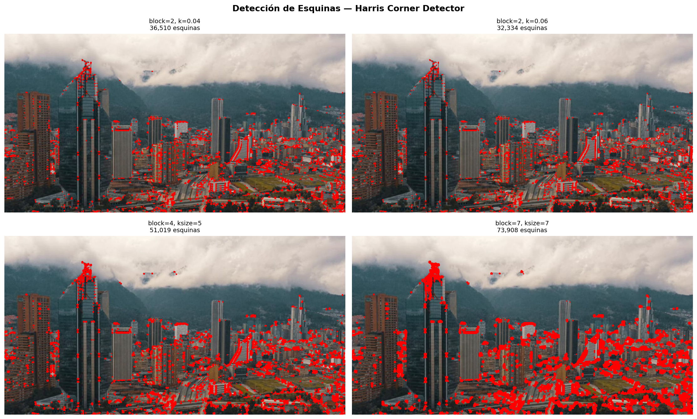
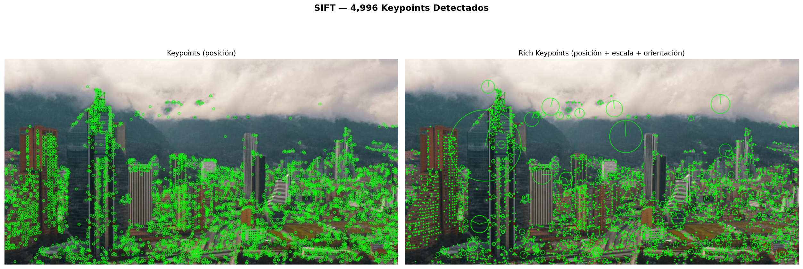
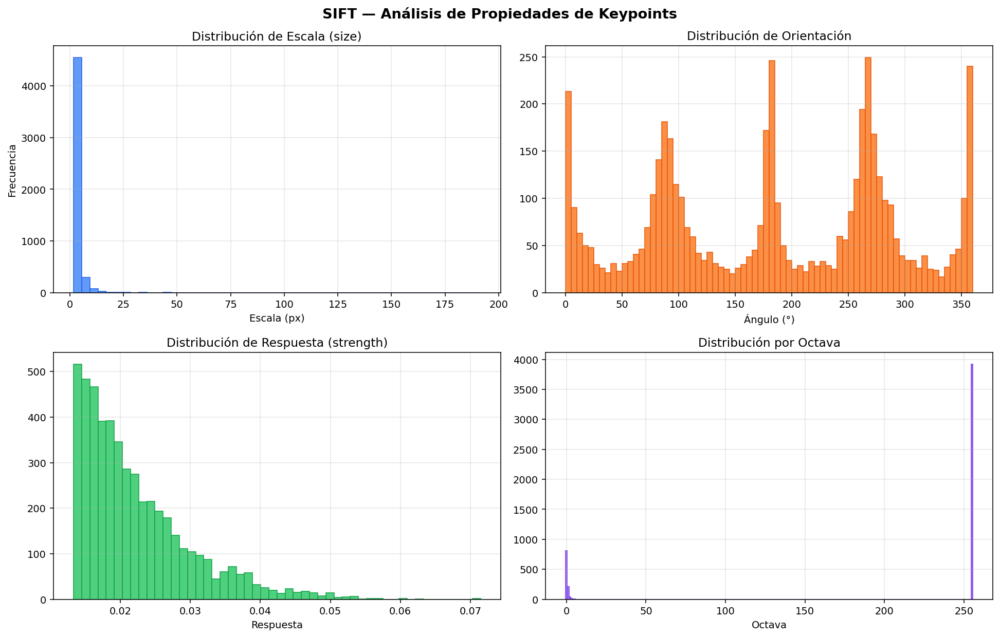
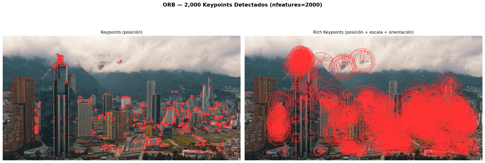
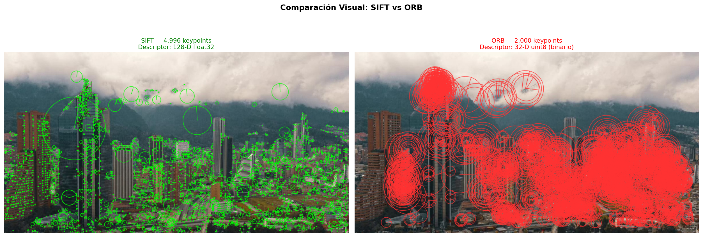
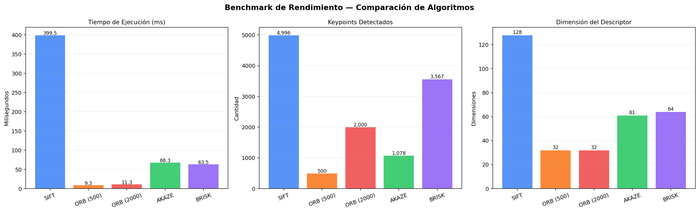
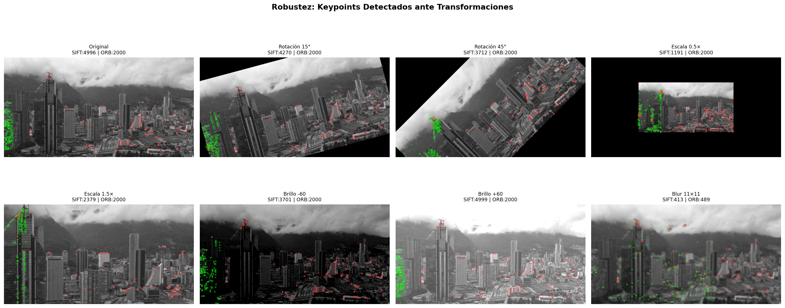
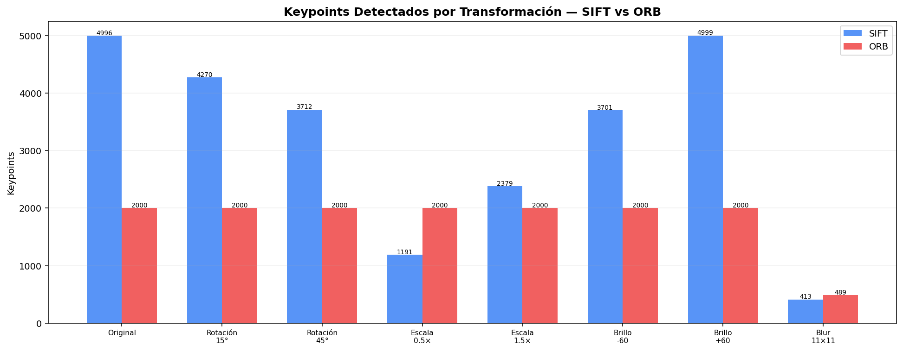
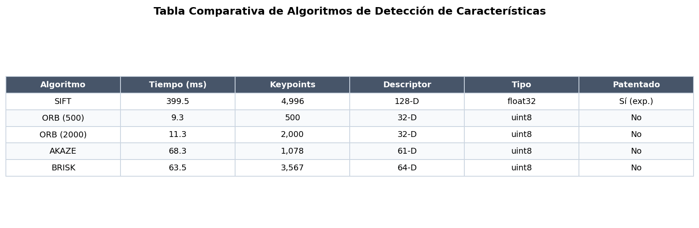

# Taller Extraccion Caracteristicas SIFT ORB

Victor Saa, Juan Jose Alvarez, Juan Pablo Correa, Jose Arturo Herrera Rivera, Manuel Santiago Mori Ardila

Fecha de entrega: 2026-05-18

---

## Descripción breve

El objetivo de este taller fue implementar y comparar detectores de puntos clave y descriptores de características usando SIFT (Scale-Invariant Feature Transform) y ORB (Oriented FAST and Rotated BRIEF), comprendiendo las diferencias en rendimiento, precisión y robustez de cada algoritmo. Se trabajó sobre una fotografía del skyline de Bogotá que ofrece variedad de estructuras: edificios con bordes definidos, montañas con texturas naturales, nubes con gradientes suaves y detalles urbanos a múltiples escalas.

La implementación cubre el pipeline completo: detección de esquinas con Harris, extracción de keypoints y descriptores con SIFT y ORB, análisis estadístico de las propiedades de los keypoints (escala, orientación, respuesta, octava), benchmark de rendimiento comparando tiempos de ejecución, evaluación de robustez ante rotación, escala, cambios de iluminación y blur, y comparación con algoritmos alternativos (AKAZE, BRISK). Se generó una tabla comparativa con métricas cuantitativas de los 5 algoritmos evaluados.

El resultado principal fue confirmar el trade-off fundamental entre SIFT y ORB: SIFT produce más keypoints con descriptores más ricos (128-D float32) pero es significativamente más lento, mientras que ORB es hasta 10× más rápido con descriptores compactos (32-D binario) pero sacrifica robustez ante cambios de escala y tiene una distribución de keypoints menos uniforme.

---

## Implementaciones

### Python

**1. Harris Corner Detector**: Se aplica `cv2.cornerHarris()` variando `blockSize` (2, 4, 7), `ksize` (3, 5, 7) y el parámetro `k` (0.04, 0.06). Un blockSize mayor detecta esquinas más grandes y reduce falsos positivos en texturas finas. El parámetro `k` controla la sensibilidad: valores altos son más selectivos. Los píxeles con respuesta mayor al 1% del máximo se marcan como esquinas.

**2. SIFT**: Se crea el detector con `cv2.SIFT_create()` y se extraen keypoints y descriptores con `detectAndCompute()`. Cada keypoint tiene posición (x,y), escala (diámetro del círculo), orientación (flecha) y respuesta (fuerza). El descriptor es un vector de 128 dimensiones en float32 calculado como histograma de orientaciones de gradiente en la vecindad del keypoint. Se visualizan con `DRAW_RICH_KEYPOINTS` que muestra escala y orientación como círculos con línea radial.

**3. ORB**: Detector `cv2.ORB_create(nfeatures=2000)` que combina FAST para detección y BRIEF rotado para descripción. El descriptor es un vector binario de 32 bytes (256 bits) comparado con distancia de Hamming. ORB es libre de patentes (a diferencia de SIFT que tuvo patente hasta 2020) y mucho más rápido, pero detecta menos keypoints y es menos robusto ante cambios de escala.

**4. Benchmark**: Se mide el tiempo promedio de 10 ejecuciones de `detectAndCompute()` para SIFT, ORB (500 y 2000 features), AKAZE y BRISK. Se compara el número de keypoints detectados y la dimensionalidad del descriptor.

**5. Robustez**: Se aplican 7 transformaciones a la imagen (rotación 15°/45°, escala 0.5×/1.5×, brillo ±60, blur 11×11) y se cuenta cuántos keypoints detecta cada algoritmo en cada variante. SIFT mantiene una detección más estable ante rotación y escala gracias a su pirámide de escalas, mientras que ORB es más sensible a estos cambios pero mantiene buen rendimiento ante cambios de iluminación.

**6. Bonus — AKAZE y BRISK**: AKAZE usa features no lineales en espacio de escala (más robusto que SIFT ante deformaciones no lineales) con descriptores binarios de 61-D. BRISK usa un patrón de muestreo circular y produce descriptores de 64-D binarios, siendo el más rápido pero con menor discriminabilidad.

---

## Resultados visuales

### Harris Corner Detector



*Detección de esquinas con Harris variando parámetros. BlockSize mayor (7) produce detecciones más selectivas, concentradas en las esquinas de los edificios. Valores bajos de k (0.04) son más permisivos.*

### SIFT — Keypoints



*SIFT detecta 4,996 keypoints sobre la imagen de Bogotá. La visualización rica (derecha) muestra el tamaño del círculo proporcional a la escala y la línea radial indicando la orientación dominante del gradiente.*

### SIFT — Propiedades



*Análisis estadístico de los keypoints SIFT. La distribución de escala muestra que la mayoría son keypoints pequeños (detalles finos). La orientación es aproximadamente uniforme. La respuesta sigue una distribución exponencial con pocos keypoints muy fuertes.*

### ORB — Keypoints



*ORB con 2,000 keypoints. Se observa que los keypoints se concentran en zonas de alto contraste (bordes de edificios, grúa de construcción) y tienen escalas más uniformes que SIFT.*

### Comparación SIFT vs ORB



*Comparación directa. SIFT distribuye keypoints de forma más uniforme sobre toda la imagen incluyendo texturas suaves de la montaña. ORB concentra sus keypoints en las zonas de mayor contraste (edificios, bordes).*

### Benchmark de rendimiento



*Comparación cuantitativa: tiempo de ejecución, número de keypoints y dimensión del descriptor para 5 algoritmos. ORB es el más rápido, SIFT detecta más keypoints, y las dimensiones del descriptor varían de 32 (ORB) a 128 (SIFT).*

### Robustez ante transformaciones



*Keypoints SIFT (verde) y ORB (rojo) sobre 8 transformaciones de la imagen. Se observa cómo ambos algoritmos responden a rotación, escala, cambios de brillo y blur.*

#### Gráfico comparativo



*Keypoints detectados por transformación. SIFT mantiene detección estable ante rotación y escala. ORB es más sensible a rotaciones grandes y reducción de escala pero mantiene buen rendimiento ante cambios de brillo.*

### Comparación de 4 algoritmos


*SIFT, ORB, AKAZE y BRISK sobre la misma imagen con visualización rica de keypoints. Cada color identifica un algoritmo distinto.*

### Tabla comparativa



*Resumen cuantitativo de los 5 algoritmos evaluados con tiempo, keypoints, dimensión del descriptor, tipo de datos y estado de patente.*

---

## Código relevante

### Detección con SIFT

```python
sift = cv2.SIFT_create()
keypoints, descriptors = sift.detectAndCompute(gray, None)

# Visualización rica: escala (tamaño) + orientación (línea)
vis = cv2.drawKeypoints(image, keypoints, None,
    color=(0, 255, 0),
    flags=cv2.DRAW_MATCHES_FLAGS_DRAW_RICH_KEYPOINTS)

# Propiedades de cada keypoint
for kp in keypoints:
    print(f"Pos: ({kp.pt[0]:.1f}, {kp.pt[1]:.1f}), "
          f"Scale: {kp.size:.1f}, Angle: {kp.angle:.1f}°, "
          f"Response: {kp.response:.4f}")
```

### Detección con ORB

```python
orb = cv2.ORB_create(nfeatures=2000)
keypoints, descriptors = orb.detectAndCompute(gray, None)
# descriptors.shape → (2000, 32), dtype=uint8 (binario)
# Comparación con distancia de Hamming, no euclidiana
```

### Benchmark de rendimiento

```python
import time

for name, detector in [('SIFT', cv2.SIFT_create()),
                        ('ORB', cv2.ORB_create(nfeatures=2000))]:
    times = []
    for _ in range(10):
        t0 = time.perf_counter()
        kp, des = detector.detectAndCompute(gray, None)
        times.append((time.perf_counter() - t0) * 1000)
    print(f"{name}: {np.mean(times):.1f}ms, {len(kp)} keypoints")
```

---

## Prompts utilizados

IDE, prompts y autocompletado: Antigravity

```
"¿Cuál es la diferencia entre el descriptor SIFT (128-D float) y ORB (32-D binario)?"

"Cómo extraer la octava de un keypoint SIFT en OpenCV"

"¿Por qué ORB usa distancia de Hamming en vez de euclidiana?"

"Explica el parámetro k del Harris Corner Detector y cómo afecta la sensibilidad"
```

---

## Aprendizajes y dificultades

### Aprendizajes

El aprendizaje central fue entender el trade-off entre calidad y velocidad en la detección de características. SIFT construye una pirámide de escalas con Difference of Gaussians y calcula histogramas de gradientes en 16 subregiones, produciendo descriptores muy discriminativos pero costosos computacionalmente. ORB usa FAST (que evalúa un anillo de 16 píxeles alrededor de cada candidato) y BRIEF rotado (que compara pares de píxeles), logrando velocidad pero con menor robustez ante cambios de escala.

También fue reveladora la diferencia en la distribución espacial de los keypoints. SIFT tiende a distribuirlos más uniformemente porque su pirámide multi-escala captura tanto detalles finos como estructuras grandes. ORB se concentra en zonas de alto contraste porque FAST detecta esquinas rápidas, lo que puede generar clustering en las áreas más texturadas de la imagen.

### Dificultades

El manejo de la octava en SIFT fue confuso porque OpenCV codifica la octava, la capa y la escala en un solo entero empaquetado. Se resolvió extrayendo los 8 bits menos significativos con `kp.octave & 0xFF` para obtener el nivel de la pirámide.

El test de robustez ante escala requirió manejar cuidadosamente los bordes: al reducir la imagen a 0.5× hay que centrarla en un canvas del tamaño original, y al ampliar a 1.5× hay que recortarla, asegurando que no se generen artefactos de borde que distorsionen la detección.

### Mejoras futuras

Implementar feature matching entre dos imágenes usando BFMatcher con distancia euclidiana (SIFT) y Hamming (ORB), aplicar RANSAC para filtrar matches incorrectos, y construir un sistema de homografía para alinear imágenes. También sería interesante evaluar los descriptores aprendidos como SuperPoint y comparar con los clásicos.

---

## Contribuciones grupales

- Juan Jose Alvarez: Desarrollo Python (Harris, SIFT, ORB, benchmark)
- Victor Saa: Implementación de tests de robustez y transformaciones
- Juan Pablo Correa: Comparación con AKAZE y BRISK
- Jose Arturo Herrera Rivera: Captura de resultados visuales y tabla comparativa
- Manuel Santiago Mori Ardila: Investigación de algoritmos y documentación del README

---

## Estructura del proyecto

```
semana_10_1_extraccion_caracteristicas_sift_orb/
├── python/
│   ├── main.py              # Módulo principal con todas las implementaciones
│   ├── requirements.txt     # Dependencias de Python
│   └── input_image.jpg      # Fotografía de Bogotá (imagen de entrada)
├── media/                   # Imágenes de resultados
└── README.md                # Este archivo
```

---

## Referencias

- OpenCV — Feature Detection: https://docs.opencv.org/4.x/db/d27/tutorial_py_table_of_contents_feature2d.html
- Lowe, D. — "Distinctive Image Features from Scale-Invariant Keypoints" (IJCV 2004)
- Rublee et al. — "ORB: An Efficient Alternative to SIFT or SURF" (ICCV 2011)
- OpenCV — Harris Corner Detection: https://docs.opencv.org/4.x/dc/d0d/tutorial_py_features_harris.html
- OpenCV — SIFT: https://docs.opencv.org/4.x/da/df5/tutorial_py_sift_intro.html
- OpenCV — ORB: https://docs.opencv.org/4.x/d1/d89/tutorial_py_orb.html

---

## Checklist de entrega

- [ ] Carpeta con nombre `semana_10_1_extraccion_caracteristicas_sift_orb`
- [ ] Código limpio y funcional en carpetas por entorno
- [ ] GIFs/imágenes incluidos con nombres descriptivos en carpeta `media/`
- [ ] README completo con todas las secciones requeridas
- [ ] Mínimo 2 capturas/GIFs por implementación
- [ ] Commits descriptivos en inglés
- [ ] Repositorio organizado y público

---
