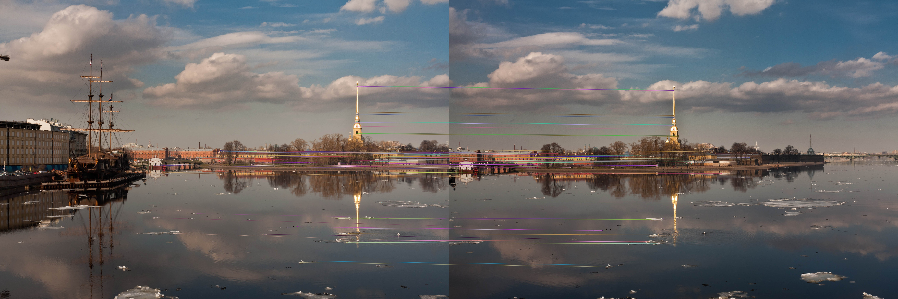
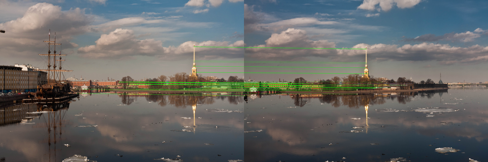
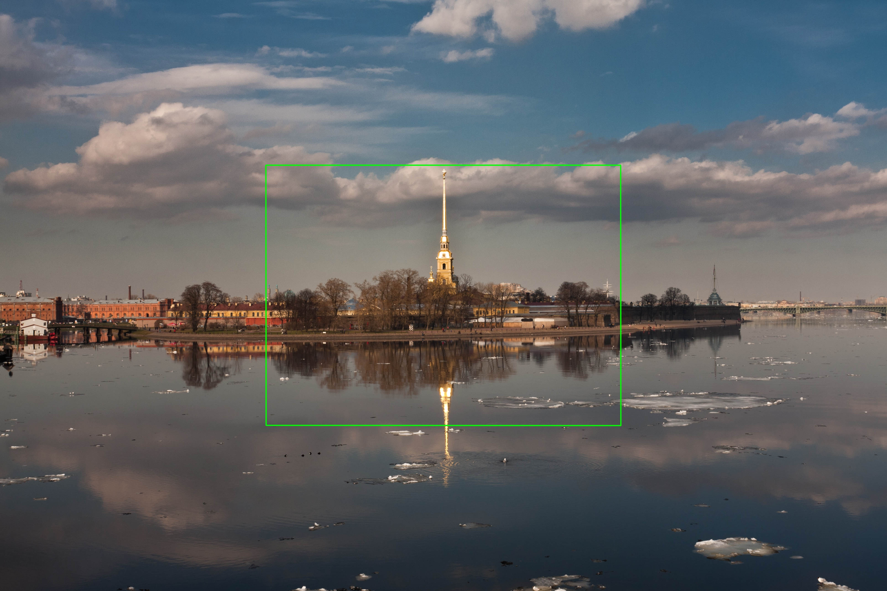
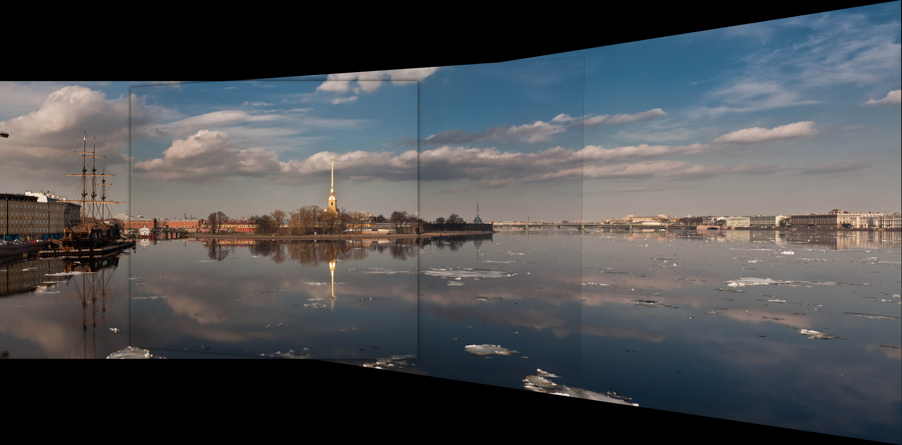
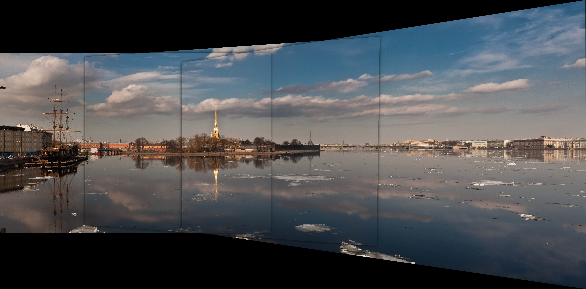

# Taller Coincidencia Patrones Homografias

**Nombre del estudiante:** [Completar nombre]  
**Fecha de entrega:** 2026-05-18

## Descripción breve

En este taller se implementó un pipeline en **Python + OpenCV** para hacer coincidencia de características, estimar homografías robustas con **RANSAC**, detectar objetos en escenas y construir un panorama por warping.

La solución incluye dos estrategias de matching (**BFMatcher** y **FLANN**), comparación de calidad por número de matches e inliers, y el **bonus** de blending suave para reducir costuras visibles en el panorama final.

## Implementaciones

### Python

Archivo principal: `python/main.py`

1. **Feature Matching con BFMatcher**
   - Detección y descripción con SIFT/ORB.
   - Emparejamiento KNN + ratio test de Lowe.
   - Visualización de coincidencias en `media/python_bf_matches.jpg`.
2. **Feature Matching con FLANN**
   - Configuración automática según descriptor (KDTREE para SIFT, LSH para ORB).
   - Filtro por ratio test.
   - Salida en `media/python_flann_matches.jpg`.
3. **Cálculo de Homografía con RANSAC**
   - Estimación de `H` con `cv2.findHomography(..., cv2.RANSAC, ...)`.
   - Visualización de inliers en `media/python_homografia_inliers.jpg`.
   - Métricas guardadas en `media/python_metricas.json`.
4. **Detección de Objetos**
   - Proyección del bounding box del template sobre la escena usando la homografía.
   - Salida en `media/python_deteccion_objeto.jpg` (si se pasan `--template` y `--scene`).
5. **Image Stitching (Panorama)**
   - Cálculo de homografía entre imágenes solapadas.
   - Warping con `cv2.warpPerspective`.
   - Panorama sin blending en `media/python_panorama_sin_blending.jpg`.
6. **Evaluación de calidad**
   - Métricas por etapa: matches totales, buenos matches, inliers, inlier ratio y tiempo.
   - Exportadas como JSON para análisis rápido y comparación.
7. **Bonus implementado**
   - **Feather blending** entre regiones solapadas para suavizar transiciones.
   - Salida en `media/python_panorama_blending_bonus.jpg`.

## Ejecución

Coloca primero tus imágenes de entrada en `python/assets/` (o usa rutas absolutas si prefieres).

```bash
cd semana_10_2_coincidencia_patrones_homografias/python
pip install -r requirements.txt

python main.py --image-a .\assets\img1.jpg --image-b .\assets\img2.jpg --template .\assets\template.jpg --scene .\assets\scene.jpg --panorama-images .\assets\img1.jpg .\assets\img2.jpg .\assets\img3.jpg
```

Si solo quieres el pipeline base (matching + homografía + stitching con 2 imágenes), basta con `--image-a` y `--image-b`.

## Resultados visuales

Se incluyen evidencias de cada etapa principal del pipeline:


*Matching con BFMatcher: correspondencias brutas entre keypoints detectados en ambas imágenes, útil como baseline de precisión.*


*Matching con FLANN: búsqueda aproximada de vecinos más cercanos; mantiene buena calidad con menor costo computacional en escenarios grandes.*


*Homografía con RANSAC: se observan las correspondencias geométricamente consistentes (inliers), base para alinear imágenes con robustez.*


*Detección de objeto: proyección del template sobre la escena mediante la matriz H, delimitando la instancia encontrada.*


*Stitching sin blending: unión por warping perspectivo con costuras visibles en zonas de solapamiento.*


*Stitching con feather blending (bonus): transición suave en solapes para reducir artefactos y mejorar continuidad visual.*

Además, las métricas numéricas por etapa (matches, inliers y tiempo) se exportan en:
`media/python_metricas.json`

## Código relevante

```python
# Homografía robusta con RANSAC
h_matrix, inlier_mask = cv2.findHomography(src_pts, dst_pts, cv2.RANSAC, ransac_thresh)

# Warping para alinear imágenes en panorama
warped_right = cv2.warpPerspective(right, translation @ h_right_to_left, output_size)

# Bonus: blending suave (feather)
blended = feather_blend(left_canvas, warped_right, sigma=18.0)
```

## Prompts utilizados

1. "¿Cómo configuro FLANN correctamente para que funcione tanto con descriptores SIFT (float32) como ORB (binarios) sin errores de tipo?"
2. "¿Cuál es una forma práctica de implementar feather blending en OpenCV para reducir costuras en un panorama hecho con homografías?"

## Aprendizajes y dificultades

El aprendizaje principal fue entender que el matching por sí solo no es suficiente: la calidad mejora mucho al filtrar correspondencias y validar geometría con RANSAC. También quedó claro que FLANN puede ser más eficiente en escenarios grandes, pero exige una configuración consistente con el tipo de descriptor.

La parte más sensible fue el stitching: pequeños errores en la homografía generan ghosting o bordes negros amplios. Se mitigó con recorte del área válida y blending suave en la zona de solapamiento.

## Estructura del proyecto

```text
semana_10_2_coincidencia_patrones_homografias/
├── python/
│   ├── assets/
│   ├── main.py
│   └── requirements.txt
├── media/
├── README.md
└── semana_10_2_coincidencia_patrones_homografias.md
```
