# Taller Flujo Óptico y Tracking

Victor Saa, Juan Jose Alvarez, Jose Arturo Herrera Rivera, Juan Pablo Correa, Manuel Santiago Mori Ardila

Fecha de entrega: 18/05/2026

---

## Descripción

Se implementó un sistema completo de flujo óptico y tracking de objetos en video usando Python con OpenCV y NumPy. El taller cubrió desde el flujo óptico disperso (Lucas-Kanade) y denso (Farnebäck), pasando por tracking de objetos con selección manual de ROI, estimación de movimiento de cámara, detección de objetos en movimiento, análisis comparativo de rendimiento, hasta funcionalidades bonus como estabilización de video, motion blur artístico y detección de gestos. Todo se ejecutó en tiempo real sobre video capturado desde webcam, con visualizaciones interactivas y métricas guardadas en JSON.

---

## Implementación

### Python (OpenCV y NumPy)

**Herramientas:** `opencv-python`, `numpy`, `matplotlib`

Se trabajó con video en tiempo real desde webcam (fuente `0`) procesando 600 frames por módulo. El proyecto se organizó en módulos independientes orquestados por un script principal con CLI.

**1. Flujo Óptico Disperso – Lucas-Kanade**

Se detectaron puntos clave con `cv2.goodFeaturesToTrack()` (hasta 200 puntos, calidad mínima 0.01, distancia mínima 15 px) y se rastrearon frame a frame con `cv2.calcOpticalFlowPyrLK()` usando ventana de 21×21 y 3 niveles de pirámide. Se dibujaron trayectorias acumuladas con colores únicos por punto y vectores de movimiento con `cv2.arrowedLine()`. Cuando los puntos rastreados caían por debajo de 30, se ejecutó re-detección automática, limpiando la máscara de trayectorias.

**2. Flujo Óptico Denso – Farnebäck**

Se calculó flujo denso entre frames consecutivos con `cv2.calcOpticalFlowFarneback()` (pirámide de 3 niveles, ventana de 15, 3 iteraciones). La visualización usó codificación HSV: el matiz (Hue) representa la dirección del flujo y la intensidad (Value) la magnitud, normalizada con `cv2.normalize()`. El resultado se compuso con el frame original usando `cv2.addWeighted()` al 50/70%.

**3. Tracking de Objetos**

Se implementó selección manual de ROI con `cv2.selectROI()`. Los puntos dentro del bounding box se detectaron con `goodFeaturesToTrack` usando una máscara. El tracking se realizó con Lucas-Kanade, evaluando en cada frame la proporción de puntos sobrevivientes respecto al conteo inicial: por debajo del 40% se reporta oclusión parcial, y por debajo del 15% se declara tracking perdido. También se detecta crecimiento anómalo del bounding box (>3× el área original). Con la tecla `r` se permite re-seleccionar el objeto.

**4. Estimación de Movimiento de Cámara**

Se analizó el flujo óptico global usando la mediana robusta de los vectores de desplazamiento para evitar la influencia de outliers. Se estimó la transformación afín parcial con `cv2.estimateAffinePartial2D()` para extraer escala (zoom) y rotación. El movimiento se clasificó en: PAN (izquierda/derecha), TILT (arriba/abajo) y ZOOM (in/out), con un umbral de 1.5 px. Se calculó la velocidad angular asumiendo un FOV horizontal de 60°.

**5. Detección de Movimiento**

Se calculó la magnitud del flujo óptico denso y se aplicó un umbral de 2.5 px para generar una máscara binaria de movimiento. Se limpiaron artefactos con operaciones morfológicas (apertura + cierre + dilatación con kernel elíptico de 7×7). Los contornos con área mayor a 500 px² se contaron como objetos en movimiento y se dibujaron con bounding boxes verdes sobre un overlay rojo semitransparente.

**6. Análisis de Rendimiento**

Se ejecutaron benchmarks de 120 frames para 3 configuraciones de Lucas-Kanade (ventanas 11, 21 y 31 con niveles 2, 3 y 4) y 3 de Farnebäck (ventanas 9, 15 y 21 con niveles 2, 3 y 5). Se midió tiempo promedio por frame, FPS y precisión del tracking (ratio de puntos mantenidos para LK, magnitud promedio para FB). Los resultados se graficaron con matplotlib en 3 paneles comparativos.

**7. Bonus: Estabilización de Video**

Se compensó el movimiento global de cámara estimando la transformación afín entre frames consecutivos. Se acumularon las traslaciones y rotaciones, y se aplicó suavizado exponencial (α=0.85) para generar una trayectoria suave. La diferencia entre la trayectoria suavizada y la real se usó como corrección con `cv2.warpAffine()`. Se mostró comparación lado a lado: original vs estabilizado.

**8. Bonus: Motion Blur Artístico**

Se creó un efecto de estelas de movimiento acumulando los píxeles en zonas donde la magnitud del flujo denso supera 1.5 px. Se usó un factor de decaimiento de 0.92 para que las estelas se desvanezcan gradualmente. El resultado se compuso sobre el frame original con `addWeighted()`.

**9. Bonus: Detección de Gestos**

Se rastrearon trayectorias de hasta 30 frames por punto. Para clasificar gestos, se analizó el desplazamiento neto (inicio→fin) de cada trayectoria: si el desplazamiento supera 50 px, se clasifica como swipe horizontal o vertical según la componente dominante. Se requiere que al menos el 20% de los puntos voten el mismo gesto. Tras detectar un gesto se aplica un cooldown de 20 frames para evitar detecciones repetidas.

---

## Resultados visuales

### Flujo Óptico Disperso (Lucas-Kanade)

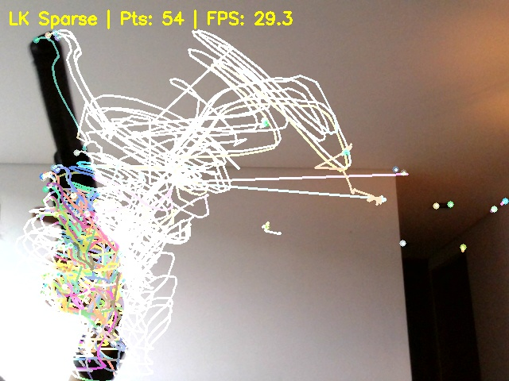

Se rastrearon hasta 200 puntos simultáneamente con trayectorias de colores únicos. Los vectores de movimiento (flechas verdes) indican la dirección y magnitud del desplazamiento de cada punto. Se procesaron 600 frames a 30.0 FPS con solo 1 re-detección, lo que indica alta estabilidad del tracking. La re-detección se activó cuando los puntos cayeron por debajo de 30.

### Flujo Óptico Denso (Farnebäck)

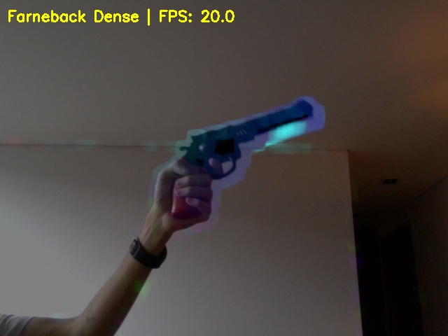

La visualización HSV muestra claramente las zonas en movimiento: los colores indican la dirección (rojo=derecha, cian=izquierda, verde=abajo, magenta=arriba) y la intensidad la magnitud. El procesamiento alcanzó 20.1 FPS, notablemente más lento que Lucas-Kanade debido al cálculo denso sobre todos los píxeles del frame.

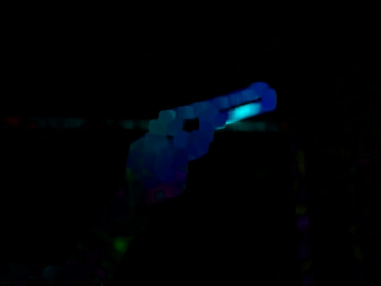

El mapa HSV puro (sin superposición) permite apreciar mejor la estructura del flujo. Las zonas negras corresponden a regiones sin movimiento detectable.

### Tracking de Objetos

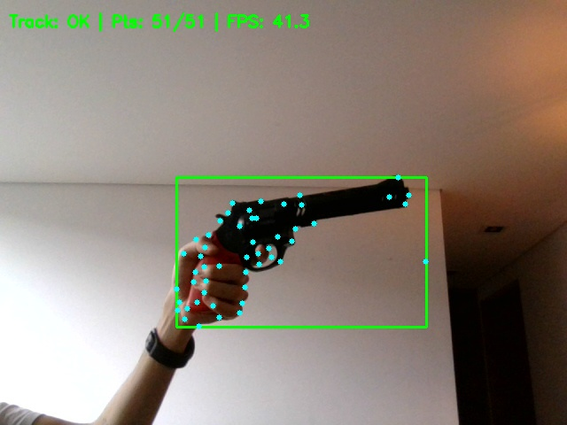

El tracker mantuvo el objeto seleccionado durante los 600 frames sin perderlo (0 pérdidas, 0 eventos de oclusión). El bounding box verde se actualizó frame a frame basándose en la posición de los puntos rastreados. El sistema alcanzó 30.1 FPS, equivalente a la tasa de la cámara.

### Estimación de Movimiento de Cámara

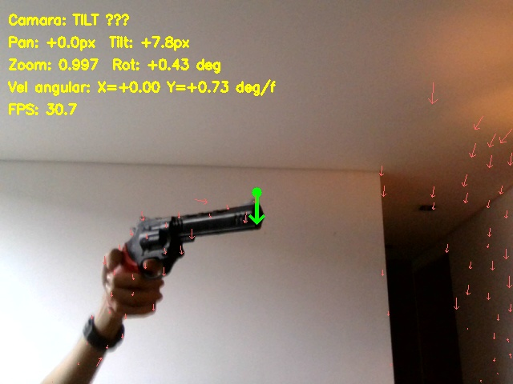

Se clasificaron los 600 frames en tipos de movimiento. Los más frecuentes fueron PAN → + TILT ↓ (106 frames) y PAN ← + TILT ↑ (99 frames), con 97 frames estáticos. Se detectaron también movimientos combinados con zoom. La flecha verde central indica la dirección global del movimiento de cámara, mientras las flechas azules muestran el flujo individual de cada punto.

### Detección de Movimiento

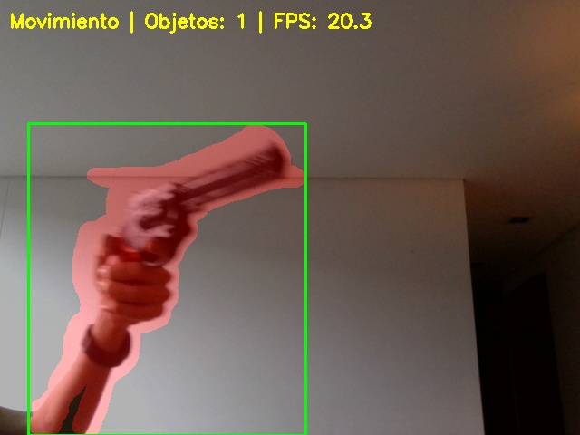

Se detectaron hasta 9 objetos en movimiento simultáneamente. Las regiones en movimiento se resaltan con overlay rojo y se encuadran con bounding boxes verdes. El umbral de magnitud de 2.5 px y el área mínima de contorno de 500 px² filtraron efectivamente el ruido.

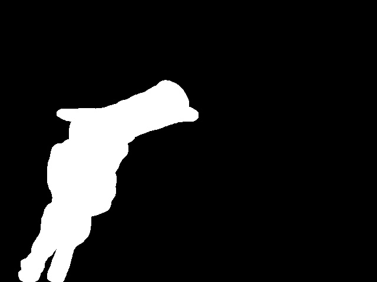

La máscara binaria de movimiento muestra las regiones que superan el umbral de flujo, después de las operaciones morfológicas de limpieza.

### Análisis de Rendimiento

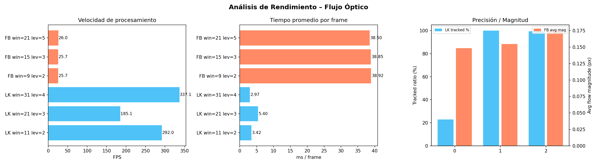

Los benchmarks revelan diferencias significativas entre los algoritmos:

| Configuración | FPS | ms/frame | Precisión/Magnitud |
|---|---|---|---|
| LK win=11 lev=2 | 292.0 | 3.42 ms | 22.8% tracked |
| LK win=21 lev=3 | 185.1 | 5.40 ms | 100% tracked |
| LK win=31 lev=4 | 337.1 | 2.97 ms | 99.5% tracked |
| FB win=9 lev=2 | 25.7 | 38.9 ms | 0.148 mag |
| FB win=15 lev=3 | 25.7 | 38.9 ms | 0.155 mag |
| FB win=21 lev=5 | 26.0 | 38.5 ms | 0.175 mag |

Lucas-Kanade es ~7-13× más rápido que Farnebäck. La configuración LK win=21 lev=3 logró el mejor balance entre velocidad (185 FPS) y precisión (100% de puntos mantenidos). Farnebäck es consistente en ~26 FPS independientemente de los parámetros.

### Bonus: Estabilización de Video

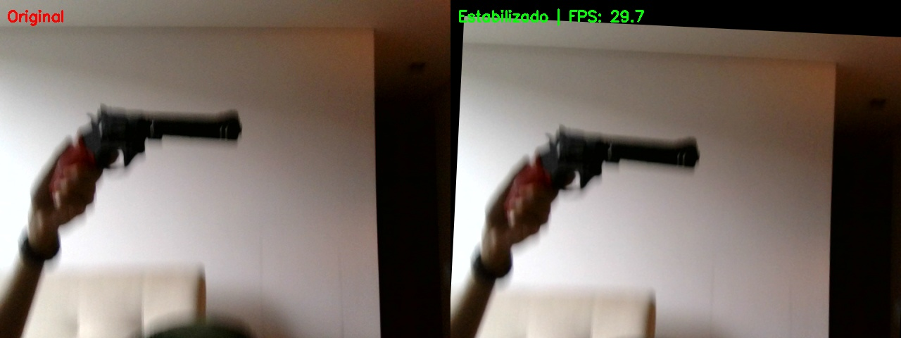

La comparación lado a lado muestra el video original (izquierda) vs el estabilizado (derecha). El suavizado exponencial eliminó los movimientos bruscos de cámara mientras preservó los movimientos intencionales lentos. Se procesó a 30.0 FPS sin impacto perceptible en rendimiento.

### Bonus: Motion Blur Artístico

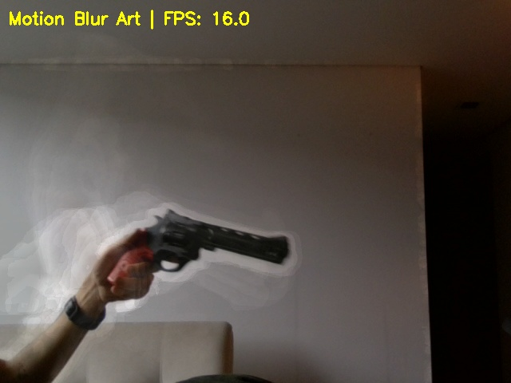

El efecto de estelas se acumula solo en las zonas con movimiento detectado, creando un efecto visual artístico de persistencia temporal. El factor de decaimiento de 0.92 produce estelas que se desvanecen en ~12 frames (~0.4 segundos). Se procesó a 16.0 FPS, limitado por el cálculo de flujo denso.

### Bonus: Detección de Gestos

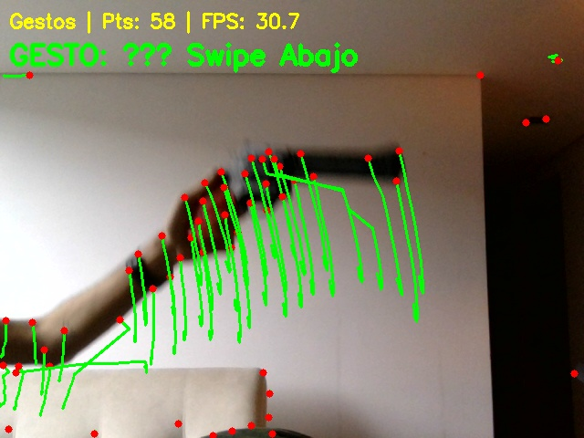

Se detectaron 21 gestos en total durante los 600 frames: 6 swipes arriba, 6 abajo, 5 a la derecha y 4 a la izquierda. Las trayectorias verdes muestran el recorrido de los puntos rastreados, y los puntos rojos su posición actual. El sistema de votación con cooldown evitó detecciones duplicadas.

---

## Código relevante

**Detección de puntos y flujo óptico disperso (Lucas-Kanade):**

```python
# Detectar puntos buenos para tracking
pts = cv2.goodFeaturesToTrack(gray, maxCorners=200, qualityLevel=0.01,
                               minDistance=15, blockSize=7)

# Calcular flujo óptico disperso
next_pts, status, _ = cv2.calcOpticalFlowPyrLK(
    prev_gray, gray, prev_pts, None,
    winSize=(21, 21), maxLevel=3,
    criteria=(cv2.TERM_CRITERIA_EPS | cv2.TERM_CRITERIA_COUNT, 30, 0.01),
)

# Filtrar puntos válidos
good_new = next_pts[status.ravel() == 1]
good_old = prev_pts[status.ravel() == 1]
```

**Flujo óptico denso y visualización HSV (Farnebäck):**

```python
# Calcular flujo denso
flow = cv2.calcOpticalFlowFarneback(
    prev_gray, gray, None,
    pyr_scale=0.5, levels=3, winsize=15,
    iterations=3, poly_n=5, poly_sigma=1.2, flags=0,
)

# Codificación HSV: dirección → hue, magnitud → value
mag, ang = cv2.cartToPolar(flow[..., 0], flow[..., 1])
hsv[..., 0] = ang * 180 / np.pi / 2          # Dirección como matiz
hsv[..., 1] = 255                              # Saturación máxima
hsv[..., 2] = cv2.normalize(mag, None, 0, 255, cv2.NORM_MINMAX)
```

**Detección de movimiento con umbral y conteo de objetos:**

```python
# Máscara de movimiento por umbral de magnitud
mag, _ = cv2.cartToPolar(flow[..., 0], flow[..., 1])
motion_mask = (mag > 2.5).astype(np.uint8) * 255

# Limpieza morfológica
kernel = cv2.getStructuringElement(cv2.MORPH_ELLIPSE, (7, 7))
motion_mask = cv2.morphologyEx(motion_mask, cv2.MORPH_OPEN, kernel)
motion_mask = cv2.morphologyEx(motion_mask, cv2.MORPH_CLOSE, kernel)

# Contar objetos en movimiento
contours, _ = cv2.findContours(motion_mask, cv2.RETR_EXTERNAL, cv2.CHAIN_APPROX_SIMPLE)
moving_objects = [c for c in contours if cv2.contourArea(c) >= 500]
```

**Estimación de movimiento de cámara y clasificación:**

```python
# Estimar transformación afín para extraer escala y rotación
mat, inliers = cv2.estimateAffinePartial2D(good_old, good_new)
scale = float(np.sqrt(mat[0, 0] ** 2 + mat[1, 0] ** 2))
rotation = float(np.arctan2(mat[1, 0], mat[0, 0]))

# Flujo global con mediana robusta
dx_mean = float(np.median(flow_vectors[:, 0]))
dy_mean = float(np.median(flow_vectors[:, 1]))
```

**Estabilización de video (Bonus):**

```python
# Acumular transformaciones y suavizar
cum_dx += dx; cum_dy += dy; cum_da += da
smooth_dx = alpha * smooth_dx + (1 - alpha) * cum_dx  # α = 0.85

# Aplicar corrección
correction = np.float64([
    [np.cos(diff_da), -np.sin(diff_da), diff_dx],
    [np.sin(diff_da),  np.cos(diff_da), diff_dy],
])
stabilized = cv2.warpAffine(frame, correction, (w, h))
```

---

## Prompts utilizados

Para algunos puntos del taller se usó IA generativa como apoyo. Los prompts principales fueron:

- _"Cómo visualizar flujo óptico denso de Farneback con codificación HSV con direccion y magnitud"_
- _"Implementa tracking de objetos con selección de ROI manual, detección de oclusiones parciales y pérdida de tracking"_
- _"Cómo estimar movimiento de cámara (pan, tilt, zoom)"_

---

## Aprendizajes y dificultades

El taller permitió entender la diferencia fundamental entre flujo óptico disperso y denso: Lucas-Kanade es rápido (hasta 337 FPS) pero solo rastrea puntos seleccionados, mientras que Farnebäck calcula el desplazamiento de cada píxel a costa de ser ~13× más lento (~26 FPS). Cada enfoque tiene su caso de uso: LK para tracking eficiente de pocos puntos y Farnebäck para análisis completo de la escena.

La estimación de movimiento de cámara requirió usar la mediana en lugar de la media para el flujo global, porque la media es muy sensible a objetos en movimiento que generan outliers. La mediana proporcionó estimaciones robustas incluso con múltiples objetos moviéndose en la escena.

El tracking de objetos presentó el reto de definir umbrales adecuados para distinguir entre oclusión parcial (40%) y pérdida total (15%). Valores muy altos generaban falsos positivos de pérdida, y valores muy bajos permitían que el tracker "saltara" a otros objetos. Los umbrales finales se calibraron experimentalmente.

La estabilización de video reveló que el suavizado exponencial simple (α=0.85) es suficiente para eliminar temblores pero preservar movimientos intencionales, sin necesidad de algoritmos más complejos como filtros de Kalman.
