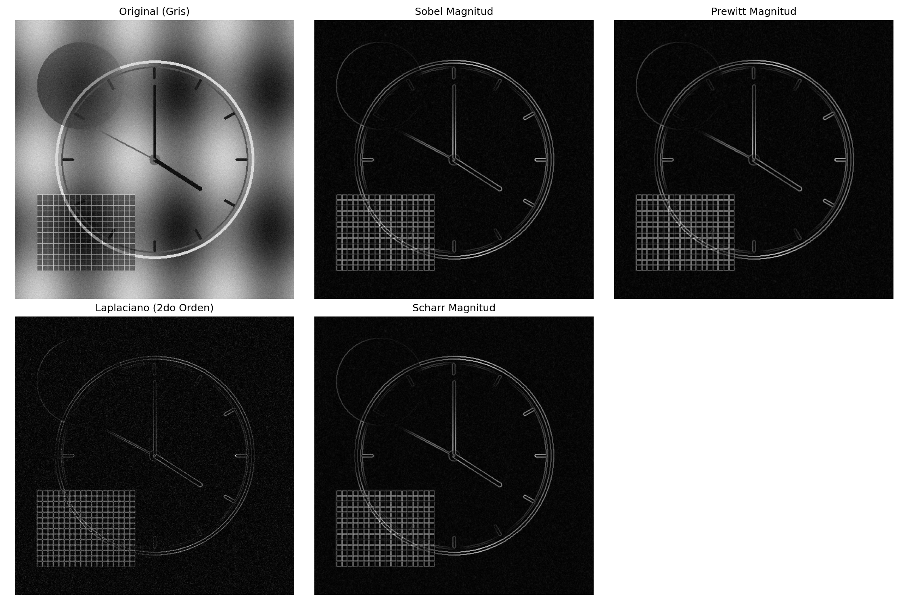
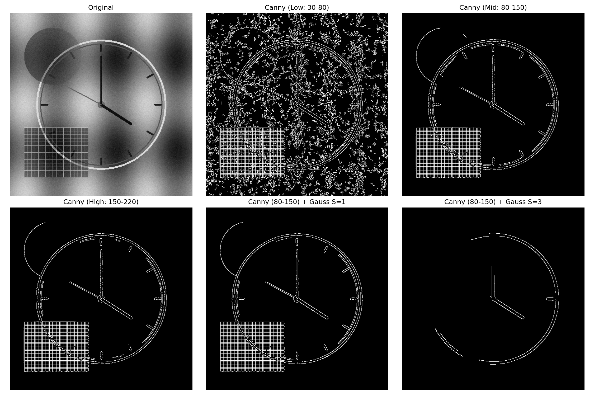
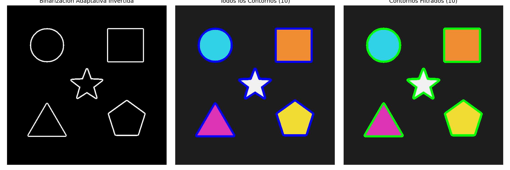
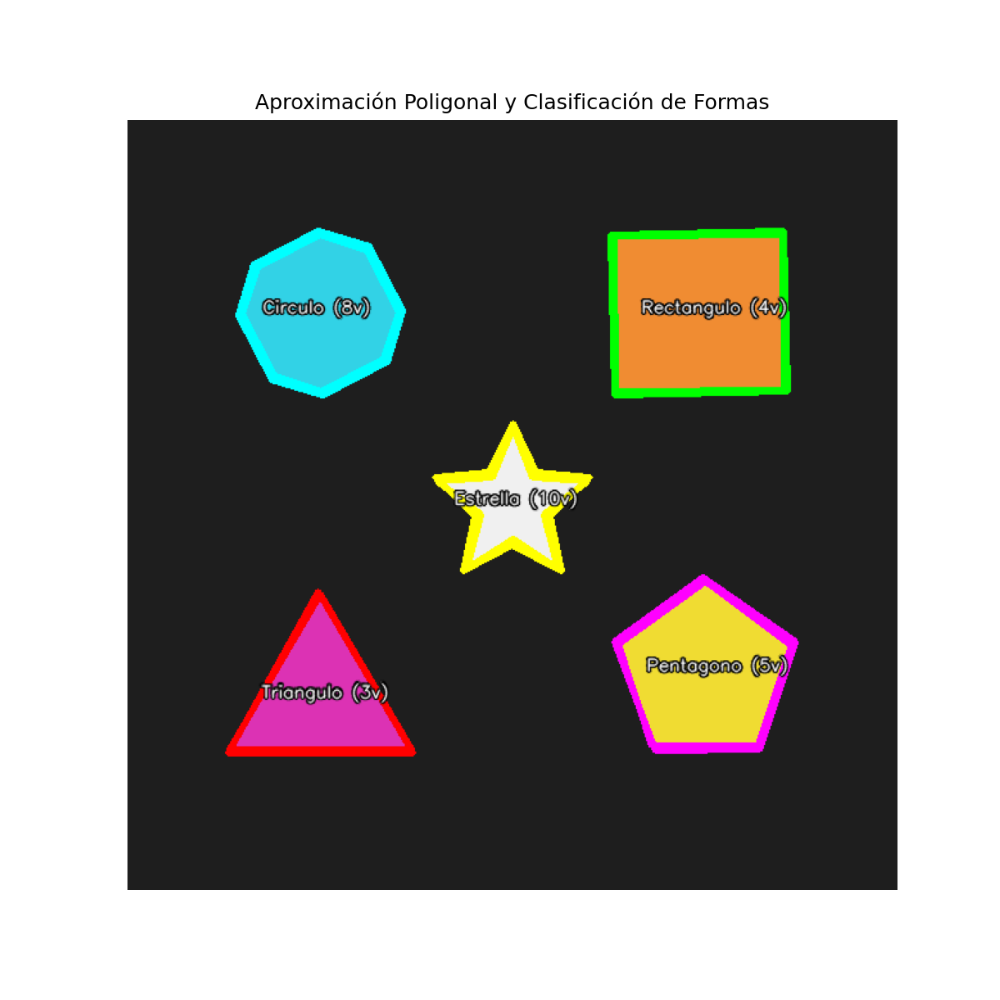
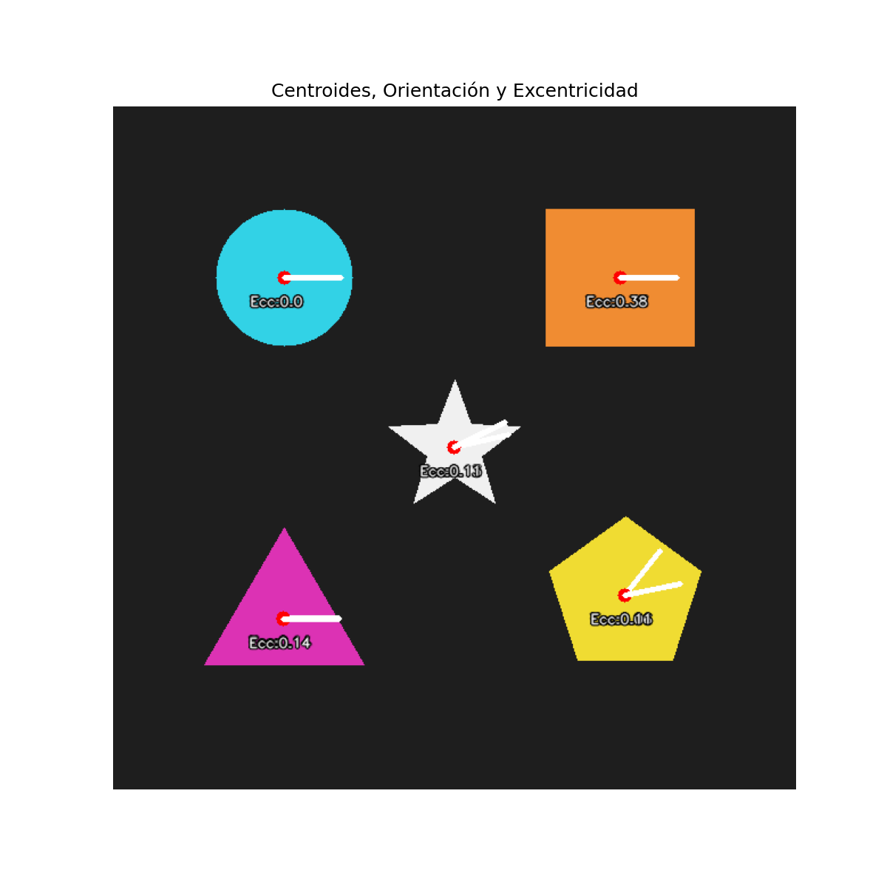
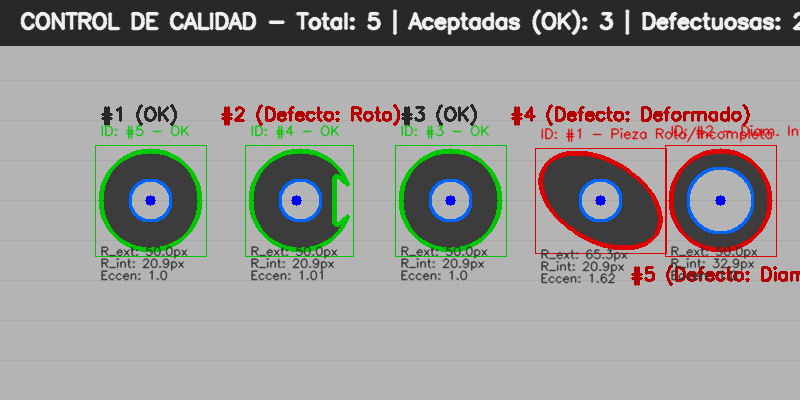
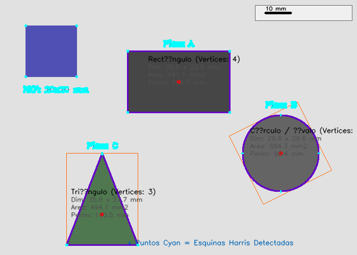
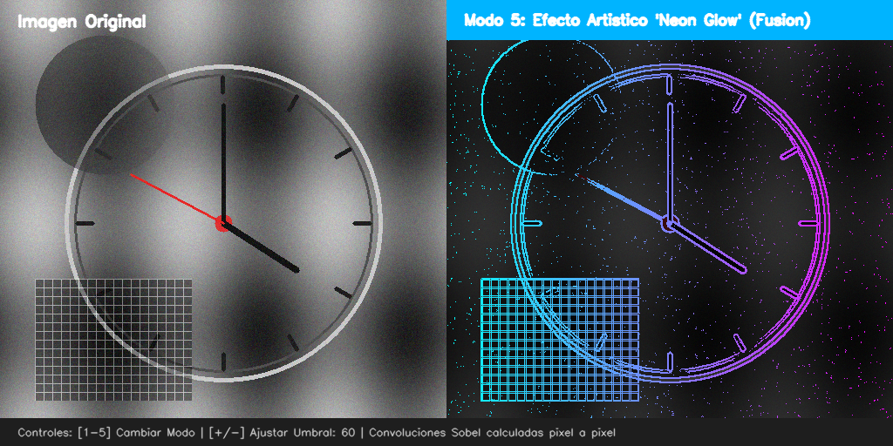

# Taller Deteccion Bordes Contornos

Victor Saa, Juan Jose Alvarez, Juan Pablo Correa, Jose Arturo Herrera Rivera, Manuel Santiago Mori Ardila

Fecha de entrega: 2026-05-20

## Descripción

Aplicar operadores de detección de bordes (Sobel, Prewitt, Canny) y técnicas de análisis de contornos para extraer información estructural de imágenes. Comprender las diferencias entre métodos y sus aplicaciones en inspección y análisis de formas.

## Implementaciones

### Python

**1. Operadores Básicos de Detección de Bordes (`Jupyter Notebook`)**:

- **Sobel**: Calcula el gradiente de intensidad horizontal ($G_x$) y vertical ($G_y$) usando kernels ponderados bilineales de $3\times3$. Se evaluó la magnitud total $G = \sqrt{G_x^2 + G_y^2}$.
- **Prewitt**: Utiliza diferencias finitas locales que resultan más sensibles al ruido por carecer de ponderación bilineal central.
- **Scharr**: Emplea kernels con pesos optimizados ($3$ y $10$) logrando una simetría rotacional perfecta en bordes oblicuos.
- **Laplaciano**: Gradiente de segundo orden ($\nabla^2 f$) que detecta el cruce por cero de los bordes, brindando bordes de 1 píxel sumamente definidos, pero hipersensible al ruido.

**2. Detector de Bordes de Canny (`Jupyter Notebook`)**:

- Suavizado Gaussiano inicial para atenuar ruido de alta frecuencia, analizando los efectos de modificar el coeficiente de dispersión $\sigma$.
- Cálculo de gradientes y supresión de no-máximos para adelgazar los bordes gruesos.
- Umbralización por histéresis mediante dos límites (alto y bajo), resolviendo la conectividad de los bordes débiles.

**3. Detección de Contornos y Jerarquía (`Jupyter Notebook`)**:

- Binarización local adaptativa con promedio Gaussiano ponderado para robustez ante iluminaciones desiguales.
- Extracción topológica de contornos mediante `cv2.findContours()` con el modo `RETR_TREE` para analizar anidamientos (padre-hijo).
- Filtrado discriminativo de contornos según su área superficial en píxeles.

**4. Aproximación de Formas (`Jupyter Notebook`)**:

- Cálculo de perímetro (`cv2.arcLength()`) y área superficial (`cv2.contourArea()`).
- Reducción de polígonos usando el algoritmo Ramer-Douglas-Peucker (`cv2.approxPolyDP()`) con un umbral de tolerancia $\epsilon = 3\%$ del perímetro.
- Clasificación automática de figuras basada en su número de vértices (Triángulos, Cuadrados/Rectángulos, Pentágonos, Círculos y Estrellas).

**5. Análisis de Momentos e Invariantes (`Jupyter Notebook`)**:

- Obtención de los momentos espaciales, centrales y normalizados (`cv2.moments()`).
- Localización exacta de centroides geométricos $(\bar{x}, \bar{y}) = \left(\frac{M_{10}}{M_{00}}, \frac{M_{01}}{M_{00}}\right)$.
- Cálculo del ángulo de orientación principal $\theta = \frac{1}{2} \arctan\left(\frac{2\mu_{11}}{\mu_{20} - \mu_{02}}\right)$.
- Determinación de la excentricidad / elongación geométrica y cálculo de los Momentos Invariantes de Hu en escala logarítmica.

**6. Sistema de Inspección de Calidad de Piezas (`inspeccion_calidad.py`)**:

- Simulación de una cinta transportadora industrial con arandelas metálicas.
- Clasificación jerárquica: Una arandela correcta cuenta con un contorno externo circular y un contorno interno (agujero) que es su hijo topológico en `RETR_CCOMP`.
- Reglas de defectos aplicadas:
    - **Sin Orificio**: Falta de hijo jerárquico.
    - **Diámetro Interno Excesivo**: Radio del agujero hijo superior a 26 píxeles.
    - **Pieza Rota/Incompleta**: Razón de área del contorno frente al círculo delimitador menor al 85%.
    - **Pieza Deformada**: Relación entre el eje mayor y menor de la elipse ajustada superior a $1.15$.
- Conteo automatizado de piezas aceptadas vs. defectuosas y exportación de reportes visuales dinámicos.

**7. Medición Calibrada y Detección Harris (`medicion_objetos.py`)**:

- Sistema autorregulable: Segmenta un cuadrado de referencia azul de tamaño conocido ($20\text{ mm} \times 20\text{ mm}$) en la esquina superior izquierda.
- Calcula dinámicamente la escala física en píxeles por milímetro ($\text{px/mm}$).
- Mide de forma exacta el ancho, alto, perímetro y área de objetos desconocidos del entorno utilizando cajas orientadas en milímetros.
- Aplica un extractor de esquinas de Harris para señalizar con precisión subpíxel los puntos de anclaje geométrico.

**8. Simulación de Convolución Sobel Manual y Efecto Neón (`simulate_processing.py`)**:

- Simulación en Python ( NumPy / OpenCV ) de un motor de convolución manual Sobel píxel a píxel, evadiendo los bordes exteriores de la imagen de entrada.
- Implementación de un modo interactivo con controles deslizantes y efecto **Neon Glow**: Si un píxel supera el umbral de borde, se colorea con un degradado dinámico (Neon Cyan-Magenta), mientras que el fondo se atenúa a un 25% de opacidad para lograr un boceto futurista de alto impacto visual.

## Resultados visuales

### Comparativa de Operadores de Gradiente (Sobel, Prewitt, Laplacian, Scharr)



_Muestra la imagen original junto con la respuesta de los diferentes operadores de gradiente aplicados sobre una textura compleja con ruido artificial._

### Canny y Análisis de Sigma Gaussiano



_Compara los efectos de variar los umbrales de histéresis y la dispersión del filtro de suavizado Gaussiano sobre la cantidad de bordes capturados._

### Binarización Adaptativa y Jerarquías de Contorno



_Muestra el proceso de binarización adaptativa invertida y la detección y agrupamiento de los contornos antes y después de filtrar por área superficial._

### Aproximación Poligonal y Clasificación de Formas



_Clasificación de formas basada en el conteo de vértices aproximados empleando el algoritmo Ramer-Douglas-Peucker._

### Centroides, Orientación y Excentricidad por Momentos



_Ubicación física del centroide (punto rojo), eje de orientación espacial (línea blanca) y valor numérico de excentricidad derivado de momentos centrales._

### Control de Calidad Industrial (Detección de Defectos)



_Reporte visual interactivo del conveyor belt. Detecta e identifica de forma exacta las arandelas perfectas (OK) frente a las rotas, deformadas o con agujero interno sobredimensionado._

### Medición Física y Esquinas Harris Calibradas



_Muestra la tarjeta de calibración de referencia (azul), la medición milimétrica real de las piezas circundantes y la señalización de esquinas Harris (puntos cyan)._

### Convolución Sobel Manual y Efecto Neón (Simulación Python)



_Simulación en Python de la convolución manual Sobel y el efecto artístico 'Neon Glow' (fusión)._

## Código relevante

### Convolución Manual de Sobel (Simulación Python)

```python
# Procesamiento píxel a píxel evadiendo los bordes exteriores de 1px
for y in range(1, h - 1):
  for x in range(1, w - 1):
    sum_x = 0.0
    sum_y = 0.0

    # Aplicar vecindad de 3x3
    for ky in range(-1, 2):
      for kx in range(-1, 2):
        pixel_val = gray[y + ky, x + kx]

        sum_x += pixel_val * kernel_x[ky + 1, kx + 1]
        sum_y += pixel_val * kernel_y[ky + 1, kx + 1]

    val_mag = np.sqrt(sum_x**2 + sum_y**2)
    img_magnitude[y, x] = 255 if val_mag > edge_threshold else 0
```

### Clasificación de Calidad por Topología de Contornos (Python)

```python
# Evaluar si la arandela tiene orificio interno (hijo en la jerarquía)
child_idx = hierarchy[i][2]
has_hole = child_idx != -1

if not has_hole:
    is_ok = False
    defect_reason = "Sin Orificio"
elif r_inner > 26:
    is_ok = False
    defect_reason = "Diam. Int. Excesivo"
elif area_ratio < 0.85:
    is_ok = False
    defect_reason = "Pieza Rota/Incompleta"
elif ellipse_aspect_ratio > 1.15:
    is_ok = False
    defect_reason = "Pieza Deformada"
```

## Prompts utilizados

Durante el desarrollo de esta práctica, se formularon los siguientes prompts para guiar las estructuras algorítmicas de optimización matemática e invariantes:

1. _"Genera una función en Python usando OpenCV para programar un canvas sintético que contenga formas geométricas perfectas (triángulo, rectángulo, círculo, pentágono, estrella) con colores específicos y alto contraste, para evaluar contornos y aproximación poligonal sin descargar archivos."_
2. _"Escribe un algoritmo robusto en OpenCV Python para clasificar arandelas defectuosas en una línea de montaje simulada. Explica cómo usar la jerarquía RETR_CCOMP para aislar el diámetro interno como un contorno hijo del contorno externo de la arandela y reportar anomalías geométricas."_
3. _"Implementa paso a paso la ecuación del ángulo de orientación y la excentricidad geométrica a partir de momentos centrales mu20, mu02 y mu11 en Python evitando errores de división por cero y explicándolos físicamente."_
4. _"Crea un script en Python que realice convoluciones Sobel personalizadas aplicando kernels flotantes 3x3 de forma puramente manual, píxel por píxel, y simule un lienzo artístico Neon Glow."_

## Aprendizajes y dificultades

- **Compatibilidad de NumPy 2.x**: Durante el desarrollo, nos topamos con un `AttributeError: module 'numpy' has no attribute 'int0'` al graficar las cajas rotadas de medición física. Se diagnosticó que `np.int0` ha sido removido de la especificación moderna de NumPy 2.0. La dificultad fue solucionada modificando la conversión para utilizar explícitamente `np.int32`, asegurando compatibilidad intergeneracional y robustez.
- **Ruido en Bordes Delgados**: Operadores de segundo orden como el Laplaciano amplificaban drásticamente el ruido de sal y pimienta de la imagen de prueba sintética. Esto se solventó implementando suavizados Gaussianos preventivos, evidenciando de forma empírica la importancia de filtrar frecuencias muy altas antes de aplicar cualquier extractor de gradientes.

## Estructura del proyecto

```
semana_10_4_deteccion_bordes_contornos/
├── python/
│   ├── requirements.txt            # Dependencias del sistema
│   ├── generate_test_images.py     # Generador de imágenes sintéticas calibradas
│   ├── inspeccion_calidad.py       # Aplicación de control de calidad industrial
│   ├── medicion_objetos.py         # Medición escala métrica y esquinas Harris
│   ├── edge_contour_taller.ipynb   # Jupyter Notebook interactivo (Puntos 1-5)
│   ├── run_notebook_cells.py       # Script auxiliar para exportar gráficos de Jupyter
│   ├── run_pipeline.py             # Script automatizado para ejecutar toda la suite
│   └── simulate_processing.py      # Simulador en Python de la convolución manual
├── media/                          # Recursos gráficos y capturas de resultados
└── README.md                       # Documentación principal del taller
```

## Referencias

- OpenCV — Contour Features: https://docs.opencv.org/4.x/dd/d49/tutorial_py_contour_features.html
- OpenCV — Canny Edge Detection: https://docs.opencv.org/4.x/da/d22/tutorial_py_canny.html
- scikit-image — Edge Detection: https://scikit-image.org/docs/stable/auto_examples/edges/plot_edge_filter.html
- Hu, M. K. — "Visual Pattern Recognition by Moment Invariants" (IRE Transactions on Information Theory, 1962)
