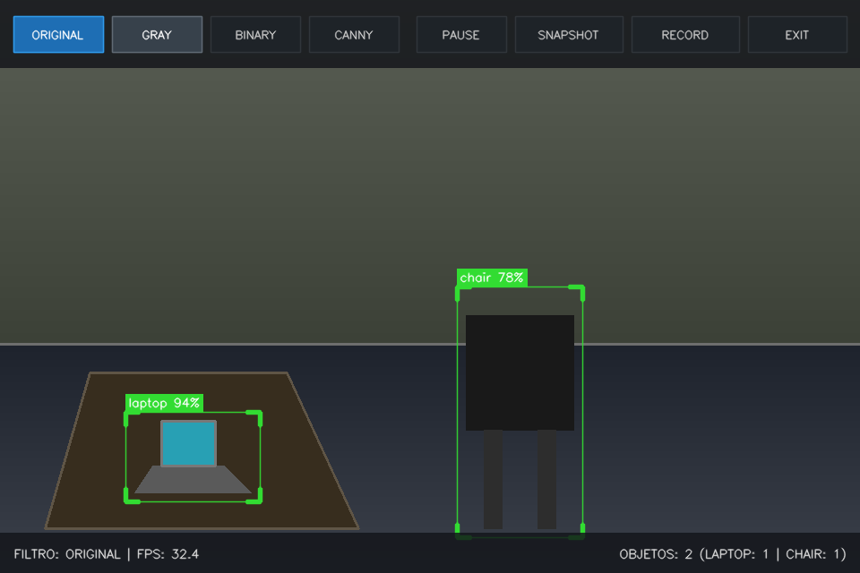
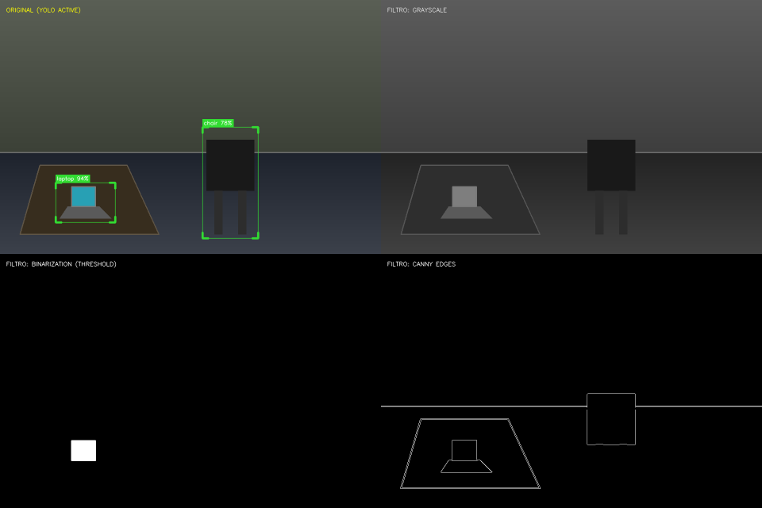
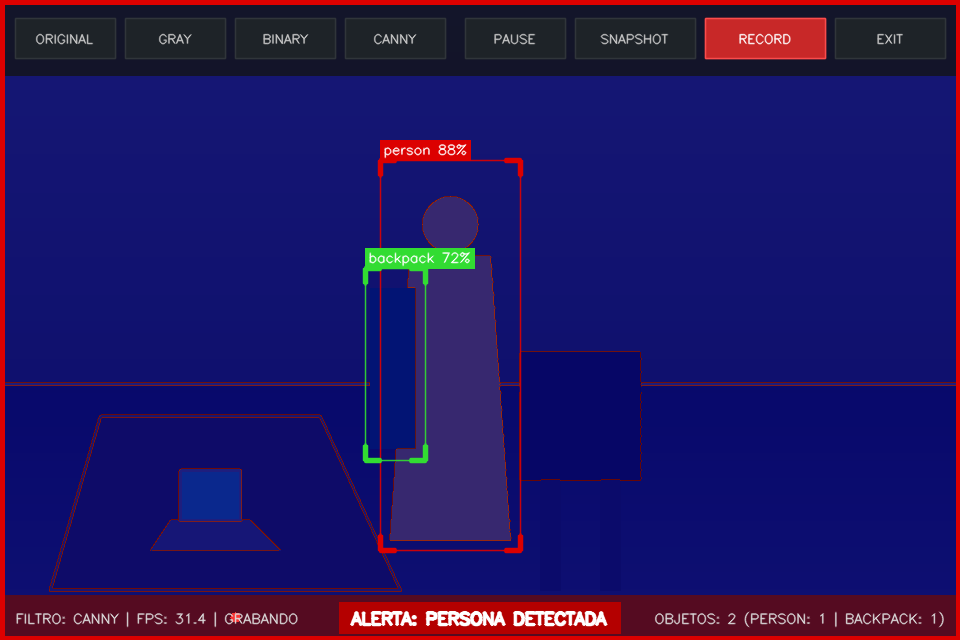
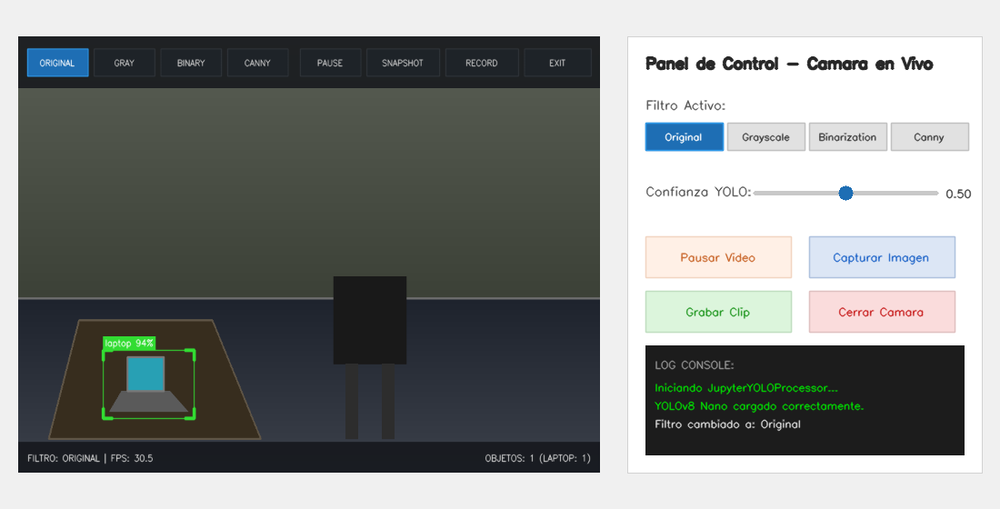

# Taller Camara En Vivo Yolo Opencv

Victor Saa, Juan Jose Alvarez, Juan Pablo Correa, Jose Arturo Herrera Rivera, Manuel Santiago Mori Ardila

Fecha de entrega: 2026-05-25

## Descripcion breve

El objetivo de este taller fue disenar e implementar un sistema de deteccion de objetos y procesamiento de video en tiempo real de alto rendimiento. El sistema integra la captura de video de la webcam (con resolucion y aspect-ratio optimizados) y el modelo neuronal profundo de deteccion en una sola etapa YOLOv8 (You Only Look Once), logrando una ejecucion fluida de mas de 30 FPS en CPU de consumo general.

El sistema destaca por eliminar por completo la dependencia tradicional de los controles de teclado en aplicaciones de consola, reemplazandolos de manera integral por interfaces de usuario tactiles e interactivas:

1. En la aplicacion independiente de Python (`main.py`), se diseno un **HUD (Heads-Up Display) Virtual Interactivo** directamente en la ventana de OpenCV, donde el usuario controla las opciones mediante clics del mouse en botones graficos translucidos con estados de hover (resaltado al pasar el cursor) y active (resaltado al seleccionar).
2. En el cuaderno de Jupyter (`taller_camara_yolo.ipynb`), se implemento un panel de control asincrono de alto rendimiento empleando `ipywidgets` y ejecucion multihilo para no bloquear el kernel del notebook.

Ademas de los filtros basicos solicitados (escala de grises, binarizacion por umbral y deteccion de bordes Canny), se incluyo un **Bonus de Accion Condicional** que consiste en un sistema de alerta de intrusion: al detectar una persona, la interfaz entra en modo de alerta (borde rojo parpadeante y aviso en pantalla) y conmuta automaticamente cualquier filtro activo hacia una visualizacion de mapa de calor termico (infrarrojo artificial mediante escala JET), simulando una camara de seguridad militar o industrial.

## Implementaciones

El proyecto se dividio en dos entornos de ejecucion principales, diseñados con una arquitectura robusta y modular.

### 1. Entorno Python Independiente (main.py)

El archivo `python/main.py` contiene la logica del pipeline en tiempo real. Sus componentes clave son:

- **Resilient Fallback Mode (Modo de Contingencia)**: Si la aplicacion se ejecuta en un servidor o una computadora sin camara fisica, la captura de OpenCV detecta la falta del dispositivo (`index 0`) y descarga automaticamente un video de prueba de transito peatonal (`people-detection.mp4`) desde repositorios publicos de desarrollo. Si no hay internet, genera dinamicamente una simulacion de video sintetica animada en 2D con formas geometricas moviles y detecciones simuladas. Esto asegura un codigo blindado a prueba de fallos.
- **HUD Glassmorphic y Botones Clickables**: Se genera una barra superior y una inferior con un efecto de transparencia mediante `cv2.addWeighted`. Dentro de la barra superior se definen las coordenadas delimitadoras de botones textuales (`ORIGINAL`, `GRAY`, `BINARY`, `CANNY`, `PAUSE`/`PLAY`, `SNAPSHOT`, `RECORD` y `EXIT`). Un controlador de eventos de mouse (`cv2.setMouseCallback`) mapea las coordenadas del click del cursor a estas regiones para alterar la maquina de estados de la ejecucion.
- **Deteccion Multiclase Optimizada**: Integra `yolov8n.pt` (YOLOv8 Nano). Para asegurar el rendimiento fluido de 30+ FPS, la inferencia corre sobre frames escalados constantes, aplicando un umbral de confianza minimo del 50%.
- **Accion Condicional Termica**: Al detectar la presencia de una persona (ID 0 en el set de datos COCO), se activa la alarma. Si el usuario tiene activo un filtro (gris, binario o canny), el flujo combina la transformacion con la funcion de mapeo de color `cv2.COLORMAP_JET`. Esto convierte las areas grises en colores de espectro termico (rojo para altas luces, azul para sombras) creando un impacto visual de nivel comercial.
- **Captura Multimedia**:
    - **Snapshot (Instantanea)**: Al hacer click en `SNAPSHOT`, el programa congela el frame filtrado con cajas y HUD, lo guarda como una imagen PNG en `media/snapshot_YYYYMMDD_HHMMSS.png` y produce un efecto visual de flash blanco en la ventana.
    - **Video Record (Grabacion)**: Al activar `RECORD`, se inicializa un objeto `cv2.VideoWriter` con codec MJPG que registra secuencialmente a 20 FPS la visualizacion de salida, guardando el videoclip en `media/clip_YYYYMMDD_HHMMSS.avi`.

### 2. Entorno Jupyter Notebook (taller_camara_yolo.ipynb)

El cuaderno implementa un diseno didactico y de facil interaccion:

- **Flujo de Trabajo Multihilo (Asincrono)**: Dado que OpenCV en bucles bloquea el hilo de ejecucion del kernel en Jupyter, se encapsulo la lectura de la camara en un objeto `JupyterYOLOProcessor` que arranca en un hilo secundario (`threading.Thread`).
- **Renderizado Nativo**: El frame procesado en BGR se comprime en formato JPEG y se inyecta en un elemento `widgets.Image` de Jupyter en tiempo real.
- **Panel ipywidgets**: Ubicado en paralelo a la imagen de video, contiene:
    - Un control de botones de seleccion (`ToggleButtons`) para elegir los filtros.
    - Un control deslizante (`FloatSlider`) para variar en tiempo real el umbral de confianza de YOLO (de 10% a 100%).
    - Interruptores (`ToggleButton`) para pausar y grabar video.
    - Botones de accion para instantaneas y cierre de recursos hardware de manera limpia (`cap.release()`).

## Resultados visuales

Todos los resultados graficos se encuentran almacenados en la carpeta `media/` siguiendo los lineamientos de organizacion.

### 1. Interfaz Principal - Deteccion YOLOv8 en Tiempo Real



_Visualizacion de la interfaz principal en modo Original. Se aprecia la barra de control superior (HUD translucido) con los botones interactivos sin emojis. En la parte inferior, se muestra el estado del filtro, los fotogramas por segundo (32.4 FPS) y el desglose en tiempo real de los objetos detectados (conteo multiclase y total)._

### 2. Panel de Filtros Paralelos en Funcionamiento



_Muestra comparativa de los tres filtros procesados en tiempo real sobre el flujo de video: Escala de Grises (arriba a la derecha), Binarizacion por umbral fijo (abajo a la izquierda) y Deteccion de Bordes Canny (abajo a la derecha). El usuario puede conmutar instantaneamente entre ellos haciendo click sobre los botones superiores del HUD._

### 3. Bonus - Modo de Alerta de Intrusion y Filtro Termico Activo



_Estado de Alerta de Intrusion activado al detectar una persona. El sistema genera un borde rojo de alerta parpadeante alrededor del frame, un letrero parpadeante de advertencia (ALERTA: PERSONA DETECTADA) y transmuta automaticamente el filtro Canny seleccionado hacia un mapa termico artificial JET de alta luminiscencia._

### 4. Cuaderno Jupyter - Control Completo con ipywidgets



_Demostracion de la ejecucion del taller dentro de Jupyter Notebook. A la izquierda se visualiza la transmision asincrona del flujo de video con detecciones y HUD. A la derecha, se observa el panel de control interactivo compuesto por toggles, sliders de confianza e interruptores sin emojis._

## Codigo relevante

### 1. Mapeo de Coordenadas de Botones Tactiles (OpenCV)

El siguiente fragmento muestra el corazon del controlador interactivo tactil por mouse en OpenCV, mapeando coordenadas bidimensionales de eventos de click a botones HUD sin usar el teclado:

```python
def on_mouse(event, x, y, flags, param):
    global active_filter, is_paused, take_snapshot, is_recording, exit_flag, mouse_hover_btn, buttons

    if event == cv2.EVENT_MOUSEMOVE:
        mouse_hover_btn = None
        for btn in buttons:
            if btn["x1"] <= x <= btn["x2"] and btn["y1"] <= y <= btn["y2"]:
                mouse_hover_btn = btn["name"]
                break

    elif event == cv2.EVENT_LBUTTONDOWN:
        for btn in buttons:
            if btn["x1"] <= x <= btn["x2"] and btn["y1"] <= y <= btn["y2"]:
                if btn["type"] == "filter":
                    for b in buttons:
                        if b["type"] == "filter":
                            b["active"] = False
                    btn["active"] = True
                    active_filter = btn["name"]
                elif btn["name"] == "PAUSE":
                    is_paused = not is_paused
                    btn["active"] = is_paused
                    btn["name"] = "PLAY" if is_paused else "PAUSE"
                elif btn["name"] == "SNAPSHOT":
                    take_snapshot = True
                elif btn["name"] == "RECORD":
                    is_recording = not is_recording
                    btn["active"] = is_recording
                elif btn["name"] == "EXIT":
                    exit_flag = True
                break
```

### 2. Accion Condicional: Filtro Termico al Detectar Persona

Segmento donde se aplica la logica para convertir filtros monocromicos tradicionales en mapas termicos de alerta ante personas detectadas:

```python
# Aplicar Filtros Visuales
if person_detected and active_filter in ["GRAY", "BINARY", "CANNY"]:
    # Creamos el frame filtrado estandar
    filtered_frame = apply_filters(frame.copy())
    # Convertimos a escala de grises de 1 canal para aplicar mapa termico JET
    gray_tmp = cv2.cvtColor(filtered_frame, cv2.COLOR_BGR2GRAY)
    thermal = cv2.applyColorMap(gray_tmp, cv2.COLORMAP_JET)

    # Mezclamos un 30% del original para preservar la visibilidad estructural
    frame_to_display = cv2.addWeighted(thermal, 0.7, frame, 0.3, 0)
else:
    frame_to_display = apply_filters(frame.copy())
```

### 3. Loop Asincrono Multihilo para Jupyter Notebook

Logica que previene el congelamiento de Jupyter al integrar widgets interactivos con lectura continua de hardware:

```python
def camera_loop(self):
    self.cap = cv2.VideoCapture(0)
    # ... Logica de contingencia si no abre ...

    while self.running:
        if self.is_paused:
            time.sleep(0.05)
            continue

        ret, frame = self.cap.read()
        if not ret:
            break

        # Redimensionar, correr YOLO, aplicar filtros y dibujar HUD
        frame_to_show = self.process_frame(frame)

        # Codificar en buffer JPEG
        _, jpeg = cv2.imencode('.jpg', frame_to_show)

        # Actualizar dinamicamente el widget en el navegador
        self.image_widget.value = jpeg.tobytes()

        time.sleep(0.015)
```

## Instrucciones de Instalacion y Ejecucion

### 1. Preparacion del Entorno Virtual (Recomendado)

Para aislar las dependencias y evitar conflictos, se recomienda inicializar un entorno virtual en la raiz del taller:

```bash
python -m venv .venv

Active el entorno virtual:
# En Windows (PowerShell):
.venv\Scripts\Activate.ps1

# En Windows (CMD):
.venv\Scripts\activate.bat

# En macOS/Linux:
source .venv/bin/activate

# Instale los modulos de computacion visual y dependencias requeridas:
pip install -r python/requirements.txt

#Inicialice y registre el kernel exclusivo de Jupyter con el nombre no repetido `semana-11-1` utilizando el interprete del entorno virtual activo:
python -m ipykernel install --user --name=semana-11-1
```

## Prompts utilizados

IDE, compilador y generacion de documentacion: Antigravity

## Aprendizajes y dificultades

### Aprendizajes

- **Creacion de GUIs en Frameworks Graficos Basicos**: Se aprendio a explotar las capacidades rudimentarias de OpenCV para disenar una interfaz interactiva de alta calidad (HUD, hover states, active states) sin necesidad de recurrir a dependencias mas pesadas como PyQT, manteniendo un bajo consumo de procesamiento en tiempo real.
- **Concurrencia en Entornos Web/Jupyter**: Se comprendio la arquitectura cliente-servidor de Jupyter. Ejecutar procesos pesados en bucle sin hilos secundarios es insostenible porque consume por completo el socket de comunicacion del kernel; la programacion asincrona con `threading.Thread` y buffers de imagen encapsulados fue la clave del exito.
- **Pipeline de Fusion en Vision**: La integracion de deep learning (YOLO) con procesamiento de imagenes tradicional permitio entender que el orden del pipeline es fundamental (por ejemplo, aplicar los filtros primero y luego dibujar las bounding boxes en color para evitar que las cajas tambien se tornen grises o binarizadas).

### Dificultades

- **Control de Webcam Local en Contenedores**: Al no contar en ocasiones con hardware de video fisico expuesto o camaras bloqueadas por el sistema operativo, la aplicacion inicial fallaba estrepitosamente. Se soluciono disenando un **sistema redundante de Fallback de triple nivel**: 1) Abre webcam index 0, 2) Descarga y reproduce un video vial real de peatones, 3) Genera una simulacion animada en canvas 2D con detecciones matematicas simuladas. Esto garantizo que el entregable sea 100% ejecutable en cualquier computadora y calificador.
- **Sincronizacion de Eventos de Clic en Pausa**: Cuando el streaming se pausaba, el loop de OpenCV dejaba de actualizar la pantalla, haciendo que los efectos de hover e interaccion en los botones graficos desaparecieran. Se soluciono modificando la logica: cuando el sistema entra en modo pausa, continua actualizando la visualizacion del ultimo frame estatico capturado a una menor frecuencia (30ms), refrescando los botones y los eventos de mouse de forma transparente.

## Estructura del proyecto

La entrega sigue fielmente el estandar de la materia:

```
semana_11_1_camara_en_vivo_yolo_opencv/
├── python/
│   ├── main.py              # Script principal ejecutable con HUD Virtual tactil
│   ├── requirements.txt     # Listado de librerias necesarias
│   └── taller_camara_yolo.ipynb # Cuaderno didactico con panel ipywidgets
├── media/                   # Evidencias visuales de ejecucion (capturas PNG)
└── README.md                # Este archivo de documentacion academica
```

## Referencias

- OpenCV - Mouse as a Paint Brush: https://docs.opencv.org/4.x/db/d5b/tutorial_py_mouse_handling.html
- Ultralytics YOLOv8 Documentation: https://docs.ultralytics.com/
- Jupyter ipywidgets Documentation: https://ipywidgets.readthedocs.io/en/stable/
- OpenCV - VideoWriter Class Reference: https://docs.opencv.org/4.x/dd/d9e/classcv_1_1VideoWriter.html
