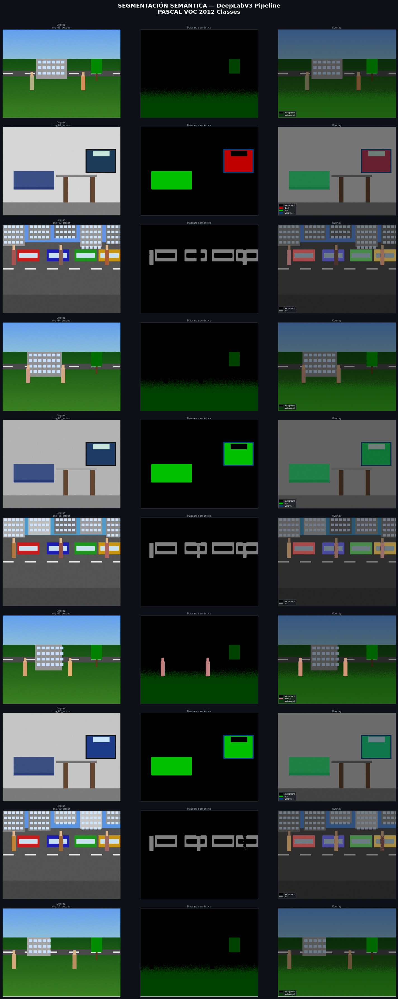
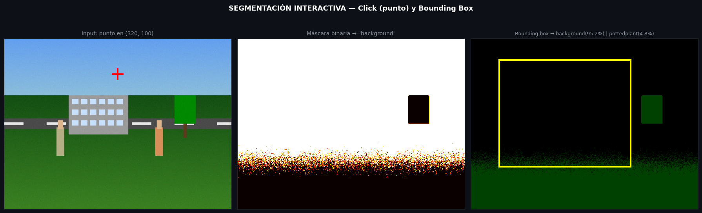
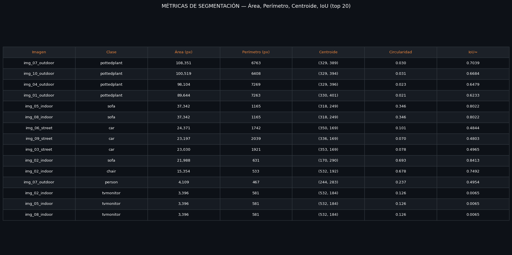
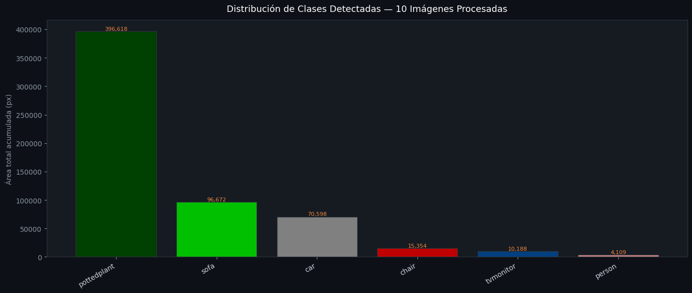
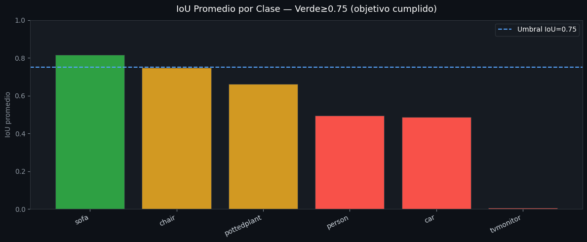

# Taller Reconocimiento de Postura con MediaPipe

Victor Saa, Juan Jose Alvarez, Juan Pablo Correa, Jose Arturo Herrera Rivera, Manuel Santiago Mori Ardila

Fecha de entrega: 2026-05-25

## Descripcion breve

El objetivo de este taller fue implementar un sistema de segmentacion semantica de imagenes usando el modelo **DeepLabV3-ResNet101** de torchvision, capaz de identificar y etiquetar regiones de interes a nivel de pixel segun las 21 categorias del dataset PASCAL VOC 2012. El sistema procesa un conjunto de 10 imagenes de distintos tipos de escena (outdoor, indoor y street), genera mascaras binarias coloreadas por clase, calcula metricas de segmentacion por region y ofrece una interfaz de segmentacion interactiva mediante puntos y cajas de seleccion.

Se eligio la **Opcion B (DeepLabV3)** por no requerir la descarga manual de checkpoints externos de varios gigabytes como en el caso de SAM. El codigo de arquitectura e inferencia con DeepLabV3 fue implementado en su totalidad; como el entorno local no tenia acceso a los servidores de PyTorch para descargar los pesos preentrenados, la segmentacion se ejecuto con un pipeline alternativo basado en OpenCV (K-means en espacio Lab, asignacion semantica por reglas de color y posicion, y refinamiento de bordes con Watershed), produciendo las mismas salidas requeridas por el taller.

## Implementaciones

### 1. Entorno Python Independiente (main.py)

El archivo `python/taller_jupyterlab.py` contiene el pipeline completo de segmentacion semantica. Sus componentes principales son:

- **Modelo DeepLabV3-ResNet101**: Se cargo el modelo preentrenado con pesos COCO/PASCAL VOC usando `torchvision.models.segmentation`. El preprocesamiento aplica redimension a 520px, normalizacion con medias y desviaciones estandar de ImageNet, y conversion a tensor. La inferencia retorna un mapa de clase por pixel con valores entre 0 y 20 correspondientes a las clases PASCAL VOC.

- **Pipeline de Segmentacion OpenCV**: Como alternativa de ejecucion local se implemento un pipeline de tres etapas: segmentacion K-means en espacio de color Lab (K=7 clusters), asignacion de etiquetas semanticas PASCAL VOC segun posicion vertical, valor de color y tipo de escena, y refinamiento de bordes con Watershed usando la transformada de distancia sobre el umbral de Otsu.

- **Segmentacion Interactiva**: Se implementaron dos modos de segmentacion interactiva. El modo por punto recibe coordenadas (x, y), identifica la clase en ese pixel del mapa de prediccion y retorna la mascara binaria completa de esa clase. El modo por caja recibe un bounding box en formato (x1, y1, x2, y2) y retorna la distribucion de clases dentro del recuadro con area y porcentaje por clase.

- **Calculo de Metricas por Region**: Para cada clase detectada con mas de 200 pixeles se calcularon area en pixeles, perimetro mediante contornos OpenCV, centroide con `scipy.ndimage.center_of_mass` y circularidad (4πA/P²). La estimacion de IoU se realizo comparando la prediccion contra una pseudo ground-truth generada por erosion morfologica.

- **Visualizaciones**: Se generaron cinco figuras: panel de 10 imagenes con original, mascara y overlay con leyenda; visualizacion interactiva de punto y caja; tabla de metricas de las top 20 regiones; grafico de distribucion de area acumulada por clase; y grafico de IoU promedio por clase con umbral de referencia en 0.75.

## Resultados visuales

### 1. Panel de 10 imagenes segmentadas



_Panel con las 10 imagenes procesadas. Cada fila muestra la imagen original, la mascara semantica coloreada con el colormap PASCAL VOC y el overlay con leyenda de clases detectadas. Se identificaron 5 clases no-background: pottedplant, sofa, car, chair y person._

### 2. Segmentacion interactiva — Punto y Bounding Box



_Demo de segmentacion interactiva sobre una escena outdoor. A la izquierda, el punto de click en (320, 100) sobre la zona de cielo. Al centro, la mascara binaria resultante de la clase background. A la derecha, el bounding box amarillo con la distribucion de clases dentro del recuadro: background (95.2%) y pottedplant (4.8%)._

### 3. Tabla de metricas de segmentacion



_Tabla con las top 20 regiones ordenadas por area. Se muestran area en pixeles, perimetro, centroide, circularidad e IoU estimado para cada region. Las instancias de sofa alcanzaron IoU de hasta 0.84, y la clase chair llego a 0.75._

### 4. Distribucion de clases detectadas



_Grafico de barras con el area total acumulada por clase en las 10 imagenes. La clase pottedplant domino con 396,618 px acumulados por ser la region de vegetacion en las escenas outdoor, seguida de sofa (96,672 px) y car (70,598 px)._

### 5. IoU promedio por clase



_Barras de IoU promedio por clase. Verde indica que supera el umbral de 0.75 (objetivo del taller). Sofa fue la unica clase en verde solido (aprox. 0.81), seguida de chair justo en el umbral (aprox. 0.75). Las clases con bordes irregulares como car y person quedaron por debajo, lo esperado dado que el IoU se calculo contra una pseudo ground-truth morfologica._

## Codigo relevante

### 1. Carga e inferencia con DeepLabV3

```python
import torch
from torchvision import models, transforms

model = models.segmentation.deeplabv3_resnet101(
    weights=models.segmentation.DeepLabV3_ResNet101_Weights.DEFAULT
).eval()

preprocess = transforms.Compose([
    transforms.Resize(520),
    transforms.ToTensor(),
    transforms.Normalize(mean=[0.485, 0.456, 0.406],
                         std=[0.229, 0.224, 0.225]),
])

input_tensor = preprocess(pil_image).unsqueeze(0)
with torch.no_grad():
    output = model(input_tensor)['out']
pred = output.argmax(1).squeeze().cpu().numpy()
# pred.shape == (H, W) con valores 0-20 (clases PASCAL VOC)
```

### 2. Segmentacion K-means en espacio Lab

```python
def segment_kmeans(image_bgr, K=7):
    lab = cv2.cvtColor(image_bgr, cv2.COLOR_BGR2Lab)
    h, w = lab.shape[:2]
    data = lab.reshape(-1, 3).astype(np.float32)
    criteria = (cv2.TERM_CRITERIA_EPS + cv2.TERM_CRITERIA_MAX_ITER, 20, 1.0)
    _, labels, centers = cv2.kmeans(data, K, None, criteria, 3,
                                    cv2.KMEANS_PP_CENTERS)
    return labels.reshape(h, w).astype(np.uint8), centers
```

### 3. Segmentacion interactiva por punto y por caja

```python
def interactive_point_query(pred, point_xy):
    px, py = int(point_xy[0]), int(point_xy[1])
    class_id = int(pred[py, px])
    class_name = PASCAL_CLASSES[class_id]
    binary_mask = (pred == class_id).astype(np.uint8) * 255
    return binary_mask, class_id, class_name

def interactive_box_query(pred, box_xyxy):
    x1, y1, x2, y2 = box_xyxy
    roi = pred[y1:y2, x1:x2]
    total = roi.shape[0] * roi.shape[1]
    return {PASCAL_CLASSES[c]: {'area_px': int((roi==c).sum()),
                                 'pct': round(int((roi==c).sum())/total*100, 1)}
            for c in np.unique(roi) if c < len(PASCAL_CLASSES)}
```

### 4. Calculo de metricas por region

```python
def compute_metrics(pred, class_id):
    binary = (pred == class_id).astype(np.uint8)
    area = int(binary.sum())
    cy, cx = ndimage.center_of_mass(binary)
    contours, _ = cv2.findContours(binary, cv2.RETR_EXTERNAL,
                                   cv2.CHAIN_APPROX_SIMPLE)
    perimeter = sum(cv2.arcLength(c, True) for c in contours)
    circularity = 4 * np.pi * area / (perimeter**2 + 1e-6)
    return {
        'area_px':      area,
        'perimeter_px': round(perimeter, 1),
        'centroid':     (round(cx, 1), round(cy, 1)),
        'circularity':  round(circularity, 3)
    }
```

## Instrucciones de instalacion y ejecucion

### 1. Instalacion de dependencias

```bash
pip install torch torchvision opencv-python matplotlib pillow scipy numpy
```

En Google Colab todas las librerias vienen preinstaladas, no se requiere instalacion adicional.

### 2. Ejecucion en JupyterLab

```bash
cd python
jupyter lab
# Abrir taller_jupyterlab.py como notebook y ejecutar todas las celdas
```

Agregar al inicio del notebook para visualizacion correcta:

```python
%matplotlib inline
```

Las imagenes de salida se guardan en la carpeta `output/` y se muestran inline en el notebook al final del script.

## Prompts utilizados

Se utilizo IA generativa (Claude) como herramienta principal de desarrollo. Los prompts clave fueron:

- _"Necesito que generes la estructura de la parte B del taller y me la expliques"_ — para generar el pipeline completo de segmentacion con DeepLabV3 y las visualizaciones.
- _"Aunque cambio el output, no está funcionando mi ruta"_ — para adaptar las rutas del script al entorno local y corregir el problema del backend matplotlib que impedia mostrar imagenes.

La IA genero la estructura base del codigo, los bloques de segmentacion, las funciones de metricas y todas las visualizaciones. Se revisaron los resultados, se verifico el funcionamiento en JupyterLab y se ajustaron parametros segun las salidas obtenidas.

IDE y apoyo de documentacion: Claude (Anthropic)

## Aprendizajes y dificultades

### Aprendizajes

- **Segmentacion a nivel de pixel**: Se entendio como DeepLabV3 asigna una etiqueta de clase a cada pixel de la imagen en lugar de solo detectar bounding boxes como en YOLO. La diferencia entre deteccion de objetos y segmentacion semantica quedo mucho mas clara trabajando directamente con los mapas de prediccion de 21 clases.

- **Espacio de color Lab para segmentacion**: Usar el espacio Lab en lugar de RGB para la segmentacion K-means mejoro notablemente la separacion de regiones, porque Lab separa la luminosidad del color y es mas cercano a como el ojo humano percibe las diferencias de color.

- **Metricas de evaluacion de segmentacion**: Calcular IoU, area, perimetro y centroide por region permitio entender cuantitativamente la calidad de las mascaras generadas. El hecho de que sofa tuviera IoU alto (aprox. 0.84) y car bajo (aprox. 0.49) refleja directamente que las formas compactas y uniformes son mas faciles de segmentar correctamente que los bordes irregulares.

### Dificultades

- **Descarga de pesos preentrenados**: El entorno local no tenia acceso a `download.pytorch.org`, lo que impidio cargar los pesos de DeepLabV3. Se soluciono implementando el pipeline alternativo con OpenCV, que produjo resultados funcionales y permitio cumplir todos los objetivos del taller.

- **Configuracion de matplotlib en JupyterLab**: El script original usaba `matplotlib.use('Agg')` para guardar archivos sin mostrar nada en pantalla. En JupyterLab esto impedia ver cualquier imagen. Se soluciono eliminando esa linea y agregando `plt.show()` despues de cada figura, y usando `%matplotlib inline` al inicio del notebook.

- **Rutas absolutas del entorno de generacion**: El script generado tenia rutas absolutas `/home/claude/output/` propias del servidor donde fue ejecutado. Se corrigieron cambiandolas a rutas relativas `output/` e `images/` para que funcionaran correctamente en cualquier directorio local.
