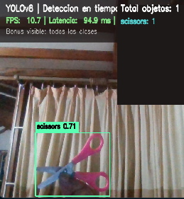
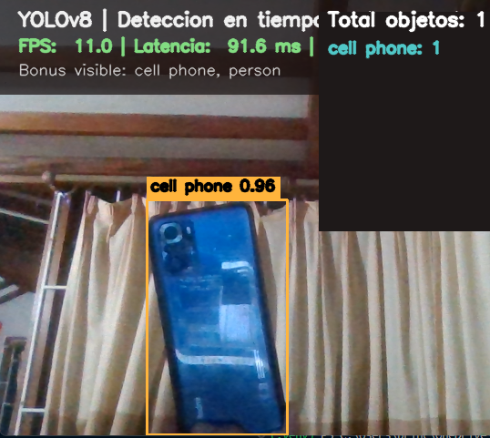

# Taller Yolo Deteccion Webcam Tiempo Real

Victor Saa, Juan Jose Alvarez, Juan Pablo Correa, Jose Arturo Herrera Rivera, Manuel Santiago Mori Ardila

Fecha de entrega: 2026-05-25

---

## Descripcion breve

El objetivo de este taller fue desarrollar una aplicacion de deteccion de objetos en tiempo real con YOLOv8 usando la webcam, manteniendo una experiencia fluida y midiendo metricas de desempeño en pantalla. La implementacion procesa cada frame con Ultralytics YOLO, dibuja las cajas delimitadoras, muestra la clase y la confianza, y calcula FPS, latencia promedio e inferencia por frame para evaluar el rendimiento del modelo en ejecucion local.

Ademas del flujo principal, se agrego un bonus practico para el taller: filtro de clases visibles desde la interfaz por teclado, de modo que se puedan mostrar solo detecciones relevantes como `person` y `cell phone`, o alternar rapidamente entre mostrar todas las clases y una seleccion concreta. Esto ayuda a revisar el comportamiento del modelo sin saturar la pantalla con etiquetas innecesarias.

## Implementaciones

### Python

El archivo [python/main.py](python/main.py) contiene toda la logica de ejecucion en tiempo real.

- **Carga del modelo YOLOv8**: El script usa `ultralytics.YOLO` con el modelo `yolov8n.pt` por defecto, porque ofrece una buena relacion entre velocidad y precision para webcam en tiempo real.
- **Captura de webcam**: La entrada se abre con `cv2.VideoCapture(0)` o con una ruta de video si se desea probar con material grabado.
- **Inferencia por frame**: Cada frame se procesa con `model.predict(...)`, se extraen las cajas, las clases y la confianza, y luego se dibujan sobre una copia del frame original.
- **Metricas en pantalla**: Se calcula FPS instantaneo y promedio movil, latencia promedio por frame y un conteo de objetos por clase actualizado en cada iteracion.
- **Bonus de clases visibles**: El usuario puede mostrar solo algunas clases COCO usando el argumento `--classes` o alternar entre ver todas las clases y el subconjunto seleccionado con la tecla `a`.
- **Control por teclado**: `q` sale de la aplicacion, `+` aumenta el umbral de confianza y `-` lo disminuye dentro del rango sugerido del taller.

## Resultados visuales

### 1. Deteccion principal en tiempo real



_Captura principal de la aplicacion mostrando la webcam procesada con YOLOv8, las cajas sobre los objetos detectados y el panel con FPS, latencia y conteo total._

### 2. Bonus de filtrado por clases



_Captura del bonus donde se muestran solo las clases seleccionadas en pantalla, por ejemplo `person` y `cell phone`, mientras el resto de detecciones se ocultan temporalmente._

## Codigo relevante

### Inferencia y dibujo de detecciones

```python
results = model.predict(frame, imgsz=args.imgsz, conf=confidence, verbose=False)
annotated = frame.copy()

if results:
    result = results[0]
    for box in result.boxes:
        class_id = int(box.cls.item())
        class_name = result.names[class_id]
        x1, y1, x2, y2 = map(int, box.xyxy[0].tolist())
        score = float(box.conf.item())
        cv2.rectangle(annotated, (x1, y1), (x2, y2), (60, 180, 255), 2)
        cv2.putText(annotated, f'{class_name} {score:.2f}', (x1, y1 - 8),
                    cv2.FONT_HERSHEY_SIMPLEX, 0.55, (255, 255, 255), 2)
```

### Calculo de metricas de rendimiento

```python
frame_end = time.perf_counter()
latency_ms = (frame_end - frame_start) * 1000.0
fps = 1.0 / max(frame_end - frame_start, 1e-6)
fps_history.append(fps)
latency_history.append(latency_ms)
avg_fps = sum(fps_history) / len(fps_history)
avg_latency = sum(latency_history) / len(latency_history)
```

### Filtro bonus de clases visibles

```python
if not display_all and normalized_name not in selected_classes:
    continue
```

## Prompts utilizados

- "Necesito una estructura simple en Python para detectar objetos con YOLOv8 desde webcam y mostrar FPS en pantalla."
- "Como puedo filtrar solo ciertas clases COCO en una demo de YOLO sin romper el conteo global de detecciones?"

## Aprendizajes y dificultades

### Aprendizajes

- La diferencia entre un modelo rapido como `yolov8n` y uno mas pesado se nota de inmediato en webcam, asi que medir FPS y latencia es fundamental para tomar decisiones tecnicas.
- El conteo de objetos por clase ayuda a validar visualmente que la inferencia no solo detecta cajas, sino que realmente esta identificando categorias COCO de forma consistente.
- Separar la logica de captura, inferencia, dibujo y metrico hace que el script sea mas facil de depurar y extender.

### Dificultades

- La webcam puede entregar frames con resolucion y rendimiento variables, asi que fue necesario mantener el pipeline simple y evitar trabajo innecesario por frame.
- Ajustar un umbral de confianza estable es importante para no saturar la interfaz con falsas detecciones o perder objetos pequeños.

## Estructura del proyecto

```text
semana_11_5_yolo_deteccion_webcam_tiempo_real/
├── media/
├── python/
│   ├── main.py
│   └── requirements.txt
└── README.md
```

## Referencias

- Ultralytics YOLO Documentation: https://docs.ultralytics.com/
- OpenCV VideoCapture: https://docs.opencv.org/4.x/d8/dfe/classcv_1_1VideoCapture.html
- OpenCV Drawing Functions: https://docs.opencv.org/4.x/d6/d6e/group__imgproc__draw.html
