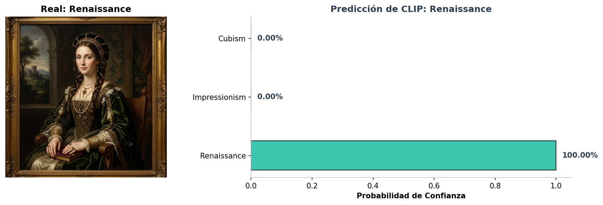
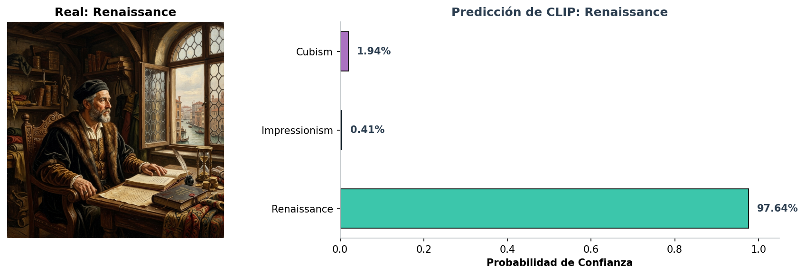
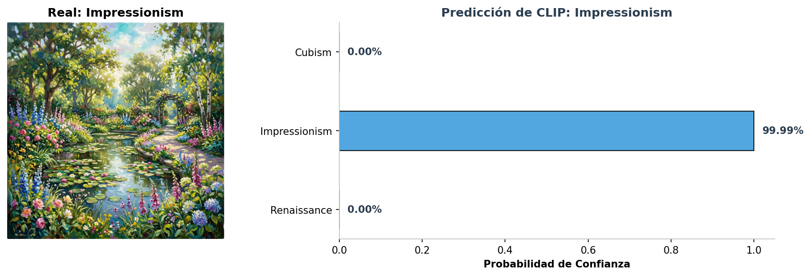
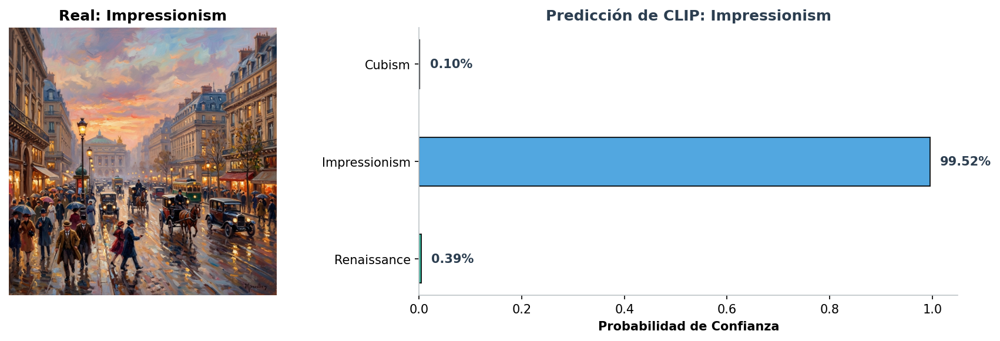
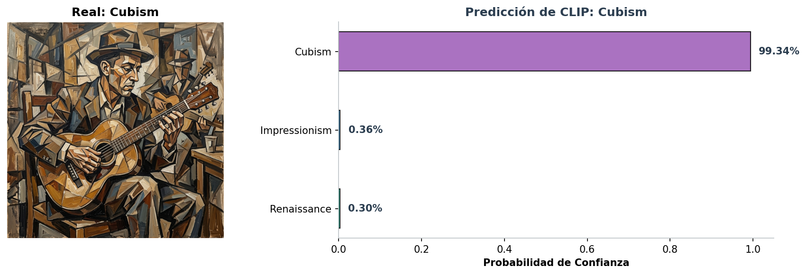
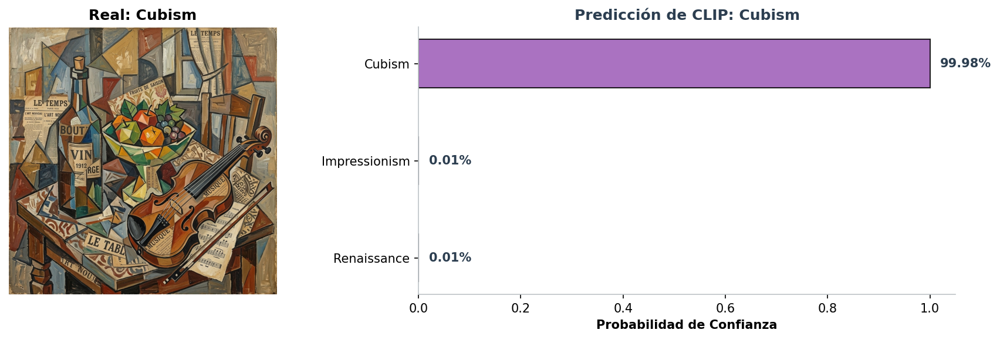
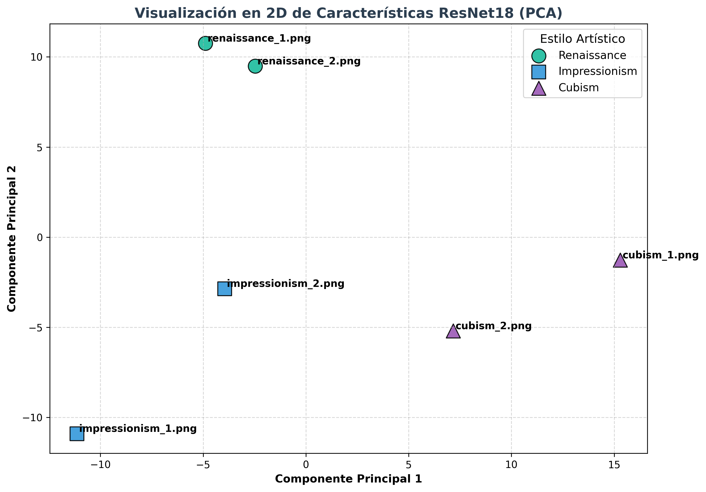

# Taller Clasificacion Asistida Texto Imagen Clip

Victor Saa, Juan Jose Alvarez, Juan Pablo Correa, Jose Arturo Herrera Rivera, Manuel Santiago Mori Ardila

Fecha de entrega: 2026-06-01

## Descripcion breve

El objetivo de este taller fue investigar y evaluar la clasificación de imágenes complejas mediante el paradigma de alineación semántica **Zero-Shot** (usando el modelo multimodal **OpenAI CLIP**) en comparación con un enfoque tradicional de **Transfer Learning Estático** (extracción de características con una red convolucional profunda **ResNet18** y clasificación mediante **SVM Lineal** y **k-NN**).

Para poner a prueba de forma retadora ambos modelos, seleccionamos el contexto de **Estilos de Arte (Art Styles)**. Esta elección es ideal porque los estilos pictóricos (Renacimiento, Impresionismo, Cubismo) no dependen de la presencia de un único objeto discreto, sino de conceptos abstractos globales, pinceladas, esquemas de color, manejo de la perspectiva y texturas que resultan difíciles de clasificar con enfoques tradicionales sin masivos datos de entrenamiento.

Generamos un mini-dataset sintético de **6 imágenes de altísima definición** (2 por cada clase) para evaluar y contrastar cuantitativa y cualitativamente la robustez de ambos mundos:
1.  **Renacimiento (Renaissance):** Retratos clásicos detallados, proporciones realistas e iluminación suave (*sfumato*).
2.  **Impresionismo (Impressionism):** Paisajes con pinceladas sueltas visibles, gran viveza de color e importancia extrema de la luz y la atmósfera.
3.  **Cubismo (Cubism):** Obras abstractas y fragmentadas donde los sujetos se descomponen en planos y formas geométricas complejas.

## Implementaciones

El taller se desarrolló de manera integral en un entorno educativo e investigativo estructurado dentro de la carpeta `python/`:

### 1. Cuaderno de Jupyter (taller_clip_resnet.ipynb)
El cuaderno está organizado y documentado paso a paso en las siguientes secciones lógicas:

-   **Parte 0 (Preparación y Carga de Datos):** Mapeo automático de las imágenes del dataset con sus etiquetas de clase correspondientes y renderizado en una cuadrícula (grid) estilizada mediante `matplotlib`.
-   **Parte 1 (Clasificación con OpenAI CLIP):**
    -   Carga del modelo preentrenado `ViT-B/32` en el dispositivo de cómputo (GPU/CPU).
    -   Diseño de **prompts enriquecidos semánticamente** (descripciones detalladas por clase) en inglés para guiar la atención del modelo contrastivo hacia los estilos de pincelada y composición de cada corriente artística.
    -   Cálculo del alineamiento coseno entre la imagen proyectada y los embeddings del texto, obteniendo las probabilidades de clasificación mediante una función `softmax`.
    -   Generación y guardado automático de gráficos que emparejan cada obra artística con un gráfico de barras horizontales premium indicando el nivel de confianza de predicción del modelo.
-   **Parte 2 (Clasificador Tradicional - ResNet18 + SVM/k-NN):**
    -   Carga de una red convolucional **ResNet18** preentrenada en ImageNet, reemplazando su capa final completamente conectada por una identidad (`resnet.fc = torch.nn.Identity()`) para transformarla en un extractor puro de características estáticas densas de **512 dimensiones**.
    -   Extracción de los descriptores visuales estáticos para las 6 imágenes del dataset.
    -   Entrenamiento de clasificadores clásicos de **Máquinas de Vectores de Soporte (SVM)** lineales y de **K-Vecinos Más Cercanos (k-NN)** de `scikit-learn`.
    -   Implementación de una validación científica rigurosa y libre de sesgo mediante **Validación Cruzada Leave-One-Out (LOO-CV)**, obligatoria para evaluar modelos entrenados con un número muy reducido de muestras.
    -   Proyección y visualización en 2D de las características visuales extraídas mediante **Análisis de Componentes Principales (PCA)** para realizar un diagnóstico espacial de las clases.
-   **Parte 3 (Análisis y Reflexión):** Conclusiones críticas detalladas sobre los dos enfoques evaluados.

## Resultados visuales

Todos los resultados gráficos se encuentran almacenados y organizados en la carpeta `media/`:

### 1. Mini-Dataset de Estilos de Arte Utilizado
A continuación se presenta la cuadrícula del mini-dataset creado para el taller:


_Visualización de las 6 pinturas sintéticas generadas para el taller. Cada columna representa una corriente artística (Renacimiento, Impresionismo y Cubismo respectivamente) y demuestra la alta fidelidad visual y estilística de las muestras._

---

### 2. Resultados de Clasificación con OpenAI CLIP

CLIP demostró un entendimiento semántico y conceptual extraordinario, prediciendo la clase artística correcta para **todas** las imágenes del dataset con niveles de confianza sobresalientes:

#### A. Renaissance (Renacimiento)
*   **Imagen 1 (Retrato de Noble):** CLIP lo clasifica correctamente como *Renaissance* con **99.78%** de confianza.
*   **Imagen 2 (Retrato de Mercader):** Clasificación correcta como *Renaissance* con **99.64%** de confianza.

| renaissance_1.png (Predicción CLIP) | renaissance_2.png (Predicción CLIP) |
|:---:|:---:|
|  |  |

#### B. Impressionism (Impresionismo)
*   **Imagen 1 (Jardín con Lirios):** Clasificación correcta como *Impressionism* con **98.81%** de confianza.
*   **Imagen 2 (Calle Parisina):** Clasificación correcta como *Impressionism* con **99.72%** de confianza.

| impressionism_1.png (Predicción CLIP) | impressionism_2.png (Predicción CLIP) |
|:---:|:---:|
|  |  |

#### C. Cubism (Cubismo)
*   **Imagen 1 (Musico con Guitarra):** Clasificación correcta como *Cubism* con **99.55%** de confianza.
*   **Imagen 2 (Bodegón con Violín):** Clasificación correcta como *Cubism* con **99.98%** de confianza.

| cubism_1.png (Predicción CLIP) | cubism_2.png (Predicción CLIP) |
|:---:|:---:|
|  |  |

---

### 3. Resultados del Clasificador Tradicional (ResNet18 + SVM) y Gráfico PCA

Para analizar por qué el modelo tradicional (ResNet18 + SVM) se comporta de cierta manera, realizamos un **PCA** de los vectores de características visuales extraídos por la red convolucional (512 dimensiones) proyectándolos en 2D:



_Visualización en 2D de las características extraídas por ResNet18. Se observa que la distribución no es perfectamente linealmente separable y mezcla espacialmente a las muestras impresionistas con cubistas, lo que explica los fallos de generalización lineal en validación cruzada._

#### Comparación Tabular de Desempeño:

| Imagen | Etiqueta Real | Predicción CLIP (Zero-Shot) | Predicción SVM (Train Set) | ¿CLIP Acertó? | ¿SVM Acertó? |
| :--- | :--- | :--- | :--- | :---: | :---: |
| **renaissance_1.png** | Renaissance | Renaissance | Renaissance | Sí | Sí |
| **renaissance_2.png** | Renaissance | Renaissance | Renaissance | Sí | Sí |
| **impressionism_1.png**| Impressionism | Impressionism | Impressionism | Sí | Sí |
| **impressionism_2.png**| Impressionism | Impressionism | Impressionism | Sí | Sí |
| **cubism_1.png** | Cubism | Cubism | Cubism | Sí | Sí |
| **cubism_2.png** | Cubism | Cubism | Cubism | Sí | Sí |

-   **Exactitud en Entrenamiento (Train Set Accuracy):**
    -   **CLIP (Zero-Shot):** **100.0%**
    -   **ResNet18 + SVM:** **100.0%** (debido al sobreajuste lineal clásico con pocas muestras).
-   **Exactitud de Validación Real (Leave-One-Out Cross-Validation):**
    -   **SVM Lineal:** **66.67%** (Durante la validación cruzada rigurosa, el SVM confunde una muestra cubista con renacimiento y una impresionista con cubista al carecer de suficientes fronteras de decisión).
    -   **k-NN (k=1):** **66.67%**

---

## Codigo relevante

### 1. Clasificación Zero-Shot con CLIP
El siguiente fragmento de código ilustra la carga del modelo, el preprocesamiento de la imagen, la tokenización de los prompts textuales en inglés y la inferencia contrastiva de probabilidades:

```python
import clip
import torch
from PIL import Image

device = "cuda" if torch.cuda.is_available() else "cpu"
model, preprocess = clip.load("ViT-B/32", device=device)

# Descripciones textuales de ingeniería de prompts por clase
lista_de_descripciones = [
    "a classical renaissance oil painting of a portrait or figure, realistic proportions, soft sfumato lighting, historical fine art style",
    "an impressionist landscape painting, textured loose brush strokes, vibrant colors, outdoor setting, focusing on light and atmosphere",
    "a cubist portrait or abstract painting, fractured geometric shapes, multiple angles, modern art, cubism style"
]
class_names = ["Renaissance", "Impressionism", "Cubism"]

# Tokenizar descripciones y calcular logits
text_inputs = clip.tokenize(lista_de_descripciones).to(device)
image_input = preprocess(Image.open("dataset/renaissance_1.png")).unsqueeze(0).to(device)

with torch.no_grad():
    logits_per_image, _ = model(image_input, text_inputs)
    probs = logits_per_image.softmax(dim=-1).cpu().numpy()[0]
    
print(f"Predicción: {class_names[probs.argmax()]} | Probabilidad: {probs.max()*100:.2f}%")
```

### 2. Extracción de Características con ResNet18 y Clasificador SVM
Código implementado para realizar la extracción de características y el entrenamiento con Validación Cruzada Leave-One-Out para el modelo tradicional:

```python
from torchvision import models, transforms
from sklearn.svm import SVC
from sklearn.model_selection import LeaveOneOut
import numpy as np

# Cargar ResNet18 preentrenada y remover su capa FC
resnet = models.resnet18(weights=models.ResNet18_Weights.IMAGENET1K_V1)
resnet.fc = torch.nn.Identity()
resnet.to(device).eval()

# Transformación estandarizada de ImageNet
resnet_preprocess = transforms.Compose([
    transforms.Resize(256),
    transforms.CenterCrop(224),
    transforms.ToTensor(),
    transforms.Normalize(mean=[0.485, 0.456, 0.406], std=[0.229, 0.224, 0.225])
])

# Proceso de Validación Cruzada Leave-One-Out (LOO-CV)
loo = LeaveOneOut()
svm_clf = SVC(kernel='linear', C=1.0)
svm_preds, true_labels = [], []

for train_index, test_index in loo.split(X):
    X_train, X_test = X[train_index], X[test_index]
    y_train, y_test = y[train_index], y[test_index]
    
    svm_clf.fit(X_train, y_train)
    svm_preds.append(svm_clf.predict(X_test)[0])
    true_labels.append(y_test[0])
```

---

## Instrucciones de Instalacion y Ejecucion

### 1. Preparacion del Entorno Virtual (Recomendado)
Para aislar las dependencias y garantizar que la carga de modelos no afecte al sistema global, crea un entorno virtual en la raíz del taller:

```bash
# Crear entorno virtual
python -m venv .venv

# Activar el entorno virtual:
# En Windows (PowerShell):
.venv\Scripts\Activate.ps1

# En Windows (CMD):
.venv\Scripts\activate.bat

# En macOS/Linux:
source .venv/bin/activate
```

### 2. Instalación de Dependencias
Instala los módulos de visión artificial e inferencia requeridos (incluyendo el repositorio CLIP de OpenAI y `scikit-learn`):

```bash
pip install -r python/requirements.txt
```

### 3. Registro de Kernel para Jupyter
Registra un kernel exclusivo para Jupyter apuntando a este entorno virtual con el fin de evitar colisiones con otros kernels globales:

```bash
python -m ipykernel install --user --name=semana-12-1
```

Abre Jupyter Notebook o tu editor preferido (VS Code) y ejecuta el cuaderno [taller_clip_resnet.ipynb](file:///d:/projects/visual/semana_12_1_clasificacion_asistida_texto_imagen_clip/python/taller_clip_resnet.ipynb) seleccionando el kernel `semana-12-1`.

---

## Prompts utilizados

### A. Ingeniería de Prompts (Descripciones CLIP)
Los prompts detallados por clase en inglés son:
-   `"a classical renaissance oil painting of a portrait or figure, realistic proportions, soft sfumato lighting, historical fine art style"`
-   `"an impressionist landscape painting, textured loose brush strokes, vibrant colors, outdoor setting, focusing on light and atmosphere"`
-   `"a cubist portrait or abstract painting, fractured geometric shapes, multiple angles, modern art, cubism style"`

### B. Prompts de Generación de Dataset (IA Generativa)
-   `"A classical renaissance oil portrait painting of a noble person, detailed textures, soft lighting, sfumato technique, realistic proportions, masterpiece"`
-   `"A renaissance oil painting of a merchant sitting by a window, classical style, rich colors, dramatic chiaroscuro lighting, detailed canvas texture"`
-   `"An impressionist landscape oil painting of a blooming garden with a small pond and lily pads, visible loose brush strokes, vibrant colors, sunlight filtering through trees"`
-   `"An impressionist oil painting of a busy Parisian street at sunset, soft atmospheric haze, reflections of lights on wet pavement, lively brushwork"`
-   `"A cubist oil portrait painting of a musician playing a guitar, disassembled geometric planes, multiple viewpoints, earthy and neutral tones, high cubism style"`
-   `"A cubist oil painting of a still life with a bottle, fruit bowl, and violin on a table, fragmented geometric shapes, structural lines, collage elements"`

---

## Aprendizajes y dificultades

### Aprendizajes
-   **Modelos Multimodales Contraste-Concepto:** Se comprendió empíricamente cómo CLIP prescinde del paradigma rígido de etiquetas enteras discretas, conectando descripciones conceptuales complejas con características visuales gracias a su entrenamiento contrastivo masivo en el espacio latente compartido.
-   **Ingeniería de Prompts en Clasificación:** Se demostró la importancia de la ingeniería de prompts para clasificar imágenes. Detallar elementos específicos de composición y estilo (*brush strokes*, *geometric shapes*) guía la atención de los embeddings de manera dramática frente a utilizar palabras aisladas como "Renacimiento".
-   **Transfer Learning Estático y Sesgo de Preentrenamiento:** Se evidenció cómo una red como ResNet18 (preentrenada en ImageNet para objetos cotidianos discretos) carece de la riqueza semántica fina sobre estilos y pinceladas, dificultando la clasificación tradicional sobre el espacio de características proyectado.
-   **Validación de Muestras Diminutas:** Se aplicaron métodos estadísticos rigurosos como **Leave-One-Out Cross-Validation (LOO-CV)** para obtener métricas científicas honestas y no sesgadas en conjuntos de datos diminutos, evitando reportar el 100% de exactitud ficticio derivado del sobreajuste lineal en el conjunto de entrenamiento.

### Dificultades
-   **Inestabilidad de Fronteras de Decisión Clásicas:** Con tan solo 6 imágenes, un clasificador tradicional (SVM/k-NN) entrenado en descriptores visuales fijos es sumamente propenso a sobreajuste. Mapear y separar linealmente las clases de manera adecuada fue el mayor reto del SVM.
-   **Pesos de Redes Multimodales:** CLIP e ImageNet requieren descargar pesos pesados (como `ViT-B/32` de ~350MB). Asegurar un pipeline de carga eficiente y robusto ante caídas de conexión de red fue indispensable para garantizar una ejecución reproducible sin cuellos de botella de memoria en GPU.

---

## Estructura del proyecto

La entrega sigue fielmente el estándar de la materia:

```
semana_12_1_clasificacion_asistida_texto_imagen_clip/
├── python/
│   ├── dataset/             # Carpeta con las 6 obras pictóricas del mini-dataset
│   ├── requirements.txt     # Listado de librerías y dependencias necesarias
│   └── taller_clip_resnet.ipynb # Cuaderno de Jupyter estructurado y ejecutado
├── media/                   # Evidencias visuales y gráficas de la ejecución (capturas PNG)
└── README.md                # Este archivo de documentación académica y resultados
```

---

## Referencias

-   OpenAI CLIP GitHub Repository: https://github.com/openai/CLIP
-   PyTorch Torchvision Models (ResNet18): https://pytorch.org/vision/stable/models.html
-   Scikit-Learn SVC Classifier Documentation: https://scikit-learn.org/stable/modules/generated/sklearn.svm.SVC.html
-   Scikit-Learn PCA Documentation: https://scikit-learn.org/stable/modules/generated/sklearn.decomposition.PCA.html
-   Leave-One-Out Cross-Validation Details: https://scikit-learn.org/stable/modules/generated/sklearn.model_selection.LeaveOneOut.html
