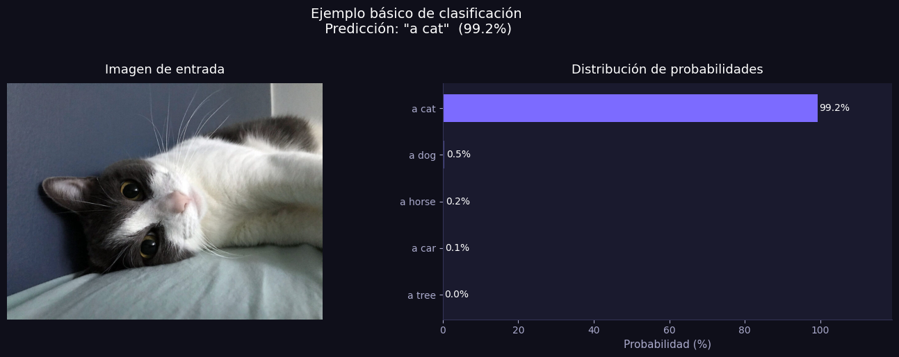
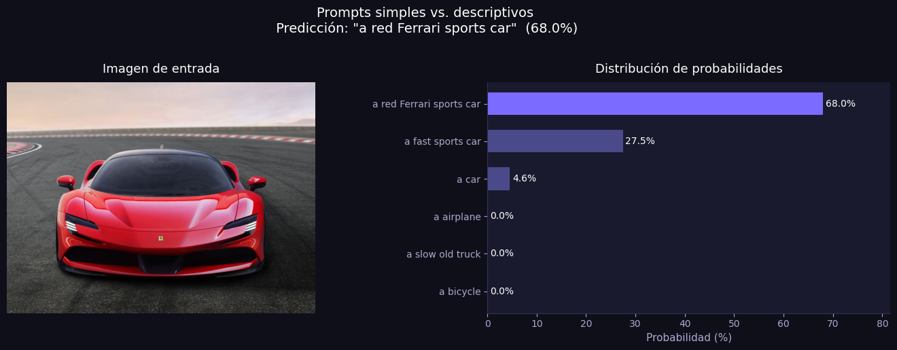
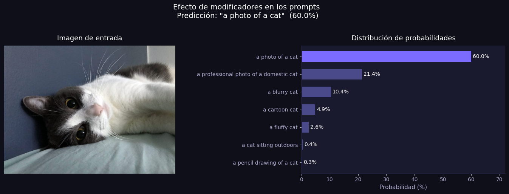
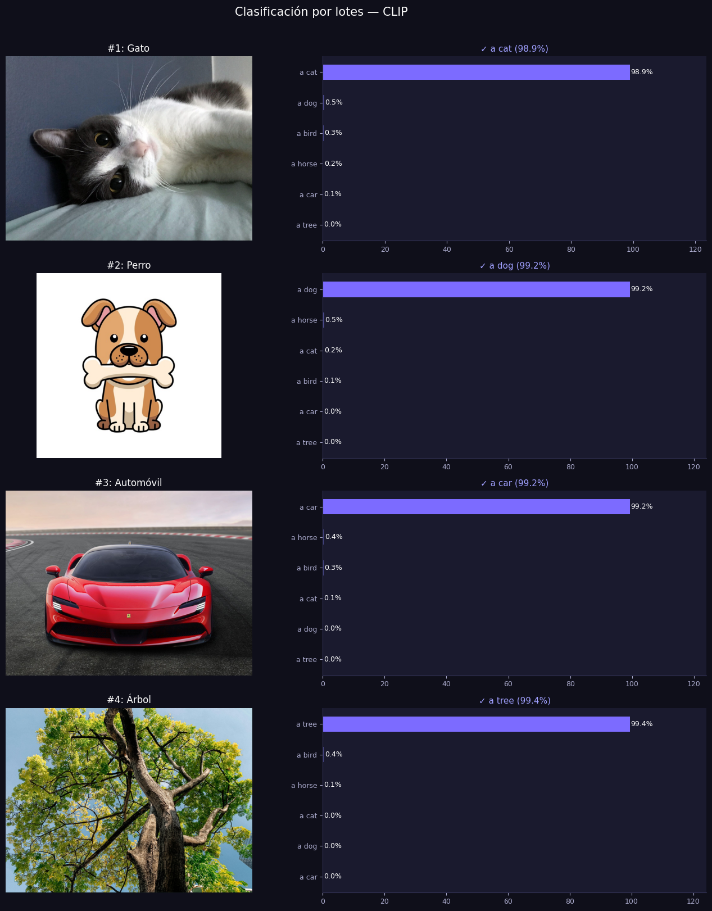
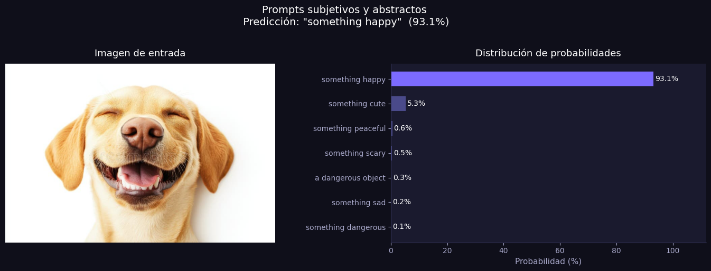
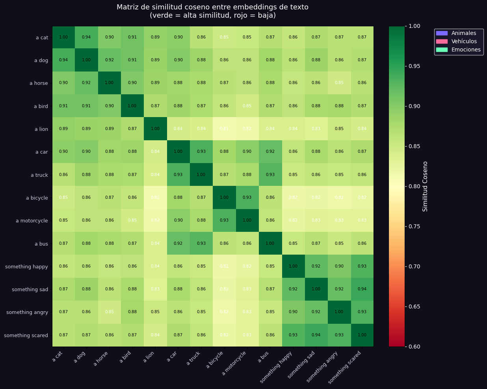
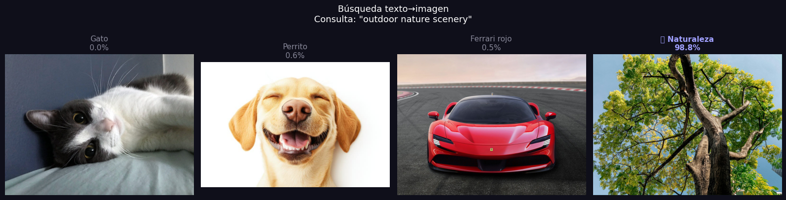

# Taller CLIP: Clasificacion Visual-Verbal

Victor Saa, Juan Jose Alvarez, Juan Pablo Correa, Jose Arturo Herrera Rivera, Manuel Santiago Mori Ardila

Fecha de entrega: 2026-06-01

## Descripcion breve

El objetivo de este taller fue explorar e implementar el modelo CLIP (Contrastive Language-Image Pre-training) de OpenAI para realizar clasificacion zero-shot de imagenes a partir de descripciones textuales en lenguaje natural. CLIP conecta el espacio visual y el espacio textual en un mismo espacio de embeddings, permitiendo clasificar imagenes sin necesidad de entrenamiento previo sobre las categorias de interes.

El notebook implementa los siguientes experimentos progresivos:

1. **Clasificacion basica**: Una imagen de un gato se clasifica contra 5 etiquetas candidatas (cat, dog, horse, car, tree), obteniendo 99.19% de confianza en la etiqueta correcta.
2. **Prompts descriptivos**: Se evalua como el nivel de detalle en la descripcion textual afecta la clasificacion. Un Ferrari rojo se clasifica con mayor confianza usando "a red Ferrari sports car" que simplemente "a car".
3. **Modificadores de calidad y estilo**: Se analiza la sensibilidad de CLIP a modificadores como "blurry", "fluffy", "cartoon", "professional photo", demostrando que el modelo distingue entre estilos visuales.
4. **Clasificacion por lotes (Batch)**: Se procesan multiples imagenes (gato, perro, automovil, arbol) simultaneamente contra etiquetas compartidas, demostrando la eficiencia del procesamiento vectorizado.
5. **Frases ambiguas y subjetivas (BONUS)**: Se explora como CLIP interpreta conceptos abstractos como "something happy", "something dangerous" o "something cute" al clasificar la imagen de un perro sonriente.
6. **Analisis de embeddings con similitud coseno (BONUS)**: Se genera una matriz de similitud coseno entre embeddings textuales de tres grupos semanticos (animales, vehiculos, emociones), visualizando que textos del mismo grupo tienen mayor similitud interna.
7. **Busqueda texto-a-imagen (BONUS)**: Dado un texto de consulta ("outdoor nature scenery"), se busca en una coleccion de 4 imagenes cual es la mas similar semanticamente, demostrando la capacidad de retrieval de CLIP.

El modelo utilizado es **ViT-B/32** (Vision Transformer con parches de 32x32), que ofrece un buen balance entre velocidad y precision con 151,277,313 parametros.

## Implementaciones

### 1. Notebook de Google Colab / Jupyter

El archivo `python/semana_12_2_clip_clasificacion_visual_verbal.ipynb` contiene el pipeline completo de experimentacion. Sus componentes principales son:

- **Carga del Modelo CLIP**: Se utiliza la libreria oficial de OpenAI (`clip`) para cargar el modelo `ViT-B/32`. El modelo se coloca automaticamente en GPU (`cuda`) si esta disponible, de lo contrario se usa CPU. Se configura en modo de inferencia con `model.eval()`.

- **Funciones Auxiliares Reutilizables**:
    - `load_image_from_url(url)`: Descarga imagenes desde URLs con headers de User-Agent para evitar bloqueos, devolviendo una imagen PIL en modo RGB.
    - `classify_image(image, labels, model, preprocess, device)`: Funcion central que preprocesa la imagen, tokeniza las etiquetas de texto, calcula los embeddings de ambas modalidades, normaliza los vectores y calcula las probabilidades softmax a partir de los logits de similitud.
    - `plot_classification(image, labels, probs, title)`: Genera una visualizacion de doble panel con la imagen de entrada a la izquierda y un grafico de barras horizontales con las probabilidades a la derecha, utilizando un tema oscuro con acentos morados.

- **Pipeline de Clasificacion Zero-Shot**: CLIP codifica imagen y texto en el mismo espacio vectorial de 512 dimensiones. La clasificacion se realiza calculando la similitud coseno entre el embedding de la imagen y los embeddings de cada etiqueta textual, aplicando softmax para obtener probabilidades.

- **Procesamiento por Lotes**: Las imagenes se apilan en un tensor batch con `torch.stack()` y se procesan en una sola pasada por el modelo, generando una matriz de logits de forma `(N_imagenes, N_etiquetas)`.

- **Analisis de Embeddings**: Se extraen los vectores de representacion textual, se normalizan, y se calcula la matriz de similitud coseno completa (`text_feats @ text_feats.T`), visualizada como un heatmap con colormap RdYlGn.

- **Busqueda por Similitud**: Se implementa retrieval texto→imagen calculando la similitud coseno entre un embedding de consulta textual y los embeddings de una coleccion de imagenes, aplicando softmax para obtener un ranking.

## Resultados visuales

### 1. Clasificacion basica — Gato



_CLIP identifica correctamente al gato con 99.19% de confianza entre 5 categorias candidatas_

### 2. Prompts descriptivos — Ferrari



_La descripcion mas especifica ("a red Ferrari sports car") obtiene mayor probabilidad que la generica ("a car")_

### 3. Modificadores de calidad y estilo



_CLIP distingue entre estilos visuales: "a professional photo of a domestic cat" se diferencia de "a cartoon cat" o "a pencil drawing of a cat"_

### 4. Clasificacion por lotes (Batch)



_Cuatro imagenes clasificadas simultaneamente contra las mismas 6 etiquetas, cada una identificada correctamente_

### 5. Frases ambiguas y subjetivas



_CLIP asigna probabilidades a conceptos abstractos: un perro sonriente se clasifica como "something cute" y "something happy"_

### 6. Similitud coseno entre embeddings de texto



_Heatmap de similitud coseno: textos del mismo grupo semantico (animales, vehiculos, emociones) muestran mayor similitud interna_

### 7. Busqueda texto→imagen



_Dada la consulta "outdoor nature scenery", CLIP identifica la imagen de naturaleza como la mas similar (98.8%)_

## Codigo relevante

### 1. Clasificacion Zero-Shot con CLIP

Funcion central que conecta imagen y texto en el espacio de embeddings compartido:

```python
def classify_image(image, labels, model, preprocess, device):
    # Preprocesar imagen
    image_input = preprocess(image).unsqueeze(0).to(device)

    # Tokenizar etiquetas
    text_input = clip.tokenize(labels).to(device)

    # Calcular embeddings y similitud
    with torch.no_grad():
        image_features = model.encode_image(image_input)
        text_features  = model.encode_text(text_input)

        # Normalizar vectores (cosine similarity)
        image_features = image_features / image_features.norm(dim=-1, keepdim=True)
        text_features  = text_features  / text_features.norm(dim=-1, keepdim=True)

        # Logits y probabilidades
        logits_per_image, _ = model(image_input, text_input)
        probs = logits_per_image.softmax(dim=-1).cpu().numpy()[0]

    return probs
```

### 2. Procesamiento por Lotes (Batch Inference)

Clasificacion eficiente de multiples imagenes en una sola pasada por el modelo:

```python
# Apilar imagenes en tensor batch
image_batch = torch.stack(processed).to(device)
text_tokens = clip.tokenize(shared_labels).to(device)

# Inferencia en batch
with torch.no_grad():
    logits_per_image, _ = model(image_batch, text_tokens)
    batch_probs = logits_per_image.softmax(dim=-1).cpu().numpy()
```

### 3. Analisis de Similitud Coseno entre Embeddings

Calculo de la matriz de similitud entre representaciones textuales:

```python
# Obtener embeddings de texto
tokens = clip.tokenize(all_texts).to(device)
with torch.no_grad():
    text_feats = model.encode_text(tokens).float()
    text_feats = text_feats / text_feats.norm(dim=-1, keepdim=True)

# Matriz de similitud coseno
sim_matrix = (text_feats @ text_feats.T).cpu().numpy()
```

### 4. Busqueda Texto→Imagen (Retrieval)

Dado un texto de consulta, encuentra la imagen mas similar en una coleccion:

```python
with torch.no_grad():
    img_feats  = model.encode_image(img_batch)
    txt_feat   = model.encode_text(text_token)
    img_feats  = img_feats / img_feats.norm(dim=-1, keepdim=True)
    txt_feat   = txt_feat  / txt_feat.norm(dim=-1, keepdim=True)
    similarities = (100 * img_feats @ txt_feat.T).squeeze().cpu().numpy()

# Normalizar a probabilidades
scores = torch.tensor(similarities).softmax(dim=0).numpy()
best_idx = np.argmax(scores)
```

## Instrucciones de Instalacion y Ejecucion

### 1. Ejecucion en Google Colab (Recomendado)

El notebook esta disenado para ejecutarse directamente en Google Colab con GPU:

1. Abrir el archivo `.ipynb` en Google Colab
2. Seleccionar **Entorno de ejecucion > Cambiar tipo de entorno de ejecucion > GPU T4**
3. Ejecutar todas las celdas secuencialmente (Ctrl+F9)

Las dependencias se instalan automaticamente en la primera celda:

```bash
!pip install torch torchvision torchaudio ftfy regex tqdm --quiet
!pip install git+https://github.com/openai/CLIP.git --quiet
!pip install requests Pillow matplotlib numpy --quiet
```

### 2. Ejecucion Local (Alternativa)

```bash
# Crear entorno virtual
python -m venv .venv

# En Windows (PowerShell):
.venv\Scripts\Activate.ps1

# En macOS/Linux:
source .venv/bin/activate

# Instalar dependencias:
pip install torch torchvision torchaudio ftfy regex tqdm
pip install git+https://github.com/openai/CLIP.git
pip install requests Pillow matplotlib numpy

# Abrir el notebook:
jupyter notebook python/semana_12_2_clip_clasificacion_visual_verbal.ipynb
```

## Prompts utilizados

- Crea un README para este taller basado en el notebook y la estructura de READMEs anteriores
- Extrae las imagenes generadas por el notebook a la carpeta media

IDE, compilador y generacion de documentacion: Antigravity

## Aprendizajes y dificultades

### Aprendizajes

- **Clasificacion Zero-Shot**: Se comprendio como CLIP permite clasificar imagenes en categorias arbitrarias sin entrenamiento previo, eliminando la necesidad de datasets etiquetados especificos. Esto contrasta con modelos supervisados tradicionales como ResNet o EfficientNet que requieren fine-tuning para cada tarea de clasificacion.
- **Ingenieria de Prompts para Vision**: Se descubrio que la especificidad del texto influye directamente en la precision de la clasificacion. "A red Ferrari sports car" obtiene mayor confianza que "a car", demostrando que CLIP beneficia de descripciones detalladas, similar al prompt engineering en modelos de lenguaje.
- **Espacio de Embeddings Compartido**: Se comprendio la arquitectura dual-encoder de CLIP, donde imagenes y textos se proyectan al mismo espacio vectorial de 512 dimensiones, permitiendo calcular similitud coseno entre cualquier par imagen-texto.
- **Comprension Semantica Abstracta**: CLIP puede asignar probabilidades a conceptos subjetivos como "something happy" o "something dangerous", demostrando que el modelo ha aprendido representaciones semanticas profundas mas alla de la simple deteccion de objetos.

### Dificultades

- **Descarga de Imagenes desde URLs Externas**: Algunas URLs de imagenes retornaban errores 403 (Forbidden) debido a protecciones anti-scraping. Se soluciono agregando headers de User-Agent que simulan un navegador real en la funcion `load_image_from_url`.
- **Interpretacion de Probabilidades Softmax**: Las probabilidades softmax son relativas al conjunto de etiquetas proporcionado, no absolutas. Si todas las etiquetas son incorrectas, el modelo aun asignara 100% distribuido entre ellas. Esto puede generar confianza alta en predicciones erroneas si el set de etiquetas no incluye la categoria correcta.

## Estructura del proyecto

```
semana_12_2_clip_clasificacion_visual_verbal/
├── python/
│   └── semana_12_2_clip_clasificacion_visual_verbal.ipynb   # Notebook principal
├── media/
│   ├── clasificacion_basica_gato.png         # Resultado: clasificacion basica
│   ├── prompts_descriptivos_ferrari.png      # Resultado: prompts descriptivos
│   ├── modificadores_calidad_estilo.png      # Resultado: modificadores de estilo
│   ├── clasificacion_por_lotes.png           # Resultado: clasificacion batch
│   ├── frases_ambiguas_subjetivas.png        # Resultado: conceptos abstractos
│   ├── similitud_coseno_embeddings.png       # Resultado: heatmap de similitud
│   └── busqueda_texto_imagen.png             # Resultado: retrieval texto→imagen
└── README.md                                 # Este archivo de documentacion academica
```

## Referencias

- OpenAI CLIP Repository: https://github.com/openai/CLIP
- Learning Transferable Visual Models From Natural Language Supervision (Paper): https://arxiv.org/abs/2103.00020
- CLIP Model Card: https://github.com/openai/CLIP/blob/main/model-card.md
- PyTorch Documentation: https://pytorch.org/docs/stable/index.html
- Matplotlib Visualization Gallery: https://matplotlib.org/stable/gallery/index.html
