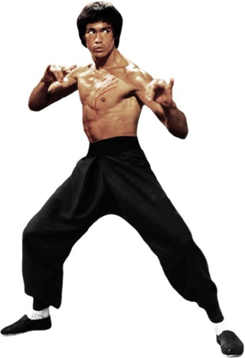
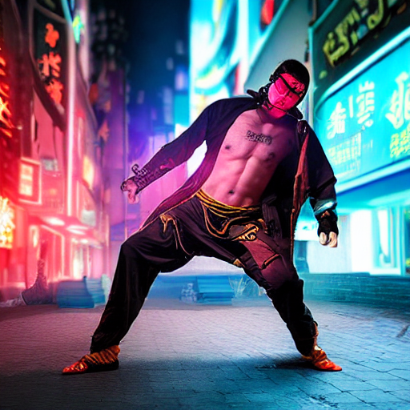
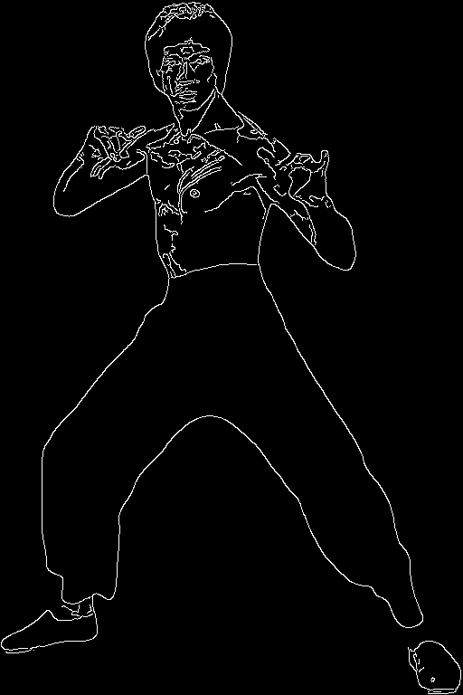
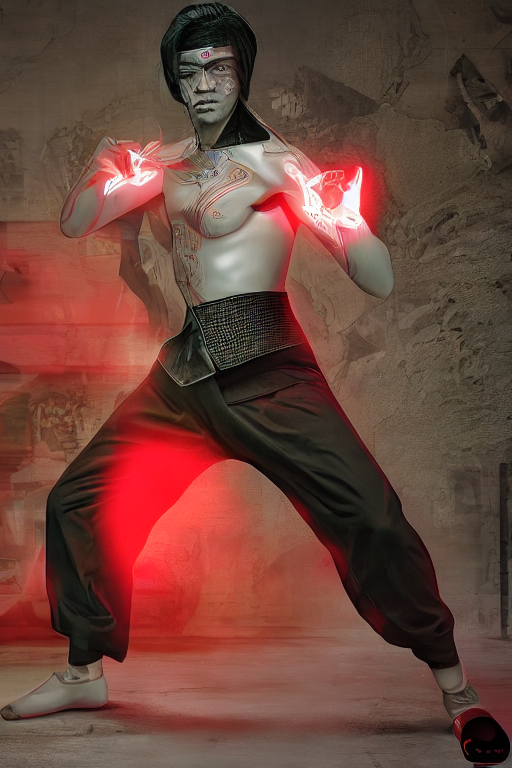
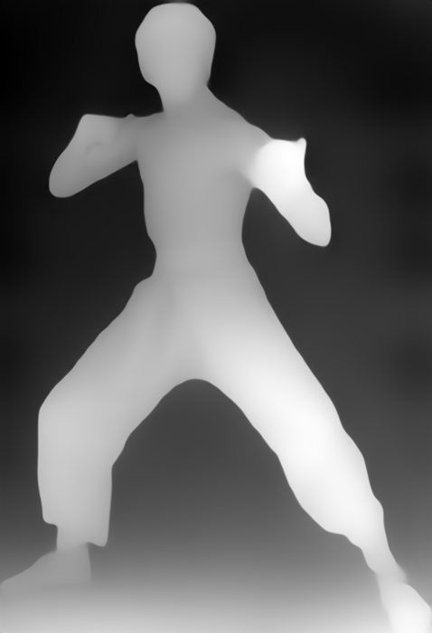
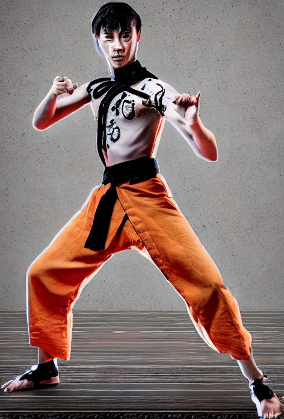
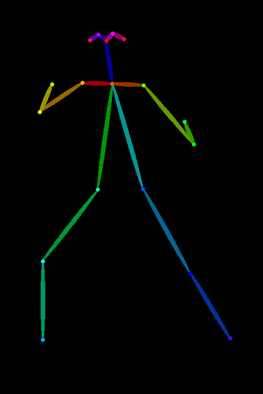
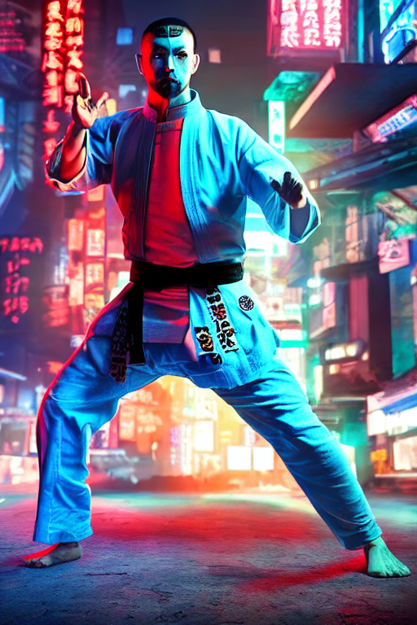

# Taller Controlnet Condiciones Visuales Stablediffusion

Victor Saa, Juan Jose Alvarez, Juan Pablo Correa, Jose Arturo Herrera Rivera, Manuel Santiago Mori Ardila

Fecha de entrega: 2026-06-01

## Descripcion breve
Actividad practica para guiar la generacion de imagenes con ControlNet y Stable Diffusion usando mapas de condicion (Canny, Depth y OpenPose). Se implementaron pipelines en Colab y se compararon resultados con y sin control visual.

## Implementaciones realizadas

### ControlNet Canny/Depth/OpenPose + Stable Diffusion
- Modelos: `lllyasviel`
- Pipeline: `StableDiffusionControlNetPipeline` con cada controlNet.
- Salidas: mapa de condicion Canny/Depth/OpenPose y generacion condicionada.

### Comparacion (solo prompt vs prompt + ControlNet)
- Mismo prompt y parametros.
- Se genera una imagen sin condicion y otra con los diferentes mapas para comparar estructura.

### Requisitos y ejecucion
- Google Colab con GPU

## Resultados visuales
### Prompt="A cyberpunk martial artist performing a kung fu pose, dynamic action, neon lights, cinematic lighting, ultra detailed, 4k"

Imagen de entrada

 
Imagen generada sin ControlNet
### Canny

Mapa



### Depth

Mapa



### OpenPose

Mapa



## 5. Codigo relevante

Carga de modelos y pipeline:

```python
import torch
from diffusers import StableDiffusionControlNetPipeline, ControlNetModel
from controlnet_aux import CannyDetector

controlnet_canny = ControlNetModel.from_pretrained("lllyasviel/sd-controlnet-canny",
                                                   torch_dtype=torch.float16)
controlnet_depth = ControlNetModel.from_pretrained("lllyasviel/sd-controlnet-depth",
                                                   torch_dtype=torch.float16)
controlnet_openpose = ControlNetModel.from_pretrained("lllyasviel/sd-controlnet-openpose",
                                                      torch_dtype=torch.float16)

pipe_canny = StableDiffusionControlNetPipeline.from_pretrained(
    "runwayml/stable-diffusion-v1-5",
    controlnet=controlnet_canny,
    torch_dtype=torch.float16,
    safety_checker=None
    ).to("cuda")

pipe_depth = StableDiffusionControlNetPipeline.from_pretrained(
    "runwayml/stable-diffusion-v1-5",
    controlnet=controlnet_depth,
    torch_dtype=torch.float16,
    safety_checker=None
    ).to("cuda")

pipe_openpose = StableDiffusionControlNetPipeline.from_pretrained(
    "runwayml/stable-diffusion-v1-5",
    controlnet=controlnet_openpose,
    torch_dtype=torch.float16,
    safety_checker=None
    ).to("cuda")
```

Ejemplo de generacion de la condicion (Canny):

```python
from PIL import Image
import numpy as np

image = Image.open("kung_fu2.jpg")
detector = CannyDetector()
condition_image = detector(image)
```

Ejemplo de generacion de la imagen (Canny):

```python
result = pipe_canny(
    prompt="A cyberpunk martial artist performing a kung fu pose, dynamic action, neon lights, cinematic lighting, ultra detailed, 4k",
    image=condition_image,
    num_inference_steps=40,
    guidance_scale=7.5,
    controlnet_conditioning_scale=1.3
).images[0]

result.save("canny_controlnet.png")
```

## 6. Prompts utilizados
- "Cuales tipos de imagen puedo usar para imagenes de condicion Canny, Depth y OpenPose?"

## 7. Aprendizajes y dificultades
- El mapa de condicion Canny estabiliza la estructura general de la imagen y reduce desviaciones del prompt.
- El mapa de profundidad (Depth) permite conservar la coherencia espacial de la escena, manteniendo la relación entre objetos cercanos y lejanos, aunque puede perder detalle fino en bordes y contornos complejos.
- OpenPose es efectivo para preservar la postura humana exacta, especialmente en acciones como artes marciales.
- Ajustar `guidance_scale` y `controlnet_conditioning_scale` ayuda a balancear fidelidad y creatividad.
- Dependencias y disponibilidad de GPU en Colab pueden afectar tiempos de ejecucion.