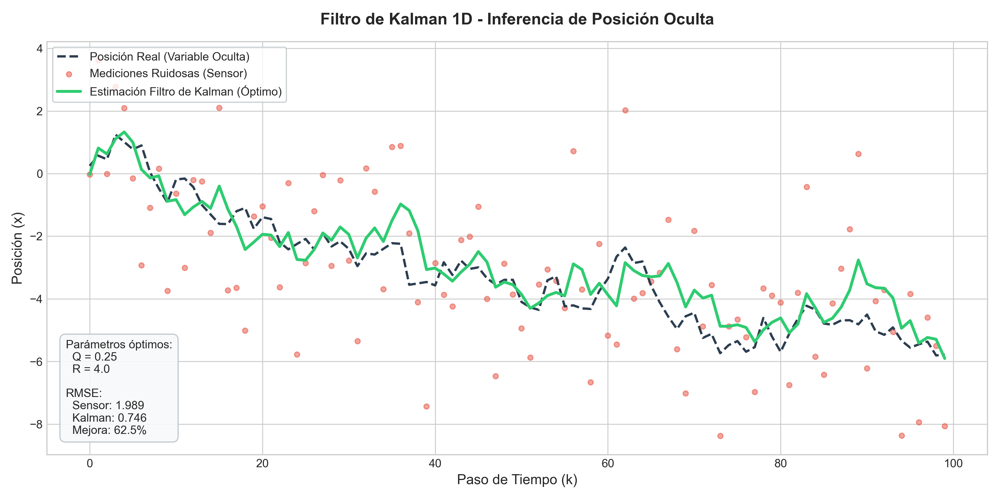
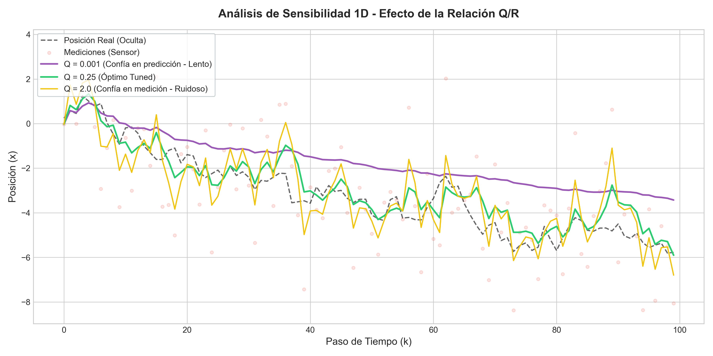
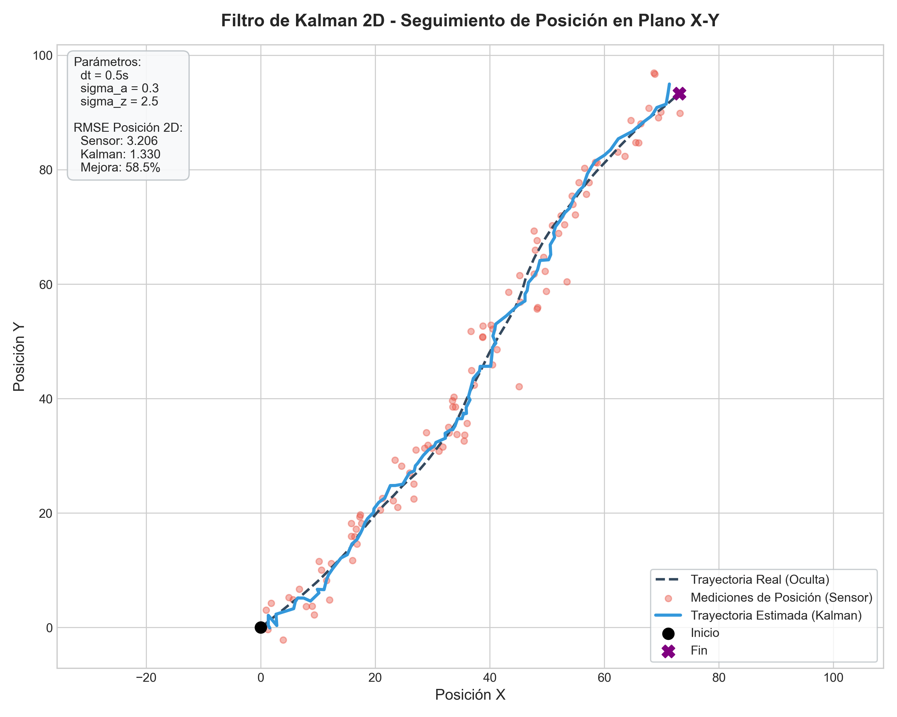
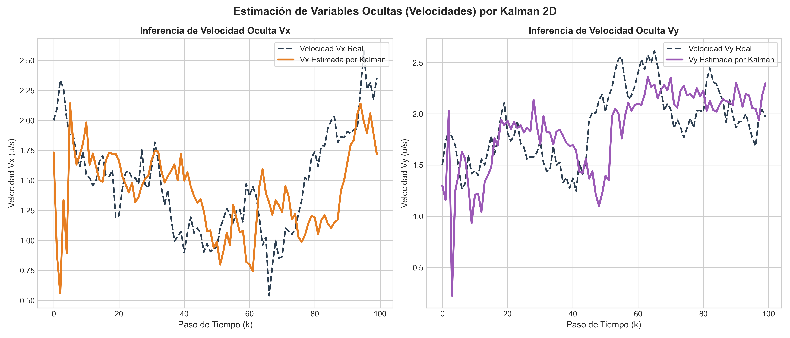

# Taller Filtro Kalman Inferencia Variables Ocultas

Victor Saa, Juan Jose Alvarez, Juan Pablo Correa, Jose Arturo Herrera Rivera, Manuel Santiago Mori Ardila

Fecha de entrega: 2026-06-08

## 1. Descripción del Problema y Objetivo

El objetivo de este taller es diseñar e implementar un **Filtro de Kalman** en Python para estimar variables de estado ocultas (la trayectoria real de un objeto) a partir de observaciones con ruido gaussiano.

En computación visual y robótica, los sensores (cámaras, GPS, LiDAR) proveen mediciones ruidosas e incompletas. El Filtro de Kalman resuelve esto mediante una aproximación Bayesiana secuencial, estimando el estado óptimo mediante la combinación del modelo dinámico del sistema (predicción física) y las mediciones de los sensores (corrección).

En este taller se resuelven dos problemas:

1. **Caso 1D (Caminar Aleatorio):** Estimación de la posición real de un objeto a partir de mediciones de posición ruidosas de una dimensión.
2. **Caso 2D (Cinemática a Velocidad Constante):** Estimación de la trayectoria en el plano X-Y a partir de mediciones de posición en 2D, infiriendo de forma dinámica la velocidad ($v_x, v_y$), las cuales son **variables ocultas** no observadas por el sensor.

## 2. Ecuaciones del Filtro de Kalman

El Filtro de Kalman opera recursivamente en un bucle de dos pasos: **Predicción** y **Corrección/Actualización**.

### Fase de Predicción

Proyecta el estado y la incertidumbre hacia adelante en el tiempo $k$:

1. **Predicción del Estado:**
   $$\hat{\mathbf{x}}_{k\mid k-1} = \mathbf{F} \hat{\mathbf{x}}_{k-1\mid k-1} + \mathbf{B} \mathbf{u}_k$$
   _Donde $\mathbf{F}$ es la matriz de transición del estado y $\mathbf{u}_k$ es la entrada de control._

2. **Predicción de la Covarianza del Error:**
   $$\mathbf{P}_{k\mid k-1} = \mathbf{F} \mathbf{P}_{k-1\mid k-1} \mathbf{F}^T + \mathbf{Q}$$
   _Donde $\mathbf{Q}$ es la matriz de covarianza del ruido del proceso (incertidumbre del modelo físico)._

### Fase de Corrección (Actualización)

Refina la predicción utilizando la nueva medición $\mathbf{z}_k$:

3. **Innovación o Residual de Medición:**
   $$\tilde{\mathbf{y}}_k = \mathbf{z}_k - \mathbf{H} \hat{\mathbf{x}}_{k\mid k-1}$$
   _Donde $\mathbf{H}$ es la matriz de medición que mapea el espacio de estado al espacio de observaciones._

4. **Covarianza de la Innovación:**
   $$\mathbf{S}_k = \mathbf{H} \mathbf{P}_{k\mid k-1} \mathbf{H}^T + \mathbf{R}$$
   _Donde $\mathbf{R}$ es la covarianza del ruido de medición (incertidumbre del sensor)._

5. **Ganancia de Kalman:**
   $$\mathbf{K}_k = \mathbf{P}_{k\mid k-1} \mathbf{H}^T \mathbf{S}_k^{-1}$$
   _La ganancia determina si confiamos más en la medición o en el modelo físico de predicción._

6. **Actualización del Estado:**
   $$\hat{\mathbf{x}}_{k\mid k} = \hat{\mathbf{x}}_{k\mid k-1} + \mathbf{K}_k \tilde{\mathbf{y}}_k$$

7. **Actualización de la Covarianza del Error:**
   $$\mathbf{P}_{k\mid k} = (\mathbf{I} - \mathbf{K}_k \mathbf{H}) \mathbf{P}_{k\mid k-1}$$

## 3. Implementaciones Realizadas

Se estructuró el entregable en Python utilizando módulos limpios y un cuaderno de Jupyter interactivo:

- **[kalman_filter_modules.py](python/kalman_filter_modules.py):** Módulo que encapsula las clases `KalmanFilter1D` y `KalmanFilter2D` mediante programación orientada a objetos.
- **[generate_data.py](python/generate_data.py):** Generador de trayectorias sintéticas realistas en 1D (caminar aleatorio) y 2D (cinemática lineal perturbada por ruido de aceleración gaussiano). Guarda los datos en `datos_1d.csv` y `datos_2d.csv`.
- **[run_estimation.py](python/run_estimation.py):** Script de ejecución automática que carga los datos, aplica el filtro, calcula las métricas de error (RMSE/MSE) y guarda gráficos de calidad de publicación.
- **[kalman_filter.ipynb](python/kalman_filter.ipynb):** Cuaderno interactivo que permite recrear los experimentos paso a paso, realizar análisis de sensibilidad sobre los hiperparámetros y visualizar interactivamente las señales.

### Matriz del Proceso 2D Implementada

En la implementación 2D, se utilizó la matriz de transición física con intervalo de tiempo $\Delta t$:
$$\mathbf{F} = \begin{bmatrix} 1 & 0 & \Delta t & 0 \\ 0 & 1 & 0 & \Delta t \\ 0 & 0 & 1 & 0 \\ 0 & 0 & 0 & 1 \end{bmatrix}$$

Como el sensor solo mide posición, la matriz de observación $\mathbf{H}$ es:
$$\mathbf{H} = \begin{bmatrix} 1 & 0 & 0 & 0 \\ 0 & 1 & 0 & 0 \end{bmatrix}$$

El ruido del proceso $\mathbf{Q}$ fue modelado utilizando la covarianza discreta de la aceleración aleatoria continuada (Continuous White Noise Acceleration):
$$\mathbf{Q} = \sigma_a^2 \begin{bmatrix} \frac{\Delta t^4}{4} & 0 & \frac{\Delta t^3}{2} & 0 \\ 0 & \frac{\Delta t^4}{4} & 0 & \frac{\Delta t^3}{2} \\ \frac{\Delta t^3}{2} & 0 & \Delta t^2 & 0 \\ 0 & \frac{\Delta t^3}{2} & 0 & \Delta t^2 \end{bmatrix}$$

## 4. Resultados Visuales

### Implementación 1D:

A continuación se muestran los dos gráficos generados para el caso 1D:

1. **Estimación Óptima:** Comparación de la señal Real (oculta), Medida (ruidosa) y la Estimación de Kalman.
   

2. **Análisis de Sensibilidad de $Q/R$:** Efecto de variar la confianza en la predicción frente al sensor.
   

### Implementación 2D:

A continuación se muestran los dos gráficos generados para el caso 2D:

1. **Trayectoria en Plano X-Y:** El sensor mide puntos dispersos de posición en rojo, y el filtro reconstruye una trayectoria suave en azul, muy cercana a la real discontinua gris.
   

2. **Inferencia de Variables Ocultas (Velocidades Vx, Vy):** Estimación precisa de la velocidad real del objeto a lo largo del tiempo, la cual **no era medida por el sensor**.
   

## 5. Análisis de Errores

Para evaluar de manera cuantitativa el filtro, calculamos la **Raíz del Error Cuadrático Medio (RMSE)**:

$$\text{RMSE} = \sqrt{\frac{1}{N}\sum_{i=1}^N (x_i^{\text{estimado}} - x_i^{\text{real}})^2}$$

### Tabla de Métricas de Rendimiento

| Caso                             | RMSE Sensor (Medición) | RMSE Kalman (Estimación) | Porcentaje de Reducción del Error |
| :------------------------------- | :--------------------: | :----------------------: | :-------------------------------: |
| **1D (Posición X)**              |         1.9889         |          0.7463          |            **62.48%**             |
| **2D (Posición Euclidiana)**     |         3.2064         |          1.3302          |            **58.51%**             |
| **2D (Velocidad Vx)** - _Oculta_ |      _No medida_       |          0.4504          |                --                 |
| **2D (Velocidad Vy)** - _Oculta_ |      _No medida_       |          0.3828          |                --                 |

### Análisis de la Inferencia de Variables Ocultas

En el caso 2D, el sensor de medición tiene un RMSE de posición de `3.2064`. Tras aplicar el filtro de Kalman, el error en posición se reduce a `1.3302` (una mejora del **58.51%**).
Más importante aún, el filtro estimó las velocidades ocultas $v_x$ y $v_y$ con errores mínimos (RMSE de `0.4504` y `0.3828` respectivamente). Esto es posible porque el Filtro de Kalman aprovecha el acoplamiento dinámico en las ecuaciones diferenciales de movimiento. Al saber que $x_k = x_{k-1} + v_{x} \Delta t$, cualquier inconsistencia acumulada en el cambio de posición medido se atribuye de forma estadísticamente óptima a una velocidad de traslación, logrando "ver" la variable oculta sin necesidad de un sensor de velocidad físico.

## 6. Aprendizajes y Dificultades

### Aprendizajes:

- **Entendimiento Físico de $Q$ y $R$:** Comprender que las matrices de covarianza no son simples números mágicos, sino representaciones físicas del comportamiento dinámico del sistema ($Q$, aceleración aleatoria debida a viento, baches) y el hardware físico ($R$, precisión del sensor).
- **Fusión de Datos e Inferencia:** Aprender a ver el Filtro de Kalman no solo como un "suavizador", sino como un inferidor Bayesiano capaz de revelar variables latentes (como velocidades o aceleraciones) a partir de la física del sistema.

### Dificultades:

- **El Tuning de Parámetros:** Ajustar incorrectamente $Q$ y $R$ produce suboptimización. Si $Q$ es muy bajo, el filtro ignora los giros y cambios reales de la trayectoria (lag o retraso de fase). Si $Q$ es demasiado alto, el filtro "se traga" todo el ruido de medición, perdiendo el efecto de filtrado.

## 7. Prompts Utilizados

Durante el desarrollo de este taller se utilizaron los siguientes prompts para guiar el diseño:

1. _"Genera una clase en Python para un Filtro de Kalman 2D de velocidad constante. Estructura la matriz de ruido Q utilizando el modelo Discrete White Noise Acceleration."_
2. _"Crea un script con matplotlib que genere gráficos elegantes con un estilo moderno, usando colores complementarios fuertes y baja opacidad para los puntos de medición ruidosos para destacar la curva suave de la estimación de Kalman."_
