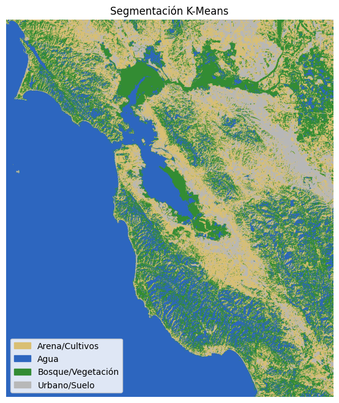
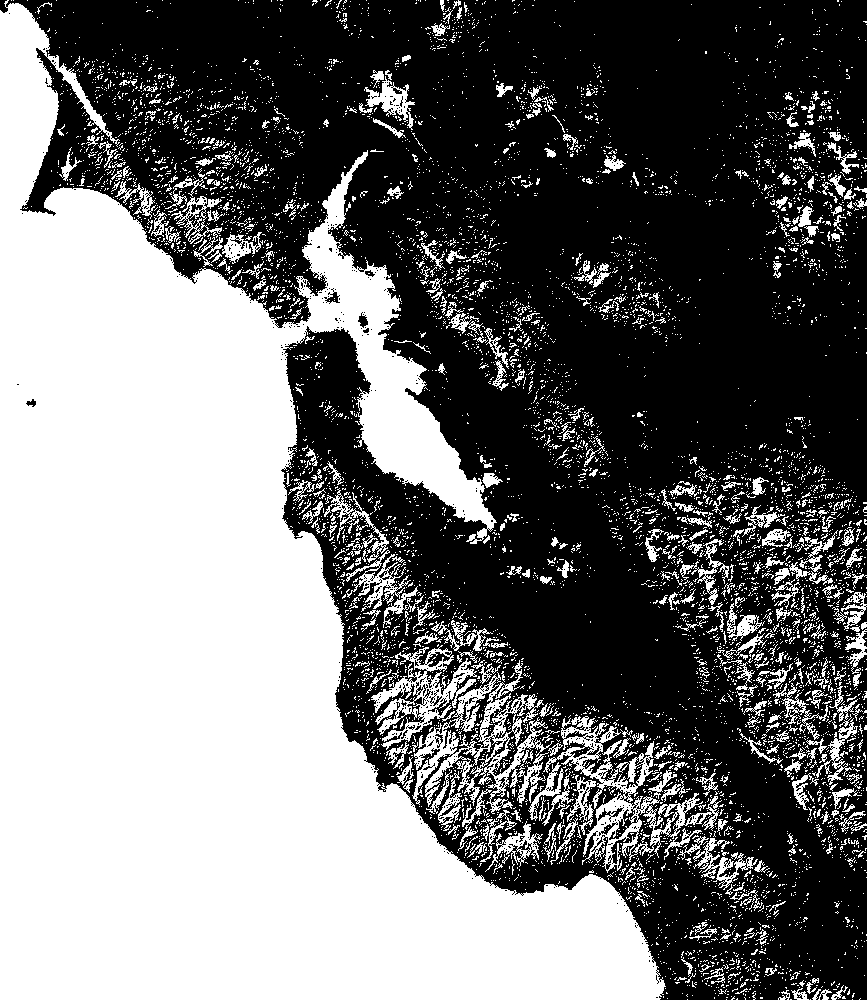
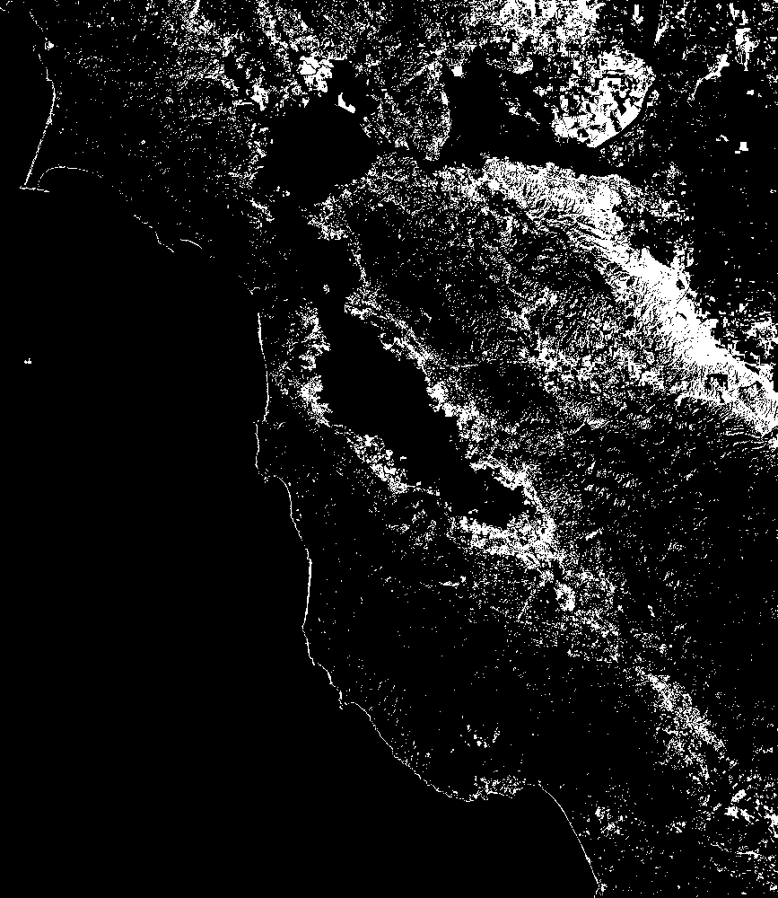
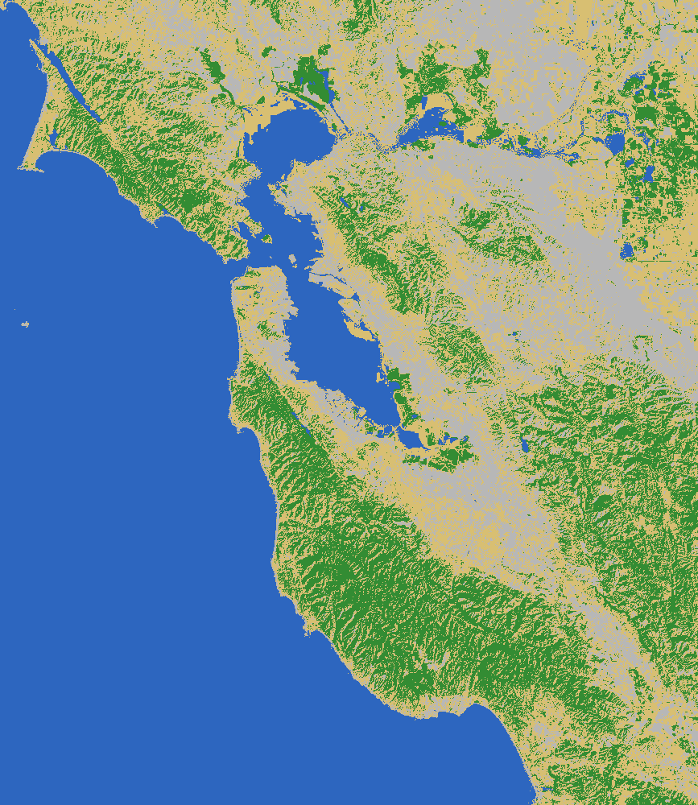
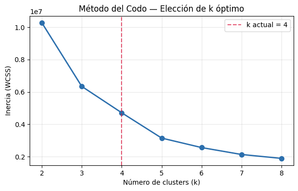

# Taller: Segmentación de Imágenes Satelitales con K-Means

Victor Saa, Juan Jose Alvarez, Juan Pablo Correa, Jose Arturo Herrera Rivera, Manuel Santiago Mori Ardila

Fecha de entrega: 2026-06-09

## Descripcion breve

El objetivo de este taller fue implementar y evaluar un pipeline de procesamiento de imágenes para realizar segmentación de imágenes satelitales utilizando el algoritmo no supervisado K-Means. A través de este método, se clasificaron las diferentes coberturas del suelo (como vegetación, agua, zonas urbanas y cultivos/arena) basándose en las propiedades de color de los píxeles en el espacio RGB.

El notebook implementa las siguientes etapas:
1. **Carga y preprocesamiento de la imagen**: Se carga la imagen satelital real de la bahía de San Francisco y se convierte de BGR a RGB.
2. **Definición de Región de Interés (ROI)**: Permite seleccionar un área de interés manualmente, interactivamente mediante `cv2.selectROI()`, o procesar la imagen completa.
3. **Segmentación con K-Means**: Agrupa los píxeles de la imagen en $k$ clusters utilizando la implementación de `scikit-learn`.
4. **Mapeo semántico dinámico (Mejora)**: Clasifica y colorea los clusters automáticamente comparando los centros de los clusters detectados con colores de referencia predefinidos.
5. **Generación de Contornos y Previsualización**: Dibuja los límites de cada cobertura de suelo y calcula la distribución porcentual de cada clase.
6. **Exportación de Máscaras Binarias**: Guarda máscaras individuales en formato `.png` para cada clase identificada.
7. **Comparación con Umbral de Color HSV (Bonus)**: Compara los resultados de K-Means con una segmentación basada en rangos de color manuales en el espacio HSV.
8. **Método del Codo (Elbow Method - Bonus)**: Evalúa la inercia (WCSS) para diferentes valores de $k$ para determinar el número óptimo de clusters.
9. **Interfaz interactiva (Bonus)**: Proporciona controles interactivos usando `ipywidgets` para explorar la segmentación variando el valor de $k$ en tiempo real.

---

## Implementaciones

El archivo `python/segmentacion_satelital.ipynb` contiene el flujo completo del pipeline de procesamiento implementado en Python utilizando las siguientes librerías principales:
- **OpenCV (cv2)**: Utilizado para la lectura de imágenes, conversión de espacios de color (BGR a RGB/HSV) y extracción de contornos de clusters (`cv2.findContours`).
- **Scikit-learn**: Para el entrenamiento del estimador `KMeans` que agrupa los píxeles en base a su información cromática RGB.
- **Matplotlib**: Para la generación de gráficas comparativas, visualización de histogramas y generación de leyendas dinámicas.
- **NumPy**: Para manipulación eficiente de matrices multidimensionales y cálculo de distancias euclidianas.

---

## Resultados visuales

### 1. Segmentación Completa — San Francisco



_Visualización comparativa: imagen original, mapa segmentado dinámicamente con K-Means y delimitación de contornos para cada cobertura identificada._

### 2. Máscaras Binarias por Clase

Aquí se muestran las máscaras individuales generadas para cada tipo de cobertura de suelo:

| Agua | Bosque / Vegetación | Urbano / Suelo | Arena / Cultivos |
| :---: | :---: | :---: | :---: |
|  |  |  |  |

### 3. Segmentación Limpia en Color



_Resultado directo de la segmentación coloreada de acuerdo a las coberturas de suelo identificadas._

### 4. Elección del Número de Clusters (Método del Codo)



_Gráfica de inercia en función de $k$. Se observa el punto de inflexión ("codo") óptimo alrededor de $k=4$._

---

## Codigo relevante

### 1. Clasificación por K-Means con Mapeo Semántico Dinámico

Esta función entrena K-Means y mapea los clusters asignados aleatoriamente a las etiquetas correspondientes basadas en la cercanía de color con centroides teóricos de referencia:

```python
def aplicar_kmeans(imagen_roi, n_clusters=3, random_state=42):
    """Aplica K-Means sobre los píxeles RGB de la ROI."""
    h, w = imagen_roi.shape[:2]
    pixels = imagen_roi.reshape(-1, 3).astype(np.float32)

    kmeans = KMeans(
        n_clusters=n_clusters,
        random_state=random_state,
        n_init='auto',
        max_iter=300
    )
    kmeans.fit(pixels)

    etiquetas = kmeans.labels_.reshape(h, w)
    centros = kmeans.cluster_centers_.astype(np.uint8)  # color medio por cluster
    inercia = kmeans.inertia_

    # ---- Asignación dinámica de PALETA inteligente ----
    global PALETA
    PALETA = {}
    referencias = [
        ({'color': (0.18, 0.40, 0.75), 'nombre': 'Agua'}, np.array([40, 60, 90])),
        ({'color': (0.20, 0.55, 0.20), 'nombre': 'Bosque/Vegetación'}, np.array([50, 80, 50])),
        ({'color': (0.72, 0.72, 0.72), 'nombre': 'Urbano/Suelo'}, np.array([150, 150, 150])),
        ({'color': (0.85, 0.75, 0.45), 'nombre': 'Arena/Cultivos'}, np.array([160, 140, 100])),
        ({'color': (0.60, 0.20, 0.20), 'nombre': 'Zona quemada'}, np.array([120, 60, 60]))
    ]
    for i, centro in enumerate(centros):
        mejor_ref = min(referencias, key=lambda r: np.linalg.norm(centro - r[1]))[0]
        PALETA[i] = mejor_ref

    return etiquetas, centros, inercia
```

### 2. Extracción de Contornos por Clase

Función que encuentra y dibuja los bordes exteriores de los clusters detectados, filtrando el ruido de alta frecuencia:

```python
def dibujar_contornos(etiquetas, imagen_color, n_clusters):
    """Dibuja contornos de cada clase sobre la imagen coloreada."""
    img_out = (imagen_color * 255).astype(np.uint8).copy()
    for k in range(n_clusters):
        mask = (etiquetas == k).astype(np.uint8) * 255
        contornos, _ = cv2.findContours(mask, cv2.RETR_EXTERNAL, cv2.CHAIN_APPROX_SIMPLE)
        # Filtrar contornos muy pequeños (ruido)
        contornos = [c for c in contornos if cv2.contourArea(c) > 300]
        cv2.drawContours(img_out, contornos, -1, (255, 255, 255), 1)
    return img_out
```

---

## Instrucciones de Instalacion y Ejecucion

### Ejecución Local

1. Clonar el repositorio y navegar a la carpeta del taller:
   ```bash
   cd semana_13_3_mini_radar_satelital_areas_interes
   ```
2. Crear un entorno virtual e instalar las dependencias requeridas:
   ```bash
   python -m venv .venv
   # En Windows:
   .venv\Scripts\Activate.ps1
   # En macOS/Linux:
   source .venv/bin/activate
   
   pip install opencv-python numpy matplotlib scikit-learn Pillow ipywidgets
   ```
3. Ejecutar Jupyter y abrir el notebook:
   ```bash
   jupyter notebook python/segmentacion_satelital.ipynb
   ```

---

## Prompts utilizados

- Extrae las imágenes generadas por el notebook a la carpeta media.

IDE, compilador y generación de documentación: Antigravity

---

## Aprendizajes y dificultades

### Aprendizajes
- **Poder de la Segmentación No Supervisada**: Se comprendió cómo K-Means es capaz de agrupar píxeles por similitud espectral/cromática sin entrenamiento etiquetado previo, siendo ideal para clasificar rápidamente coberturas terrestres en imágenes satelitales RGB de alta resolución.
- **Importancia del Espacio de Color**: Se comparó la segmentación directa en RGB contra el uso de rangos fijos en HSV, concluyendo que HSV es más intuitivo para umbrales definidos manualmente, pero K-Means en RGB se adapta mejor de forma global a variaciones complejas de la imagen.
- **Asignación Semántica Automática**: La asignación de etiquetas aleatorias de K-Means fue solucionada dinámicamente mapeando los centroides reales hacia colores teóricos representativos de las clases del suelo (Agua, Bosque, Urbano, etc.).

### Dificultades
- **No Determinismo de K-Means**: La inicialización aleatoria de centroides causaba que en diferentes corridas una misma clase semántica (ej. Agua) recibiera etiquetas numéricas distintas (ej. Clase 0 en una ejecución, Clase 2 en otra). Esto desordenaba los colores de la paleta. Se solucionó con un mapeo de distancia euclidiana mínima contra centroides de referencia.
- **Ruido en Contornos**: En áreas altamente heterogéneas (zonas urbanas con árboles), los contornos generaban bordes fragmentados y pequeños puntos aislados. Se implementó un filtro de área mínima en `cv2.findContours` para limpiar el ruido.

---

## Estructura del proyecto

```
semana_13_3_mini_radar_satelital_areas_interes/
├── python/
│   └── segmentacion_satelital.ipynb   # Notebook principal con el pipeline
├── media/
│   ├── San francisco.jpg               # Imagen satelital original
│   ├── mascara_agua.png                # Máscara binaria del agua
│   ├── mascara_bosque.png              # Máscara binaria de vegetación
│   ├── mascara_urbano.png              # Máscara binaria urbana
│   ├── mascara_arena.png               # Máscara binaria de arena/cultivos
│   ├── segmentacion_color.png          # Imagen segmentada limpia
│   ├── grafica_segmentacion.png        # Gráfica principal con leyenda
│   └── grafica_metodo_codo.png         # Curva de inercia (método del codo)
└── README.md                           # Documentación técnica académica
```

---

## Referencias
- Scikit-learn KMeans documentation: https://scikit-learn.org/stable/modules/generated/sklearn.cluster.KMeans.html
- OpenCV Contours documentation: https://docs.opencv.org/4.x/d4/d73/tutorial_py_contours_begin.html
- ESA Sentinel-2 Imagery information: https://sentinel.esa.int/web/sentinel/missions/sentinel-2
