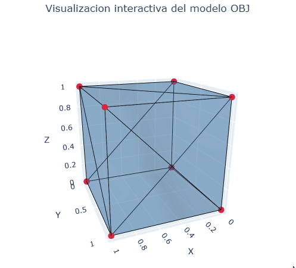

# Taller Construyendo Mundo 3D

Victor Saa

Fecha de entrega: 20/02/2026

## Descripción

Este proyecto es una aplicación para renderizar un objeto 3D con python y con javascript.

## Implementaciónes

### Python

Se utilizó jupyter notebook para la implementación. Se carga el objeto y se extrae la geometría, vertices y caras. Se utiliza matplotlib para la visualización.

```bash
# Crear el entorno virtual
python -m venv .venv

# Activar el entorno virtual
.venv\Scripts\activate

# Instalar dependencias
pip install -r requirements.txt
```

### Jupyter en el editor (VS Code, Antigravity, etc.)

```bash
# Registrar el kernel para Jupyter
python -m ipykernel install --user --name semana1-visual --display-name "Python (semana1-visual)"
```

Abre `main.ipynb`, haz clic en el selector de kernel (arriba a la derecha) y elige **Python (semana1-visual)**.

### Three.js

Se utilizó three.js para la implementación. Se carga el objeto y se extrae la geometría, vertices y caras. Se utiliza three fiber para la visualización.

```bash
cd threejs

# Con yarn
yarn install
yarn dev

# Con npm
npm install
npm run dev
```

## IA

IDE, prompts y autocompletado: Antigravity

## Resultados visuales




## Prompts utilizados

Como python no es mi fuerte, aca me ayude de "Antigravity" con `Claude Sonnet 4.6 Thinking` con este promt:

```
Vamos a modificar este notebook para cargar cube.obj y visualizar malla 3D con colores distintos para vértices, aristas y caras. También mostrar información estructural del modelo: número de vértices, aristas y caras. Nada de emojis ni cosas extra. Quiero un demostración muy básica.
```

Luego pedí interactividad con el cursor usando Plotly.

Añadí algunos comentarios para entender mejor. y modifique las variables por camelCase simplemente por preferencia personal.

## Aprendizajes

Aunque ya había trabajado con Three.js con algunos ejercicios básicos tuve que investigar como extraer la geometría de un modelo y la parte del conteo (porque 12 caras?), otros extras fueron la integración con React y la librerías de three fiber. Igual solo seguí la documentación asi que por ahi bien. Ya tenia el scaffolding de otros proyectos y lo incluí porque hace muy comodo trabajar y estructural el código cuando ya esta configurado.

No registre todo lo que busque, pero algunos recursos como [este](https://discourse.threejs.org/t/how-can-we-get-number-of-triangles-vertices-faces-of-glb-model/37064/2) fueron muy utiles
