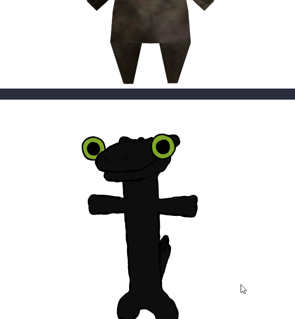

# Taller Importando el Mundo: Visualización y Conversión de Formatos 3D

Victor Saa

Fecha de entrega: 20/02/2026

## Descripción

Este proyecto es una aplicación para transformar y analizar modelos 3D.

## Implementaciónes

### Python

Se utilizó jupyter notebook para la implementación. Se carga los objetos y se analiza su estructura. Se visualizan y posteriormente se exportan a otros formatos con trimesh.

```bash
# Crear el entorno virtual
python -m venv .venv

# Activar el entorno virtual
.venv\Scripts\activate

# Instalar dependencias
pip install -r requirements.txt
```

### Jupyter en el editor (VS Code, Antigravity, etc.)

```bash
# Registrar el kernel para Jupyter
python -m ipykernel install --user --name semana2-visual --display-name "Python (semana2-visual)"
```

Abre `main.ipynb`, haz clic en el selector de kernel (arriba a la derecha) y elige **Python (semana2-visual)**.

### Three.js

Se utilizó three.js para la implementación. Se cargan los objetos y se visualizan con three fiber.

```bash
cd threejs

# Con yarn
yarn install
yarn dev

# Con npm
npm install
npm run dev
```

## IA

IDE, prompts y autocompletado: Antigravity

## Resultados visuales




## Prompts utilizados

Se usaron prompt relacionados a la descomposición para el análisis de los modelos y la conversión de archivos.

## Aprendizajes

Aca me toco investicar un poco mas en torno a los materiales y el uv mapping por que no lograba cargar las texturas de los modelos.
