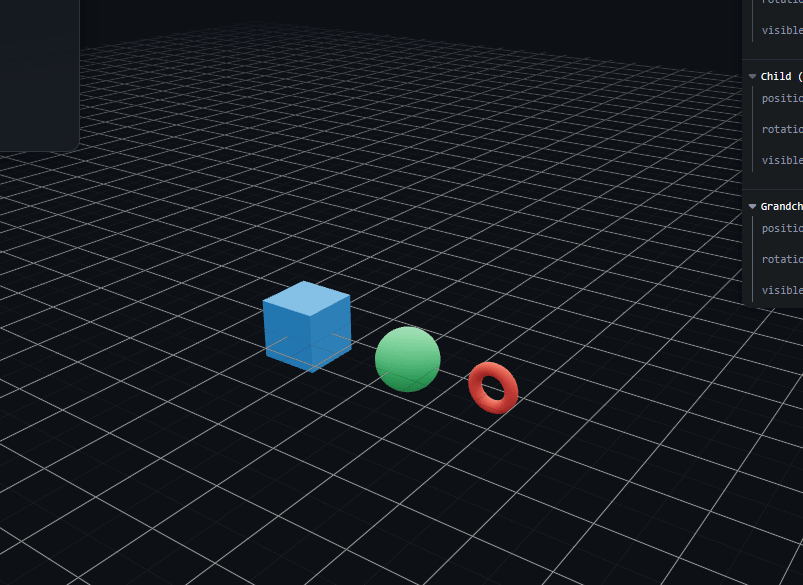

# Taller Jerarquias Transformaciones

Victor Saa

Fecha de entrega: 20/02/2026

## Descripción

Este proyecto es una aplicación para mostrar la jerarquía de transformaciones en three.js y unity. Encadenando transformaciones en grupos.

## Implementaciónes

### Unity

### Three.js

Se utilizó three.js para la implementación. Se carga el objeto y se extrae la geometría, vértices y caras. Se utiliza three fiber para la visualización.

```bash
cd threejs

# Con yarn
yarn install
yarn dev

# Con npm
npm install
npm run dev
```

## IA

IDE, prompts y autocompletado: Antigravity

## Resultados visuales




## Prompts utilizados

Aca le pedí a antigravity que me ayudara con la implementación de la jerarquía de transformaciones en three.js modificando la vista existente con los requisitos del ejercicio.

## Aprendizajes

Esta es la primera vez que uso unity, asi que todo fue nuevo para mi.
