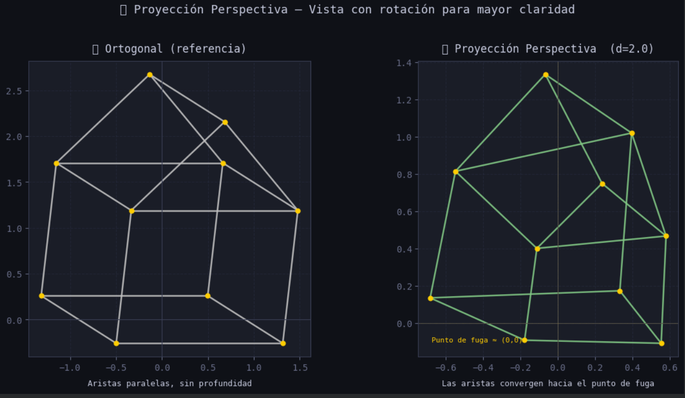
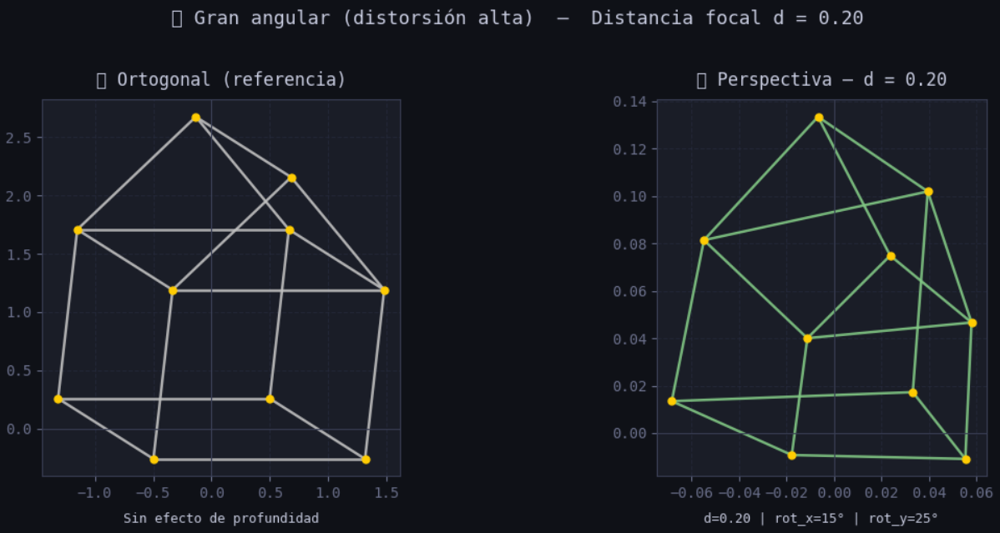
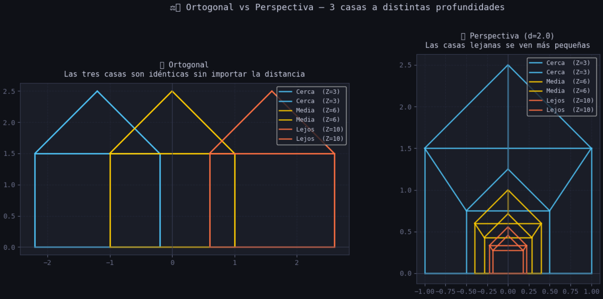
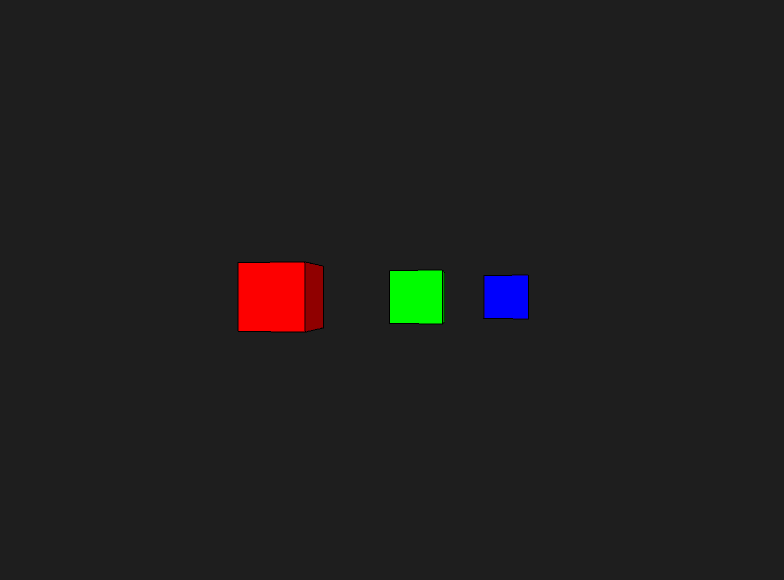
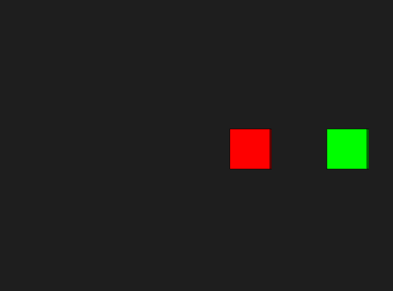

# Taller Espacios Proyectivos Matrices Proyeccion

Victor Saa, Samuel Vargas y Diego Romero

## Fecha de entrega

`2026-02-27`

## Descripción

Este proyecto es una aplicación para evaluar perspectivas y proyecciones.

## Implementaciónes

### Python

Se implementó un notebook en Google Colab para visualizar y comparar proyecciones ortogonal y perspectiva sobre una figura 3D (casa). Se representaron los puntos con coordenadas homogéneas y se implementaron manualmente las matrices de proyección usando `numpy`. La visualización se realizó con `matplotlib`, incluyendo un widget interactivo con `ipywidgets` para explorar el efecto de la distancia focal en tiempo real.

La figura elegida fue una casa 3D (10 vértices, 17 aristas) por combinar superficies planas y una estructura angular en el techo, haciendo muy visible la diferencia entre tipos de proyección.

Las matrices implementadas fueron:

- **Proyección ortogonal**: descarta la coordenada Z, los objetos mantienen el mismo tamaño sin importar la distancia.
- **Proyección perspectiva**: divide X e Y por Z escalado por la distancia focal `d`. A menor `d` mayor distorsión (gran angular); a mayor `d` converge hacia la ortogonal (teleobjetivo).

```python
def proyectar_perspectiva(puntos, d=1.0):
    P = np.array([
        [1, 0,   0, 0],
        [0, 1,   0, 0],
        [0, 0,   1, 0],
        [0, 0, 1/d, 0]
    ])
    puntos_hom = np.vstack((puntos, np.ones((1, puntos.shape[1]))))
    proy = P @ puntos_hom
    proy /= proy[-1, :]
    return proy[:2, :]
```

Para que la diferencia perspectiva fuera visible, la figura se rota y se desplaza dinámicamente en Z antes de proyectar, garantizando que todos los vértices queden frente a la cámara con Z positivo.

```bash
# Ejecutar en Google Colab — no requiere entorno local
# Las dependencias se instalan en la primera celda del notebook
!pip install numpy matplotlib ipywidgets --quiet
```

### Jupyter en el editor (VS Code, Antigravity, etc.)

```bash
# Registrar el kernel para Jupyter
python -m ipykernel install --user --name semana2-1-visual --display-name "Python (semana2-1-visual)"
```

Abre `main.ipynb`, haz clic en el selector de kernel (arriba a la derecha) y elige **Python (semana2-1-visual)**.

### Three.js

Se utilizó three.js para la implementación. Se carga el objeto y se extrae la geometría, vertices y caras. Se utiliza three fiber para la visualización.

```bash
cd threejs

# Con yarn
yarn install
yarn dev

# Con npm
npm install
npm run dev
```

### Processing

Se utilizó processing para implementar la diferencia en la visualización entre el modo perspectiva y el modo ortográfico.

```java
void draw() {
  background(30);

  if (usarPerspectiva) {
    float fov = PI/3.0;
    float aspect = float(width)/float(height);
    perspective(fov, aspect, 1, 1000);
  } else {
    ortho(-width/2, width/2, -height/2, height/2, 1, 1000);
  }

  lights();

  translate(width/2, height/2);
  rotateY(angulo);
  angulo += 0.01;

  // Cubo cercano
  pushMatrix();
  translate(-150, 0, -100);
  fill(255, 0, 0);
  box(80);
  popMatrix();

  // Cubo medio
  pushMatrix();
  translate(0, 0, -300);
  fill(0, 255, 0);
  box(80);
  popMatrix();

  // Cubo lejano
  pushMatrix();
  translate(150, 0, -500);
  fill(0, 0, 255);
  box(80);
  popMatrix();
}
```

## IA

IDE, prompts y autocompletado: Antigravity

## Resultados visuales

### Python

**Comparación ortogonal vs. perspectiva con rotación aplicada**



**Efecto de la distancia focal sobre la proyección perspectiva**



**Tres casas a distintas profundidades — efecto de achicamiento con la distancia**



### Otros entornos





## Prompts utilizados

Se usaron prompts para generar objetos en threejs.

Para la implementación en Python se utilizó IA generativa (Claude) con los siguientes prompts principales:

- _"Implementar matrices de proyección ortogonal y perspectiva sobre una casa 3D con numpy y matplotlib, con widget interactivo para variar la distancia focal"_
- _"La proyección perspectiva se ve igual en todos los paneles, hacer que la diferencia sea visualmente clara mostrando tres casas a distintas profundidades"_
- _"Los sliders del widget dejan puntos estáticos en la vista perspectiva al rotar la figura"_ → llevó a implementar el desplazamiento dinámico en Z para garantizar vértices siempre frente a la cámara.

## Aprendizajes

Aca se jugo con la implementacion de distintas perspectivas.

## Contribuciones grupales (si aplica)

Samuel Vargas: Desarrollo en Processing
Diego Romero: Desarrollo python
Victor Saa: Desarrollo Threejs

## Estructura del proyecto

```
semana_2_1_espacios_proyectivos_matrices_proyeccion/
    ├── python/
    ├── processing/
    ├── threejs/
    ├── media/
    └── README.md
```

---

## Referencias

Lista las fuentes, tutoriales, documentación o papers consultados durante el desarrollo:

- Documentación oficial de NumPy: https://numpy.org/doc/
- Tutorial de React Three Fiber: https://docs.pmnd.rs/react-three-fiber/
- Documentación oficial de Processing: https://processing.org/reference/
