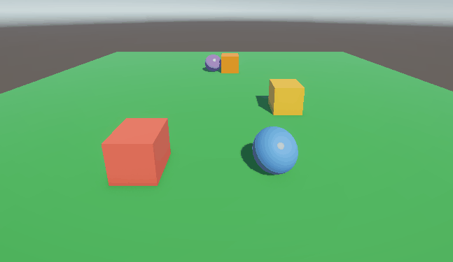
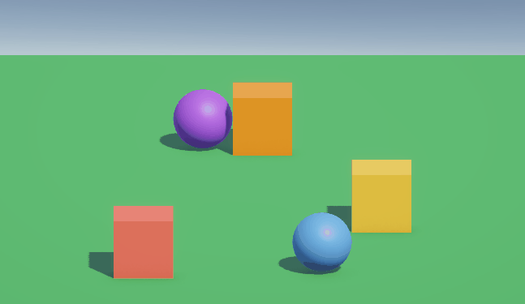
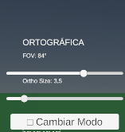

# Taller Jerarquias Transformaciones

## Nombre del estudiante

Diego Romero y Juan Esteban Santacruz

## Fecha de entrega

`2026-02-27`

---

## Descripción

En este taller se exploró el funcionamiento de una cámara virtual dentro de un entorno tridimensional, analizando cómo las matrices de proyección determinan la representación final de una escena en un plano bidimensional.

Se implementaron y compararon dos modelos fundamentales de proyección:

Proyección en perspectiva, donde los objetos lejanos se perciben más pequeños y las líneas paralelas pueden converger, simulando el comportamiento de la visión humana.

Proyección ortográfica, donde se preservan proporciones independientemente de la profundidad, eliminando el efecto de convergencia y distorsión por distancia.

A través de escenas con múltiples objetos distribuidos en el eje Z, se observó cómo los parámetros de la cámara (fov, aspect, near, far en perspectiva; left, right, top, bottom en ortográfica) afectan directamente la percepción de tamaño, profundidad y proporción.

El objetivo principal fue comprender cómo la matriz de proyección transforma coordenadas del espacio 3D al espacio 2D de la pantalla, evidenciando la relación entre teoría matemática y representación gráfica en tiempo real.

## Implementaciónes

### Three.js / React Three Fiber

La implementación en Three.js se desarrolló utilizando React Three Fiber como abstracción de Three.js dentro de un entorno React, permitiendo una gestión declarativa de la escena 3D.

Se construyó una escena básica compuesta por varios objetos (<Box /> y <Sphere />) posicionados a diferentes profundidades en el eje Z con el fin de evidenciar los efectos visuales de cada tipo de proyección.

Se configuraron dos cámaras alternables dinámicamente:

<PerspectiveCamera />

<OrthographicCamera />

El cambio entre cámaras se realizó mediante un estado de React controlado por un botón, permitiendo comparar en tiempo real cómo varía la percepción de profundidad, tamaño y proporciones.

Además, se integró OrbitControls (desde @react-three/drei) para permitir navegación interactiva alrededor de los objetos, facilitando la observación del comportamiento espacial desde distintos ángulos.

Para reforzar la comprensión técnica, se mostraron en pantalla los parámetros activos de la cámara:

En perspectiva: fov, aspect, near, far

En ortográfica: left, right, top, bottom

Como extensión adicional, se utilizó Vector3.project(camera) para demostrar cómo un punto en coordenadas 3D es transformado al espacio normalizado de dispositivo (NDC), evidenciando matemáticamente el efecto de la matriz de proyección.

Esta implementación permitió observar de manera directa cómo la matriz de proyección influye en la representación final en pantalla y cómo la percepción de profundidad depende completamente del modelo de cámara utilizado.

```javascript
export default function Scene({ isPerspective }: Props) {
  const { size } = useThree();
  const aspect = size.width / size.height;

  const perspectiveRef = useRef<THREE.PerspectiveCamera>(null!);
  const orthoRef = useRef<THREE.OrthographicCamera>(null!);

  // Bonus: proyectar punto
  useFrame(() => {
    const camera = isPerspective ? perspectiveRef.current : orthoRef.current;
    const point = new THREE.Vector3(0, 0, 0);
    point.project(camera);
    console.log("Proyección 2D:", point);
  });

  return (
    <>
      {isPerspective ? (
        <PerspectiveCamera
          ref={perspectiveRef}
          makeDefault
          position={[0, 2, 8]}
          fov={60}
          near={0.1}
          far={100}
        />
      ) : (
        <OrthographicCamera
          ref={orthoRef}
          makeDefault
          position={[0, 2, 8]}
          left={-5 * aspect}
          right={5 * aspect}
          top={5}
          bottom={-5}
          near={0.1}
          far={100}
        />
      )}

      <OrbitControls />

      {/* Luces */}
      <ambientLight intensity={0.5} />
      <pointLight position={[10, 10, 10]} />

      {/* Objetos distribuidos */}
      <Box position={[-3, 0, 0]}/>
      <Box position={[0, 0, -5]} />
      <Sphere position={[3, 0, -10]} />
    </>
  );
}
```

### Unity

Se implementó una escena en Unity con 6 objetos (cubos, esferas y un plano) distribuidos a distintas profundidades en el eje Z, con materiales de colores diferenciados para facilitar la identificación visual de cada objeto según su distancia a la cámara.

La escena incluye un script C# (`ProyeccionCamaraController`) adjunto a un `GameController` vacío que controla en tiempo real los parámetros de la `Main Camera`. El script permite alternar entre proyección perspectiva y ortográfica mediante un botón, y ajustar los parámetros de cada modo con sliders:

- **Modo perspectiva**: slider de Field of View (FOV) entre 10° y 120°. A mayor FOV se obtiene un efecto gran angular con mayor distorsión; a menor FOV los objetos se comprimen como un teleobjetivo.
- **Modo ortográfico**: slider de Orthographic Size entre 1 y 20, que controla el zoom sin alterar las proporciones ni producir efecto de profundidad.

Al cambiar de modo, la matriz de proyección actual se imprime en consola mediante `camera.projectionMatrix`, mostrando la diferencia matemática entre ambos tipos de proyección. La matriz también se muestra en pantalla en tiempo real a través de un texto TMP.

La UI se construyó con el sistema Canvas de Unity usando TextMeshPro, con textos de valores actualizados cada frame para reflejar el estado actual de la cámara.

```csharp
public void CambiarModo()
{
    esPerspectiva = !esPerspectiva;

    Debug.Log("════════════════════════════════════════");
    Debug.Log($"Modo: {(esPerspectiva ? "PERSPECTIVA" : "ORTOGRÁFICA")}");
    Debug.Log("Matriz de proyección:");
    Debug.Log(camara.projectionMatrix);
    Debug.Log("════════════════════════════════════════");
}
```

```csharp
void Update()
{
    LeerSliders();

    if (esPerspectiva)
    {
        camara.orthographic = false;
        camara.fieldOfView  = campoPVision;
    }
    else
    {
        camara.orthographic     = true;
        camara.orthographicSize = tamanoOrtografico;
    }

    ActualizarUI();
}
```

## IA

IDE, prompts y autocompletado: Antigravity

## Resultados visuales

### Three.js


### Unity

**Efecto del FOV en modo perspectiva — objetos se deforman con el ángulo de visión**



**Modo ortográfico — los objetos mantienen proporciones sin importar la distancia**



**Panel de controles UI — sliders y botón de cambio de modo**



## Prompts utilizados

Aca me ayude de Antigravity para crear los frames del gif y la escena del cubo en threejs.

Para la implementación en Unity se utilizó IA generativa (Claude) con los siguientes prompts principales:
- *"Crear una escena con cubos, esferas y un plano distribuidos a distintas profundidades, con un script C# para cambiar entre proyección perspectiva y ortográfica desde la UI"*
- *"Mostrar la matriz de proyección en pantalla en tiempo real usando TextMeshPro"*
- *"El script usa el componente Text antiguo pero Unity tiene TextMeshPro"* → llevó a actualizar el script para usar `TMP_Text` en lugar de `Text`.

## Aprendizajes

Siento que aca hice algo de uso de lo que aprendi en algebra lineal, aunque solo fue aplicar las formulas de traslacion, rotacion y escala. Tambien familiarizarme mas con como operar con matrices en python.

## Contribuciones grupales (si aplica)

(Contribuciones)

---

## Estructura del proyecto

```
semana_2_2_proyecciones_camara_virtual/
    ├── unity/
    ├── threejs/
    ├── media/
    └── README.md
```

---

## Referencias

Lista las fuentes, tutoriales, documentación o papers consultados durante el desarrollo:

- Documentación oficial de NumPy: https://numpy.org/doc/
- Tutorial de React Three Fiber: https://docs.pmnd.rs/react-three-fiber/
- Unity Manual — Cameras: https://docs.unity3d.com/Manual/CamerasOverview.html