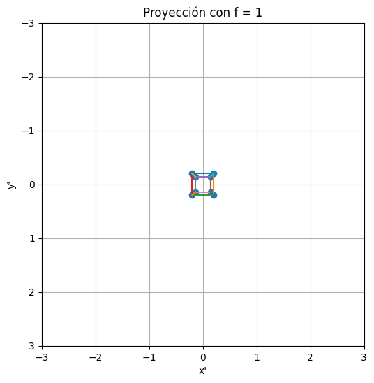
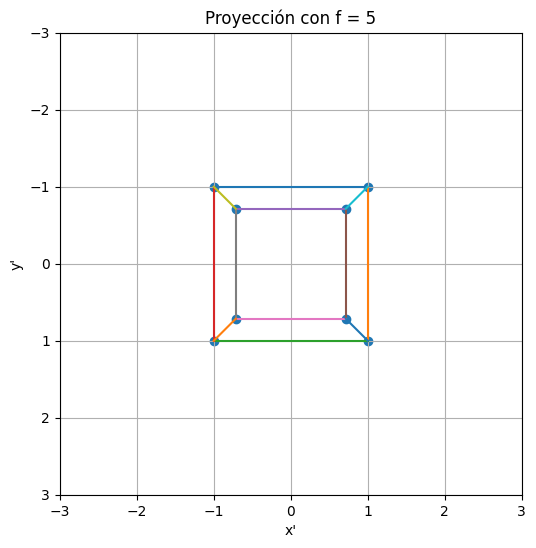
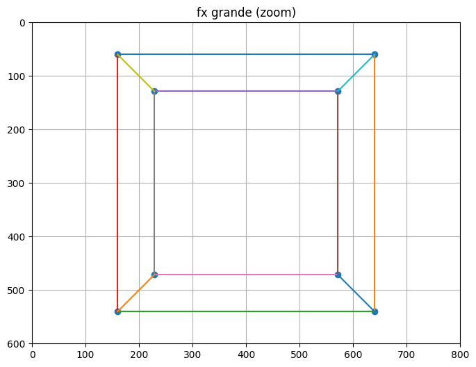
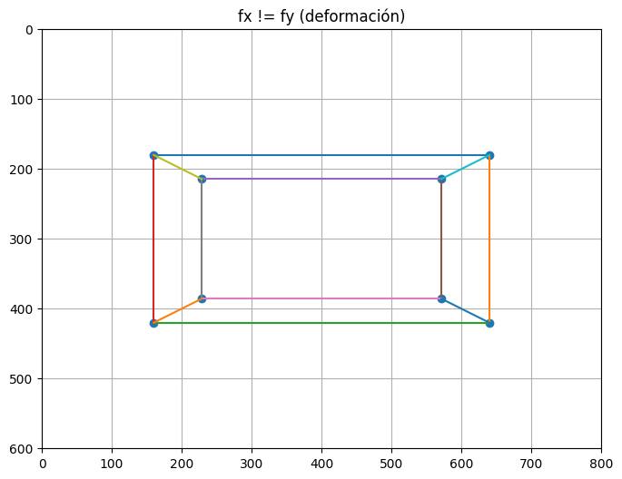
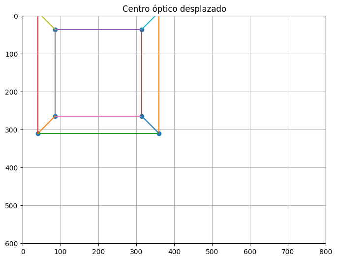
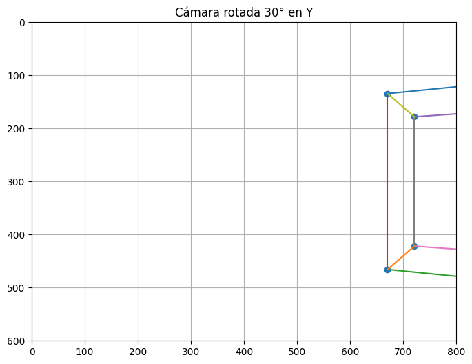
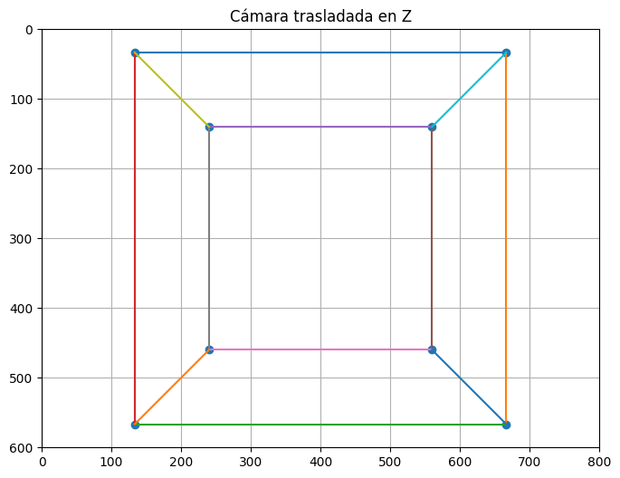
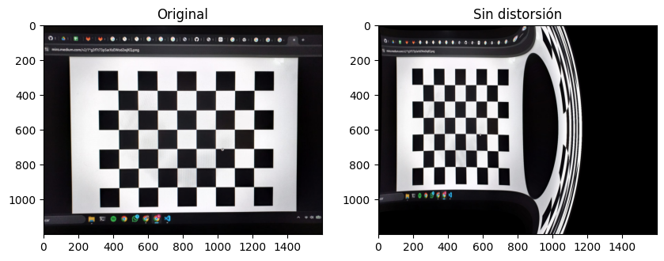

# Taller Camara Pinhole

Samuel Vargas y Álvaro Romero

Fecha de entrega: 27/02/2026

## Descripción

Este proyecto se recrea una camara por medio de proyecciones de 3D -> 2D. Y se recrean las matrices necesarias para proyecciones más fieles por medio de auto calibración por medio de imágenes de checkerboard.

## Implementaciónes

### Python

Se utilizó jupyter notebook para la implementación. Se encuentra el desarrollo punto por punto separado por titulos de markdown.

```bash
# Instalar dependencias
pip install -r requirements.txt
```

### Jupyter en el editor (VS Code, Antigravity, etc.)

```bash
# Registrar el kernel para Jupyter
python -m ipykernel install --user --name semana4-visual --display-name "Python (semana4-visual)"
```

Abre `main.ipynb`, haz clic en el selector de kernel (arriba a la derecha) y elige **Python (semana4-visual)**.

### Three.js

Se utilizó three.js para la implementación. Se carga el objeto y se extrae la geometría, vertices y caras. Se utiliza three fiber para la visualización.

```bash
cd threejs

# Con yarn
yarn install
yarn dev

# Con npm
npm install
npm run dev
```

## IA

IDE, prompts y autocompletado: VScode

## Resultados visuales

### Proyecciones con diferente distancia focal




### Proyecciones con distintos valores intrinsecos





### Proyecciones con distintos valores extrinsecos




### Corrección de distorción



## Prompts utilizados

Ayudas para entender las matrices a usar y como declararlas correctamente.

## Aprendizajes

Un entendimiento profundo a lo necesario para proyectar objetos en 3D a la pantalla y lo que significan cada una de las operaciones necesarias para proyectar.
