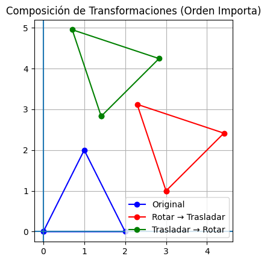
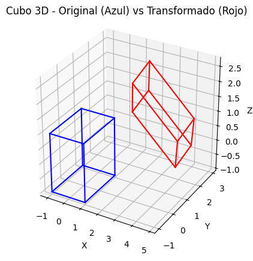
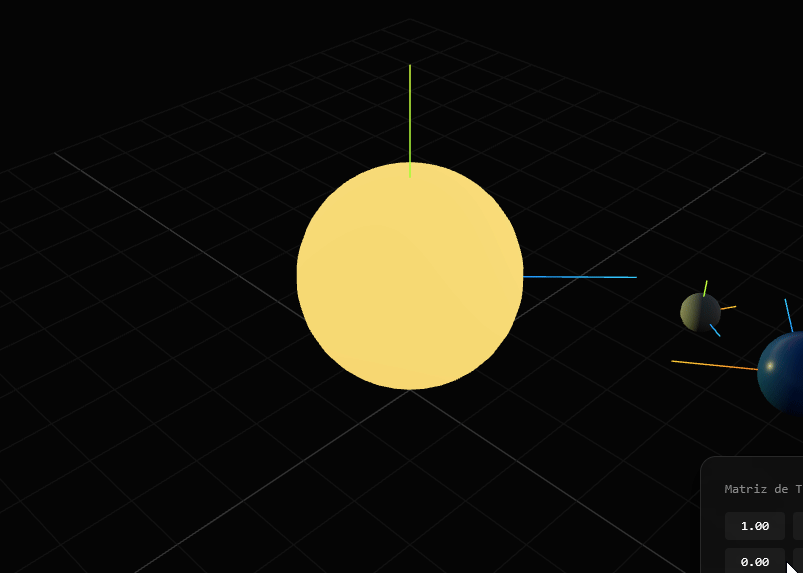

# Taller Transformaciones

Victor Saa y Samuel Vargas

Fecha de entrega: 27/02/2026

## Descripción

En este taller se implementaron transformaciones homogéneas en 2D y 3D utilizando matrices 3x3 y 4x4 para modelar traslaciones, rotaciones, escalamiento y reflexiones. Se estudió la composición de transformaciones y se demostró que la multiplicación de matrices no es conmutativa.

Además, se trabajó el concepto de cambio de base entre sistemas de referencia y el cálculo de transformaciones inversas para deshacer transformaciones. Finalmente, se aplicaron estos conceptos en la modelación de un brazo robótico mediante cinemática directa (forward kinematics), visualizando la cadena cinemática y los distintos marcos de coordenadas.

## Implementaciónes

### Python

La implementación en Python se desarrolló en un notebook utilizando NumPy para el manejo de matrices y Matplotlib para la visualización en 2D y 3D.

Primero, se representaron puntos en coordenadas homogéneas agregando una componente adicional igual a 1, lo que permitió trabajar con transformaciones afines mediante multiplicación matricial. Se implementaron matrices 3x3 para transformaciones en 2D (traslación, rotación, escalamiento y reflexión) y matrices 4x4 para transformaciones en 3D (traslaciones, rotaciones respecto a los ejes X, Y y Z, y escalamiento).

Posteriormente, se realizó la composición de transformaciones, demostrando que el orden de multiplicación de matrices afecta el resultado (no conmutatividad). También se verificó que aplicar una transformación compuesta es equivalente a aplicar las transformaciones de manera secuencial.

En 3D, se modeló un cubo y se aplicaron transformaciones compuestas para visualizar los efectos espaciales. Se implementaron transformaciones inversas y se verificó algebraicamente que T⋅T^(−1)=I, demostrando cómo “deshacer” una transformación.

Finalmente, se aplicaron estos conceptos en robótica, modelando un brazo robótico planar de dos grados de libertad. Se calcularon las matrices de transformación encadenadas para obtener la cinemática directa (forward kinematics), transformando coordenadas desde el espacio articular al espacio del mundo y visualizando la cadena cinemática junto con sus sistemas de referencia.

```python
def translation_matrix_3d(tx, ty, tz):
    return np.array([
        [1, 0, 0, tx],
        [0, 1, 0, ty],
        [0, 0, 1, tz],
        [0, 0, 0, 1]
    ])

def scaling_matrix_3d(sx, sy, sz):
    return np.array([
        [sx, 0, 0, 0],
        [0, sy, 0, 0],
        [0, 0, sz, 0],
        [0, 0, 0, 1]
    ])

def rotation_x(theta):
    return np.array([
        [1, 0, 0, 0],
        [0, np.cos(theta), -np.sin(theta), 0],
        [0, np.sin(theta),  np.cos(theta), 0],
        [0, 0, 0, 1]
    ])

def rotation_y(theta):
    return np.array([
        [ np.cos(theta), 0, np.sin(theta), 0],
        [0, 1, 0, 0],
        [-np.sin(theta), 0, np.cos(theta), 0],
        [0, 0, 0, 1]
    ])

def rotation_z(theta):
    return np.array([
        [np.cos(theta), -np.sin(theta), 0, 0],
        [np.sin(theta),  np.cos(theta), 0, 0],
        [0, 0, 1, 0],
        [0, 0, 0, 1]
    ])
```

## IA

IDE, prompts y autocompletado: Antigravity

## Resultados visuales





## Prompts utilizados

Aca me ayude de Antigravity construir la escena base del sistema solar.

## Aprendizajes

Durante el desarrollo del taller comprendí la importancia de las coordenadas homogéneas para unificar rotaciones y traslaciones en una sola operación matricial. Entendí que el orden en la multiplicación de matrices es fundamental, ya que las transformaciones no son conmutativas. Además, reforcé el concepto de cambio de base entre sistemas de referencia y su aplicación en robótica mediante la cinemática directa, visualizando cómo las transformaciones encadenadas determinan la posición final de un efector.

## Contribuciones grupales (si aplica)

Samuel Vargas: Desarrollo en Python
Victo Saa: Desarrollo Threejs

## Estructura del proyecto

```
semana_2_4_transformaciones_homogeneas/
├── unity/
├── threejs/
├── media/ # Imágenes, videos, GIFs de resultados
└── README.md
```

---

## Referencias

Lista las fuentes, tutoriales, documentación o papers consultados durante el desarrollo:

- Documentación oficial de Unity: https://docs.unity3d.com/Manual/
- Tutorial de React Three Fiber: https://docs.pmnd.rs/react-three-fiber/
- Leva (React UI controls): https://leva.pmnd.rs/

---
