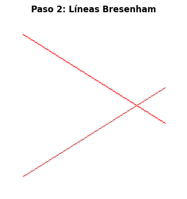
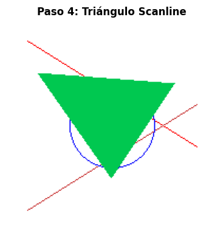
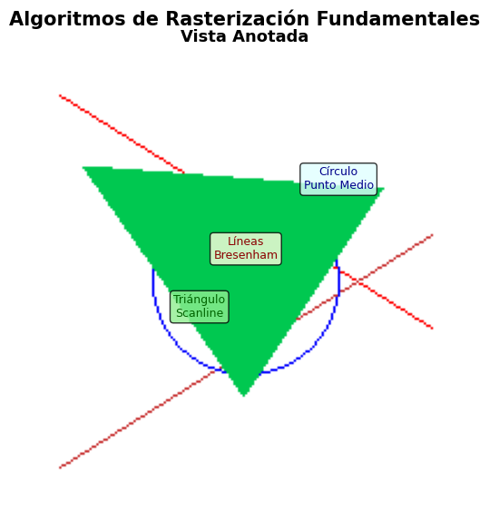
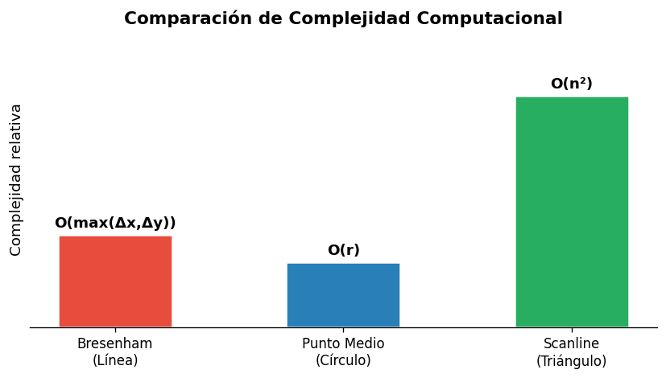

# Taller Algoritmos Rasterizacion Basica

**Estudiante:** Victor Saa, Juan Jose Alvarez, Jose Arturo Herrera Rivera, Juan Pablo Correa Sierra, Manuel Santiago Mori Ardila

**Fecha de entrega:** 09 de marzo de 2026  

---

## Descripción

Este taller implementa tres algoritmos clásicos de rasterización básica en Python utilizando manipulación directa de píxeles sobre una imagen de 200×200. El objetivo es comprender cómo la computadora transforma primitivas geométricas (líneas, círculos y polígonos) en conjuntos discretos de píxeles, evitando el uso de funciones de dibujo de alto nivel.

Los algoritmos implementados operan únicamente sobre aritmética entera y coordenadas de píxel, lo que ilustra los fundamentos del pipeline gráfico a bajo nivel.

---

## Implementaciones

### 1. Algoritmo de Bresenham (Línea)

Implementado en Python con PIL para la manipulación directa de píxeles. El algoritmo traza líneas usando **aritmética entera pura**, calculando un error acumulado `err` que decide en cada paso si avanzar en X, en Y o en ambos. Esto lo hace extremadamente eficiente: complejidad **O(max(Δx, Δy))** sin ninguna operación de punto flotante.

Se trazaron dos líneas diagonales en tonos rojos, más una línea horizontal y vertical cruzadas para verificar los casos límite.

### 2. Algoritmo de Círculo de Punto Medio

Aprovecha la **simetría de 8 octantes** del círculo: solo se calcula 1/8 de los puntos y se reflejan los 7 restantes mediante transformaciones de signo y transposición de coordenadas. La variable de decisión `p` parte de `1 - radio` y se actualiza de forma incremental. Complejidad: **O(r)** donde r es el radio.

Se dibujaron dos círculos concéntricos (radios 40 y 15) en tonos azules sobre el canvas que ya contenía las líneas Bresenham.

### 3. Rasterización Scanline (Triángulo Relleno)

Recorre cada línea horizontal (scanline) dentro del bounding box del triángulo. Los vértices se ordenan por coordenada Y, luego se interpolan los bordes izquierdo y derecho para cada fila, y se pintan todos los píxeles entre ellos. Complejidad: **O(n²)** donde n es el tamaño del triángulo en píxeles.

Se rellenó un triángulo con vértices en (30,50), (100,150) y (160,60) en color verde.

---

## Resultados Visuales

### Bresenham — Líneas

| Vista simple | Con contexto |
|:---:|:---:|
|  |  |

Las líneas rojas trazadas confirman que el algoritmo maneja correctamente pendientes positivas, negativas y casos especiales (horizontal/vertical).

### Círculo de Punto Medio

Los dos círculos concéntricos se superponen con las líneas de Bresenham. Se puede observar que el contorno del círculo es suave y continuo gracias al uso de los 8 octantes de simetría.

### Scanline — Triángulo Relleno

| Triángulo aislado | Resultado final combinado |
|:---:|:---:|
|  |  |

El relleno scanline produce un triángulo sólido sin huecos ni artefactos. La imagen final combina los tres algoritmos sobre el mismo canvas.

### Comparación de Complejidad

| 

---

## Código Relevante

### Bresenham

```python
def bresenham(x0, y0, x1, y1, color=(255, 0, 0)):
    dx = abs(x1 - x0)
    dy = abs(y1 - y0)
    sx = 1 if x0 < x1 else -1
    sy = 1 if y0 < y1 else -1
    err = dx - dy

    while True:
        if 0 <= x0 < width and 0 <= y0 < height:
            pixels[x0, y0] = color
        if x0 == x1 and y0 == y1:
            break
        e2 = 2 * err
        if e2 > -dy:
            err -= dy
            x0 += sx
        if e2 < dx:
            err += dx
            y0 += sy
```

### Punto Medio

```python
def midpoint_circle(x0, y0, radius, color=(0, 0, 255)):
    x = radius
    y = 0
    p = 1 - radius

    while x >= y:
        for dx, dy in [(x,y),(y,x),(-x,y),(-y,x),(-x,-y),(-y,-x),(x,-y),(y,-x)]:
            px, py = x0 + dx, y0 + dy
            if 0 <= px < width and 0 <= py < height:
                pixels[px, py] = color
        y += 1
        if p <= 0:
            p = p + 2*y + 1
        else:
            x -= 1
            p = p + 2*y - 2*x + 1
```

### Scanline

```python
def fill_triangle(p1, p2, p3, color=(0, 200, 80)):
    pts = sorted([p1, p2, p3], key=lambda p: p[1])
    (x1, y1), (x2, y2), (x3, y3) = pts

    def interpolate(ya, yb, xa, xb):
        if yb - ya == 0:
            return []
        return [int(xa + (xb - xa) * (y - ya) / (yb - ya)) for y in range(ya, yb)]

    x12 = interpolate(y1, y2, x1, x2)
    x23 = interpolate(y2, y3, x2, x3)
    x13 = interpolate(y1, y3, x1, x3)
    x_left = x12 + x23

    for y, xl, xr in zip(range(y1, y3), x13, x_left):
        for x in range(min(xl, xr), max(xl, xr)):
            if 0 <= x < width and 0 <= y < height:
                pixels[x, y] = color
```

---

## Resumen de Algoritmos

| Algoritmo | Color | Complejidad | Ventaja principal |
|-----------|-------|-------------|-------------------|
| **Bresenham (línea)** | 🔴 Rojo | O(max(Δx,Δy)) | Solo aritmética entera |
| **Punto Medio (círculo)** | 🔵 Azul | O(r) | Simetría de 8 octantes |
| **Scanline (triángulo)** | 🟢 Verde | O(n²) | Relleno completo sin huecos |

---

## Prompts Utilizados

Para este taller no se utilizó IA generativa en la implementación de los algoritmos, dado que el objetivo es comprender el funcionamiento interno de cada uno. Sin embargo, se consultó documentación de referencia y se usó la siguiente estrategia de verificación con IA:

- **Prompt de depuración:** *"¿Por qué el algoritmo de Bresenham puede saltarse píxeles en líneas con pendiente mayor a 1?"* — Esto ayudó a identificar la importancia del intercambio de roles X/Y.
- **Prompt de conceptos:** *"Explica la variable de decisión p en el algoritmo de punto medio para círculos"* — Útil para entender la derivación matemática de la actualización incremental.

---

## Aprendizajes y Dificultades

### Aprendizajes

**Discretización como decisión:** El mayor aprendizaje fue entender que la rasterización no es una conversión mecánica, sino una *toma de decisiones* píxel a píxel. El error acumulado de Bresenham es elegante porque convierte un problema continuo (¿dónde cae la línea?) en uno discreto (¿cuándo cambia de fila?).

**Simetría como optimización:** El algoritmo de punto medio demostró que entender la geometría del problema permite reducir drásticamente el trabajo: en lugar de calcular 360 puntos, basta con calcular ~45 y reflejarlos. Esto aplica a muchos problemas computacionales.

**Pipeline gráfico:** Ver cómo las tres primitivas se combinan en un mismo canvas ayudó a intuir cómo los motores gráficos modernos construyen escenas complejas a partir de operaciones simples.

### Dificultades

- **Ordenamiento de vértices en Scanline:** El algoritmo asume vértices ordenados por Y. Al principio los bordes interpolados quedaban asignados al lado incorrecto, produciendo artefactos. Solucionado ordenando los puntos antes de interpolar.
- **Límites del canvas:** Los algoritmos necesitan verificar que cada píxel esté dentro del rango `[0, width)` × `[0, height)`. Olvidarlo produce excepciones de índice fuera de rango con PIL.
- **Superposición visual:** Al combinar los tres algoritmos en el mismo canvas, los píxeles del triángulo verde sobrescribían parte de las líneas rojas y el círculo azul. Se resolvió aplicando los algoritmos en el orden correcto (Bresenham → Círculo → Triángulo).

semana_3_1_algoritmos_rasterizacion_basica/
├── python/
├── media/ # Imágenes, videos, GIFs de resultados
└── README.md
