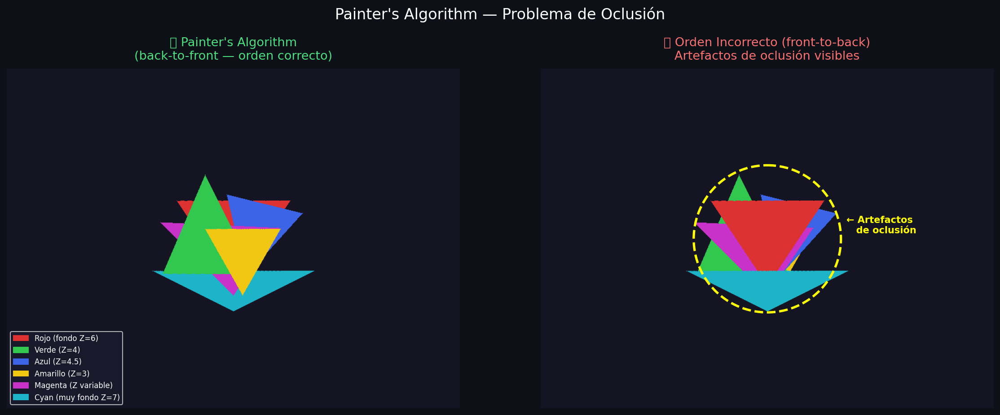
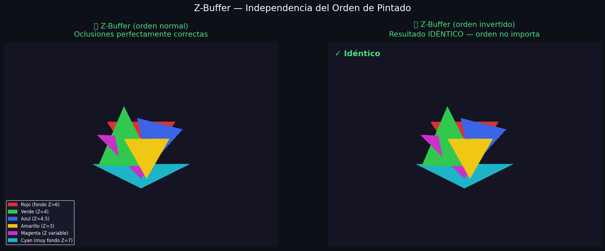
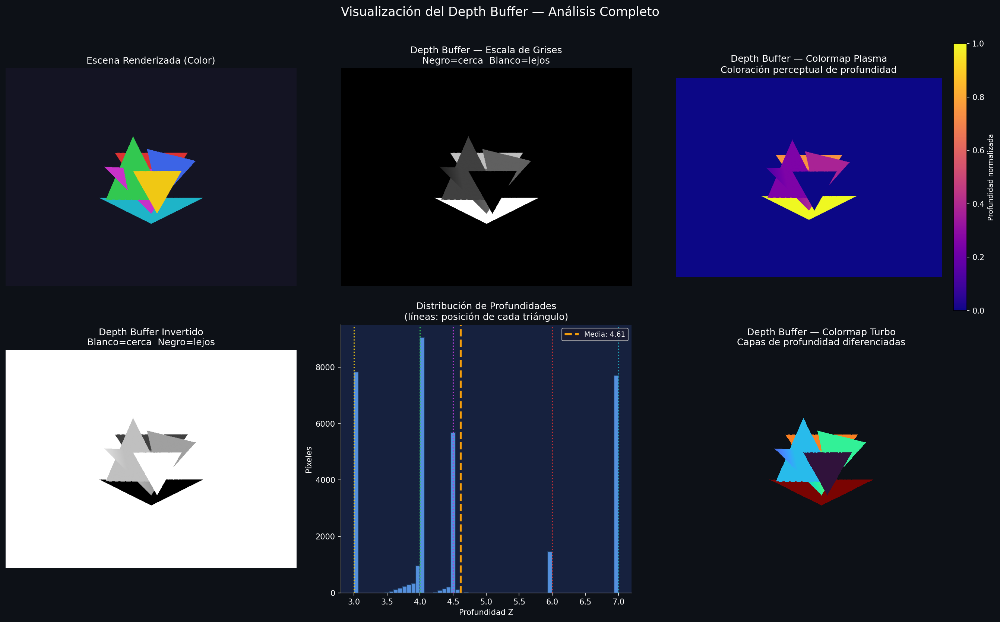
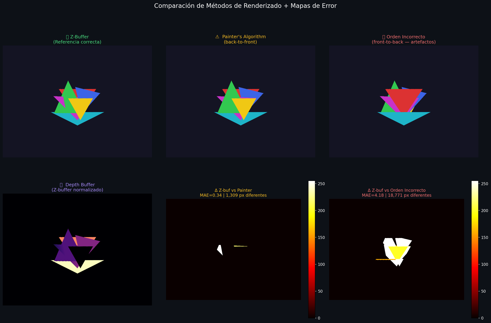
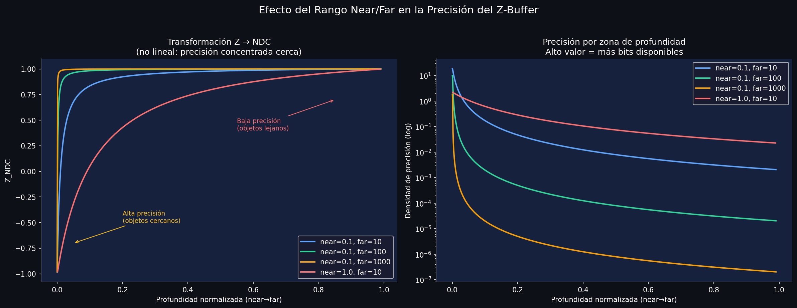
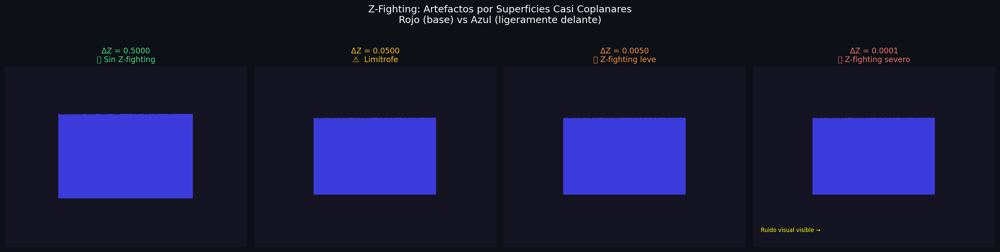

# Taller Implementación de Z-Buffer y Depth Testing

Victor Saa, Juan Jose Alvarez, Jose Arturo Herrera Rivera, Juan Pablo Correa, Manuel Santiago Mori Ardila

Fecha de entrega: 09/03/2026

## Descripción

Implementación desde cero del algoritmo **Z-Buffer (Depth Testing)** para renderizado 3D correcto. El taller explora el problema de oclusión en gráficos por computadora, comparando el clásico Painter's Algorithm con la solución moderna del Z-buffer. Se implementa la proyección perspectiva, rasterización de triángulos con coordenadas baricéntricas, interpolación de profundidad por píxel, y se analizan problemas de precisión como el Z-fighting y el efecto del rango near/far.

## Implementaciónes

### Python

Implementación completa en Jupyter Notebook (`python/main.ipynb`) usando únicamente `numpy` y `matplotlib`. Se construyó un pipeline de renderizado desde cero con los siguientes componentes:

- **Proyección perspectiva**: función `project_point()` que transforma vértices 3D `(X, Y, Z)` al plano de pantalla 2D usando la fórmula $x = f \cdot X/Z + c_x$.
- **Coordenadas baricéntricas**: función `barycentric_coords()` para determinar si un píxel está dentro de un triángulo e interpolar la profundidad Z.
- **Rasterizador sin Z-buffer**: implementación del Painter's Algorithm (`rasterize_no_zbuffer`) que pinta directamente sin test de profundidad, demostrando artefactos de oclusión.
- **Rasterizador con Z-buffer**: implementación `rasterize_zbuffer()` que inicializa una matriz `float32` con `+∞` y actualiza un píxel solo si su Z interpolado es menor al valor almacenado.
- **Visualización del Depth Buffer**: normalización del Z-buffer a [0,1] mostrado en escala de grises, plasma y turbo, con histograma de distribución de profundidades.
- **Comparación cuantitativa**: mapas de error y métrica MAE entre métodos, demostrando que el Z-buffer produce resultados correctos independiente del orden de pintado.
- **Análisis de precisión**: curvas de transformación NDC no lineal para distintos rangos near/far, y simulación de Z-fighting con superficies a separaciones ΔZ desde 0.5 hasta 0.0001.

### Unity

Se desarrolló un shader personalizado para mapear la profundidad del espacio de clip a un valor escalar visible (escala de grises).
Fragment Shader: La clave reside en la macro de Unity 
```UNITY_Z_0_FAR_FROM_CLIPSPACE(i.vertex.z)``` (Codigo en el snippet de Unity)
Esta función normaliza la posición Z del objeto en un rango [0, 1]. Un valor de 0 (negro) representa el Near Plane, mientras que 1 (blanco) representa el Far Plane.

Tambien se implementó un controlador en C# utilizando el Input System Package para manipular la cámara en tiempo real sin salir del modo Play.

Movimiento (Eje Z): Permite observar cómo el valor de profundidad cambia dinámicamente según la posición del observador (teclas W/S).

Manipulación FarClip (Teclas A/D): El script modifica el atributo cam.farClipPlane.

Punto crítico: Al reducir el farClipPlane con la tecla A, se hace más preciso para resolver el Z-fighting.

### Three.js

DESCRIBIR IMPLEMENTACIÓN EN THREE.JS

<!-- TODO: agregar descripción de implementación Three.js -->

```bash
cd threejs

# Con yarn
yarn install
yarn dev

# Con npm
npm install
npm run dev
```

## IA

IDE, prompts y autocompletado: Antigravity

## Resultados visuales


### Python








## Snippet de Python

La implementación se basa en un pipeline de renderizado por software. Los fragmentos clave incluyen la proyección de puntos, el cálculo de coordenadas baricéntricas para la interpolación de profundidad y la lógica central del Z-buffer:

```python
def project_point(point_3d, focal_length=500, cx=400, cy=300):
    """Proyecta punto 3D (X,Y,Z) al plano de pantalla 2D."""
    X, Y, Z = point_3d
    if Z <= 0:
        return None  # Detrás de la cámara
    px = int(focal_length * X / Z + cx)
    py = int(focal_length * Y / Z + cy)
    return (px, py)

def barycentric_coords(px, py, v0, v1, v2):
    """Calcula coordenadas baricéntricas para determinar pertenencia e interpolar Z."""
    x0,y0 = v0;  x1,y1 = v1;  x2,y2 = v2
    denom = (y1-y2)*(x0-x2) + (x2-x1)*(y0-y2)
    if abs(denom) < 1e-10:
        return -1, -1, -1   # Triángulo degenerado
    l0 = ((y1-y2)*(px-x2) + (x2-x1)*(py-y2)) / denom
    l1 = ((y2-y0)*(px-x2) + (x0-x2)*(py-y2)) / denom
    l2 = 1.0 - l0 - l1
    return l0, l1, l2

def rasterize_zbuffer(image, zbuffer, pts_2d, depths, color):
    """Rasteriza triángulo CON test de profundidad píxel a píxel."""
    H, W = image.shape[:2]
    v0, v1, v2 = pts_2d
    z0, z1, z2 = depths
    # Bounding box del triángulo
    min_x = max(0,   int(min(v0[0], v1[0], v2[0])))
    max_x = min(W-1, int(max(v0[0], v1[0], v2[0])))
    min_y = max(0,   int(min(v0[1], v1[1], v2[1])))
    max_y = min(H-1, int(max(v0[1], v1[1], v2[1])))
    
    for py in range(min_y, max_y + 1):
        for px in range(min_x, max_x + 1):
            l0, l1, l2 = barycentric_coords(px, py, v0, v1, v2)
            if l0 >= 0 and l1 >= 0 and l2 >= 0:
                # Interpolación baricéntrica de profundidad
                z_interp = l0*z0 + l1*z1 + l2*z2
                # TEST Z-BUFFER
                if z_interp < zbuffer[py, px]:
                    zbuffer[py, px] = z_interp   # Actualizar profundidad
                    image[py, px]   = color       # Pintar color
```

## Snippet de Unity
```
C++float depth = UNITY_Z_0_FAR_FROM_CLIPSPACE(i.vertex.z);
return float4(depth, depth, depth, 1.0);
```

## Prompts utilizados

Aca me ayude de Antigravity para construir la escena y el shader.

Mediante Claude se ayudo a entender los conceptos de Z-buffer y depth testing, apoyando la creacion del Notebook de Python.

## Aprendizajes

- El **Z-buffer** resuelve correctamente la oclusión para cualquier geometría, incluyendo triángulos entrelazados que el Painter's Algorithm no puede manejar.
- La **independencia del orden de pintado** es la ventaja clave del Z-buffer: se obtiene el mismo resultado sin importar el orden en que se procesen los triángulos.
- La **interpolación baricéntrica** es fundamental: sin ella no es posible calcular la profundidad correcta en cada píxel interior del triángulo.
- La transformación Z a NDC es **no lineal**: la mayoría de la precisión float32 se concentra cerca de la cámara. Un rango near/far muy amplio degrada severamente la precisión en objetos lejanos.
- El **Z-fighting** es un problema real de precisión numérica: con `float32`, superficies separadas por ΔZ < 0.001 producen artefactos visuales de ruido, ya que los tests Z se vuelven inconsistentes píxel a píxel.
- Creo que el uso de shaders es una herramienta interesante para la visualizacion de los modelos.

## Contribuciones grupales (si aplica)

Victor Saa: Desarrollo threejs
Juan Jose Alvarez: Desarrollo Python

## Estructura del proyecto

```
semana_3_2_zbuffer_depth_testing/
├── python/
├── unity/
├── threejs/
├── media/ # Imágenes, videos, GIFs de resultados
└── README.md
```

---

## Referencias

Lista las fuentes, tutoriales, documentación o papers consultados durante el desarrollo:

- Documentación oficial de Unity: https://docs.unity3d.com/Manual/
- Tutorial de React Three Fiber: https://docs.pmnd.rs/react-three-fiber/
- Leva (React UI controls): https://leva.pmnd.rs/

---
