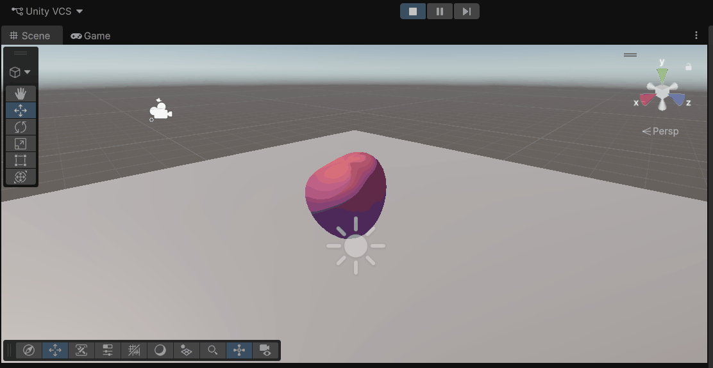
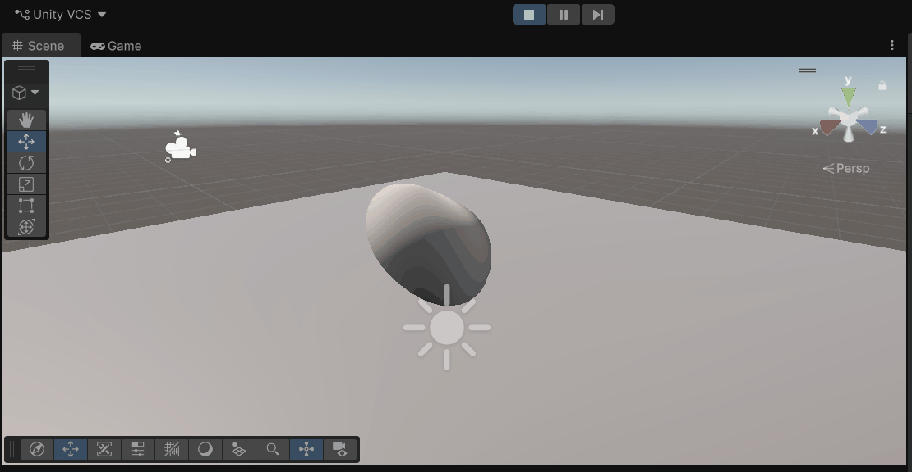
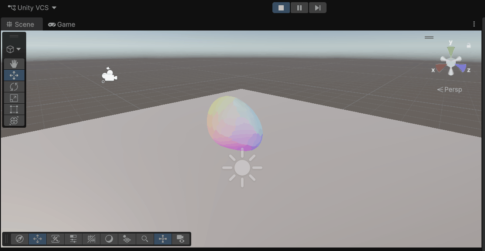
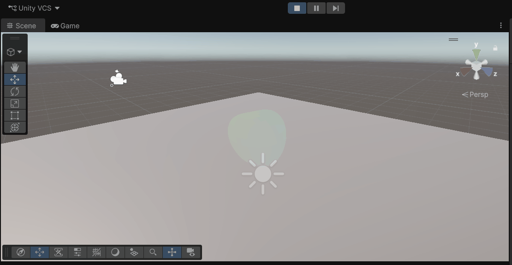
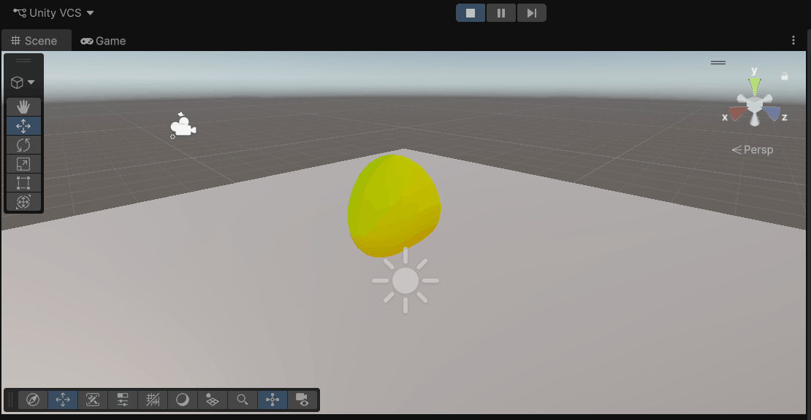
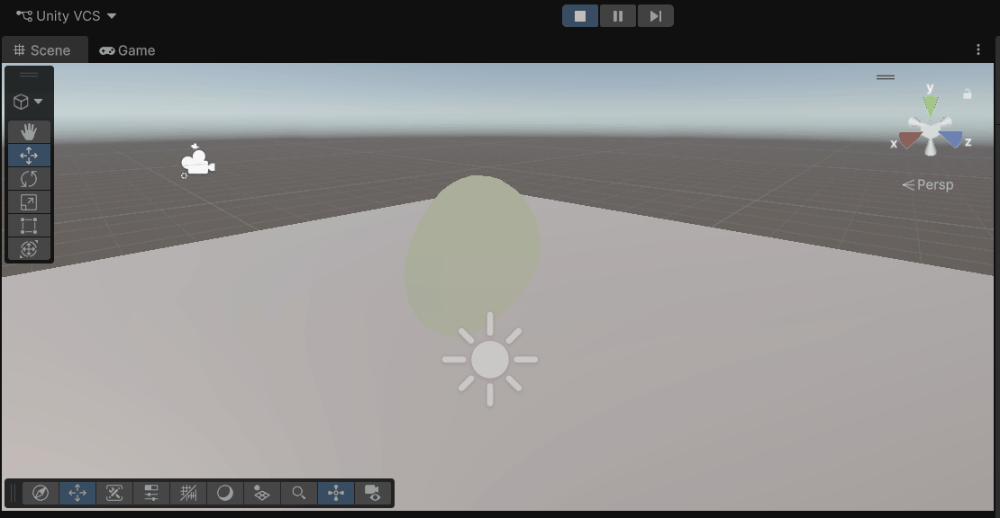
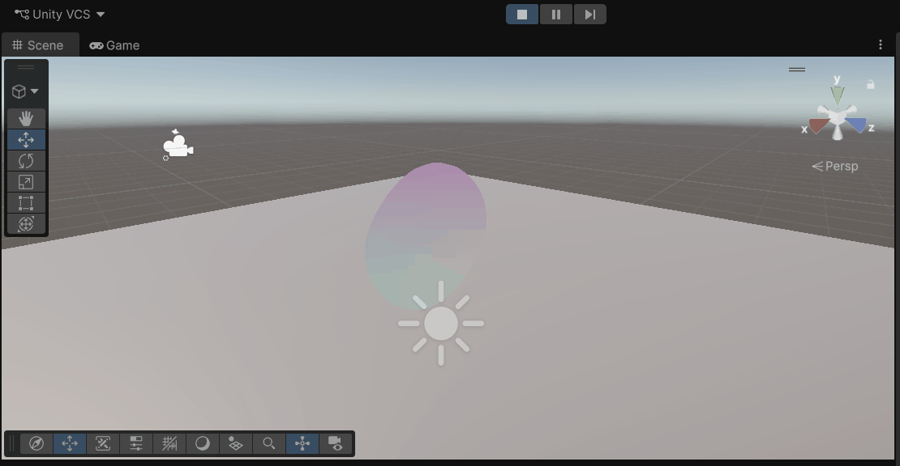
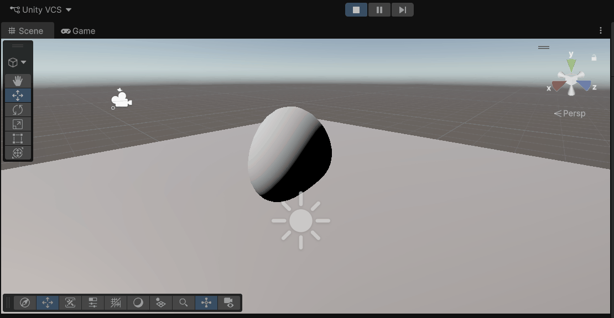
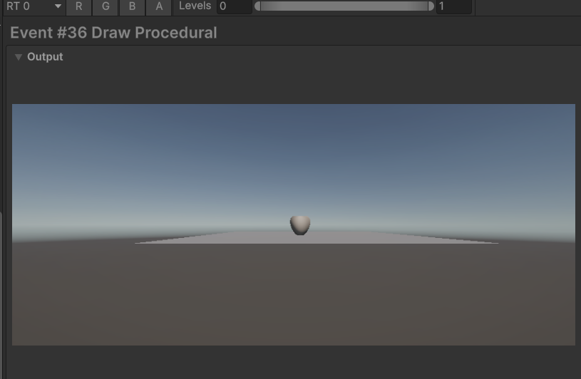
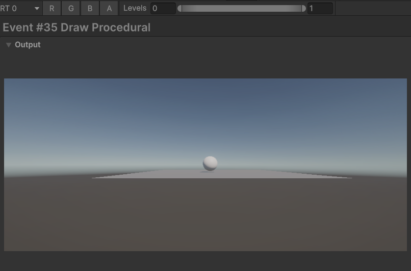

# Taller Etapas del Pipeline Programable

Victor Saa, Juan Jose Alvarez, Juan Pablo Correa

Fecha de entrega: 09/03/2026

## Descripción

Explorar las etapas programables del pipeline gráfico moderno (vertex shader, fragment shader, geometry shader), comprender su funcionamiento y crear shaders personalizados para cada etapa. Comparar con el pipeline de función fija y aprender técnicas de debugging.

## Implementaciónes

### Unity

Para esta parte del taller se trabajó en Unity con URP y un shader en HLSL, dejando por fuera la parte opcional de Geometry Shader. La escena se mantuvo sencilla a propósito: un plano, una esfera, una luz direccional y la cámara enfocando el objeto, para que lo importante fuera observar con claridad el comportamiento del shader. Sobre la esfera se comparó primero un material estándar de URP y luego un material con shader personalizado, con el fin de evidenciar mejor la diferencia entre un enfoque predefinido y uno programable.

La implementación se centró en seguir el recorrido de los datos dentro del pipeline. En el vertex shader se tomó la posición del vértice en object space y se le aplicó una deformación sinusoidal para que la geometría cambiara en tiempo real. Después de eso, esa posición se transformó a world space, view space y clip space, mientras también se enviaban al fragment shader las UV, la normal en espacio mundo y el color por vértice, para que toda esa información pudiera interpolarse y usarse en el cálculo final por píxel.

En el fragment shader se construyó el color final mezclando varios elementos: una textura base, iluminación difusa tipo Lambert, un gradiente vertical y un patrón procedural de franjas. Con esto se mostró que esta etapa no solo sirve para aplicar una textura, sino también para generar efectos visuales de forma matemática y tener un mayor control sobre el resultado final.

Para el debugging, se añadió un parámetro llamado DebugMode, con el que fue posible visualizar directamente en pantalla valores intermedios como normales, UV, posiciones en distintos espacios y el término de iluminación Lambert. Esto facilitó bastante la verificación de que las transformaciones estuvieran correctas y ayudó a detectar errores de mezcla de espacios. Además, la revisión se complementó usando el Frame Debugger de Unity para inspeccionar el draw call del objeto y entender mejor el proceso de renderizado.

Al final, la comparación mostró algo muy claro: el material estándar de URP resuelve el sombreado de forma rápida y funcional, pero el shader personalizado ofrece mucho más control sobre la deformación de la geometría, los datos interpolados y el color final. En otras palabras, uno resulta más práctico para obtener resultados rápidos, mientras que el otro permite entender y manipular mucho mejor el pipeline gráfico.

### Fragmento clave del vertex shader

```bash
Varyings vert(Attributes input)
{
    Varyings output;

    float3 deformedOS = input.positionOS.xyz;
    deformedOS.y += sin((deformedOS.x + deformedOS.z) * _WaveFrequency + _Time.y * 3.0) * _WaveAmplitude;
    deformedOS.x += cos(deformedOS.z * _WaveFrequency + _Time.y * 2.0) * (_WaveAmplitude * 0.25);

    VertexPositionInputs posInputs = GetVertexPositionInputs(deformedOS);
    VertexNormalInputs normalInputs = GetVertexNormalInputs(input.normalOS);

    output.positionHCS = posInputs.positionCS;
    output.positionWS  = posInputs.positionWS;
    output.positionVS  = posInputs.positionVS;
    output.positionCS  = posInputs.positionCS;
    output.normalWS    = normalize(normalInputs.normalWS);
    output.uv          = TRANSFORM_TEX(input.uv, _BaseMap);
    output.color       = input.color;

    return output;
}
```

### Fragmento clave del fragment shader

```bash
half4 frag(Varyings input) : SV_Target
{
    Light mainLight = GetMainLight();

    half3 N = normalize(input.normalWS);
    half3 L = normalize(mainLight.direction);
    half lambert = saturate(dot(N, L));

    half4 texColor = SAMPLE_TEXTURE2D(_BaseMap, sampler_BaseMap, input.uv);

    half gradientMask = saturate(input.uv.y);
    half3 gradient = lerp(_GradientA.rgb, _GradientB.rgb, gradientMask);

    half stripes = 0.5h + 0.5h * sin(input.uv.x * _PatternScale + _Time.y * 2.0h);
    half3 procedural = lerp(gradient, gradient * stripes, 0.4h);

    half3 finalColor = texColor.rgb * _BaseColor.rgb * procedural;
    finalColor *= (0.2h + lambert * mainLight.color.rgb);
    finalColor *= input.color.rgb;

    return half4(finalColor, 1.0);
}
```

### Three.js

Se utilizó three.js para la implementación. Se generó una escena con una esfera. Se implementaron shaders personalizados (vertex shader, fragment shader, geometry shader) y post-procesado. Se utilizó leva para controlar los parámetros de la escena.

```bash
cd threejs

# Con yarn
yarn install
yarn dev

# Con npm
npm install
npm run dev
```

## IA

IDE, prompts y autocompletado: Antigravity

## Resultados visuales

## Resultados visuales

### Unity

A continuación se presentan las evidencias visuales obtenidas durante la implementación y depuración del shader en Unity. Estas capturas y animaciones permiten observar tanto la deformación geométrica aplicada en el vertex shader como la visualización de valores intermedios en el fragment shader.

### Deformación y resultado general





### Visualización de normales y coordenadas UV







### Visualización de espacios de transformación





### Iluminación



### Comparación de materiales





## Three.js


## Prompts utilizados

Aca me ayude de Antigravity construir la escena base del sistema solar.

## Aprendizajes

No conocia el lenguaje GLSL, tambien amplie mas mi percepcion de como los shaders pueden llegar a modificar la percepcion de los objetos en una escena 3D.

## Contribuciones grupales (si aplica)

Victor Saa: Desarrollo Three.js
Juan Pablo Correa: Desarrollo Unity

## Estructura del proyecto

```
semana_3_4_etapas_pipeline_programable/
├── unity/
├── threejs/
├── media/ # Imágenes, videos, GIFs de resultados
└── README.md
```

---

## Referencias

Lista las fuentes, tutoriales, documentación o papers consultados durante el desarrollo:

- Documentación oficial de Unity: https://docs.unity3d.com/Manual/
- Tutorial de React Three Fiber: https://docs.pmnd.rs/react-three-fiber/
- Leva (React UI controls): https://leva.pmnd.rs/

---
