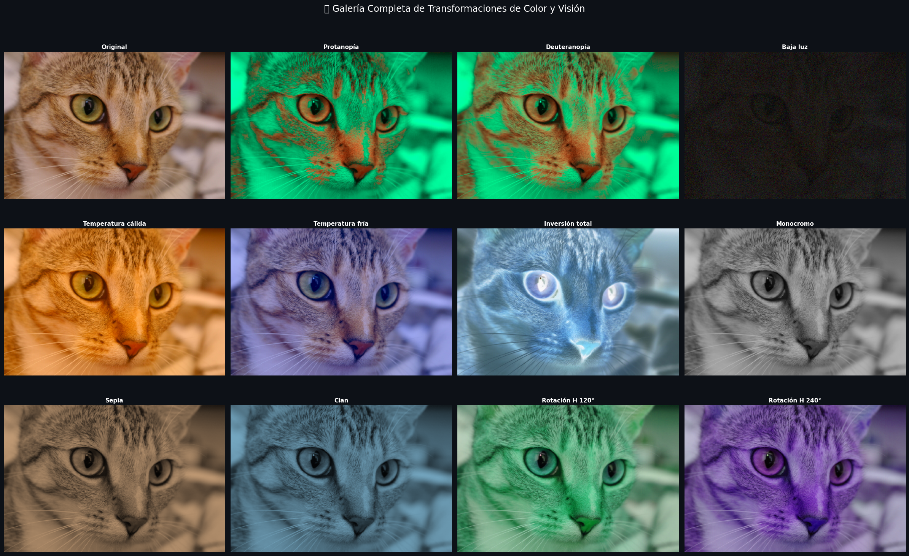
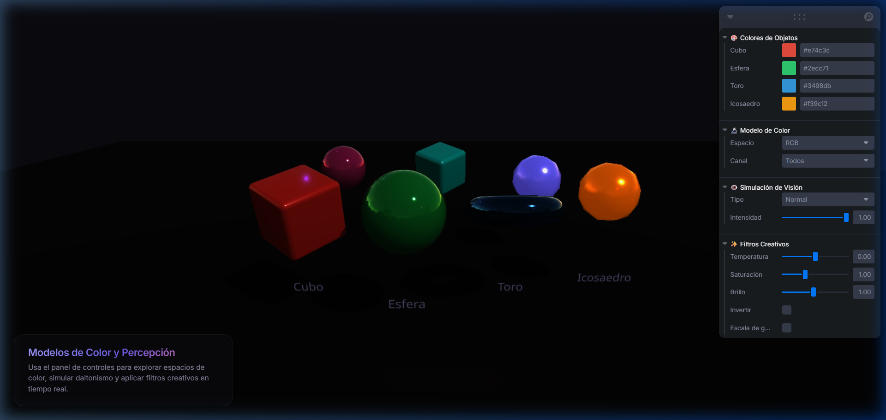
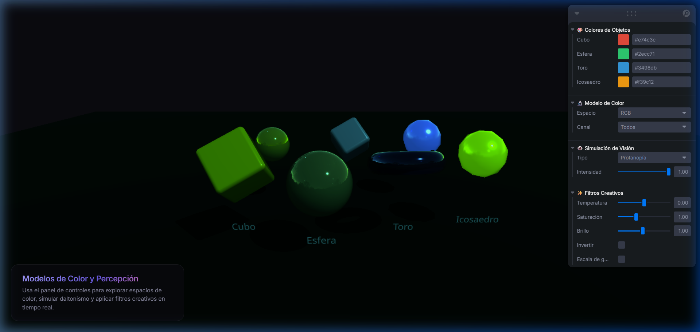
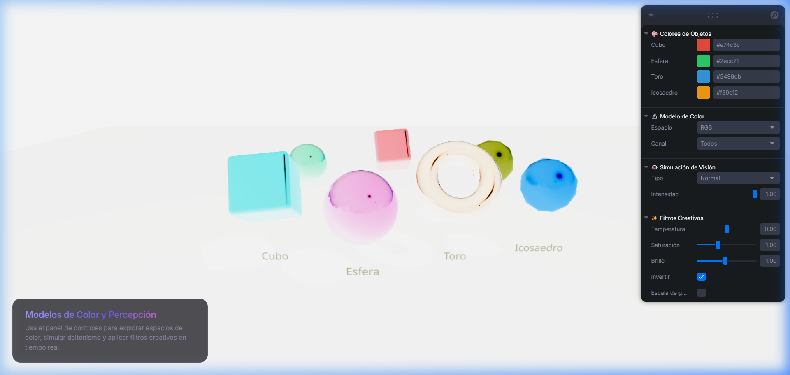

# Taller Espacios de Color y Simulación de Visión

Juan Jose Alvarez

Fecha de entrega: 28/03/2026

## Descripción

Explorar la conversión entre espacios de color (RGB, HSV, CIE Lab), visualizar sus canales individuales y comprender su impacto en la percepción visual. Simular alteraciones de visión como daltonismo (protanopía y deuteranopía) y condiciones de baja luminosidad. Aplicar transformaciones creativas de color como temperatura, inversión y monocromo, con soporte para un selector interactivo dinámico entre todas las simulaciones.

## Implementaciones

### Python (Google Colab)

La implementación en Python se desarrolló en un notebook de Google Colab utilizando **OpenCV**, **NumPy**, **scikit-image**, **colorsys** y **matplotlib** para el procesamiento y visualización de imágenes.

#### Detalles Técnicos:

- **Conversión RGB → HSV**: Se utilizó `cv2.cvtColor` con `COLOR_RGB2HSV` para separar la imagen en los canales Hue (matiz), Saturation (saturación) y Value (brillo), cada uno visualizado con colormaps semánticos.
- **Conversión RGB → CIE Lab**: Se empleó `skimage.color.rgb2lab` para obtener los canales L\* (luminosidad perceptual), a\* (eje verde-rojo) y b\* (eje azul-amarillo), que modelan la percepción humana de manera uniforme.
- **Simulación de Daltonismo**: Se implementaron las matrices de transformación LMS de Machado et al. (2009) con corrección gamma sRGB completa para simular protanopía (deficiencia de rojo) y deuteranopía (deficiencia de verde):

$$\text{LMS}_{sim} = M_{sim} \cdot M_{sRGB \to LMS} \cdot \text{pixel}$$

- **Simulación de Baja Luminosidad**: Combinación de reducción de brillo (escala del canal V), compresión de contraste (acercamiento al gris medio) y ruido gaussiano para emular el comportamiento de un sensor en oscuridad.
- **Transformaciones Creativas**: Filtros de temperatura de color (cálido/frío mediante manipulación de canales R/G/B), inversión total y parcial con mezcla controlada, monocromo con matiz personalizable (sepia, cian, violeta), y rotación de matiz en espacio HSV.

#### Snippets de Código:

```python
# Simulación de daltonismo con matrices LMS (Machado et al., 2009)
def simulate_colorblindness(img_rgb: np.ndarray, kind: str = 'protanopia') -> np.ndarray:
    M_sim = M_protanopia if kind == 'protanopia' else M_deuteranopia

    # Linealización gamma (sRGB)
    img_f = img_rgb.astype(np.float64) / 255.0
    img_lin = np.where(img_f <= 0.04045,
                       img_f / 12.92,
                       ((img_f + 0.055) / 1.055) ** 2.4)

    pixels  = img_lin.reshape(-1, 3)
    lms     = pixels @ M_srgb2lms.T
    lms_sim = lms @ M_sim.T
    rgb_sim = lms_sim @ M_lms2srgb.T
    ...
    return result

# Simulación de baja luminosidad con ruido gaussiano
def simulate_low_light(img_rgb, brightness=0.3, contrast=0.5, noise_std=8.0):
    img_c = 128 + (img_rgb.astype(np.float32) - 128) * contrast
    img_b = img_c * brightness
    if noise_std > 0:
        noise  = np.random.normal(0, noise_std, img_b.shape).astype(np.float32)
        img_b += noise
    return np.clip(img_b, 0, 255).astype(np.uint8)
```

### Three.js (React Three Fiber)

La implementación en Three.js se desarrolló como aplicación web interactiva usando **React Three Fiber**, **@react-three/drei**, **Leva** (UI controls) y shaders GLSL personalizados para post-procesamiento.

#### Detalles Técnicos:

- **Escena 3D con Materiales**: Se crearon 4 tipos de objetos con `meshPhysicalMaterial` de Three.js: cubos con clearcoat, esferas especulares, toros con transmisión (glass-like) e icosaedros emisivos. Cada objeto posee propiedades de material distintas (roughness, metalness, clearcoat, transmission, emissive) para maximizar la diversidad visual de la escena.
- **Post-processing con GLSL**: Se implementó un shader fragment personalizado como pase de post-procesamiento fullscreen (render-to-texture → quad). El shader opera sobre cada píxel renderizado y aplica en cadena: simulación CVD, temperatura, saturación, brillo, escala de grises, inversión y visualización de modelo de color.
- **Simulación de Daltonismo en GPU**: Las matrices CVD de Machado et al. (2009) se implementaron directamente en GLSL con corrección gamma sRGB (`srgbToLinear` / `linearToSrgb`), soportando protanopía, deuteranopía y tritanopía con interpolación gradual via `mix()`:

$$\text{col}_{sim} = \text{linearToSrgb}\left(\text{mix}\left(\text{lin}, M_{cvd} \cdot \text{lin}, \text{strength}\right)\right)$$

- **Conversión RGB → HSV y RGB → CIE Lab en GLSL**: Se implementaron las funciones de conversión completas dentro del fragment shader para visualizar canales individuales de cada espacio de color en tiempo real.
- **UI Interactiva (Bonus)**: Panel de controles Leva con 4 secciones: color pickers para cada objeto, selector de espacio de color + canal, selector de simulación de visión + intensidad, y sliders/toggles para filtros creativos.

#### Snippets de Código:

```glsl
// Simulación de daltonismo en GLSL (fragment shader post-processing)
mat3 getProtanopia() {
    return mat3(
        0.152286,  1.052583, -0.204868,
        0.114503,  0.786281,  0.099216,
       -0.003882, -0.048116,  1.051998
    );
}

void main() {
    vec4 texel = texture2D(tDiffuse, vUv);
    vec3 col = texel.rgb;

    // CVD simulation en espacio lineal
    if (uCvdType > 0) {
        vec3 lin = srgbToLinear(col);
        mat3 cvd;
        if (uCvdType == 1) cvd = getProtanopia();
        else if (uCvdType == 2) cvd = getDeuteranopia();
        else cvd = getTritanopia();
        lin = mix(lin, cvd * lin, uCvdStrength);
        col = linearToSrgb(clamp(lin, 0.0, 1.0));
    }
    // ... temperatura, saturación, brillo, grayscale, inversión
}
```

```tsx
// Post-processing con render-to-texture en React Three Fiber
function ColorVisionPostProcess(props) {
    const { gl, scene, camera, size } = useThree();
    const renderTarget = useMemo(
        () => new THREE.WebGLRenderTarget(size.width, size.height),
        []
    );

    useFrame(() => {
        // Render scene to texture
        gl.setRenderTarget(renderTarget);
        gl.render(scene, camera);
        // Render quad with post-processing to screen
        material.uniforms.tDiffuse.value = renderTarget.texture;
        gl.setRenderTarget(null);
        gl.render(quadScene, quadCamera);
    }, 1);
}
```

## IA

IDE, prompts y autocompletado: Claude (Anthropic) — estructuración de funciones y documentación.

## Resultados Visuales

### Python


*Vista general de las 12 transformaciones implementadas.*

### Three.js


*Escena 3D con cubo, esfera, toro e icosaedro en sus colores originales, con panel de controles Leva.*


*Simulación de protanopía aplicada en tiempo real: el cubo rojo se percibe amarillo-verdoso, el icosaedro naranja se vuelve verde.*


*Filtro de inversión de color: todos los colores se transforman a sus complementarios (rojo → cian, verde → magenta).*


*Video funcionamiento general.*

## Prompts Utilizados

- *"Implementa la simulación de daltonismo (protanopía y deuteranopía) usando las matrices LMS de Machado et al. con corrección gamma sRGB"*
- *"Agrega un selector interactivo con ipywidgets que permita alternar dinámicamente entre todas las transformaciones con un slider de intensidad"*
- *"En semana_4_2_modelos_color_percepcion/threejs, crea una escena con materiales aplicados a objetos, aplica cambios de color programáticamente y simula filtros de visión modificando shaders. Agrega un UI slider o menú para seleccionar el modelo de color o simulación"*

## Aprendizajes

- Comprender que los espacios de color no son equivalentes: HSV separa información perceptual de forma intuitiva (matiz, saturación, brillo), mientras que CIE Lab modela la percepción humana de manera matemáticamente uniforme.
- Las simulaciones de daltonismo requieren operar en espacio lineal (corrección gamma) para producir resultados físicamente correctos; trabajar directamente en sRGB produce simulaciones inexactas.
- La rotación y manipulación de canales en HSV es mucho más intuitiva para efectos visualos creativos que operar directamente sobre RGB.
- El espacio Lab es ideal para operaciones donde se quiere preservar luminosidad y modificar solo cromaticidad, o viceversa.
- Implementar conversiones de color (RGB↔HSV, RGB→Lab) directamente en GLSL permite procesamiento en tiempo real por píxel en GPU, logrando rendimiento interactivo imposible de alcanzar con CPU.
- El post-processing via render-to-texture en Three.js permite aplicar efectos globales (filtros, simulaciones de visión) a toda la escena sin modificar los materiales individuales de cada objeto.
- `meshPhysicalMaterial` de Three.js permite simular materiales realistas (clearcoat, transmisión, emisión) que generan una variedad de respuestas cromáticas útiles para evaluar el impacto de los filtros de color.

## Estructura del Proyecto

```
semana_4_2_modelos_color_percepcion/
├── python/
│   └── color_vision_lab.ipynb       # Notebook principal de Google Colab
├── threejs/                          # Aplicación Three.js interactiva
│   ├── index.html
│   ├── package.json
│   ├── vite.config.ts
│   ├── tsconfig.json
│   └── src/
│       ├── main.tsx                  # Entry point React
│       ├── index.css                 # Estilos globales (dark theme)
│       ├── App.css                   # Estilos del App (glassmorphism)
│       └── App.tsx                   # Escena 3D + shaders + controles
├── media/                            # Imágenes de resultados
│   ├── semana_4_2_python.png
│   ├── threejs_escena_inicial.png
│   ├── threejs_protanopia.png
│   ├── threejs_inversion.png
│   └── threejs_video.gif
└── README.md
```

---

## Referencias

- Machado, G. M., Oliveira, M. M., & Fernandes, L. A. F. (2009). *A Physiologically-based Model for Simulation of Color Vision Deficiency*. IEEE Transactions on Visualization and Computer Graphics.
- Documentación oficial de OpenCV — Color Space Conversions: https://docs.opencv.org/4.x/de/d25/imgproc_color_conversions.html
- Documentación de scikit-image — `skimage.color`: https://scikit-image.org/docs/stable/api/skimage.color.html
- CIE 15:2004 — *Colorimetry*, 3rd edition. Commission Internationale de l'Éclairage.
- Documentación de ipywidgets: https://ipywidgets.readthedocs.io/
- Documentación de Three.js — `MeshPhysicalMaterial`: https://threejs.org/docs/#api/en/materials/MeshPhysicalMaterial
- React Three Fiber: https://r3f.docs.pmnd.rs/
- @react-three/drei: https://drei.docs.pmnd.rs/
- Leva UI Controls: https://github.com/pmndrs/leva

---
