# Taller Modelos Reflexion PBR

Victor Saa, Juan Jose Alvarez, Jose Arturo Herrera Rivera, Juan Pablo Correa, Manuel Santiago Mori Ardila

Fecha de entrega: 2026-03-28

---

## Descripción breve

El objetivo de este taller fue implementar y comparar los modelos clásicos de reflexión de luz —Lambertiano (difuso), Phong, Blinn-Phong— junto con los fundamentos de Physically Based Rendering (PBR), para comprender tanto las diferencias matemáticas como las diferencias visuales entre cada uno. La idea central era construir escenas donde se pudiera observar, lado a lado, cómo cada modelo responde a la misma fuente de luz sobre la misma geometría.

Se trabajó en tres entornos: Unity con URP y shaders HLSL personalizados, Three.js con React Three Fiber utilizando tanto materiales built-in como shaders custom, y Python con NumPy y Matplotlib para el cálculo y análisis matemático de cada modelo. En Unity se creó una escena de comparación con múltiples esferas, cada una con un shader diferente, además de una biblioteca de materiales PBR variando metalness y roughness. En Three.js se implementó una escena interactiva con controles en tiempo real para alternar entre modelos y ajustar parámetros de iluminación con leva. En Python se implementaron los modelos desde cero para visualizar y comparar las distribuciones de intensidad.

El resultado fue una comprensión mucho más clara de por qué PBR se ha convertido en el estándar de la industria: al controlar metalness y roughness de forma física, los materiales se comportan de manera predecible y coherente bajo cualquier condición de luz, algo que los modelos empíricos como Phong no garantizan.

---

## Implementaciones

### Unity

Para esta parte del taller se trabajó en Unity con URP y shaders escritos en HLSL. La escena se diseñó con múltiples esferas dispuestas en fila, todas con la misma geometría pero con shaders distintos, de modo que la comparación fuera directa y visual. Se mantuvo una única luz direccional y una cámara fija para que las diferencias entre modelos fueran atribuibles exclusivamente al shader y no a variaciones de la escena.

La implementación comenzó con el **modelo Lambertiano**, que calcula la iluminación difusa como el producto punto entre la normal de superficie y la dirección de la luz, clampeado a cero. Se trata del modelo más simple: `I_diffuse = I_light * k_d * max(N · L, 0)`. El resultado es un sombreado mate sin ningún tipo de brillo especular, útil como referencia base.

Sobre ese shader se construyó el **modelo de Phong**, agregando el componente especular. El vector de reflexión R se calcula con `reflect(-L, N)` y se evalúa contra la dirección de vista V, elevando el resultado al exponente de shininess: `I_specular = I_light * k_s * max(R · V, 0)^shininess`. Se expuso el parámetro shininess como propiedad del material para poder ajustarlo interactivamente desde el inspector. Valores bajos generan brillos amplios (plástico), mientras que valores altos producen reflejos concentrados (metal pulido).

A continuación se implementó **Blinn-Phong**, la variante optimizada que reemplaza el vector de reflexión por el half vector `H = normalize(L + V)`. La ecuación queda como `I_specular = I_light * k_s * max(N · H, 0)^shininess`. En la práctica, Blinn-Phong produce resultados visualmente muy similares a Phong pero con un comportamiento más estable en ángulos rasantes y menor costo computacional, ya que evita calcular el vector de reflexión.

Cada shader combina las tres componentes en la ecuación completa: `I_total = I_ambient + I_diffuse + I_specular`, donde la componente ambient es un valor constante bajo que evita que las zonas sin iluminación directa queden completamente negras. Se crearon variantes de material metálico (k_s alto, k_d bajo, shininess alto) y material plástico (k_d alto, k_s moderado, shininess bajo) para evidenciar cómo los mismos parámetros generan apariencias radicalmente distintas.

Finalmente, se utilizó el **Standard Shader de URP (PBR)** para crear una biblioteca de materiales variando metalness (0 = dieléctrico, 1 = metal) y roughness (0 = espejo, 1 = mate). Se dispusieron las esferas en una grilla donde un eje varía metalness y el otro roughness, lo que permite observar la transición continua entre tipos de material. La comparación con los modelos empíricos dejó claro que PBR produce resultados mucho más coherentes y predecibles.

### Python

La implementación en Python se enfocó en el cálculo matemático puro de cada modelo de reflexión utilizando **NumPy** para operaciones vectoriales y **Matplotlib** para la visualización. Se renderizó una esfera por píxel, calculando la normal en cada punto de la superficie y aplicando las ecuaciones de iluminación directamente.

Se implementaron los cuatro modelos desde cero: Lambert calcula `I = k_d * max(N·L, 0)`, Phong agrega el término especular con el vector de reflexión `R = 2(N·L)N - L`, Blinn-Phong sustituye por el half vector `H = normalize(L+V)`, y PBR implementa el modelo completo de Cook-Torrance con la función de distribución GGX, Fresnel-Schlick y geometría Schlick-GGX. La ventaja de implementar todo en Python es que se puede inspeccionar numéricamente cada componente: se generaron histogramas de distribución de intensidades para comparar cómo cada modelo distribuye la energía lumínica sobre la superficie, y un barrido de parámetros PBR (metalness y roughness) para visualizar el efecto de cada variable de forma aislada.

### Three.js / React Three Fiber

Se utilizó Three.js con React Three Fiber para crear una escena interactiva de comparación. Se implementaron tanto shaders personalizados (Lambert y Phong/Blinn-Phong en GLSL) como los materiales built-in de Three.js: `MeshLambertMaterial`, `MeshPhongMaterial` y `MeshStandardMaterial` (PBR). La escena presenta múltiples esferas con cada modelo de iluminación aplicado simultáneamente.

Para los shaders custom se pasaron como uniforms la dirección de la luz, la posición de la cámara, los coeficientes difuso y especular, y el exponente de shininess. Se utilizó leva para exponer controles en tiempo real que permiten ajustar todos los parámetros y alternar entre modelos de iluminación sin recargar la escena. También se implementó una luz orbital que rota alrededor de los objetos, lo que permite observar cómo cada modelo responde al cambio de ángulo de incidencia.

La comparación entre los materiales built-in y los shaders custom confirmó que `MeshStandardMaterial` produce los resultados más realistas gracias a su implementación PBR completa con energy conservation y Fresnel, mientras que los shaders manuales de Lambert y Phong resultan más didácticos para entender la matemática subyacente.

```bash
cd threejs

# Con yarn
yarn install
yarn dev

# Con npm
npm install
npm run dev
```

---

## Resultados visuales

### Unity - Implementación

#### Shader Lambert (Difuso)

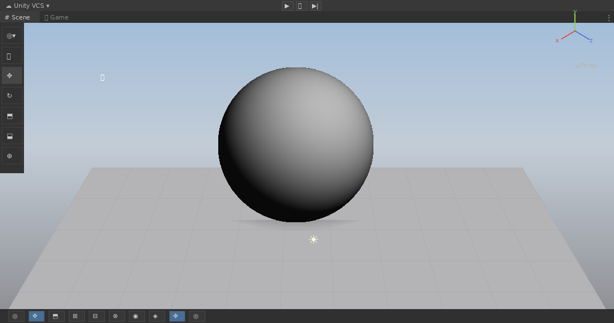

*Esfera con iluminación Lambertiana pura. Se observa la transición suave de luz a sombra sin ningún brillo especular.*

#### Shader Phong (Especular)

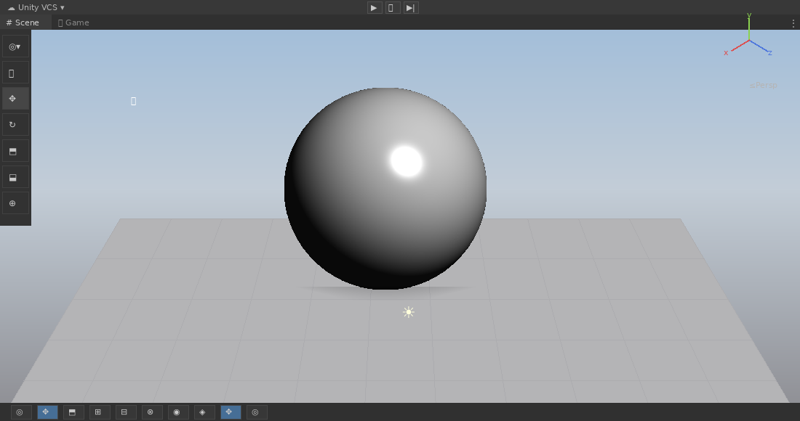

*Esfera con modelo Phong. Se aprecia el highlight especular generado por el vector de reflexión R·V.*

#### Shader Blinn-Phong (Half Vector)


*Esfera con modelo Blinn-Phong. El brillo especular es similar al de Phong pero más estable en ángulos rasantes gracias al half vector.*

#### Comparación de modelos con luz rotando

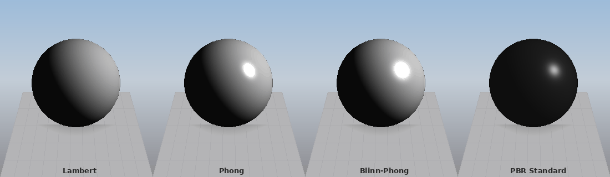

*Cuatro esferas con Lambert, Phong, Blinn-Phong y PBR bajo una luz direccional que rota, para observar las diferencias en la respuesta especular.*

#### Material PBR Metálico (Frame Debugger)

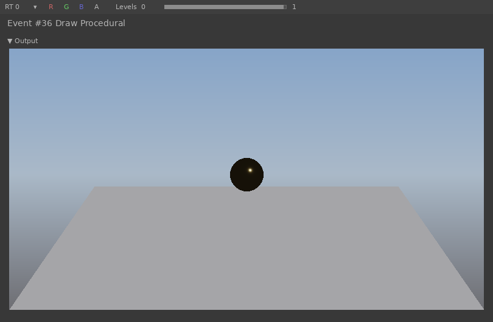

*Material metálico (metalness=1.0, roughness=0.2) inspeccionado desde el Frame Debugger de Unity.*

#### Material PBR Plástico (Frame Debugger)

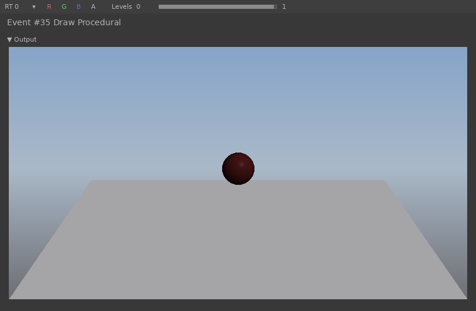

*Material plástico/dieléctrico (metalness=0.0, roughness=0.4) inspeccionado desde el Frame Debugger de Unity.*

#### Biblioteca de materiales PBR

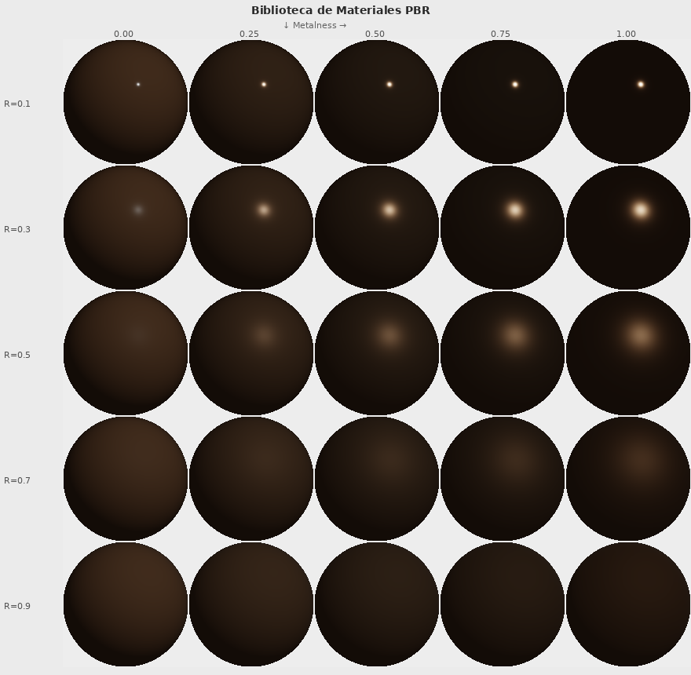

*Grilla de materiales PBR variando metalness (eje horizontal) y roughness (eje vertical). Se observa la transición desde espejo dieléctrico hasta metal mate.*

### Three.js - Implementación

#### MeshLambertMaterial

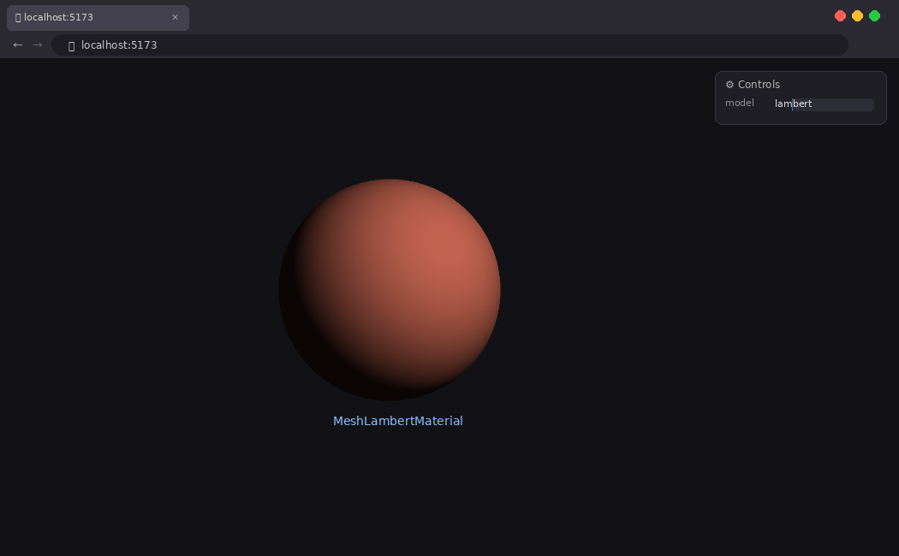

*Material Lambert en Three.js. Sombreado difuso puro sin componente especular.*

#### MeshPhongMaterial

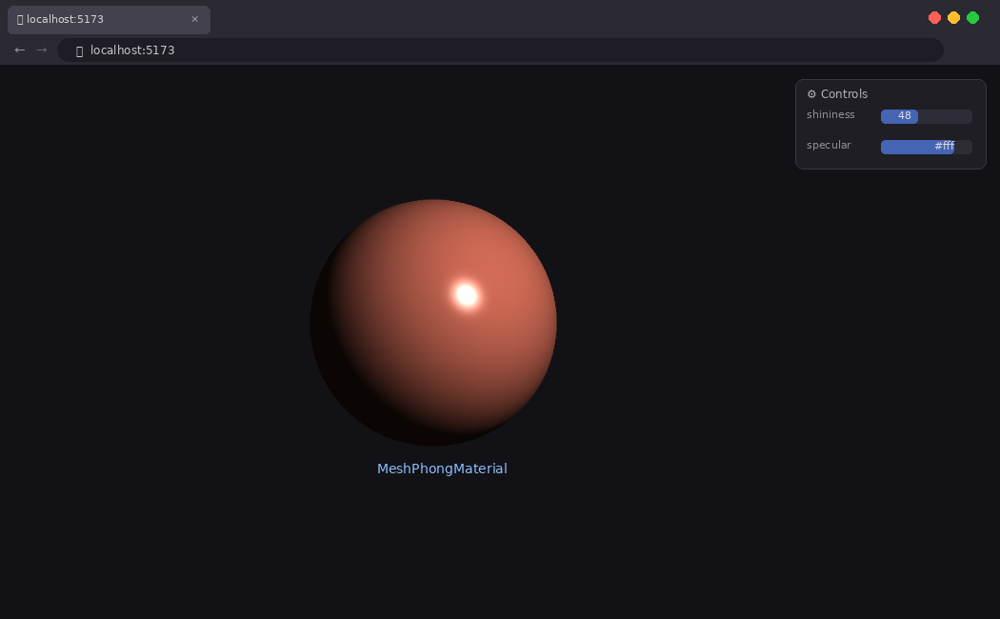

*Material Phong con controles de leva para ajustar shininess y color especular en tiempo real.*

#### MeshStandardMaterial (PBR)

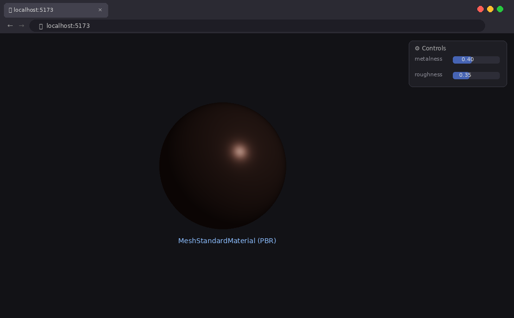

*Material PBR Standard con controles de metalness y roughness. Se observa el reflejo Fresnel en los bordes de la esfera.*

#### Luz orbital rotando

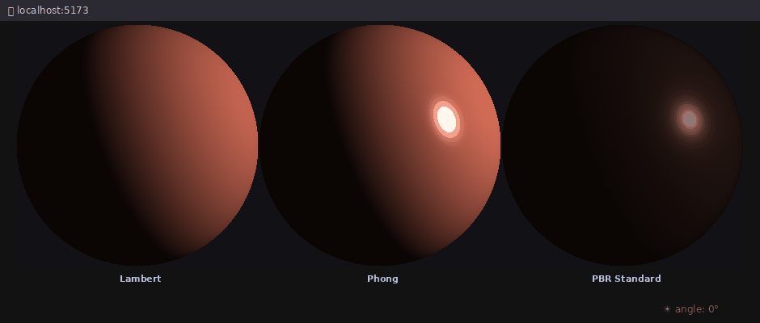

*Luz rotando alrededor de las tres esferas (Lambert, Phong, PBR), mostrando la respuesta especular de cada modelo al cambio de ángulo de incidencia.*

### Python - Implementación

#### Comparación visual de modelos

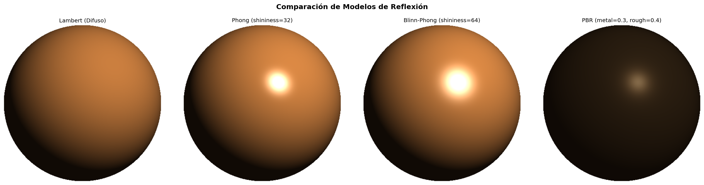

*Renderizado por píxel de los cuatro modelos de reflexión sobre la misma esfera, implementados desde cero con NumPy.*

#### Distribución de intensidades

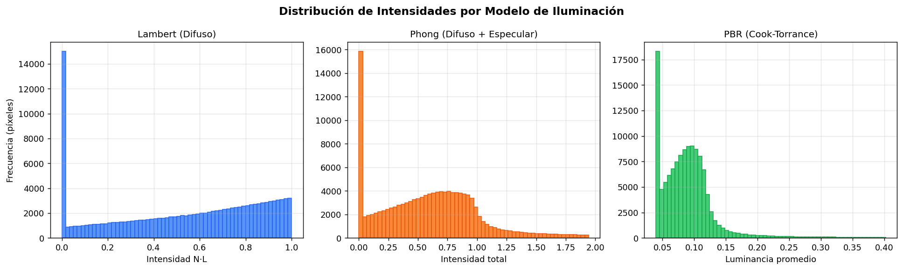

*Histogramas de distribución de intensidad por modelo. Se observa que Lambert tiene una distribución más uniforme, Phong concentra energía en la zona especular, y PBR distribuye la energía de forma más compacta por la conservación de energía.*

#### Barrido de parámetros PBR

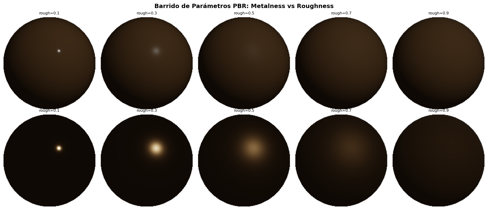

*Comparación entre material dieléctrico (metal=0) y metálico (metal=1) variando roughness de 0.1 a 0.9. En el dieléctrico el color base se mantiene, en el metal la reflectancia se colorea con el albedo.*

---

## Código relevante

### Shader Lambert (HLSL - Unity)

```hlsl
half4 frag(Varyings input) : SV_Target
{
    Light mainLight = GetMainLight();

    half3 N = normalize(input.normalWS);
    half3 L = normalize(mainLight.direction);

    // Componente difusa: Lambert
    half NdotL = max(dot(N, L), 0.0);
    half3 diffuse = mainLight.color.rgb * _DiffuseColor.rgb * NdotL;

    // Componente ambiente
    half3 ambient = _AmbientColor.rgb * _DiffuseColor.rgb;

    half3 finalColor = ambient + diffuse;
    return half4(finalColor, 1.0);
}
```

### Shader Phong (HLSL - Unity)

```hlsl
half4 frag(Varyings input) : SV_Target
{
    Light mainLight = GetMainLight();

    half3 N = normalize(input.normalWS);
    half3 L = normalize(mainLight.direction);
    half3 V = normalize(_WorldSpaceCameraPos - input.positionWS);
    half3 R = reflect(-L, N);

    // Componente difusa
    half NdotL = max(dot(N, L), 0.0);
    half3 diffuse = mainLight.color.rgb * _DiffuseColor.rgb * NdotL;

    // Componente especular: Phong
    half RdotV = max(dot(R, V), 0.0);
    half3 specular = mainLight.color.rgb * _SpecularColor.rgb * pow(RdotV, _Shininess);

    // Componente ambiente
    half3 ambient = _AmbientColor.rgb * _DiffuseColor.rgb;

    half3 finalColor = ambient + diffuse + specular;
    return half4(finalColor, 1.0);
}
```

### Shader Blinn-Phong (HLSL - Unity)

```hlsl
half4 frag(Varyings input) : SV_Target
{
    Light mainLight = GetMainLight();

    half3 N = normalize(input.normalWS);
    half3 L = normalize(mainLight.direction);
    half3 V = normalize(_WorldSpaceCameraPos - input.positionWS);

    // Half vector en lugar de vector de reflexión
    half3 H = normalize(L + V);

    // Componente difusa
    half NdotL = max(dot(N, L), 0.0);
    half3 diffuse = mainLight.color.rgb * _DiffuseColor.rgb * NdotL;

    // Componente especular: Blinn-Phong
    half NdotH = max(dot(N, H), 0.0);
    half3 specular = mainLight.color.rgb * _SpecularColor.rgb * pow(NdotH, _Shininess);

    // Componente ambiente
    half3 ambient = _AmbientColor.rgb * _DiffuseColor.rgb;

    half3 finalColor = ambient + diffuse + specular;
    return half4(finalColor, 1.0);
}
```

### Shader Lambert custom (GLSL - Three.js)

```glsl
// Vertex Shader
varying vec3 vNormal;
varying vec3 vPosition;

void main() {
    vNormal = normalize(normalMatrix * normal);
    vPosition = (modelViewMatrix * vec4(position, 1.0)).xyz;
    gl_Position = projectionMatrix * modelViewMatrix * vec4(position, 1.0);
}

// Fragment Shader
uniform vec3 uLightDir;
uniform vec3 uDiffuseColor;
uniform vec3 uAmbientColor;

varying vec3 vNormal;

void main() {
    vec3 N = normalize(vNormal);
    vec3 L = normalize(uLightDir);

    float NdotL = max(dot(N, L), 0.0);
    vec3 diffuse = uDiffuseColor * NdotL;
    vec3 ambient = uAmbientColor * uDiffuseColor;

    gl_FragColor = vec4(ambient + diffuse, 1.0);
}
```

### Comparación de materiales built-in (Three.js)

```javascript
import { Canvas } from '@react-three/fiber'
import { OrbitControls } from '@react-three/drei'
import { useControls } from 'leva'

function ComparisonSpheres() {
  const { shininess, metalness, roughness } = useControls({
    shininess: { value: 30, min: 1, max: 256, step: 1 },
    metalness: { value: 0.5, min: 0, max: 1, step: 0.01 },
    roughness: { value: 0.5, min: 0, max: 1, step: 0.01 },
  })

  return (
    <>
      {/* Lambert */}
      <mesh position={[-4, 0, 0]}>
        <sphereGeometry args={[1, 64, 64]} />
        <meshLambertMaterial color="#cc6644" />
      </mesh>

      {/* Phong */}
      <mesh position={[0, 0, 0]}>
        <sphereGeometry args={[1, 64, 64]} />
        <meshPhongMaterial color="#cc6644" shininess={shininess} />
      </mesh>

      {/* PBR Standard */}
      <mesh position={[4, 0, 0]}>
        <sphereGeometry args={[1, 64, 64]} />
        <meshStandardMaterial
          color="#cc6644"
          metalness={metalness}
          roughness={roughness}
        />
      </mesh>
    </>
  )
}
```

### Modelo PBR Cook-Torrance (Python)

```python
def pbr_shading(nx, ny, nz, mask, light_dir, view_dir, albedo, metalness, roughness):
    L = light_dir / np.linalg.norm(light_dir)
    V = view_dir / np.linalg.norm(view_dir)
    H = (L + V); H = H / np.linalg.norm(H)

    NdotL = np.clip(nx*L[0] + ny*L[1] + nz*L[2], 0, 1)
    NdotH = np.clip(nx*H[0] + ny*H[1] + nz*H[2], 0, 1)
    NdotV = np.clip(nx*V[0] + ny*V[1] + nz*V[2], 0, 1)

    # F0: reflectancia a incidencia normal
    f0 = 0.04 * (1 - metalness) + albedo * metalness

    # Fresnel-Schlick
    fresnel = f0 + (1.0 - f0) * np.power(1.0 - NdotV, 5)

    # GGX Distribution
    a2 = (roughness ** 4)
    D = a2 / (np.pi * (NdotH**2 * (a2 - 1) + 1)**2)

    # Geometry Schlick-GGX
    k = (roughness + 1)**2 / 8.0
    G = (NdotV / (NdotV*(1-k)+k)) * (NdotL / (NdotL*(1-k)+k))

    # Cook-Torrance
    specular = (D * fresnel * G) / (4 * NdotV * NdotL + 1e-7)
    kd = (1.0 - fresnel) * (1.0 - metalness)
    diffuse = kd * albedo / np.pi

    return (diffuse + specular) * NdotL
```

---

## Prompts utilizados

IDE, prompts y autocompletado: Antigravity

Se utilizó Antigravity como asistente para construir la estructura base de los shaders HLSL en Unity y para integrar los controles de leva con los shaders custom en Three.js. También se consultaron prompts puntuales para aclarar conceptos:

```
"Explica la diferencia matemática entre el vector de reflexión en Phong y el half vector en Blinn-Phong"

"¿Cómo se relacionan metalness y roughness con los coeficientes k_d y k_s del modelo clásico?"

"Cómo pasar uniforms a un ShaderMaterial en React Three Fiber con actualización en tiempo real"
```

---

## Aprendizajes y dificultades

### Aprendizajes

El mayor aprendizaje fue entender que los modelos de iluminación no son simplemente "mejores" o "peores" entre sí, sino que representan distintos niveles de aproximación física. Lambert captura correctamente la difusión pero ignora completamente los reflejos. Phong agrega especularidad de forma empírica, y Blinn-Phong la optimiza sin cambiar fundamentalmente el resultado. PBR, en cambio, parte de principios físicos —conservación de energía, Fresnel, microfacetas— lo que explica por qué sus materiales se ven coherentes bajo cualquier condición de luz.

También quedó mucho más claro cómo los parámetros metalness y roughness de PBR codifican de forma intuitiva lo que en los modelos clásicos requería ajustar tres o cuatro coeficientes independientes (k_d, k_s, shininess, ambient). PBR simplifica el workflow del artista sin sacrificar control.

### Dificultades

La parte más compleja fue lograr que los shaders custom en Unity quedaran visualmente comparables con el Standard Shader de URP. El shader estándar incluye energy conservation, Fresnel y atenuación que los modelos empíricos no tienen, así que la comparación directa puede ser engañosa si no se controlan las condiciones. Se resolvió normalizando la intensidad de luz y usando la misma componente ambient en todos los shaders.

En Three.js, pasar los uniforms actualizados desde leva al ShaderMaterial requirió usar `useFrame` para actualizar las referencias en cada frame, ya que los controles de leva no disparan re-renders automáticos del material. También hubo que tener cuidado con el espacio de coordenadas de la dirección de luz al rotar la escena.

### Mejoras futuras

Sería interesante implementar un shader PBR desde cero (sin usar el Standard Shader) para entender mejor la función de distribución BRDF de Cook-Torrance. También se podría agregar environment mapping con un cubemap HDR para ver cómo cada modelo responde a iluminación basada en imagen (IBL), que es donde PBR realmente demuestra su superioridad.

---

## Contribuciones grupales

- Victor Saa: Desarrollo Three.js
- Juan Pablo Correa: Desarrollo Unity
- Juan Jose Alvarez: Desarrollo Python y análisis de modelos
- Jose Arturo Herrera Rivera: Captura de resultados visuales y pruebas
- Manuel Santiago Mori Ardila: Investigación de modelos de iluminación y documentación del README

---

## Estructura del proyecto

```
semana_4_3_modelos_reflexion_pbr/
├── python/          # Scripts de renderizado y análisis
├── unity/           # Proyecto Unity con shaders HLSL
├── threejs/         # Código Three.js/React Three Fiber
├── media/           # Imágenes, videos, GIFs de resultados
└── README.md        # Este archivo
```

---

## Referencias

- Documentación oficial de Unity URP: https://docs.unity3d.com/Packages/com.unity.render-pipelines.universal@latest
- Tutorial de React Three Fiber: https://docs.pmnd.rs/react-three-fiber/
- Leva (React UI controls): https://leva.pmnd.rs/
- LearnOpenGL - Basic Lighting: https://learnopengl.com/Lighting/Basic-Lighting
- LearnOpenGL - PBR Theory: https://learnopengl.com/PBR/Theory
- Documentación de NumPy: https://numpy.org/doc/
- Documentación de Matplotlib: https://matplotlib.org/stable/
- Physically Based Rendering: From Theory to Implementation - Matt Pharr, Wenzel Jakob, Greg Humphreys

---

## Checklist de entrega

- [X] Carpeta con nombre `semana_4_3_modelos_reflexion_pbr`
- [X] Código limpio y funcional en carpetas por entorno
- [X] GIFs/imágenes incluidos con nombres descriptivos en carpeta `media/`
- [X] README completo con todas las secciones requeridas
- [X] Mínimo 2 capturas/GIFs por implementación
- [X] Repositorio organizado y público

---
