# Taller Conversion Espacios Color

Victor Saa, Juan Jose Alvarez, Jose Arturo Herrera Rivera, Juan Pablo Correa, Manuel Santiago Mori Ardila

Fecha de entrega: 2026-03-28

---

## Descripción breve

El objetivo de este taller fue trabajar con diferentes espacios de color (RGB, HSV, HSL, LAB, CIE YCrCb), realizar conversiones entre ellos y aplicarlos en tareas prácticas de procesamiento de imágenes: segmentación por color, manipulación de tonos, color grading cinematográfico, extracción de paletas con K-means y análisis de histogramas con ecualización adaptativa.

La implementación se realizó completamente en Python utilizando OpenCV para las conversiones y operaciones sobre imágenes, scikit-image para funciones auxiliares, scikit-learn para el clustering K-means en la extracción de paletas, y Matplotlib para todas las visualizaciones. Se utilizó como imagen de entrada una fotografía real del skyline de Bogotá con los cerros orientales de fondo, que ofrece una rica variedad cromática: los verdes oscuros de la montaña, los grises de las nubes, los tonos cálidos terracota de los edificios, el azul acero del cielo nublado y los acentos de las construcciones urbanas.

El resultado fue una comprensión mucho más clara de por qué ciertos espacios de color son más adecuados que otros para tareas específicas: HSV facilita enormemente la segmentación por color porque separa el matiz de la intensidad, LAB permite ajustar luminosidad sin alterar los colores percibidos, y YCrCb es útil para detección de piel y balance de blancos.

---

## Implementaciones

### Python

La implementación en Python cubre las siete actividades propuestas en el taller, organizadas en funciones independientes dentro del módulo `main.py`.

**1. Conversión entre espacios de color:** Se carga la imagen de prueba en BGR (formato nativo de OpenCV) y se convierte a HSV, HLS, LAB, YCrCb y escala de grises usando `cv2.cvtColor()`. Para cada espacio se visualizan los canales individuales con colormaps apropiados: el canal H de HSV se muestra con el colormap `hsv` para reflejar la naturaleza circular del matiz, mientras que los canales a* y b* de LAB se muestran con colormaps divergentes que reflejan sus ejes verde↔rojo y azul↔amarillo respectivamente.

**2. Visualización 3D:** Se construyen gráficos de dispersión 3D donde cada punto es un píxel de la imagen. En el espacio RGB los ejes corresponden directamente a los canales R, G, B. Para HSV se transforma a coordenadas cilíndricas: el matiz H define el ángulo, la saturación S el radio, y el valor V la altura. Esto permite ver cómo HSV separa la información cromática de la acromática.

**3. Segmentación por color:** Usando rangos definidos en espacio HSV, se crean máscaras binarias para rojo, amarillo, verde y azul/violeta. El rojo requiere dos rangos (0-10 y 170-179) porque el matiz rojo cruza el punto 0/180 del espacio H. Se aplican operaciones morfológicas (closing y opening) con un kernel elíptico de 5×5 para limpiar ruido en las máscaras.

**4. Manipulación de color:** Se implementan tres operaciones: ajuste de saturación multiplicando el canal S de HSV por un factor, rotación de matiz sumando un offset al canal H (con módulo 180), y ajuste de luminosidad sumando un offset al canal L* de LAB. Cada una opera en el espacio de color más natural para la operación.

**5. Color grading:** Se implementan LUTs (Look-Up Tables) como arrays de 256 valores que mapean cada posible intensidad de entrada a una salida. Se crean curvas para warm tones (boost R, reduce B), cool tones (inverso), alto contraste con curva sigmoide, vintage (desaturación + tinte sepia) y un estilo Instagram que combina warm + contraste + viñeta radial.

**6. Paletas de colores:** Se usa K-means con k=8 para agrupar los píxeles por similitud cromática. Los centroides del clustering son los colores dominantes. Se generan armonías cromáticas (complementario, análogos, triádico, split-complementario) rotando el matiz HSV del color dominante.

**7. Histogramas y ecualización:** Se generan histogramas RGB y HSV, y se compara la ecualización estándar (`cv2.equalizeHist`) con CLAHE (`cv2.createCLAHE`) que opera por bloques de 8×8 y limita el contraste para evitar sobreamplificación de ruido. Se demuestra la ecualización CLAHE sobre el canal L de LAB para mejorar contraste preservando el color.

---

## Resultados visuales

### Conversión entre espacios de color

#### Canales RGB

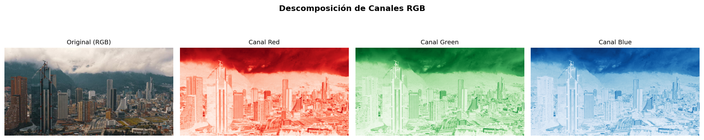

*Descomposición de la imagen en sus canales rojo, verde y azul. Los edificios terracota brillan en el canal rojo, la vegetación de los cerros domina el canal verde, y el cielo nublado es más visible en el canal azul.*

#### Canales HSV

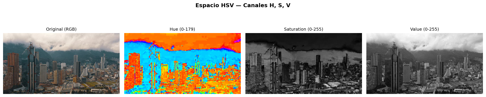

*Espacio HSV. El canal Hue codifica el matiz como un valor numérico (0-179), Saturation indica la pureza del color, y Value la luminosidad. Las nubes y el cielo nublado tienen saturación baja, mientras que los edificios y la vegetación presentan valores más altos.*

#### Canales LAB

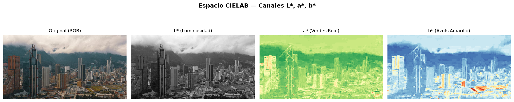

*Espacio CIELAB. L* captura la luminosidad de forma perceptualmente uniforme. El canal a* codifica el eje verde-rojo y b* el eje azul-amarillo.*

#### Comparación general

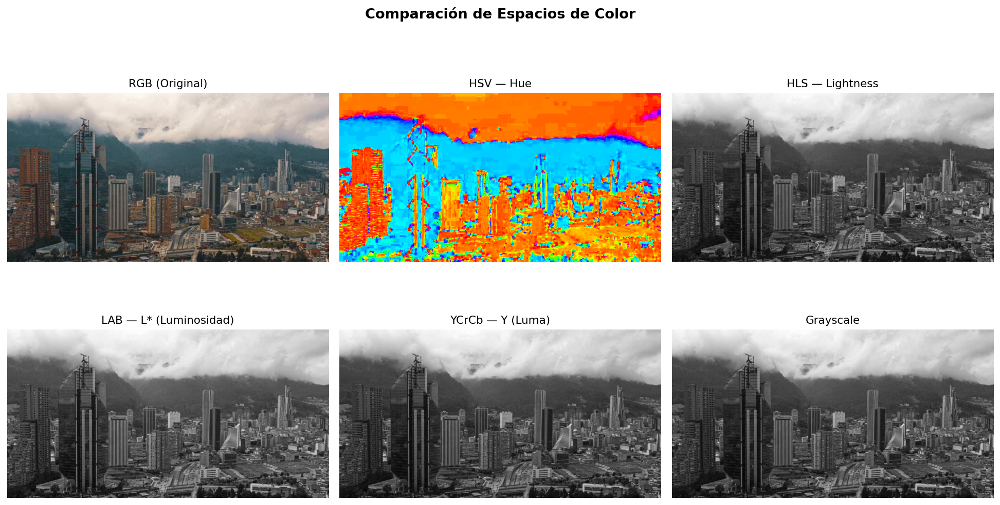

*Vista unificada de la imagen en seis representaciones distintas. Se aprecia cómo cada espacio enfatiza información diferente de la misma imagen.*

### Visualización 3D

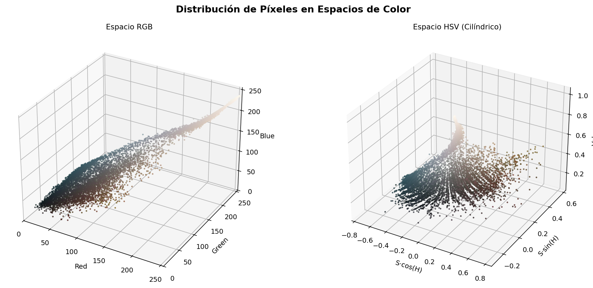

*Distribución de los píxeles de la imagen en espacio RGB (cubo) y HSV (cilindro). En RGB los píxeles se concentran en clusters, mientras que en HSV la representación cilíndrica separa claramente matiz (ángulo) de saturación (radio).*

### Segmentación por color

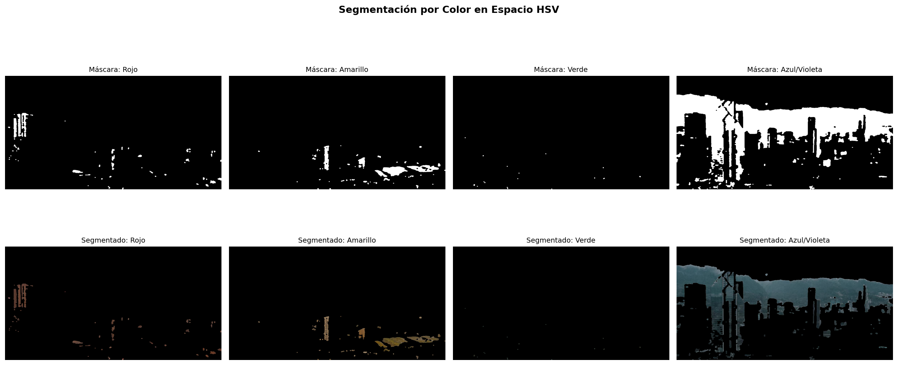

*Segmentación en HSV de cuatro familias de color. El rojo captura las fachadas terracota de los edificios, el amarillo identifica acentos cálidos y algunos techos, el verde aísla la vegetación de los cerros, y el azul/violeta extrae el cielo nublado y las montañas con neblina.*

### Manipulación de color

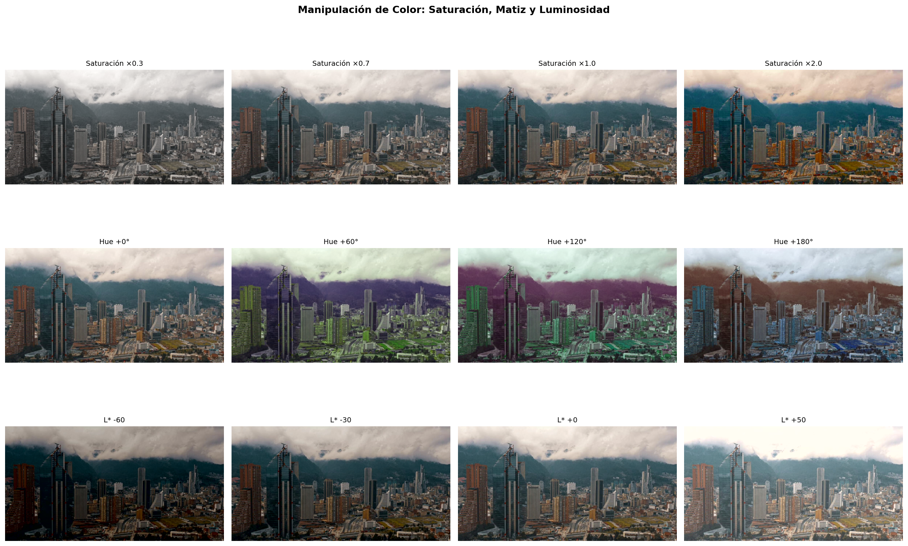

*Tres operaciones de manipulación. Fila 1: saturación desde 0.3× (casi gris) hasta 2.0× (colores intensos). Fila 2: rotación de matiz en pasos de 60°, generando versiones con paletas completamente distintas. Fila 3: ajuste de luminosidad en LAB desde -60 (oscuro) hasta +50 (sobreexpuesto).*

### Color grading

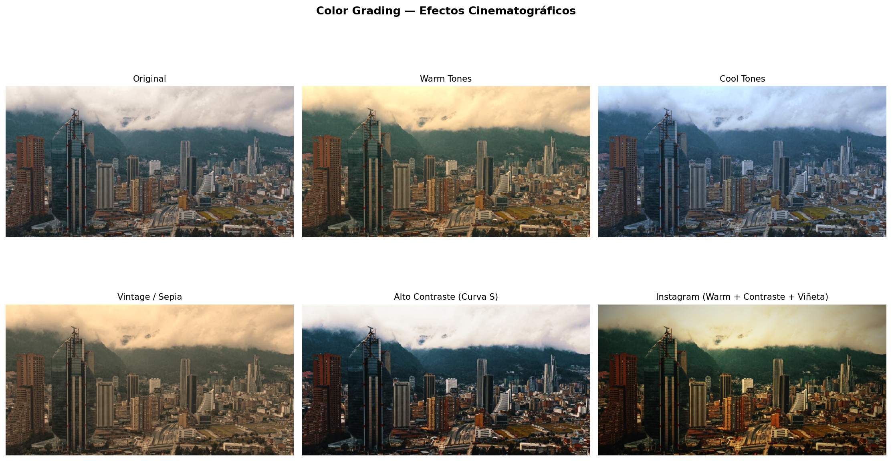

*Seis versiones de la misma imagen con diferentes efectos cinematográficos aplicados mediante LUTs.*

#### Curvas de color

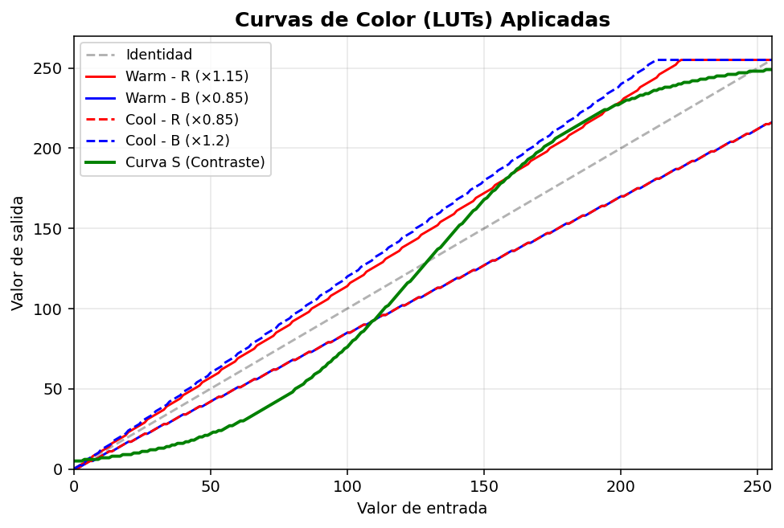

*Las curvas de transferencia (LUTs) utilizadas para cada efecto. La curva S genera alto contraste comprimiendo sombras y highlights. Los offsets por canal generan los tonos cálidos y fríos.*

### Paleta de colores

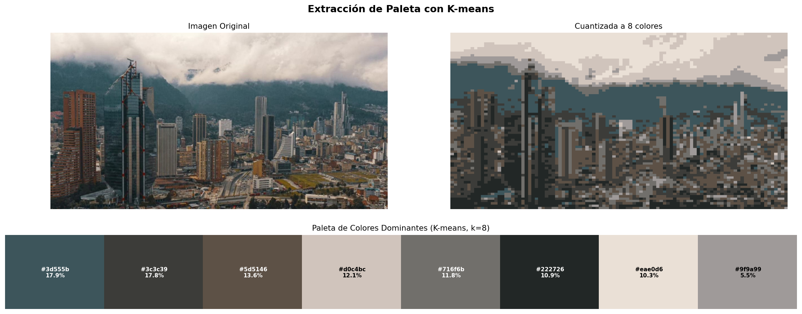

*Extracción de los 8 colores dominantes con K-means. Se muestra la imagen original, la versión cuantizada a 8 colores, y la paleta con valores hexadecimales y porcentaje de presencia.*

#### Armonías cromáticas

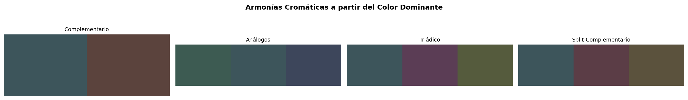

*Armonías cromáticas generadas a partir del color dominante de la imagen, rotando el matiz en HSV.*

### Histogramas y ecualización

#### Histogramas RGB y HSV

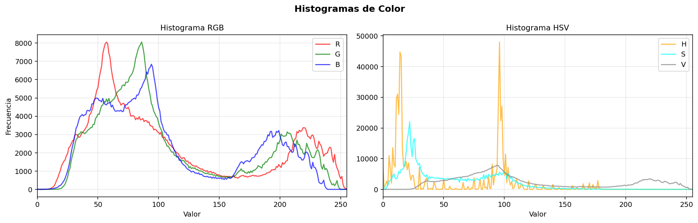

*Histograma RGB: la distribución muestra concentración en medios tonos por el cielo nublado y los edificios. Histograma HSV: la dispersión del Hue refleja la variedad cromática entre los verdes de la montaña, los marrones de los edificios y los grises del cielo.*

#### Ecualización

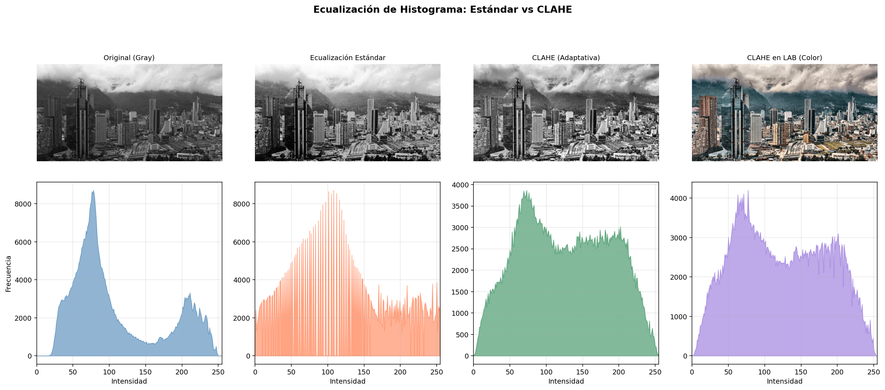

*Comparación entre ecualización estándar y CLAHE. La ecualización estándar redistribuye toda la gama pero puede generar artefactos. CLAHE opera por bloques produciendo un resultado más natural. La última columna muestra CLAHE aplicado solo al canal L de LAB, mejorando contraste sin distorsionar los colores.*

---

## Código relevante

### Segmentación por color en HSV

```python
def segmentacion_por_color(image_bgr):
    hsv = cv2.cvtColor(image_bgr, cv2.COLOR_BGR2HSV)

    # El rojo cruza el punto 0/180 del matiz, requiere dos rangos
    lower_red1 = np.array([0, 80, 80])
    upper_red1 = np.array([10, 255, 255])
    lower_red2 = np.array([170, 80, 80])
    upper_red2 = np.array([179, 255, 255])

    mask = cv2.inRange(hsv, lower_red1, upper_red1)
    mask |= cv2.inRange(hsv, lower_red2, upper_red2)

    # Limpieza morfológica
    kernel = cv2.getStructuringElement(cv2.MORPH_ELLIPSE, (5, 5))
    mask = cv2.morphologyEx(mask, cv2.MORPH_CLOSE, kernel)
    mask = cv2.morphologyEx(mask, cv2.MORPH_OPEN, kernel)

    result = cv2.bitwise_and(image_bgr, image_bgr, mask=mask)
    return mask, result
```

### Color grading con LUTs

```python
def apply_lut_curve(img, lut_r, lut_g, lut_b):
    """Aplica curvas de color independientes por canal RGB."""
    result = img.copy()
    result[..., 0] = lut_r[result[..., 0]]
    result[..., 1] = lut_g[result[..., 1]]
    result[..., 2] = lut_b[result[..., 2]]
    return result

# Curva S para alto contraste (sigmoide)
x = np.arange(256)
s_curve = (255 * (1 / (1 + np.exp(-0.03 * (x - 128))))).astype(np.uint8)
contrast_img = apply_lut_curve(rgb, s_curve, s_curve, s_curve)
```

### Extracción de paleta con K-means

```python
from sklearn.cluster import KMeans

pixels = image_rgb.reshape(-1, 3).astype(np.float32)
kmeans = KMeans(n_clusters=8, random_state=42, n_init=10)
kmeans.fit(pixels)

# Centroides = colores dominantes
dominant_colors = kmeans.cluster_centers_.astype(np.uint8)

# Frecuencia de cada color
counts = np.bincount(kmeans.labels_)
sorted_idx = np.argsort(-counts)
dominant_colors = dominant_colors[sorted_idx]
```

### Ecualización CLAHE en espacio LAB

```python
# CLAHE solo en el canal L para preservar color
lab = cv2.cvtColor(image_bgr, cv2.COLOR_BGR2LAB)
clahe = cv2.createCLAHE(clipLimit=3.0, tileGridSize=(8, 8))
lab[..., 0] = clahe.apply(lab[..., 0])
result = cv2.cvtColor(lab, cv2.COLOR_LAB2BGR)
```

---

## Prompts utilizados

IDE, prompts y autocompletado: Antigravity

Se utilizó Antigravity para consultas puntuales sobre rangos de valores y sintaxis:

```
"¿Cuáles son los rangos de H, S, V en OpenCV para segmentar rojo?"

"Cómo aplicar CLAHE solo al canal L de LAB sin afectar el color"

"Explica la diferencia entre ecualización estándar y adaptativa"

"¿Cómo generar armonías cromáticas complementarias a partir de un valor HSV?"
```

---

## Aprendizajes y dificultades

### Aprendizajes

El aprendizaje más importante fue entender que cada espacio de color está diseñado para resolver un problema distinto. RGB es el espacio nativo de las pantallas pero es terrible para segmentar o manipular color de forma intuitiva. HSV resuelve la segmentación de forma elegante porque el matiz H codifica "qué color es" independientemente de cuánta luz hay. LAB es el espacio que mejor respeta la percepción humana, lo que lo hace ideal para ajustar luminosidad sin generar artefactos cromáticos.

También quedó clara la potencia de las LUTs como herramienta de color grading: son simplemente arrays de 256 valores que funcionan como funciones de transferencia, pero permiten generar efectos cinematográficos complejos combinando curvas independientes por canal. La curva sigmoide para contraste es particularmente elegante porque comprime simultáneamente las sombras y los highlights mientras expande los medios tonos.

### Dificultades

La segmentación del rojo fue la parte más compleja porque el rojo en HSV ocupa dos rangos separados: 0-10 y 170-179. Al principio la máscara solo capturaba la mitad de los tonos rojos hasta que se implementó la unión de dos `cv2.inRange`. También hubo que calibrar los umbrales de saturación y valor mínimos para no capturar grises como falsos positivos.

En la extracción de paleta con K-means, la convergencia dependía mucho de la inicialización. Con `n_init=10` se obtuvieron resultados estables, pero con valores menores los colores dominantes cambiaban entre ejecuciones. También fue necesario redimensionar la imagen antes del clustering para evitar tiempos de cómputo excesivos.

### Mejoras futuras

Sería interesante implementar color transfer entre imágenes usando las estadísticas de LAB (media y desviación estándar por canal), y también agregar simulación de daltonismo transformando los colores según los modelos de deficiencia de visión (protanopia, deuteranopia, tritanopia). Otra mejora sería implementar histogram matching para transferir la distribución de intensidades de una imagen de referencia a otra.

---

## Contribuciones grupales

- Juan Jose Alvarez: Desarrollo Python completo (módulos de conversión, segmentación, grading, paletas)
- Jose Arturo Herrera Rivera: Generación de imagen de prueba y captura de resultados visuales
- Manuel Santiago Mori Ardila: Investigación de espacios de color y documentación del README
- Victor Saa: Revisión de código y análisis de histogramas
- Juan Pablo Correa: Pruebas de segmentación y calibración de rangos HSV

---

## Estructura del proyecto

```
semana_4_4_conversion_espacios_color/
├── python/
│   ├── main.py                 # Módulo principal con todas las implementaciones
│   ├── generate_test_image.py  # Generador de imagen de prueba (alternativa)
│   ├── requirements.txt        # Dependencias de Python
│   └── test_image.png          # Fotografía de Bogotá utilizada como entrada
├── media/                      # Imágenes de resultados
└── README.md                   # Este archivo
```

---

## Referencias

- Documentación oficial de OpenCV — Color Conversions: https://docs.opencv.org/4.x/d8/d01/group__imgproc__color__conversions.html
- OpenCV — Histograms: https://docs.opencv.org/4.x/d1/db7/tutorial_py_histogram_begins.html
- scikit-learn — KMeans Clustering: https://scikit-learn.org/stable/modules/generated/sklearn.cluster.KMeans.html
- scikit-image — Color Module: https://scikit-image.org/docs/stable/api/skimage.color.html
- Wikipedia — CIELAB Color Space: https://en.wikipedia.org/wiki/CIELAB_color_space
- Learn OpenCV — Color Spaces: https://learnopencv.com/color-spaces-in-opencv-cpp-python/

---

## Checklist de entrega

- [ ] Carpeta con nombre `semana_4_4_conversion_espacios_color`
- [ ] Código limpio y funcional en carpetas por entorno
- [ ] GIFs/imágenes incluidos con nombres descriptivos en carpeta `media/`
- [ ] README completo con todas las secciones requeridas
- [ ] Mínimo 2 capturas/GIFs por implementación
- [ ] Commits descriptivos en inglés
- [ ] Repositorio organizado y público

---
