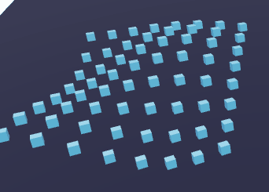
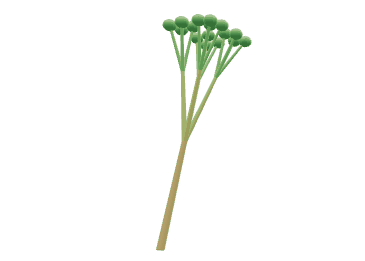
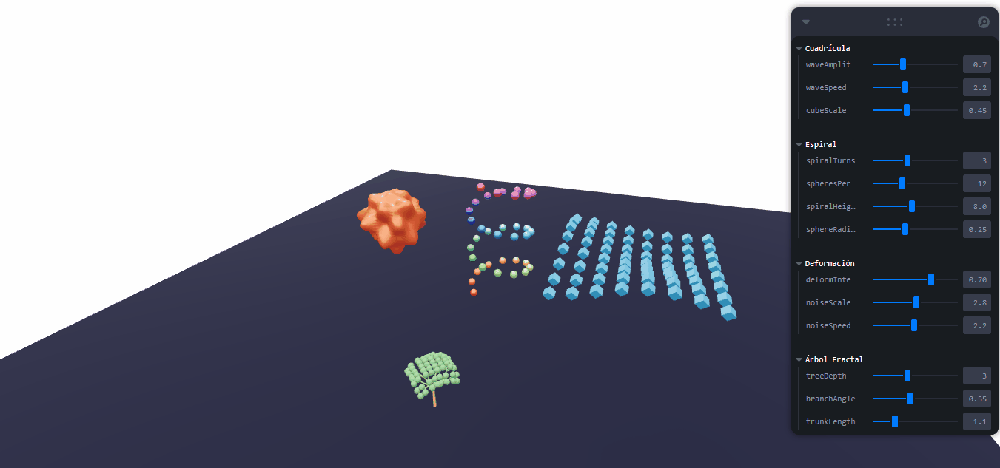

# Taller Modelado Procedural Básico: Geometría desde Código

**Estudiantes:** Manuel Santiago Mori Ardila, Jose Arturo Herrera Rivera

**Fecha de entrega:** 28/03/2026

## Descripción

Generación de modelos 3D mediante algoritmos, sin modelado manual. Se explora la creación y manipulación de geometría desde código para construir estructuras dinámicas y animadas.

## Implementaciones

### Unity

Tres scripts de geometría procedural en C#:

1. **ProceduralGenerator:** Genera rejilla de cubos (5x5 con animación de ola), espiral de cilindros (20 elementos con colores HSV) y pirámide personalizada construida con `Mesh`, `Vector3[]` y `int[]`.

2. **FractalTree:** Árbol fractal recursivo usando `CreatePrimitive(Cylinder)` con 4 ramas por nivel y esferas como hojas.

3. **DeformableMesh:** Deformación en tiempo real de `Mesh.vertices` usando funciones sinusoidales como ruido procedural.

```csharp
// Malla personalizada con vértices y triángulos
Vector3[] vertices = new Vector3[] {
    new Vector3(-s, 0, -s), new Vector3(s, 0, -s),
    new Vector3(s, 0, s), new Vector3(-s, 0, s),
    new Vector3(0, h, 0)
};
int[] triangles = new int[] { 0, 2, 1, 0, 3, 2, 5, 9, 6, 6, 10, 7, 7, 11, 8, 8, 12, 5 };
mesh.vertices = vertices;
mesh.triangles = triangles;
mesh.RecalculateNormals();
```

### Three.js

Cuatro componentes en React Three Fiber:

1. **AnimatedGrid:** `InstancedMesh` de 8x8 cubos con animación sinusoidal de ola.

2. **Spiral:** Esferas en espiral 3D con colores HSL por posición.

3. **DeformableSphere:** Manipulación directa de `bufferGeometry.attributes.position.array` con recálculo de normales por frame.

4. **FractalTree:** Árbol recursivo con profundidad y ángulos configurables via Leva.

```tsx
// Deformación de vértices en tiempo real
for (let i = 0; i < positions.length; i += 3) {
    const noise = Math.sin(ox * noiseScale + time * noiseSpeed) *
                  Math.cos(oy * noiseScale + time * noiseSpeed);
    positions[i] = ox + (ox / length) * noise * deformIntensity;
}
geometry.attributes.position.needsUpdate = true;
geometry.computeVertexNormals();
```

## IA

IDE, prompts y autocompletado: GitHub Copilot

## Resultados Visuales

### Three.js







### Unity


## Prompts Utilizados

- "Cómo puedo crear geometría procedural en React Three Fiber que genere una cuadrícula de cubos animados con efecto de ola, y también manipular los vértices de una esfera en tiempo real usando bufferGeometry.attributes.position"
- "Necesito crear objetos 3D desde código en Unity usando CreatePrimitive y también construir una malla personalizada definiendo los vértices y triángulos manualmente con la clase Mesh"

## Aprendizajes

- La relación vértices-triángulos-normales es fundamental para crear mallas correctas desde código.
- Modificar `bufferGeometry.attributes.position.array` (Three.js) o `Mesh.vertices` (Unity) permite deformaciones en tiempo real; es necesario recalcular normales después.
- La recursividad permite generar estructuras fractales complejas con código simple; el control de profundidad máxima es crucial para rendimiento.
- `InstancedMesh` (Three.js) reduce draw calls significativamente para objetos repetidos.

## Estructura del Proyecto

```
semana_5_2_modelado_procedural_basico/
├── unity/
│   └── Assets/Scripts/
│       ├── ProceduralGenerator.cs
│       ├── FractalTree.cs
│       └── DeformableMesh.cs
├── threejs/
│   └── src/
│       └── App.tsx
├── media/
└── README.md
```

---

## Referencias

- Unity Mesh API: https://docs.unity3d.com/ScriptReference/Mesh.html
- Three.js BufferGeometry: https://threejs.org/docs/#api/en/core/BufferGeometry
- React Three Fiber: https://docs.pmnd.rs/react-three-fiber/
- Leva UI Controls: https://leva.pmnd.rs/

---
