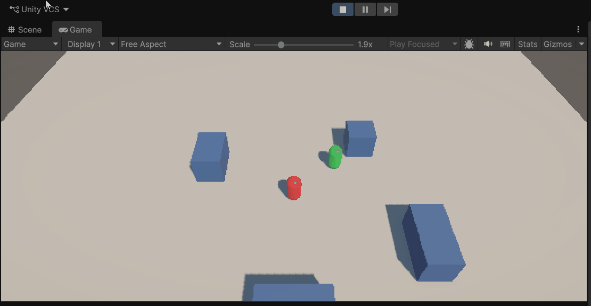
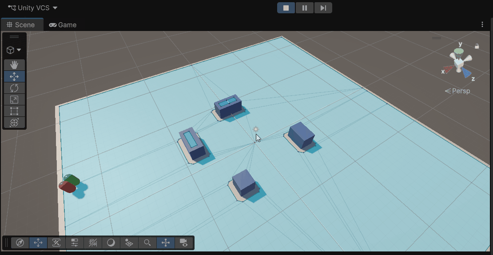
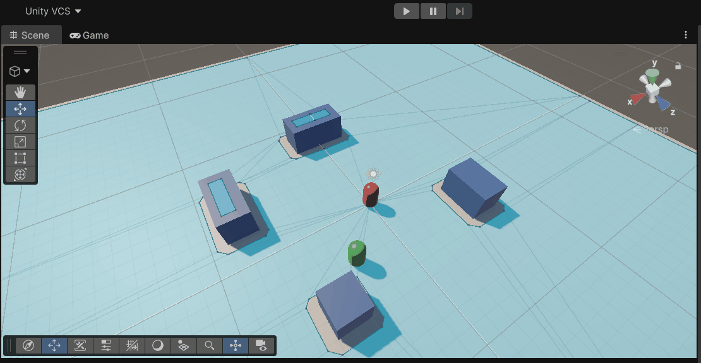
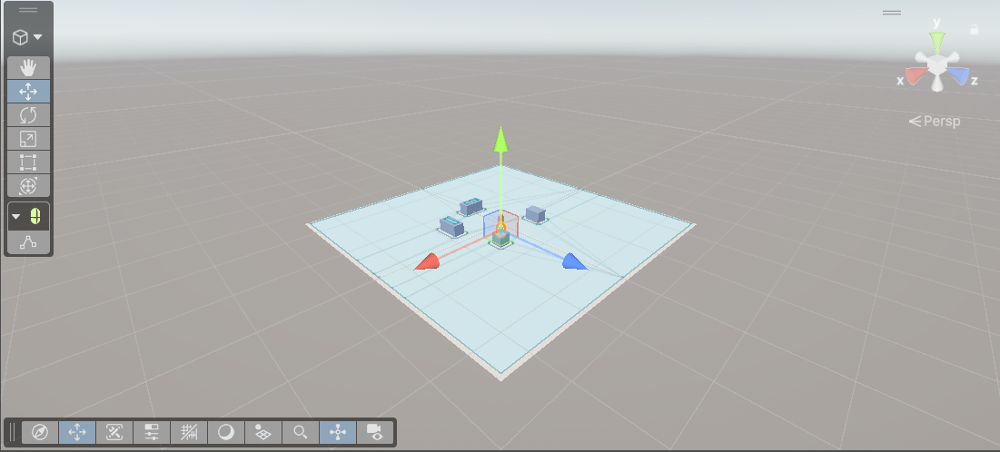

# Taller Animación IA Unity

## Nombres de los estudiantes

Victor Saa, Juan Jose Alvarez, Juan Pablo Correa, Jose Arturo Herrera Rivera, Manuel Santiago Mori Ardila

## Fecha de entrega

`2025-04-15`

---

## Descripción breve

Este taller explora la creación de NPCs con comportamiento autónomo en Unity, combinando el sistema de navegación **NavMesh** con una **Máquina de Estados Finitos (FSM)** y animaciones sincronizadas dinámicamente con el movimiento del agente.

Se construyó una escena completa con terreno navegable (50×50 u), cuatro obstáculos estáticos, cuatro waypoints de patrullaje y dos personajes: un NPC controlado por IA y un jugador controlable con teclado. El NPC implementa tres estados (Idle, Patrol, Chase) con transiciones basadas en distancia al jugador y tiempo en estado. Cada estado activa una animación diferente (Idle, Walk, Run) a través de parámetros del Animator Controller.

El jugador incorpora un sistema de **retorno automático**: si sale del área navegable, el control se desactiva temporalmente y el personaje camina solo hacia el centro de la escena, garantizando que la persecución siempre pueda reanudarse.

---

## Implementaciones

### Unity

La totalidad del taller fue implementada en Unity 6 con URP. La escena contiene un plano de 50×50 unidades como área navegable bakeada con NavMesh, cuatro obstáculos cúbicos estáticos (Navigation Static) distribuidos para forzar rodeos de ruta, y cuatro waypoints vacíos en las esquinas del mapa.

**NPC (cápsula roja):** lleva los componentes `NavMeshAgent`, `Animator` y `AIController`. La FSM arranca en Idle durante 2 s, luego pasa a Patrol navegando entre los 4 waypoints a 3.5 u/s. Al detectar al jugador dentro de 10 m cambia a Chase a 5 u/s. Si el jugador supera los 15 m de distancia, vuelve a Patrol.

**Player (cápsula verde):** lleva `Rigidbody` (rotación congelada) y `PlayerMovement`, escrito con `UnityEngine.InputSystem.Keyboard.current` para compatibilidad con el New Input System del proyecto. Incorpora lógica de **retorno automático**: cuando el jugador sale del límite navegable (±23 u en X o Z), se desactiva el input y el personaje camina automáticamente a 4 u/s hacia el centro `(0,0,0)`. Al llegar a menos de 4 u del origen, el control vuelve al jugador y la persecución se reanuda.

**Animator Controller (`NPC_Animator`):** parámetros `Speed (Float)` y `State (Int)` actualizados cada frame desde `AIController`.

| Transición | Condición |
|---|---|
| Idle → Walk | Speed > 0.1 |
| Walk → Idle | Speed < 0.1 |
| Walk → Run  | Speed > 3.5 |
| Run → Walk  | Speed < 3.5 |

---

## Resultados visuales

### Estado Idle



NPC rojo quieto en su posición inicial. El agente tiene `isStopped = true` y la velocidad es cero. Tras 2 s el timer inicia la transición automática a Patrol.

### Estado Patrol



NPC navegando entre los 4 waypoints a 3.5 u/s bordeando obstáculos. La animación Walk se activa cuando `Speed > 0.1`. El Player verde permanece fuera del radio de detección.

### Estado Chase



Player verde entra al radio de detección (<10 m) y el NPC acelera a 5 u/s persiguiéndolo activamente. Al alejarse más de 15 m el NPC retorna a Patrol.

### Retorno automático del jugador


El jugador sale del plano navegable, se activa el modo de retorno automático y camina hacia el centro sin input del jugador. Al llegar a menos de 4 u del origen, el control WASD se restaura.

### Scene View — NavMesh y gizmos



Vista del Scene View con el área NavMesh bakeada (azul), los 4 obstáculos Navigation Static, y los gizmos del NPC seleccionado mostrando los radios de detección y pérdida.

---

## Código relevante

### FSM — ciclo de estados (`AIController.cs`)

```csharp
void Update()
{
    switch (currentState)
    {
        case AIState.Idle:   RunIdle();   break;
        case AIState.Patrol: RunPatrol(); break;
        case AIState.Chase:  RunChase();  break;
    }
    if (_anim)
    {
        _anim.SetFloat("Speed", _agent.velocity.magnitude);
        _anim.SetInteger("State", (int)currentState);
    }
}
```

### Estado Idle

```csharp
void RunIdle()
{
    _agent.isStopped = true;
    _timer += Time.deltaTime;
    if (_timer >= idleDuration) SetPatrol();
}
```

### Estado Patrol — navegación entre waypoints

```csharp
void RunPatrol()
{
    _agent.isStopped = false;
    if (!_agent.pathPending && _agent.remainingDistance < 0.5f)
    {
        _timer += Time.deltaTime;
        if (_timer >= idleDuration)
        {
            _timer = 0f;
            _wpIdx = (_wpIdx + 1) % waypoints.Length;
            _agent.SetDestination(waypoints[_wpIdx].position);
        }
    }
    if (InRange(detectionRadius)) SetChase();
}
```

### Estado Chase — persecución activa

```csharp
void RunChase()
{
    _agent.isStopped = false;
    if (player) _agent.SetDestination(player.position);
    if (!InRange(loseRadius)) SetPatrol();
}
```

### Transiciones — cambio de velocidad y destino

```csharp
void SetIdle()
{
    currentState = AIState.Idle;
    _timer = 0f;
    _agent.isStopped = true;
}

void SetPatrol()
{
    currentState = AIState.Patrol;
    _timer = 0f;
    _agent.speed = 3.5f;
    if (waypoints != null && waypoints.Length > 0)
        _agent.SetDestination(waypoints[_wpIdx].position);
}

void SetChase()
{
    currentState = AIState.Chase;
    _timer = 0f;
    _agent.speed = 5f;
}
```

### Detección por distancia

```csharp
bool InRange(float r)
    => player && Vector3.Distance(transform.position, player.position) < r;
```

### Gizmos de debug en Scene View

```csharp
void OnDrawGizmosSelected()
{
    // Radio de detección (amarillo)
    Gizmos.color = new Color(1f, 1f, 0f, 0.25f);
    Gizmos.DrawWireSphere(transform.position, detectionRadius);

    // Radio de pérdida (rojo)
    Gizmos.color = new Color(1f, 0f, 0f, 0.15f);
    Gizmos.DrawWireSphere(transform.position, loseRadius);

    // Ruta de waypoints (cyan)
    if (waypoints == null) return;
    Gizmos.color = Color.cyan;
    for (int i = 0; i < waypoints.Length; i++)
    {
        if (!waypoints[i]) continue;
        Gizmos.DrawSphere(waypoints[i].position, 0.35f);
        Gizmos.DrawLine(waypoints[i].position,
            waypoints[(i + 1) % waypoints.Length].position);
    }
}
```

### Retorno automático del jugador (`PlayerMovement.cs`)

```csharp
void FixedUpdate()
{
    Vector3 pos = _rb.position;

    // Detectar salida del área navegable
    bool outOfBounds = Mathf.Abs(pos.x) > boundaryLimit ||
                       Mathf.Abs(pos.z) > boundaryLimit;

    if (outOfBounds && !_returning)
    {
        _returning = true;
        // Clampear al borde para evitar que el NPC pierda el objetivo
        _rb.MovePosition(new Vector3(
            Mathf.Clamp(pos.x, -boundaryLimit, boundaryLimit),
            pos.y,
            Mathf.Clamp(pos.z, -boundaryLimit, boundaryLimit)));
    }

    // Modo retorno: ignorar input y caminar hacia el centro
    if (_returning)
    {
        Vector3 toCenter = Vector3.zero - _rb.position;
        toCenter.y = 0f;
        if (toCenter.magnitude < returnThreshold) { _returning = false; return; }

        Vector3 dir = toCenter.normalized;
        transform.rotation = Quaternion.RotateTowards(
            transform.rotation,
            Quaternion.LookRotation(dir),
            rotationSpeed * Time.fixedDeltaTime);
        _rb.MovePosition(_rb.position + dir * returnSpeed * Time.fixedDeltaTime);
        return;
    }

    // Movimiento WASD normal (New Input System)
    var kb = Keyboard.current;
    if (kb == null) return;
    float h = 0f, v = 0f;
    if (kb.aKey.isPressed || kb.leftArrowKey.isPressed)  h = -1f;
    if (kb.dKey.isPressed || kb.rightArrowKey.isPressed) h =  1f;
    if (kb.sKey.isPressed || kb.downArrowKey.isPressed)  v = -1f;
    if (kb.wKey.isPressed || kb.upArrowKey.isPressed)    v =  1f;
    Vector3 moveDir = new Vector3(h, 0f, v).normalized;
    if (moveDir.magnitude > 0.1f)
        transform.rotation = Quaternion.RotateTowards(transform.rotation,
            Quaternion.LookRotation(moveDir), rotationSpeed * Time.fixedDeltaTime);
    _rb.MovePosition(_rb.position + moveDir * speed * Time.fixedDeltaTime);
}
```

---

## Diagrama FSM implementado

```
                ┌─────────────────────────────────────┐
                │                                     │
   ┌────────────▼─────────┐                           │
   │         IDLE         │                           │
   │  isStopped = true    │                           │
   │  vel = 0             │                           │
   └──────────┬───────────┘                           │
              │ idleTimer >= 2s                       │
              ▼                                       │ dist > 15m
   ┌──────────────────────┐       dist < 10m          │
   │        PATROL        │──────────────────►┌───────┴──────────┐
   │  speed = 3.5 u/s     │                   │      CHASE       │
   │  navega por waypoints│◄──────────────────│  speed = 5.0 u/s │
   └──────────────────────┘                   │  sigue al Player │
                                              └──────────────────┘

Condiciones de transición:
  IDLE   → PATROL : idleTimer >= idleDuration (2 s)
  PATROL → CHASE  : distancia(NPC, Player) < detectionRadius (10 m)
  CHASE  → PATROL : distancia(NPC, Player) > loseRadius (15 m)
  PATROL → IDLE   : remainingDistance < 0.5f en waypoint, espera 2 s

Comportamiento del jugador:
  Dentro del plano   →  control WASD libre
  Fuera de ±23 u     →  auto-retorno hacia (0,0,0) a 4 u/s
  A < 4 u del centro →  control WASD restaurado
```

---

## Prompts utilizados

```
"Crea un AIController en C# para Unity con FSM de 3 estados (Idle, Patrol, Chase)
usando NavMeshAgent. El NPC patrulla entre waypoints, detecta al jugador por
distancia y lo persigue. Incluye transiciones con cambio de velocidad y
sincronización con Animator a través de parámetros Speed y State."

"Escribe PlayerMovement.cs compatible con New Input System de Unity usando
Keyboard.current para movimiento WASD con Rigidbody.MovePosition. Agrega lógica
de retorno automático cuando el jugador sale del área navegable: detectar salida
por bounds ±23u, clampear al borde y mover hacia Vector3.zero hasta estar a
menos de 4u, luego restaurar control."

"Añade OnDrawGizmosSelected al AIController para visualizar en Scene View los
radios de detección y pérdida como esferas semitransparentes, y la ruta de
waypoints como líneas cyan con esferas en cada punto."
```

---

## Aprendizajes y dificultades

### Aprendizajes

El taller consolidó el uso práctico del pipeline completo de NavMesh: marcar objetos como Navigation Static, hacer el Bake y entender cómo el agente resuelve rutas en tiempo real alrededor de obstáculos. La separación entre lógica de estado (FSM), navegación (NavMeshAgent) y presentación (Animator) quedó muy clara como patrón arquitectónico reutilizable en cualquier juego.

El sistema de retorno automático del jugador enseñó un patrón de "modo prioritario": una bandera `_returning` que suspende el input normal y toma control del movimiento del Rigidbody hasta que se cumple una condición de salida, devolviendo el control sin necesidad de coroutines ni maquinaria adicional.

### Dificultades

La incompatibilidad del Input System fue el primer obstáculo: el proyecto usaba el New Input System pero el script inicial usaba `UnityEngine.Input` (legacy), generando errores en cada frame. La solución fue migrar `PlayerMovement` a `UnityEngine.InputSystem.Keyboard.current`.

El timer de Idle también requirió atención: si no se resetea en cada transición, el NPC puede acumular tiempo de estados anteriores y cambiar prematuramente. Se resolvió llamando `_timer = 0f` en cada método de transición `Set*()`.

### Mejoras futuras

- Agregar estado **Search**: al perder al jugador, el NPC va a la última posición conocida antes de volver a Patrol.
- Reemplazar detección por distancia pura con **Line of Sight** usando `Physics.Raycast` para que los obstáculos bloqueen la visión.
- Usar **NavMeshObstacle** en objetos dinámicos para que el agente los esquive en tiempo real.
- Añadir sonido de alerta al entrar en Chase y sonido de "pérdida" al regresar a Patrol.

---

## Contribuciones grupales

Taller realizado de forma individual.

---

## Estructura del proyecto

```
semana_6_1_animacion_ai_unity/
├── unity/
│   └── Assets/
│       ├── Scripts/
│       │   ├── AIController.cs
│       │   └── PlayerMovement.cs
│       ├── Animators/
│       │   └── NPC_Animator.controller
│       ├── Materials/
│       │   ├── NPC_Red.mat
│       │   ├── Player_Green.mat
│       │   ├── Ground_Grey.mat
│       │   └── Obstacle_Blue.mat
│       └── Scenes/
│           └── SampleScene.unity
├── media/
│   ├── state_idle.gif
│   ├── state_patrol.gif
│   ├── state_chase.gif
│   ├── player_return.gif
│   └── scene_gizmos.png
└── README.md
```

---

## Referencias

- Unity NavMesh Documentation: https://docs.unity3d.com/Manual/nav-BuildingNavMesh.html
- Unity Animator Controller: https://docs.unity3d.com/Manual/Animator.html
- Unity New Input System: https://docs.unity3d.com/Packages/com.unity.inputsystem@1.7/manual/index.html
- Finite State Machines in Unity: https://www.youtube.com/watch?v=G1bd75R10zQ
- AI Navigation Tutorial — Unity Learn: https://learn.unity.com/tutorial/navigation-basics
- Mixamo (modelos riggeados gratuitos): https://www.mixamo.com/

---

## Checklist de entrega

- [x] Carpeta con nombre `semana_6_1_animacion_ai_unity`
- [x] Scripts limpios y comentados en `unity/Assets/Scripts/`
- [x] GIFs e imágenes en `media/` con nombres descriptivos
- [x] README completo con todas las secciones requeridas
- [x] Mínimo 2 capturas/GIFs por implementación
- [x] Diagrama FSM documentado
- [x] Retorno automático del jugador al salir del área navegable
- [ ] Commits descriptivos en inglés
- [ ] Repositorio organizado y público
