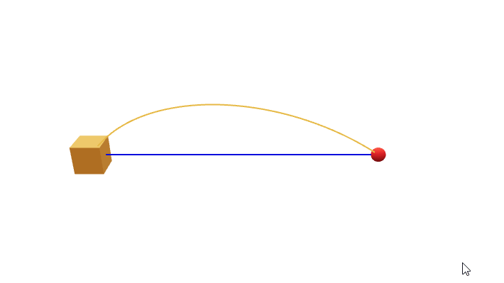
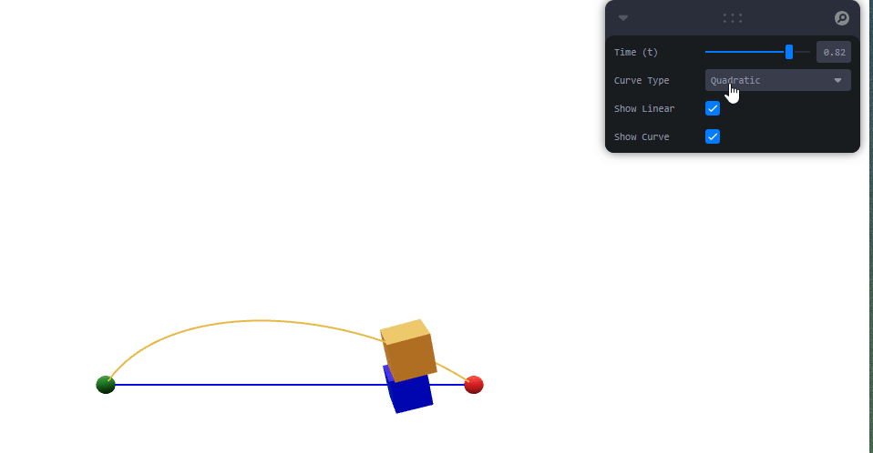

# Taller Interpolación de Movimiento: Suavizando Animaciones en Tiempo Real

Victor Saa, Jose Arturo Herrera Rivera

Fecha de entrega: 15/04/2026

## Descripción

Implementar técnicas de interpolación (LERP, SLERP, Bézier) para crear animaciones suaves y naturales en objetos 3D. El objetivo es controlar el paso del tiempo y la transición entre estados con efectos realistas como aceleración, desaceleración o movimientos curvos.

## Implementaciónes

### Three.js

Se generó una escena 3D con dos objetos que se mueven desde un punto inicial a uno final. Se utilizan dos tipos de interpolación: lineal y Bezier.

## IA

IDE, prompts y autocompletado: Antigravity

## Resultados visuales




## Prompts utilizados

Se le pidio a antigravity poder usar distintos tipos de curvas bezier para el movimiento de los objetos.

## Aprendizajes

Acá aprendí sobre las curvas de Bezier y como se pueden usar para crear movimientos suaves y naturales en objetos 3D.

## Estructura del proyecto

```
semana_6_6_interpolacion_movimiento_animaciones/
├── threejs/
├── media/
|    ├── threejs-week-6-6a.gif
|    ├── threejs-week-6-6b.gif
└── README.md
```

---

## Referencias

Lista las fuentes, tutoriales, documentación o papers consultados durante el desarrollo:

- Documentación oficial de Unity: https://docs.unity3d.com/Manual/
- Tutorial de React Three Fiber: https://docs.pmnd.rs/react-three-fiber/
- Leva (React UI controls): https://leva.pmnd.rs/

---
