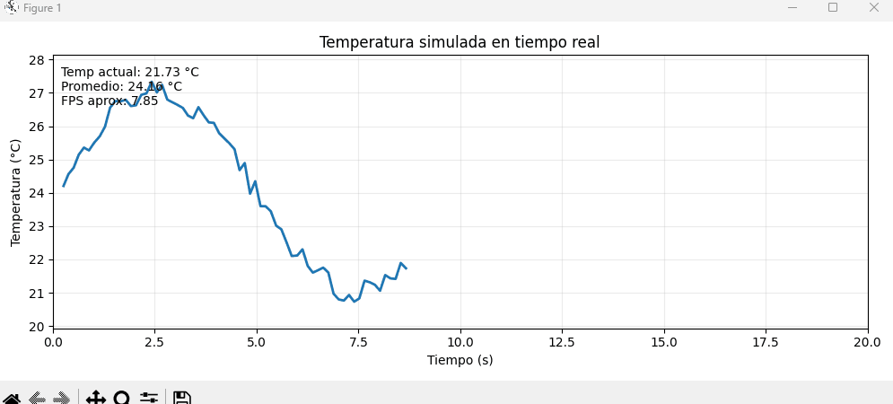
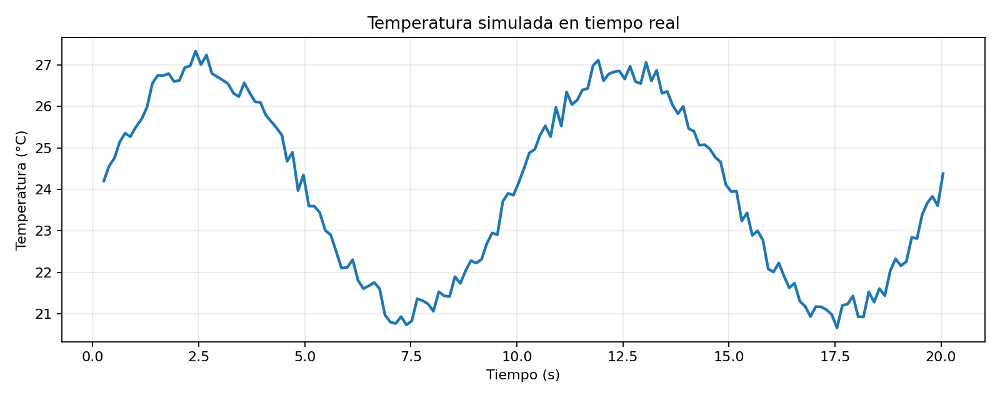
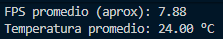

# Taller Visualizacion Datos Tiempo Real Graficas

**Nombre de los estudiantes:**
 Victor Saa, Juan Jose Alvarez, Juan Pablo Correa, Jose Arturo Herrera Rivera, Manuel Santiago Mori Ardila 

**Fecha de entrega:** 24/04/2026

## Descripcion breve

En esta actividad se implemento una visualizacion en tiempo real en **Python** para una metrica simulada de temperatura.  
El sistema actualiza una grafica de lineas en vivo usando `matplotlib.animation.FuncAnimation()`, y muestra estadisticas en tiempo real (valor actual, promedio y FPS aproximado).

Como parte del **bonus**, al finalizar la ejecucion se exportan automaticamente:
- Un archivo CSV con las muestras (`media/temperatura_tiempo_real.csv`)
- Una imagen PNG con la curva final (`media/grafica_final_temperatura.png`)
- Estadisticas de rendimiento en consola (FPS promedio y promedio de temperatura)

## Implementaciones

### Python

Se desarrollo `python/realtime_grafica.py` con dos modos de ejecucion:

1. **Interactivo (default):** abre una ventana con la grafica actualizandose en vivo.
2. **Headless (`--headless`):** simula datos sin abrir ventana y genera los archivos de salida automaticamente.

La señal simulada usa una base senoidal (`sin`) + ruido para representar cambios realistas en el tiempo.

## Resultados visuales

<!-- > Placeholders minimos requeridos (2 evidencias para la implementacion de Python): -->





## Codigo relevante

Snippet principal de actualizacion en tiempo real:

```python
def actualizar(_frame: int):
    ahora = time.perf_counter()
    elapsed = ahora - inicio
    temperatura = simular_temperatura(elapsed)

    muestras.append(
        Muestra(
            timestamp_iso=datetime.now().isoformat(timespec="milliseconds"),
            elapsed_s=elapsed,
            temperatura_c=temperatura,
        )
    )

    x = np.array([m.elapsed_s for m in muestras], dtype=float)
    y = np.array([m.temperatura_c for m in muestras], dtype=float)
    linea.set_data(x, y)
```

Comando de ejecucion sugerido:

```bash
cd semana_7_11_visualizacion_datos_tiempo_real_graficas/python
pip install -r requirements.txt
python realtime_grafica.py --duration 20 --interval-ms 120
```

Para generar evidencias rapido sin UI:

```bash
python realtime_grafica.py --headless --duration 8 --interval-ms 100
```

## Prompts utilizados

1. "En Matplotlib, cual es la forma mas estable de actualizar una grafica de lineas en tiempo real con `FuncAnimation` sin que aumente demasiado el uso de memoria?"
2. "Como exportar al finalizar una simulacion en vivo tanto un CSV de muestras como un PNG de la curva final en Python?"

## Aprendizajes y dificultades


Se aprendio a conectar una fuente de datos incremental con una visualizacion dinamica, y a mostrar indicadores de rendimiento en paralelo (FPS aproximado y promedio).  
La principal dificultad fue ajustar el intervalo de actualizacion para mantener fluidez visual sin perder estabilidad; se resolvio dejando parametros configurables por linea de comandos.

## Estructura del proyecto

```text
semana_7_11_visualizacion_datos_tiempo_real_graficas/
├── python/
│   ├── realtime_grafica.py
│   └── requirements.txt
├── media/
├── README.md
└── semana_07_11_visualizacion_datos_tiempo_real_graficas.md
```
