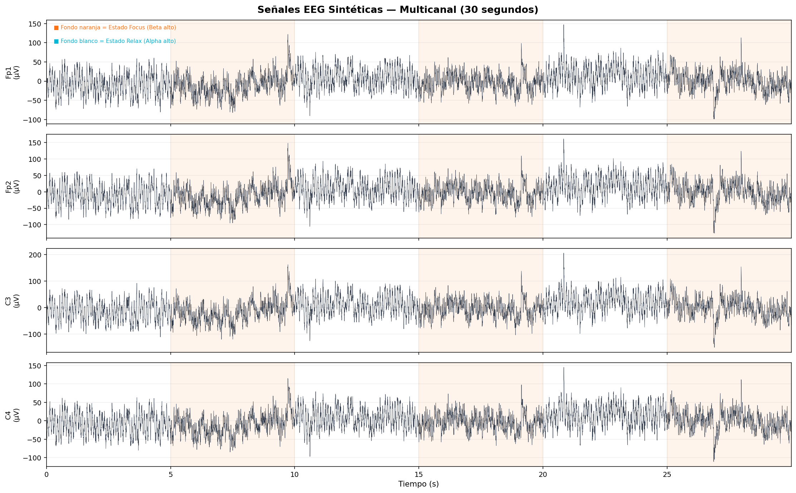
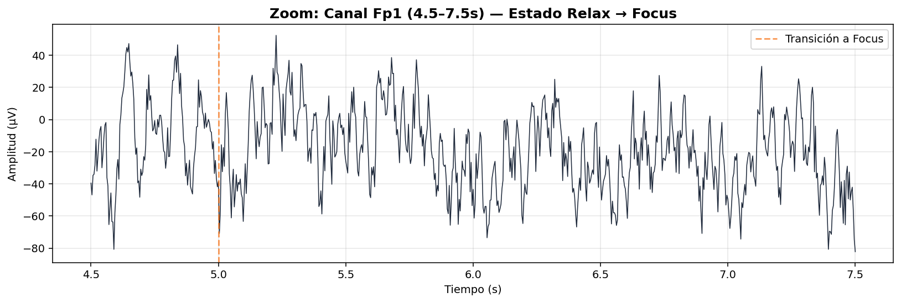
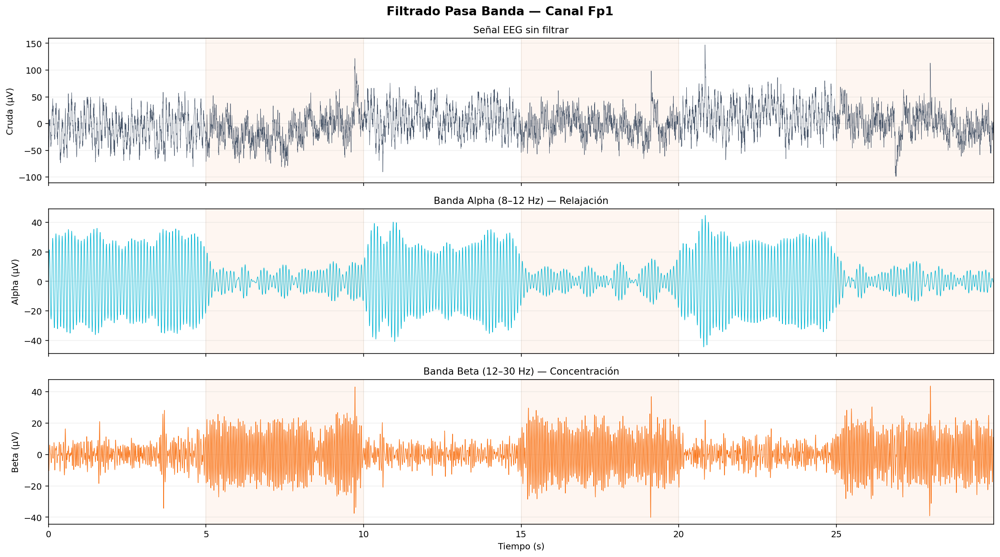
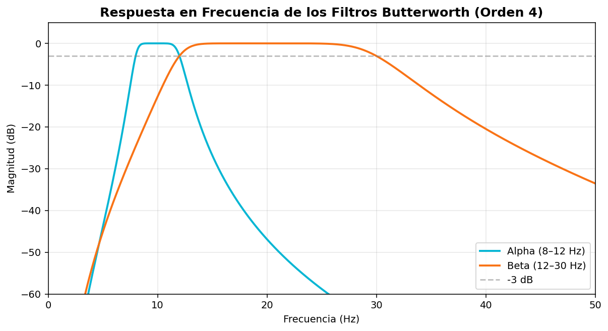
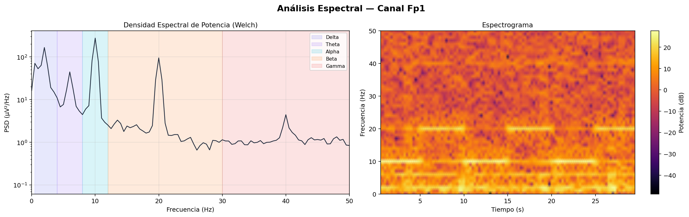
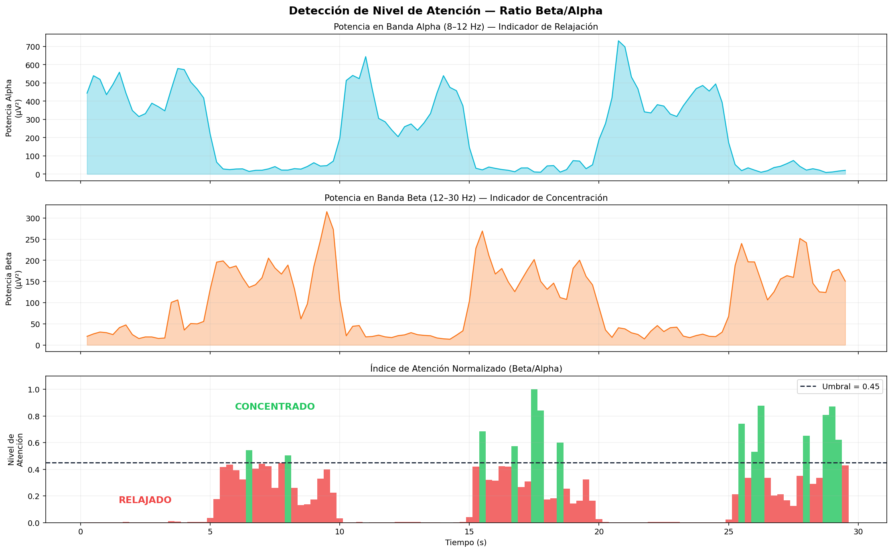
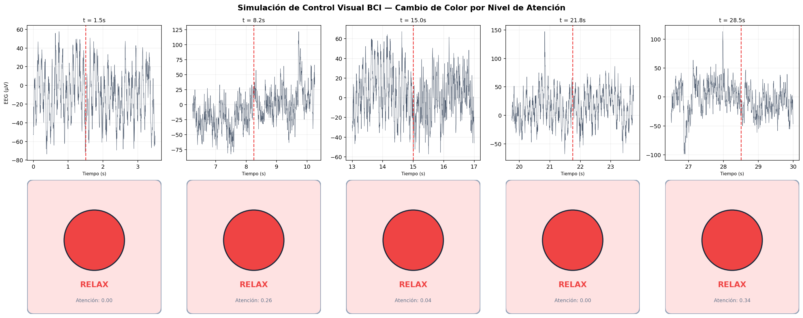
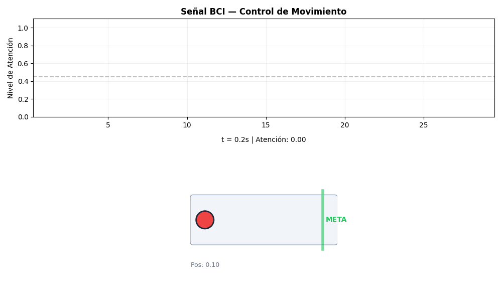
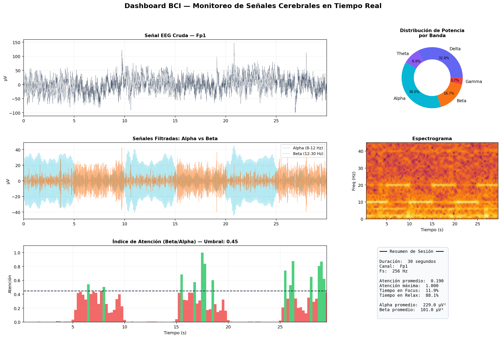
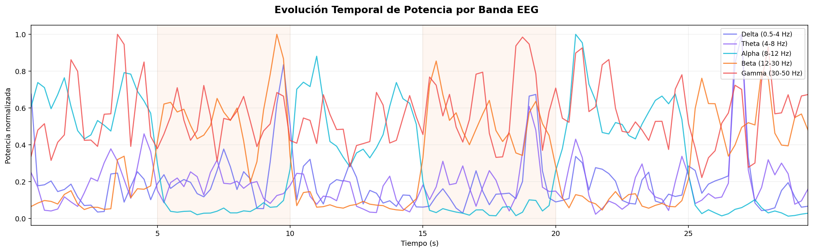

# Taller Bci Simulado Control Visual

Victor Saa, Juan Jose Alvarez, Juan Pablo Correa, Jose Arturo Herrera Rivera, Manuel Santiago Mori Ardila

Fecha de entrega: 2026-04-25

---

## Descripción breve

El objetivo de este taller fue simular el comportamiento de una interfaz cerebro-computadora (BCI) utilizando señales EEG generadas sintéticamente para comprender el procesamiento básico de señales cerebrales. Se generaron señales multicanal con componentes realistas (Delta, Theta, Alpha, Beta, Gamma, ruido rosa y artefactos) que alternan entre estados de relajación (Alpha dominante) y concentración (Beta dominante). Sobre estas señales se aplicaron filtros pasa banda Butterworth para aislar las bandas Alpha (8-12 Hz) y Beta (12-30 Hz), se calculó un índice de atención basado en el ratio Beta/Alpha, y se simuló un sistema de control visual que responde a la actividad cerebral detectada.

La implementación se realizó completamente en Python con NumPy para la generación de señales y cálculos vectoriales, SciPy para el filtrado digital y análisis espectral (Welch, espectrogramas), Pandas para la gestión del dataset en CSV, Matplotlib para todas las visualizaciones, y scikit-learn como dependencia auxiliar. Se generó un dataset de 30 segundos a 256 Hz con 4 canales (Fp1, Fp2, C3, C4) que simula condiciones realistas incluyendo correlación espacial entre electrodos, ruido rosa (1/f) y artefactos por parpadeo.

El resultado principal es un dashboard BCI integrado que muestra en tiempo real la señal cruda, las bandas filtradas, el espectrograma, la distribución de potencia por banda, el índice de atención y un resumen estadístico de la sesión. Además, se implementó una simulación de control de movimiento donde un objeto avanza en pantalla cuando el nivel de atención supera el umbral definido.

---

## Implementaciones

### Python

La implementación cubre el pipeline completo de un sistema BCI desde la adquisición de señales hasta el control visual.

**Generación de señales EEG** (`generate_eeg.py`): Se construye una señal compuesta sumando ondas sinusoidales en cada banda de frecuencia (Delta 2 Hz, Theta 6 Hz, Alpha 10 Hz, Beta 20 Hz, Gamma 40 Hz) con modulaciones de amplitud que alternan en bloques de 5 segundos. En los bloques de relajación la amplitud Alpha se multiplica por 2.5 y la Beta se reduce a 0.5; en los bloques de concentración se invierte: Beta ×2.8, Alpha ×0.4. Las transiciones entre estados se suavizan con rampas de 200ms. Se agrega ruido rosa generado por filtrado espectral de ruido blanco, ruido gaussiano adicional, y artefactos aleatorios que simulan parpadeos (picos exponenciales de 80-150 μV).

**Filtrado pasa banda** (`main.py`): Se implementan filtros Butterworth de orden 4 usando `scipy.signal.butter` y se aplican con `filtfilt` para cero desfase. Se aíslan las bandas Alpha (8-12 Hz) y Beta (12-30 Hz) individualmente. Se verifica la respuesta en frecuencia de cada filtro mostrando la atenuación de -3 dB en las frecuencias de corte.

**Análisis espectral**: Se calcula la densidad espectral de potencia (PSD) con el método de Welch usando segmentos de 2 segundos, y se genera un espectrograma con ventanas de 1 segundo y 75% de solapamiento. Ambos permiten visualizar cómo la energía se distribuye por frecuencia y cómo cambia a lo largo del tiempo según el estado mental simulado.

**Detección de atención**: La potencia en cada banda se calcula como la media del cuadrado de la señal filtrada en ventanas deslizantes de 0.5 segundos con 50% de solapamiento. El índice de atención se define como el ratio Beta/Alpha normalizado a [0, 1]. Cuando este ratio supera el umbral de 0.45, el sistema interpreta que el sujeto está concentrado; cuando está por debajo, se interpreta como relajación.

**Control visual**: Se implementan dos modos de visualización. El primero es un indicador de color tipo semáforo que cambia entre rojo (RELAX) y verde (FOCUS) según el nivel de atención. El segundo es una simulación de movimiento donde un objeto se desplaza por una pista horizontal: cuando hay concentración, el objeto acelera hacia la derecha; cuando hay relajación, desacelera y se detiene gradualmente.

**Dashboard BCI**: Panel integrado que muestra simultáneamente la señal cruda, las señales filtradas Alpha y Beta superpuestas, el espectrograma, un gráfico donut con la distribución de potencia por banda, el índice de atención temporal y un resumen estadístico con métricas de la sesión.

---

## Resultados visuales

### Señales EEG crudas



*Señales EEG multicanal (Fp1, Fp2, C3, C4) durante 30 segundos. El sombreado naranja indica los bloques de estado Focus (Beta alto). Se observan artefactos ocasionales como picos de alta amplitud que simulan parpadeos.*

#### Zoom de señal



*Zoom de 3 segundos sobre el canal Fp1 mostrando la transición del estado Relax a Focus. Se aprecia cómo cambia la composición frecuencial de la señal en la transición.*

### Filtrado pasa banda



*Señal EEG original y sus componentes Alpha (8-12 Hz) y Beta (12-30 Hz) aislados con filtros Butterworth de orden 4. En los bloques de relajación la banda Alpha tiene mayor amplitud, mientras que en los bloques de concentración la banda Beta domina.*

#### Respuesta en frecuencia



*Respuesta en frecuencia de los filtros Butterworth utilizados. Se observa la atenuación de -3 dB en las frecuencias de corte y la pendiente de caída fuera de la banda de paso.*

### Análisis espectral



*Izquierda: PSD por el método de Welch mostrando las bandas de frecuencia sombreadas. Derecha: Espectrograma que revela cómo la distribución de energía por frecuencia varía a lo largo del tiempo, con activación alternante en bandas Alpha y Beta.*

### Detección de atención



*Potencia en bandas Alpha y Beta a lo largo del tiempo (arriba), y el índice de atención normalizado Beta/Alpha (abajo). Las barras verdes indican momentos donde la atención supera el umbral de 0.45 (estado Focus), las rojas indican relajación.*

### Control visual BCI

#### Indicador de color



*Simulación de control visual por cambio de color. Cada columna muestra un instante: la señal EEG en ese momento (arriba) y el indicador resultante (abajo). El color verde indica concentración detectada, el rojo indica relajación.*

#### Control de movimiento



*GIF del sistema de control de movimiento BCI. El objeto (círculo) avanza hacia la meta cuando el nivel de atención supera el umbral. La velocidad de avance es proporcional a la sostenibilidad de la concentración.*

### Dashboard BCI



*Dashboard integrado de monitoreo BCI mostrando simultáneamente: señal cruda, señales filtradas Alpha vs Beta, espectrograma, distribución de potencia por banda (donut), índice de atención temporal y resumen estadístico de la sesión.*

### Potencia por banda



*Evolución temporal de la potencia normalizada en las cinco bandas EEG. Se observa claramente la alternancia entre dominancia Alpha (relajación) y Beta (concentración) a lo largo de la sesión.*

---

## Código relevante

### Generación de señal EEG con modulación de estados

```python
# Componentes base
delta = 20 * np.sin(2 * np.pi * 2 * t)
theta = 10 * np.sin(2 * np.pi * 6 * t)
alpha = 15 * np.sin(2 * np.pi * 10 * t)
beta  =  8 * np.sin(2 * np.pi * 20 * t)

# Modular según estado mental
if estado == 'relax':
    alpha_mod = 2.5   # Alpha dominante
    beta_mod  = 0.5
elif estado == 'focus':
    alpha_mod = 0.4
    beta_mod  = 2.8   # Beta dominante

signal = delta + theta + alpha*alpha_mod + beta*beta_mod + pink_noise(n)
```

### Filtrado pasa banda con Butterworth

```python
from scipy.signal import butter, filtfilt

def bandpass_filter(data, lowcut, highcut, fs=256, order=4):
    nyq = 0.5 * fs
    b, a = butter(order, [lowcut/nyq, highcut/nyq], btype='band')
    return filtfilt(b, a, data)  # Cero desfase

alpha_signal = bandpass_filter(eeg, 8, 12)   # Banda Alpha
beta_signal  = bandpass_filter(eeg, 12, 30)  # Banda Beta
```

### Cálculo de potencia por banda en ventanas deslizantes

```python
def compute_band_power(data, lowcut, highcut, fs=256, window_sec=0.5):
    filtered = bandpass_filter(data, lowcut, highcut, fs)
    window_samples = int(window_sec * fs)
    hop = window_samples // 2  # 50% overlap

    powers, times = [], []
    for start in range(0, len(filtered) - window_samples, hop):
        segment = filtered[start:start + window_samples]
        powers.append(np.mean(segment ** 2))
        times.append((start + window_samples / 2) / fs)

    return np.array(powers), np.array(times)
```

### Índice de atención y control visual

```python
alpha_power, t = compute_band_power(eeg, 8, 12, fs=256)
beta_power, _  = compute_band_power(eeg, 12, 30, fs=256)

# Ratio Beta/Alpha normalizado como indicador de atención
attention = beta_power / (alpha_power + 1e-6)
attention_norm = (attention - attention.min()) / (attention.max() - attention.min())

# Control: mover objeto si atención > umbral
threshold = 0.45
for att in attention_norm:
    if att >= threshold:
        velocity = min(velocity + 0.008, 0.04)  # Acelerar
    else:
        velocity = max(velocity - 0.005, 0.0)    # Desacelerar
    position += velocity
```

---

## Prompts utilizados

IDE, prompts y autocompletado: Antigravity

Se utilizó Antigravity para consultas de referencia sobre procesamiento de señales:

```
"¿Cómo generar ruido rosa (1/f) con NumPy para simular EEG?"

"Explica la diferencia entre filter y filtfilt en scipy.signal"

"¿Cuáles son los rangos de frecuencia estándar de las bandas EEG?"

"Cómo calcular la densidad espectral de potencia con el método de Welch"
```

---

## Aprendizajes y dificultades

### Aprendizajes

El aprendizaje más importante fue entender que una señal EEG es una superposición de múltiples componentes de frecuencia que codifican distintos estados mentales. La banda Alpha (8-12 Hz) se asocia con relajación y se atenúa cuando el sujeto se concentra, mientras que la banda Beta (12-30 Hz) aumenta durante la atención activa. Este principio simple —el ratio entre la potencia de dos bandas— es suficiente para construir un sistema BCI básico que traduce actividad cerebral en acciones.

También fue revelador comprobar la importancia del ruido en señales biológicas. Un EEG real contiene ruido rosa (1/f), artefactos de movimiento ocular, interferencia de red eléctrica (50/60 Hz) y ruido muscular. Sin modelar este ruido, la señal sintética sería irrealistamente limpia y los algoritmos de detección no enfrentarían los desafíos reales del procesamiento BCI. El uso de `filtfilt` para obtener cero desfase es crítico porque preserva la relación temporal entre la señal filtrada y los eventos que se quieren detectar.

### Dificultades

La calibración del umbral de atención fue la parte más compleja. Un umbral demasiado bajo genera muchos falsos positivos (detecta concentración cuando no la hay), mientras que uno demasiado alto ignora períodos reales de atención. Se resolvió normalizando el ratio Beta/Alpha al rango [0, 1] y usando un umbral de 0.45, pero en un sistema real este umbral debería calibrarse individualmente por sujeto.

Otra dificultad fue generar transiciones suaves entre estados. Las transiciones abruptas en la modulación de amplitud generaban artefactos visibles en la señal filtrada (saltos). Se resolvió implementando rampas lineales de 200ms en los bordes de cada bloque, lo que produce transiciones más naturales.

### Mejoras futuras

Sería interesante conectar este sistema con datos EEG reales del dataset OpenBCI o EEG Eye State de UCI, implementar un feedback loop donde la acción visual influya en el estado mental (neurofeedback), y agregar clasificación con machine learning para detectar más estados mentales que solo relax/focus.

---

## Contribuciones grupales

- Juan Jose Alvarez: Desarrollo Python completo (generación de señales, filtrado, detección de atención)
- Victor Saa: Implementación de análisis espectral y espectrogramas
- Juan Pablo Correa: Simulación de control visual y generación de GIFs
- Jose Arturo Herrera Rivera: Dashboard BCI y captura de resultados visuales
- Manuel Santiago Mori Ardila: Investigación de bandas EEG y documentación del README

---

## Estructura del proyecto

```
semana_7_2_bci_simulado_control_visual/
├── python/
│   ├── main.py              # Módulo principal: procesamiento, análisis y visualización
│   ├── generate_eeg.py      # Generador de señales EEG sintéticas multicanal
│   ├── requirements.txt     # Dependencias de Python
│   └── eeg_synthetic.csv    # Dataset de señales EEG generado
├── media/                   # Imágenes y GIFs de resultados
└── README.md                # Este archivo
```

---

## Referencias

- MNE-Python — EEG Analysis: https://mne.tools/stable/index.html
- SciPy Signal Processing: https://docs.scipy.org/doc/scipy/reference/signal.html
- OpenBCI — Open Source Brain-Computer Interface: https://openbci.com/
- Wikipedia — Electroencephalography: https://en.wikipedia.org/wiki/Electroencephalography
- Nunez, P. & Srinivasan, R. — "Electric Fields of the Brain" (Oxford University Press)
- UCI Machine Learning Repository — EEG Eye State Dataset: https://archive.ics.uci.edu/dataset/264/eeg+eye+state

---

## Checklist de entrega

- [ ] Carpeta con nombre `semana_7_2_bci_simulado_control_visual`
- [ ] Código limpio y funcional en carpetas por entorno
- [ ] GIFs/imágenes incluidos con nombres descriptivos en carpeta `media/`
- [ ] README completo con todas las secciones requeridas
- [ ] Mínimo 2 capturas/GIFs por implementación
- [ ] Commits descriptivos en inglés
- [ ] Repositorio organizado y público

---
