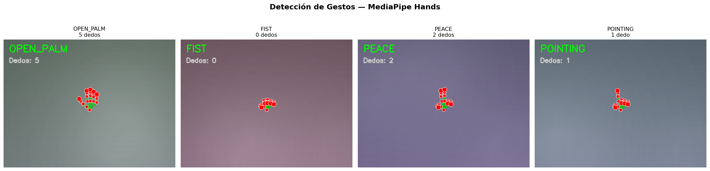
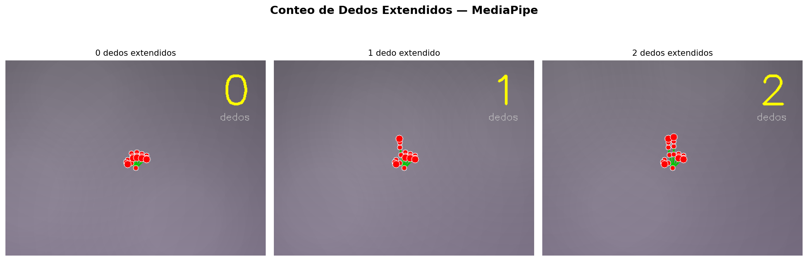
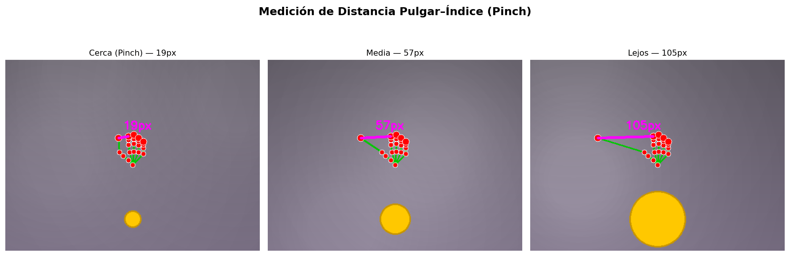
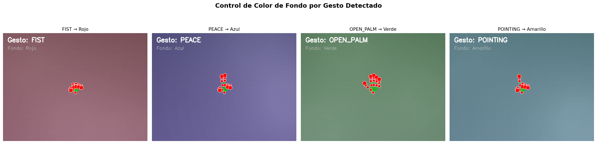
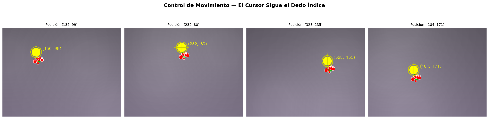
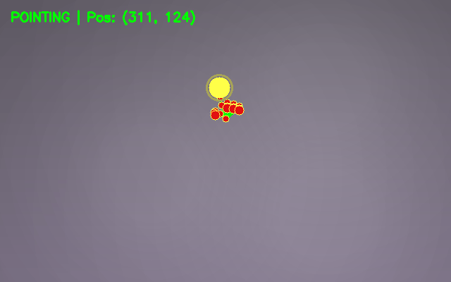
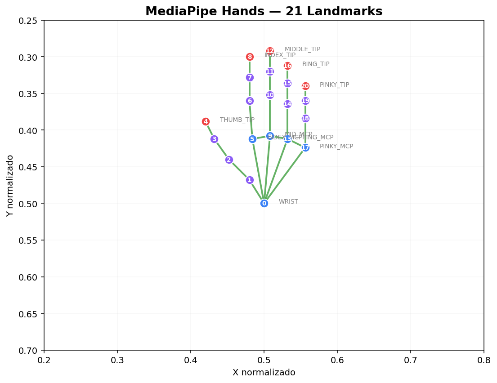
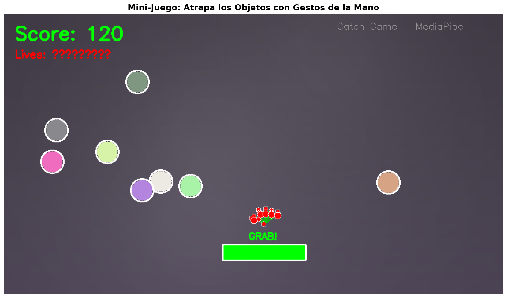

# Taller Gestos Webcam Mediapipe

Victor Saa, Juan Jose Alvarez, Juan Pablo Correa, Jose Arturo Herrera Rivera, Manuel Santiago Mori Ardila

Fecha de entrega: 2026-04-25

---

## Descripción breve

El objetivo de este taller fue usar la webcam y la biblioteca MediaPipe para detectar gestos de manos y ejecutar acciones visuales en tiempo real, explorando cómo las interfaces naturales permiten interactuar con la pantalla sin hardware adicional. Se implementó un sistema completo que captura video, detecta los 21 landmarks de la mano con MediaPipe Hands, clasifica gestos basándose en el conteo de dedos extendidos y la distancia entre puntas, y traduce cada gesto en una acción visual: cambio de color de fondo, movimiento de un cursor que sigue el dedo índice, escalado de objetos mediante pinch (distancia pulgar-índice), y cambio de escena con palma abierta.

La implementación se realizó en Python con OpenCV para la captura y procesamiento de video, MediaPipe para la detección de landmarks, y NumPy para los cálculos geométricos. Se desarrolló un módulo de utilidades (`gesture_utils.py`) con funciones reutilizables para conteo de dedos, medición de distancias y clasificación de gestos, y una aplicación principal (`main.py`) con dos modos: detección interactiva y un mini-juego donde el jugador atrapa objetos que caen controlando un receptor con la posición de la palma y cerrando el puño para agarrar.

El sistema reconoce 7 gestos distintos: FIST (puño cerrado), OPEN_PALM (palma abierta), POINTING (señalar), PEACE (paz), THREE (tres dedos), THUMBS_UP (pulgar arriba) y PINCH (pellizcar), cada uno asociado a una acción visual diferente.

---

## Implementaciones

### Python

**Detección de landmarks** (`gesture_utils.py`): Se utiliza `mediapipe.solutions.hands` configurado para detección en tiempo real (`static_image_mode=False`) con un máximo de 1 mano, confianza de detección de 0.7 y de tracking de 0.5. MediaPipe devuelve 21 landmarks normalizados (x, y, z) que se convierten a coordenadas de píxel multiplicando por las dimensiones del frame.

**Conteo de dedos**: Para el pulgar se compara la posición X del tip (landmark 4) contra la articulación IP (landmark 3) — si el tip está más afuera que la IP, el pulgar está extendido. Se invierte la comparación para mano izquierda vs derecha. Para los demás dedos se compara la posición Y del tip contra la articulación PIP — si el tip está más arriba (menor Y), el dedo está extendido. Esta lógica funciona robustamente porque los landmarks de MediaPipe son estables incluso con oclusiones parciales.

**Medición de distancia**: La distancia entre las puntas de dos dedos se calcula como la distancia euclidiana en píxeles. La distancia pulgar-índice se usa como control de escalado: cuando es menor a 40px se clasifica como PINCH.

**Clasificación de gestos**: Se combina el conteo de dedos con la distancia thumb-index para clasificar 7 gestos. La clasificación es jerárquica: primero se verifican los casos extremos (0 dedos = FIST, 5 = OPEN_PALM), luego las combinaciones específicas (solo índice = POINTING, índice+medio = PEACE), y finalmente la distancia de pinch.

**Control visual** (`main.py`): Cada gesto dispara una acción distinta en el frame renderizado. FIST aplica un overlay rojo, OPEN_PALM verde (y si se mantiene 1 segundo, cambia de escena), POINTING mueve un cursor, PEACE aplica azul, y PINCH escala un objeto. Todo se superpone al feed de la webcam en tiempo real.

**Mini-juego**: Objetos de colores aleatorios caen desde la parte superior del frame. El jugador controla un receptor horizontal con la posición X de la palma, y cierra el puño para atrapar objetos cuando están sobre el receptor. Cada objeto atrapado suma 10 puntos; los objetos que caen al fondo restan una vida. El juego termina con 0 vidas.

---

## Resultados visuales

### Detección de gestos



*Cuatro gestos detectados: palma abierta (5 dedos), puño cerrado (0 dedos), peace (2 dedos) y señalar (1 dedo). Se muestran los landmarks de MediaPipe y el color de fondo cambia según el gesto.*

### Conteo de dedos



*Conteo de dedos extendidos. El sistema detecta cuántos dedos están extendidos comparando las posiciones Y de los tips vs las articulaciones PIP.*

### Distancia pinch



*Medición de distancia entre pulgar e índice. La distancia controla el tamaño de un objeto en pantalla — cerca produce un objeto pequeño, lejos uno grande.*

### Cambio de color por gesto



*Cada gesto produce un color de fondo diferente: puño = rojo, peace = azul, palma = verde, señalar = amarillo. El overlay se aplica con transparencia sobre el feed de la webcam.*

### Control de movimiento



*El cursor (círculo cyan) sigue la punta del dedo índice en el gesto POINTING. Las coordenadas se actualizan en cada frame para control fluido.*

#### Seguimiento en tiempo real



*GIF mostrando el cursor siguiendo el movimiento del dedo índice con trail visual. La posición se actualiza en cada frame del video.*

### Diagrama de landmarks



*Los 21 landmarks del modelo MediaPipe Hands. Rojo: puntas de dedos (tips). Azul: nudillos (MCPs) y muñeca. Violeta: articulaciones intermedias.*

### Mini-juego



*Screenshot del mini-juego de captura. Los objetos de colores caen desde arriba, el receptor verde se controla con la posición de la palma, y cerrar el puño activa el GRAB para atrapar objetos.*

---

## Código relevante

### Conteo de dedos extendidos

```python
def count_fingers(hand_landmarks, img_shape, handedness='Right'):
    coords = get_landmark_coords(hand_landmarks, img_shape)
    fingers = {}

    # Pulgar: comparar en eje X (invertido para mano izquierda)
    thumb_tip = coords[4]   # THUMB_TIP
    thumb_ip = coords[3]    # THUMB_IP

    if handedness == 'Right':
        fingers['thumb'] = thumb_tip[0] < thumb_ip[0]
    else:
        fingers['thumb'] = thumb_tip[0] > thumb_ip[0]

    # Otros dedos: tip más arriba que PIP = extendido
    for finger, tip_id, pip_id in [
        ('index', 8, 6), ('middle', 12, 10),
        ('ring', 16, 14), ('pinky', 20, 18)
    ]:
        fingers[finger] = coords[tip_id][1] < coords[pip_id][1]

    return sum(fingers.values()), fingers
```

### Detección de gestos y acciones visuales

```python
# En el loop principal de la webcam
results = hands.process(cv2.cvtColor(frame, cv2.COLOR_BGR2RGB))

if results.multi_hand_landmarks:
    for hand_landmarks in results.multi_hand_landmarks:
        gesture, count, fingers = detect_gesture(hand_landmarks, frame.shape)

        if gesture == 'POINTING':
            # Cursor sigue el dedo índice
            tip = get_landmark_coords(hand_landmarks, frame.shape)[8]
            cv2.circle(frame, tip, 15, (0, 255, 255), -1)

        elif gesture == 'PINCH':
            # Escalar objeto con distancia thumb-index
            dist, pa, pb = finger_distance(hand_landmarks, frame.shape)
            obj_radius = max(20, min(120, int(dist / 2)))

        elif gesture == 'OPEN_PALM':
            # Mantener 1s para cambiar escena
            if time.time() - gesture_start > 1.0:
                scene_index = (scene_index + 1) % len(scenes)
```

### Mini-juego: detección de colisión y agarre

```python
# Spawn de objetos aleatorios
objects.append([random_x, y=0, random_color, random_speed])

# Colisión con receptor
for obj in objects:
    obj[1] += obj[3]  # Caída por gravedad

    if (obj[1] >= receptor_y - 20 and
        abs(obj[0] - palm_x) < receptor_width):
        if gesture == 'FIST':  # Puño = agarrar
            score += 10
```

---

## Prompts utilizados

IDE, prompts y autocompletado: Antigravity

```
"¿Cuáles son los índices de los landmarks de MediaPipe Hands para cada dedo?"

"Cómo detectar si un dedo está extendido comparando landmarks tip vs PIP"

"¿Cómo medir la distancia entre pulgar e índice con MediaPipe para implementar pinch?"

"Configura mediapipe.solutions.hands para detección en tiempo real con una sola mano"
```

---

## Aprendizajes y dificultades

### Aprendizajes

El aprendizaje principal fue entender el modelo de 21 landmarks de MediaPipe y cómo la geometría de esos puntos codifica la postura de la mano. La clave del conteo de dedos es una observación simple: un dedo extendido tiene su tip más arriba (menor Y) que su articulación PIP, mientras que uno doblado tiene el tip más abajo. El pulgar es el caso especial porque se extiende lateralmente, requiriendo comparar en el eje X en lugar de Y.

También fue revelador lo robusto que es MediaPipe en condiciones variadas de iluminación y fondo. La detección funciona bien incluso con manos parcialmente ocluidas, lo que permite implementar gestos como el puño donde los dedos no son visibles individualmente.

### Dificultades

El manejo de la lateralidad (mano derecha vs izquierda) fue la dificultad principal. El pulgar se extiende en dirección opuesta según la mano, así que la comparación X del tip vs IP se debe invertir para la mano izquierda. MediaPipe reporta la handedness pero hay que tener en cuenta que el frame se espeja con `cv2.flip(frame, 1)` lo que invierte la clasificación.

La clasificación de gestos ambiguos también fue compleja. Por ejemplo, un THUMBS_UP con los dedos no completamente cerrados puede confundirse con una palma parcialmente abierta. Se resolvió priorizando la clasificación jerárquicamente: primero los casos exactos (0 o 5 dedos), luego las combinaciones específicas.

### Mejoras futuras

Implementar gestos dinámicos (como swipe o circular motion) que requieren analizar la trayectoria temporal de los landmarks, no solo su posición en un frame. También se podría agregar un modo de calibración donde el usuario define sus propios gestos y umbrales, y aplicar machine learning para clasificación más robusta con un dataset de gestos del propio usuario.

---

## Contribuciones grupales

- Juan Pablo Correa: Desarrollo del módulo de detección y clasificación de gestos
- Victor Saa: Implementación del control visual y cambio de escenas
- Juan Jose Alvarez: Desarrollo del mini-juego de captura
- Jose Arturo Herrera Rivera: Generación de media y capturas de resultados
- Manuel Santiago Mori Ardila: Diagrama de landmarks y documentación del README

---

## Estructura del proyecto

```
semana_7_5_gestos_webcam_mediapipe/
├── python/
│   ├── main.py              # Aplicación principal (gestos + juego)
│   ├── gesture_utils.py     # Módulo de utilidades de detección de gestos
│   ├── generate_media.py    # Generador de media para documentación
│   └── requirements.txt     # Dependencias de Python
├── media/                   # Imágenes y GIFs de resultados
└── README.md                # Este archivo
```

---

## Referencias

- MediaPipe Hands: https://developers.google.com/mediapipe/solutions/vision/hand_landmarker
- OpenCV VideoCapture: https://docs.opencv.org/4.x/d8/dfe/classcv_1_1VideoCapture.html
- MediaPipe Hand Landmark Model: https://ai.google.dev/edge/mediapipe/solutions/vision/hand_landmarker
- Tutorial MediaPipe + OpenCV: https://google.github.io/mediapipe/solutions/hands.html

---

## Checklist de entrega

- [ ] Carpeta con nombre `semana_7_5_gestos_webcam_mediapipe`
- [ ] Código limpio y funcional en carpetas por entorno
- [ ] GIFs/imágenes incluidos con nombres descriptivos en carpeta `media/`
- [ ] README completo con todas las secciones requeridas
- [ ] Mínimo 2 capturas/GIFs por implementación
- [ ] Commits descriptivos en inglés
- [ ] Repositorio organizado y público

---
