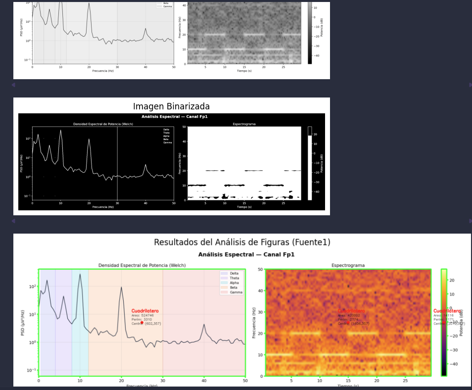
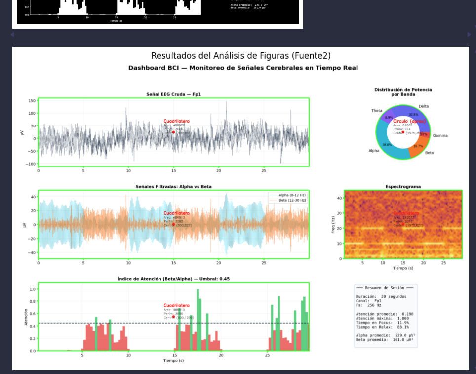

# Taller Análisis de Figuras Geométricas: Centroide, Área y Perímetro

Victor Saa, Juan Jose Alvarez, Juan Pablo Correa, Jose Arturo Herrera Rivera, Manuel Santiago Mori Ardila

Fecha de entrega: 11/05/2026

## Descripción

Detectar formas simples (círculos, cuadrados, triángulos) en imágenes binarizadas y calcular propiedades geométricas como área, perímetro y centroide. El objetivo es desarrollar habilidades para extraer métricas relevantes de contornos detectados en imágenes procesadas.

## Implementaciónes

### Python

Se utilizó jupyter notebook para la implementación. Se carga el objeto y se extrae la geometría, vertices y caras. Se utiliza matplotlib para la visualización.

```bash
# Crear el entorno virtual
python -m venv .venv

# Activar el entorno virtual (powershell en windows)
.venv\Scripts\activate

# Instalar dependencias
pip install -r requirements.txt
```

### Jupyter en el editor (VS Code, Antigravity, etc.)

```bash
# Registrar el kernel para Jupyter
python -m ipykernel install --user --name semana9-1-visual --display-name "Python (semana9-1-visual)"
```

Abre `main.ipynb`, haz clic en el selector de kernel (arriba a la derecha) y elige **Python (semana9-1-visual)**.

## IA

IDE, prompts y autocompletado: Antigravity

## Codigo relevante

### Binarización:

Para binarizar la imagen se utiliza la función `cv2.threshold()` que recibe como parámetros la imagen en escala de grises, el umbral y el tipo de umbral. En este caso, se utiliza un umbral de 127 y el tipo de umbral `cv2.THRESH_BINARY` que convierte los píxeles mayores a 127 en 255 y los menores en 0.

```python
_, imagen_binaria = cv2.threshold(imagen_gris, 127, 255, cv2.THRESH_BINARY)
```

### Detección de contornos:

Para detectar los contornos se utiliza la función `cv2.findContours()` que recibe como parámetros la imagen binarizada y el tipo de contorno. En este caso, se utiliza el tipo de contorno `cv2.RETR_EXTERNAL` que retorna solo los contornos externos y `cv2.CHAIN_APPROX_SIMPLE` que retorna solo los vértices de los contornos.

```python
contornos, _ = cv2.findContours(imagen_binaria, cv2.RETR_EXTERNAL, cv2.CHAIN_APPROX_SIMPLE)
```

## Resultados visuales




## Prompts utilizados

En general se utilizo el autocompletado de antigravity y se requirieron algunos prompts relacionados a la binarización de la imagen y la detección de contornos.

## Aprendizajes

Aca fue interesante ver como se pueden combinar diferentes funciones de openCV para obtener el resultado deseado (superposición de resultados). Open cv hace la mayotia del trabajo identificando los vertices y las caras. Lo de dibujar aun no lo veo tan intuitivo asi que me ayude de la ia.
