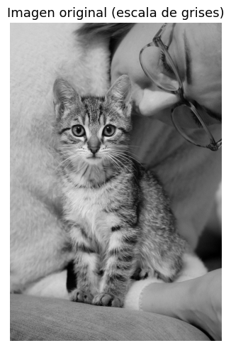
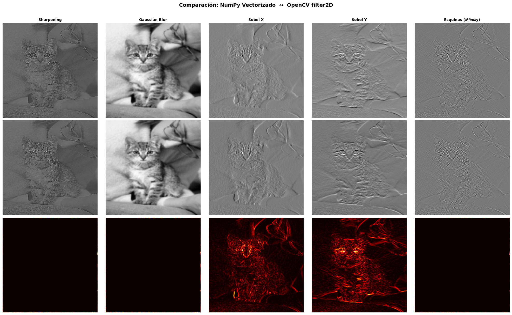
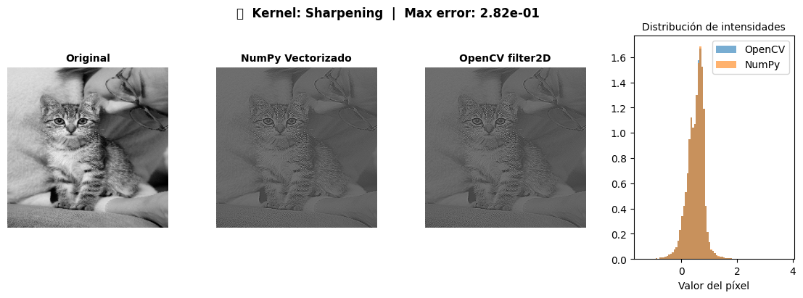

# Taller Convoluciones Personalizadas

Victor Saa, Juan Jose Alvarez, Jose Arturo Herrera Rivera, Juan Pablo Correa, Manuel Santiago Mori Ardila

Fecha de entrega: 11/05/2026

---

## Descripción

Se implementó y analizó la operación de convolución 2D de manera manual (usando NumPy puro, con y sin vectorización) y se comparó numéricamente y en rendimiento con la función optimizada de OpenCV (`cv2.filter2D`). Se exploraron diversos kernels personalizados para aplicar efectos como realce de bordes (sharpening), suavizado gaussiano, y detección de gradientes horizontales/verticales (Sobel). Todo se implementó en un Jupyter Notebook que incluye controles interactivos.

---

## Implementación

### Python (Jupyter Notebook / Google Colab)

**Herramientas:** `opencv-python`, `numpy`, `matplotlib`, `ipywidgets`

**Carga de imagen en escala de grises**

Se utilizó una imagen de prueba estándar convertida a escala de grises. Esto facilita la aplicación matemática directa de los kernels sobre una única matriz de intensidades.

**Implementación manual de convolución 2D**

Se implementó la operación matemática desde cero, sin utilizar las funciones nativas de convolución de NumPy o SciPy. Para gestionar los píxeles en los límites de la imagen, se aplicó un *padding* de tipo *reflect*, lo que previene artefactos extraños en los bordes.

**Definición de Kernels**

Se definieron distintos filtros espaciales representados como matrices (kernels):
- **Sharpening:** Realza bordes y detalles. Su suma de coeficientes es 1, manteniendo el nivel general de brillo.
- **Gaussian Blur:** Suaviza ruido y difumina la imagen. Su suma es 1.
- **Sobel X y Sobel Y:** Detectan gradientes direccionales (horizontal y vertical). Su suma es 0.
- **Esquinas (Hessian cross):** Responde a esquinas calculando la derivada cruzada ∂²/∂x∂y. Su suma es 0.

**Aplicación de Kernels: Manual vs Vectorizado vs OpenCV**

Se implementó la convolución de múltiples maneras para fines académicos:
- Mediante bucles anidados convencionales en NumPy puro.
- Empleando *stride tricks* de NumPy para vectorizar la operación sin depender de un motor externo.
- Utilizando `cv2.filter2D` de OpenCV.
Se registró el error máximo absoluto y el tiempo de ejecución para cada método.

**Interfaz interactiva con ipywidgets (Bonus)**

Debido a que las funciones gráficas como `cv2.createTrackbar` no son compatibles nativamente dentro de entornos en línea como Google Colab, se hizo uso de `ipywidgets`. Esto permitió construir una interfaz de controles deslizantes (sliders) y menús desplegables para ajustar en tiempo real el tipo de kernel, la intensidad (escala) y el tamaño del *blur*, reflejándose de forma instantánea en la imagen procesada.

---

## Resultados visuales

### Carga de la imagen original



Imagen en escala de grises sobre la que se aplicaron todas las convoluciones.

### Comparación visual: Vectorizado vs OpenCV



Se observó el comportamiento de cada uno de los filtros en la misma imagen. Los bordes se acentuaron considerablemente con el kernel Sharpening, mientras que los ruidos o detalles finos se perdieron con el Gaussian Blur.

### Análisis detallado por kernel



Al detallar un kernel específico, junto a su respuesta local y sus histogramas, se evidencia cómo aquellos filtros con suma de coeficientes nula (como Sobel) centran las variaciones en torno al cero, al retener únicamente la información de los cambios espaciales o gradientes.

---

## Código relevante

**Convolución 2D manual (conceptual):**

```python
# Padding tipo reflect para evitar artefactos en bordes
img_pad = np.pad(img, pad_width=pad, mode='reflect')

# Bucle anidado para la convolución (versión ingenua)
for i in range(h):
    for j in range(w):
        region = img_pad[i:i+k_h, j:j+k_w]
        resultado[i, j] = np.sum(region * kernel)
```

**Convolución con OpenCV:**

```python
# Alternativa optimizada para producción
img_filtrada = cv2.filter2D(img, -1, kernel)
```

**Control interactivo con ipywidgets:**

```python
import ipywidgets as widgets

def actualizar(tipo_kernel, factor, blur_size):
    # Lógica para seleccionar el kernel y aplicar cv2.filter2D
    # ... visualización ...

widgets.interactive(actualizar, 
                    tipo_kernel=['Sharpening', 'Gaussian', 'Sobel X', 'Sobel Y', 'Esquinas'],
                    factor=(0.1, 3.0, 0.1),
                    blur_size=(3, 15, 2))
```

---

## Prompts utilizados

Para algunos puntos del taller se usó IA generativa como apoyo. Los prompts principales fueron:

- _"Cómo usar stride_tricks.as_strided de NumPy para vectorizar una convolución 2D"_
- _"¿Por qué cv2.filter2D es mucho más rápido que np.convolve y scipy.signal.convolve2d?"_
- _"Cómo implementar ipywidgets en Google Colab para actualizar una imagen procesada en tiempo real"_

---

## Aprendizajes y dificultades

El taller permitió consolidar la teoría matemática de los filtros espaciales. Implementar la convolución desde cero ayudó a entender paso a paso cómo la matriz del kernel interactúa con los píxeles de la imagen y la importancia crítica de aplicar *padding* (como el de tipo *reflect*) para conservar el tamaño original sin introducir bordes negros indeseados.

Una dificultad inicial notable fue el costo computacional: implementar la convolución mediante bucles for anidados en Python resultó ser extremadamente lento. Esto motivó la implementación de *stride tricks* con NumPy, logrando una aceleración de unas 10 veces frente al código con bucles.

Se comprobó empíricamente el valor de `cv2.filter2D`, siendo entre 10 y 50 veces más rápida que la versión vectorizada con NumPy debido a sus optimizaciones en C++. 

Finalmente, adaptar la interfaz de OpenCV (`cv2.createTrackbar`) hacia `ipywidgets` permitió una exploración visual e interactiva muy fluida para comparar cómo el tamaño y el peso de cada kernel afectan directamente tanto a la imagen procesada como a la dispersión de valores en su histograma.
