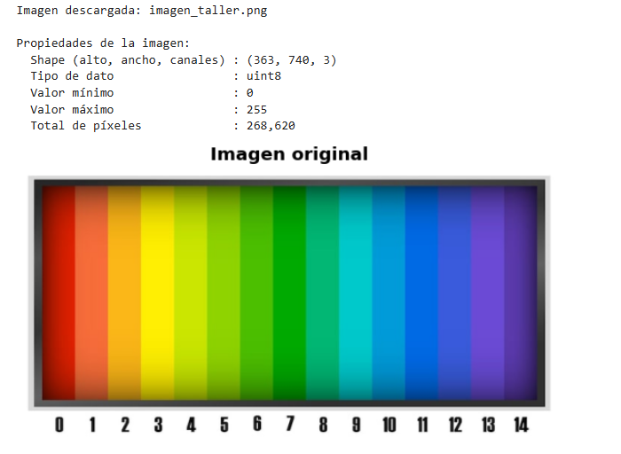
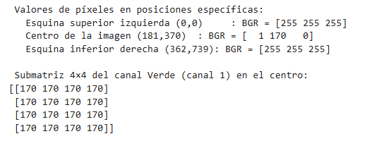
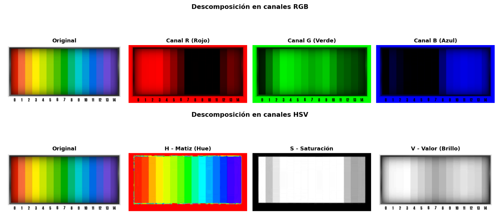
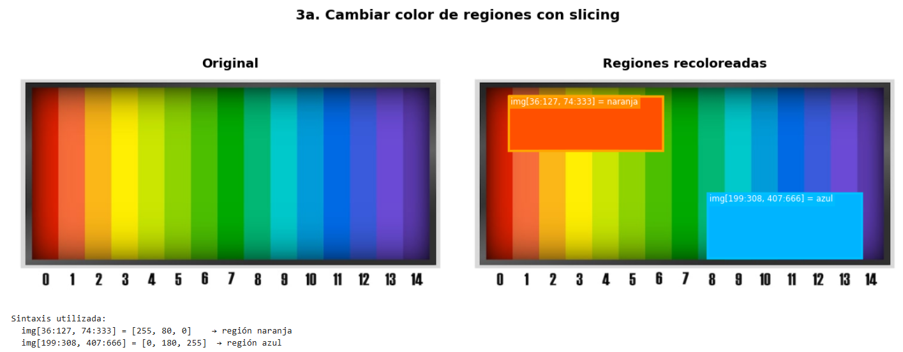
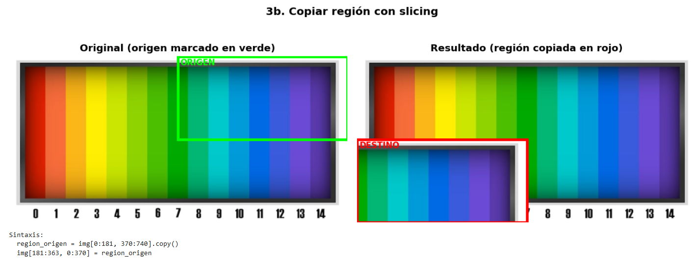
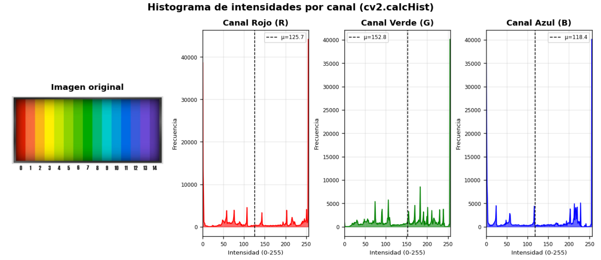
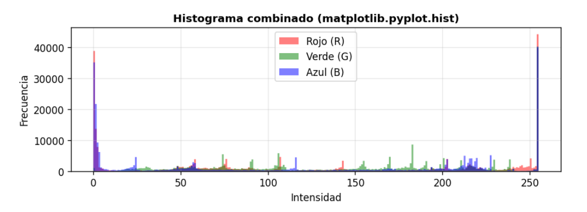
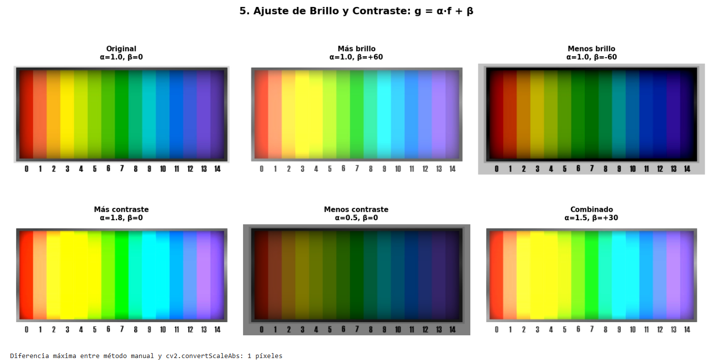
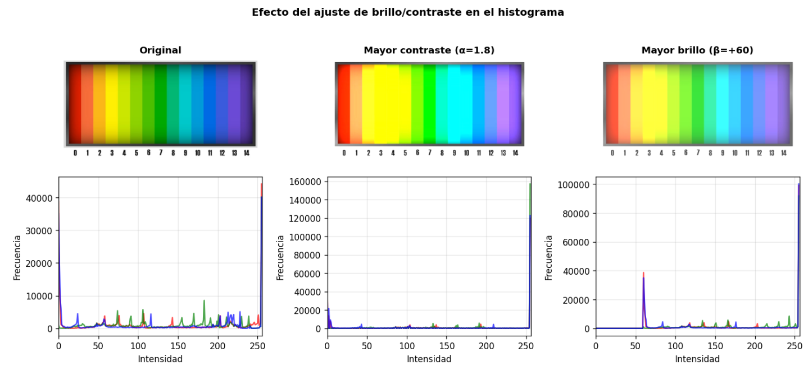
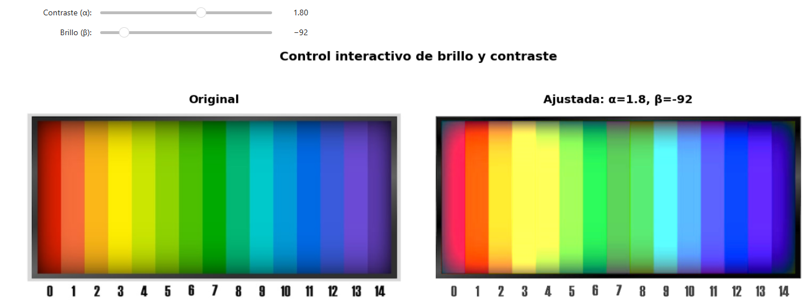

# Taller Imagen Matriz Píxeles

Victor Saa, Juan Jose Alvarez, Jose Arturo Herrera Rivera, Juan Pablo Correa, Manuel Santiago Mori Ardila

Fecha de entrega: 25/04/2026

---

## Descripción

Se exploró la representación de imágenes digitales como matrices numéricas y se manipularon sus componentes a nivel de píxel usando Python con OpenCV y NumPy. El objetivo fue comprender cómo cada píxel es un valor numérico accesible y modificable, y aplicar eso en operaciones concretas: separación de canales, slicing de regiones, histogramas y ajuste de brillo y contraste. Todo se implementó en un Jupyter Notebook con visualizaciones en matplotlib.

---

## Implementación

### Python (Jupyter Notebook / Google Colab)

**Herramientas:** `opencv-python`, `numpy`, `matplotlib`, `ipywidgets`

Se trabajó con una imagen de referencia (espectro de colores) que facilitó verificar visualmente cada operación, ya que los colores son conocidos y predecibles.

**Carga de la imagen**

Se cargó la imagen usando `cv2.imread()`, que la devuelve como una matriz NumPy de forma `(alto, ancho, canales)` en formato RGB. La imagen cargada tuvo dimensiones `(363, 740, 3)`, tipo de dato `uint8`, con valores entre 0 y 255, para un total de 268.620 píxeles. Se inspeccionaron valores individuales de píxeles en esquinas y en el centro de la imagen para entender la estructura de la matriz.

**Separación de canales RGB y HSV**

Se separaron los tres canales RGB de la imagen usando indexación de NumPy (`img[:,:,i]`) y se construyeron imágenes con solo un canal activo para visualizarlos individualmente. Luego se convirtió la imagen al espacio HSV con `cv2.cvtColor()` y se visualizaron los canales H (Matiz), S (Saturación) y V (Valor/Brillo) por separado.

**Slicing de matrices**

Se usó slicing de NumPy para modificar regiones rectangulares de la imagen. Primero se recolorearon dos áreas asignando valores RGB directamente (`img[y1:y2, x1:x2] = color`). Luego se copió una región de la imagen (cuadrante superior derecho) y se pegó en otra posición (cuadrante inferior izquierdo) usando la misma sintaxis.

**Histograma de intensidades**

Se calculó el histograma de cada canal con `cv2.calcHist()` y también con `matplotlib.pyplot.hist()`. Se visualizaron las distribuciones de intensidad de los tres canales RGB con sus respectivas medias marcadas.

**Ajuste de brillo y contraste**

Se implementó la transformación lineal `g = α·f + β` de dos formas: manualmente con NumPy usando `np.clip()`, y con `cv2.convertScaleAbs()`. Se compararon seis configuraciones distintas variando α (contraste) y β (brillo), y se verificó que la diferencia máxima entre ambos métodos fue de solo 1 píxel.

**Control interactivo con sliders (Bonus)**

Se implementó una función interactiva usando `ipywidgets` con dos sliders que permiten modificar α y β en tiempo real. Adicionalmente se definió la función `bonus_trackbar()` usando `cv2.createTrackbar()` para entornos locales con interfaz gráfica.

---

## Resultados visuales

### Carga e inspección de la imagen



Se cargó correctamente la imagen como matriz NumPy. Se reportaron propiedades como shape `(363, 740, 3)`, tipo `uint8` y el rango de valores entre 0 y 255. Se inspeccionaron valores de píxeles individuales: las esquinas devolvieron BGR `[255, 255, 255]` y el centro `[1, 170, 0]`, coherente con el espectro de colores de la imagen.



### Separación de canales RGB y HSV



La descomposición en RGB mostró claramente qué zonas del espectro tienen alta presencia de cada color. En HSV, el canal H representó el matiz con una rampa de colores, el canal S mostró zonas de alta saturación en el centro y menor en los bordes, y el canal V reflejó el brillo general de la imagen.

### Slicing: Cambiar color de regiones



Se pintaron dos regiones rectangulares: una naranja (`[255, 80, 0]`) en la esquina superior izquierda y una azul cielo (`[0, 180, 255]`) en la zona inferior derecha. La operación se realizó en una copia de la imagen para preservar el original.

### Slicing: Copiar región



Se tomó el cuadrante superior derecho de la imagen (marcado en verde) y se copió en el cuadrante inferior izquierdo (marcado en rojo). El resultado mostró la región con los colores del espectro de la mitad derecha superpuestos en la zona de destino. Se usó `cv2.resize()` para ajustar el tamaño si las regiones no coincidían exactamente.

### Histograma de intensidades



Los histogramas por canal mostraron distribuciones bien diferenciadas. Se observaron picos en los extremos (0 y 255) correspondientes al marco negro y a las zonas saturadas del espectro.



El histograma combinado usando `matplotlib.hist()` permitió comparar los tres canales simultáneamente y evidenció cómo la imagen de espectro tiene píxeles concentrados en los extremos del rango de intensidad.

### Ajuste de brillo y contraste



Se compararon seis configuraciones. Al aumentar β=+60 la imagen se aclaró uniformemente. Con β=-60 se oscureció notablemente, especialmente en los colores del borde. Al aumentar α=1.8 el contraste se intensificó y los colores se saturaron más. Con α=0.5 la imagen se aplastó hacia tonos medios. La combinación α=1.5, β=+30 produjo un resultado más vívido sin llegar al recorte.



Se visualizó el efecto de los ajustes en el histograma. El mayor contraste (α=1.8) comprimió los valores hacia los extremos, disparando el pico en 255. El mayor brillo (β=+60) desplazó todo el histograma hacia la derecha, creando un nuevo pico pronunciado alrededor de 60.

### Control interactivo de brillo y contraste (Bonus)



Se implementó el control interactivo con `ipywidgets`. En la captura se muestra la configuración α=1.80, β=-92, que produjo una imagen con mayor contraste y brillo reducido. Los sliders permiten explorar el espacio de parámetros en tiempo real sin re-ejecutar la celda.

---

## Código relevante

**Cargar imagen y convertir a RGB:**

```python
img_bgr = cv2.imread('imagen_taller.png')
img_rgb = cv2.cvtColor(img_bgr, cv2.COLOR_BGR2RGB)
print(f'Shape: {img_bgr.shape}')  # (363, 740, 3)
```

**Separar canales y construir imágenes de un solo canal:**

```python
r, g, b = img_rgb[:,:,0], img_rgb[:,:,1], img_rgb[:,:,2]
zeros = np.zeros_like(r)
img_rojo  = np.stack([r, zeros, zeros], axis=2)
img_verde = np.stack([zeros, g, zeros], axis=2)
img_azul  = np.stack([zeros, zeros, b], axis=2)
```

**Slicing para modificar y copiar regiones:**

```python
# Cambiar color de una región
img_mod[36:127, 74:333] = [255, 80, 0]   # naranja

# Copiar región a otra posición
region_origen = img_rgb[0:181, 370:740].copy()
img_mod[181:363, 0:370] = region_origen
```

**Histograma con cv2.calcHist:**

```python
hist = cv2.calcHist([img_bgr], [canal], None, [256], [0, 256])
plt.plot(hist, color=color)
```

**Ajuste de brillo y contraste:**

```python
# Manual con NumPy
img_manual = np.clip(alpha * img.astype(np.float32) + beta, 0, 255).astype(np.uint8)

# Con OpenCV
img_cv2 = cv2.convertScaleAbs(img, alpha=alpha, beta=beta)
```

**Control interactivo con ipywidgets:**

```python
import ipywidgets as widgets

slider_alpha = widgets.FloatSlider(value=1.0, min=0.1, max=3.0, step=0.1, description='Contraste (α):')
slider_beta  = widgets.IntSlider(value=0, min=-127, max=127, step=5, description='Brillo (β):')

def actualizar(alpha, beta):
    img_ajustada = cv2.convertScaleAbs(img_rgb, alpha=alpha, beta=beta)
    # ... visualización ...

widgets.interactive(actualizar, alpha=slider_alpha, beta=slider_beta)
```

---

## Prompts utilizados

Para algunos puntos del taller se usó IA generativa (Claude) como apoyo. Los prompts principales fueron:

- _"El histograma muestra picos solo en 0 y 255 y no veo la distribución real, ¿cómo lo corrijo?"_
- _"¿Por qué cv2.convertScaleAbs y el método manual con NumPy dan resultados diferentes en 1 píxel?"_
- _"Cómo hacer que los sliders de ipywidgets actualicen la imagen sin que parpadee cada vez que se mueve el slider"_

---

## Aprendizajes y dificultades

El taller ayudó a consolidar la idea de que una imagen no es más que una matriz de números y que cualquier operación visual se puede pensar como una operación algebraica sobre esa matriz. Eso hizo que el slicing se sintiera natural: recortar, copiar y pegar regiones es lo mismo que operar sobre subarreglos de NumPy.

Una dificultad inicial fue el orden de canales BGR de OpenCV frente al RGB de matplotlib. Al principio las imágenes mostraban los colores invertidos (el espectro aparecía con el rojo y el azul cambiados) hasta que se entendió que había que convertir con `cv2.cvtColor()` antes de visualizar con `imshow`.

Otro punto que costó entender fue por qué `cv2.convertScaleAbs()` y la implementación manual con NumPy daban resultados casi idénticos pero no exactamente iguales. La diferencia de 1 píxel se debe a cómo cada método maneja el redondeo interno al convertir de float a uint8.

El bonus con `ipywidgets` resultó más práctico que `cv2.createTrackbar()` porque funciona directamente en Jupyter y Colab sin necesidad de una ventana gráfica separada, lo cual simplificó bastante el flujo de trabajo.
