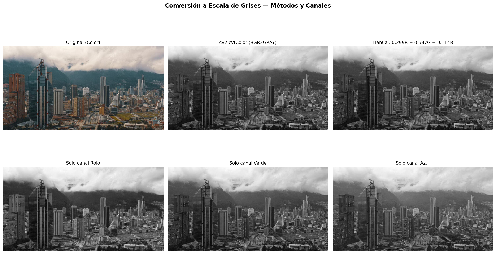
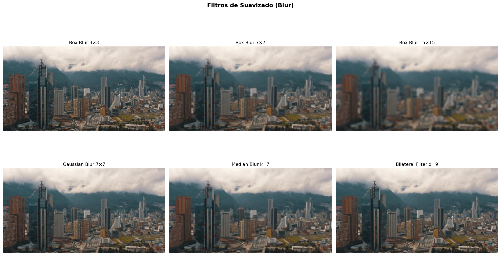
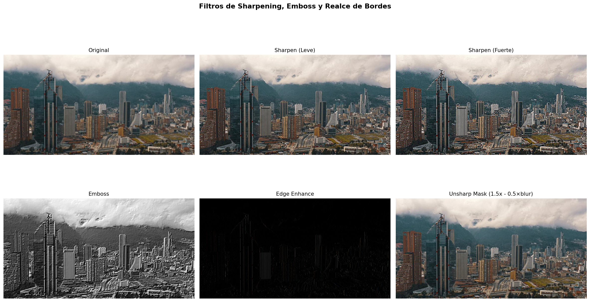
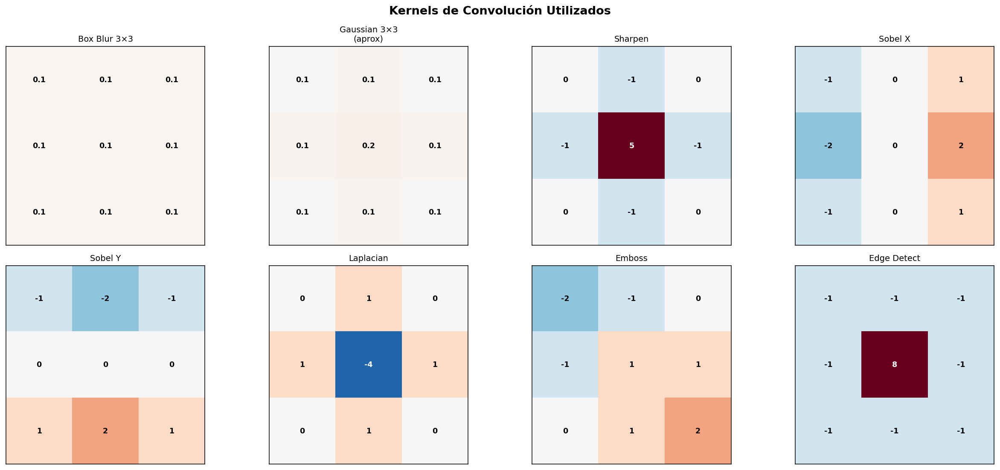
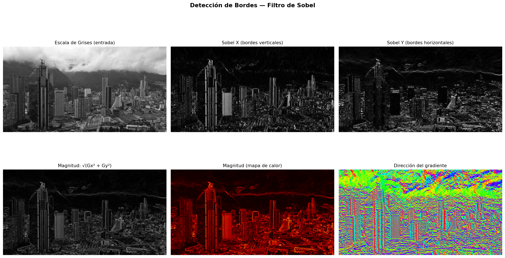
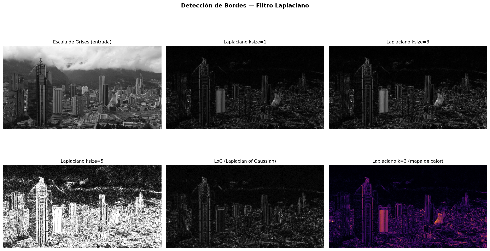
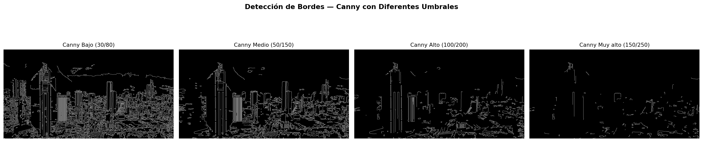
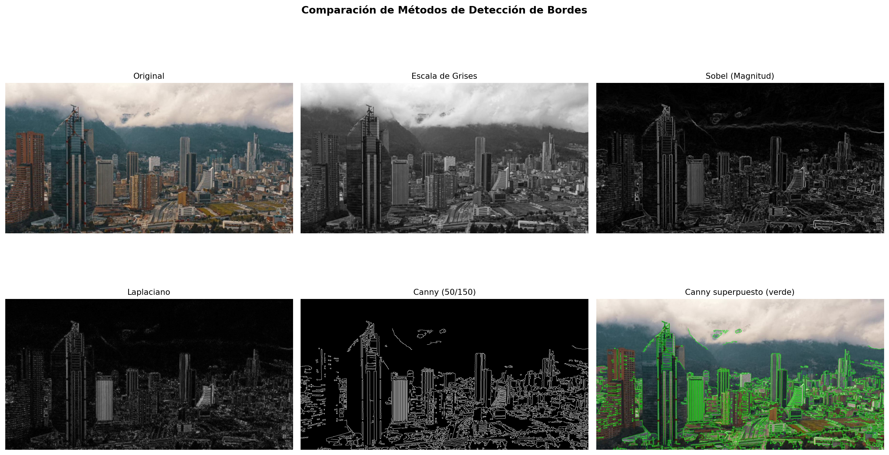
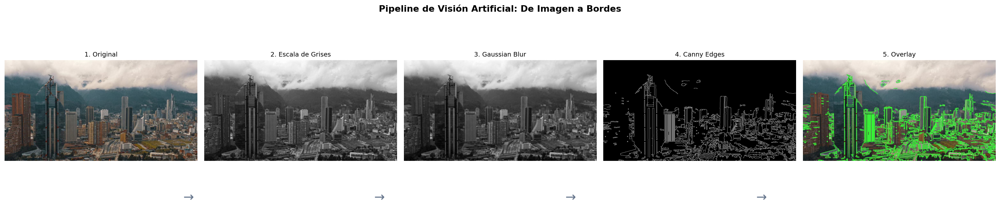
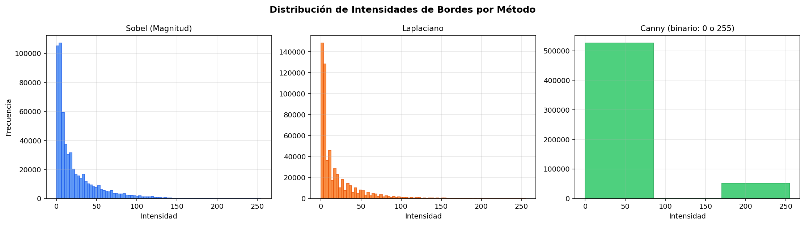

# Taller Ojos Digitales Vision Artificial

Victor Saa, Juan Jose Alvarez, Juan Pablo Correa, Jose Arturo Herrera Rivera, Manuel Santiago Mori Ardila

Fecha de entrega: 2026-05-09

---

## Descripción breve

El objetivo de este taller fue comprender los fundamentos de la percepción visual artificial mediante el procesamiento de imágenes con OpenCV. Se trabajó sobre una fotografía del skyline de Bogotá con los cerros orientales de fondo, aplicando conversión a escala de grises, filtros convolucionales (blur, sharpening, emboss, unsharp mask), y detección de bordes con tres métodos distintos: Sobel (gradiente direccional), Laplaciano (segunda derivada) y Canny (detección multi-etapa con supresión de no-máximos).

La implementación se realizó completamente en Python con OpenCV para las operaciones de procesamiento de imágenes, NumPy para la manipulación de matrices y kernels, y Matplotlib para las visualizaciones. Se generaron 10 figuras comparativas que documentan cada paso del pipeline de visión artificial, desde la imagen original hasta la superposición de bordes detectados.

El resultado principal fue una comprensión clara de cómo los computadores interpretan imágenes: como matrices numéricas donde los filtros de convolución extraen información de estructura local (bordes, texturas, gradientes). La imagen de Bogotá resultó ideal porque los edificios producen bordes verticales fuertes con Sobel X, los pisos y la línea del horizonte generan bordes horizontales con Sobel Y, y la montaña produce gradientes suaves que permiten comparar la sensibilidad de cada método.

---

## Implementaciones

### Python

**1. Conversión a escala de grises**: Se compara `cv2.cvtColor(BGR2GRAY)` con la fórmula manual de luminancia ponderada `Y = 0.299R + 0.587G + 0.114B`, y se visualiza cada canal RGB individual como imagen en escala de grises. El canal verde es el más similar al resultado final porque la fórmula de luminancia le asigna el mayor peso (0.587), reflejando la mayor sensibilidad del ojo humano al verde.

**2. Filtros convolucionales**: Se implementan 6 filtros de suavizado (Box Blur 3×3/7×7/15×15, Gaussian, Median, Bilateral) y 4 filtros de realce (Sharpen leve y fuerte, Emboss, Unsharp Mask). Cada filtro opera deslizando un kernel sobre la imagen y calculando la suma ponderada de los píxeles vecinos. Se visualizan los 8 kernels utilizados como matrices con los valores de cada celda.

**3. Detección de bordes — Sobel**: Aplica el operador de Sobel en X (detecta bordes verticales) e Y (detecta bordes horizontales) usando `cv2.Sobel()` con profundidad `CV_64F` para preservar valores negativos. Se calcula la magnitud del gradiente como `√(Gx² + Gy²)` con `cv2.magnitude()` y la dirección con `arctan2(Gy, Gx)`. Se aplica Gaussian Blur previo de 3×3 para reducir la sensibilidad al ruido.

**4. Detección de bordes — Laplaciano**: Aplica el operador Laplaciano (segunda derivada isotrópica) con kernels de tamaño 1, 3 y 5, y se implementa LoG (Laplacian of Gaussian) aplicando primero un Gaussian Blur fuerte de 7×7 y luego el Laplaciano. Se compara la sensibilidad al ruido de cada variante.

**5. Detección de bordes — Canny**: Se aplica el detector de Canny con 4 combinaciones de umbrales (30/80, 50/150, 100/200, 150/250) para mostrar el efecto del threshold en la cantidad de bordes detectados. Canny aplica internamente: Gaussian blur, gradiente de Sobel, supresión de no-máximos, y histéresis de doble umbral.

**6. Comparación y pipeline**: Se comparan los tres métodos lado a lado sobre la misma imagen, y se construye un pipeline secuencial de 5 pasos (original → gris → blur → Canny → overlay verde) que muestra el flujo completo de visión artificial.

---

## Resultados visuales

### Conversión a escala de grises



*Conversión de la imagen de Bogotá a escala de grises por diferentes métodos. El canal verde es el más similar al resultado ponderado porque la fórmula de luminancia le da el mayor peso (0.587).*

### Filtros de suavizado



*Seis filtros de suavizado aplicados. Box Blur aumenta el desenfoque con el tamaño del kernel. Median Blur es mejor para eliminar ruido salt-and-pepper. Bilateral preserva los bordes mientras suaviza.*

### Filtros de realce



*Filtros de Sharpen, Emboss y Unsharp Mask. El Sharpen fuerte exagera los bordes de los edificios. Emboss genera un efecto de relieve 3D. Unsharp Mask resta una versión borrosa para realzar detalles.*

### Kernels de convolución



*Los 8 kernels utilizados con los valores numéricos de cada celda. Se observa que los kernels de blur tienen valores positivos que suman 1, mientras que los de detección de bordes tienen valores que suman 0.*

### Detección de bordes — Sobel



*Filtro de Sobel aplicado a la foto de Bogotá. Sobel X resalta las líneas verticales de los rascacielos, Sobel Y captura la línea del horizonte y los pisos. La magnitud combina ambos, y el mapa de dirección codifica la orientación del gradiente con HSV.*

### Detección de bordes — Laplaciano



*Filtro Laplaciano con kernels de diferente tamaño. Kernels más grandes capturan bordes más gruesos y son menos sensibles al ruido. LoG aplica suavizado previo para producir bordes más limpios.*

### Detección de bordes — Canny



*Canny con cuatro combinaciones de umbrales. Umbrales bajos (30/80) capturan muchos bordes incluyendo ruido; umbrales altos (150/250) solo detectan los bordes más prominentes como los edificios principales.*

### Comparación entre métodos



*Comparación directa: Sobel produce bordes gruesos y continuos, Laplaciano es más sensible a texturas finas, y Canny produce bordes delgados y limpios gracias a la supresión de no-máximos. La última imagen superpone los bordes Canny en verde sobre la foto original.*

### Pipeline completo



*Pipeline de 5 pasos desde la imagen original hasta la superposición de bordes. Cada paso transforma la imagen para la siguiente etapa: color → gris → suavizado → detección → visualización.*

### Histograma de bordes



*Distribución de intensidades de bordes. Sobel y Laplaciano producen valores continuos con la mayoría de píxeles en intensidades bajas. Canny es estrictamente binario (0 o 255), simplificando la decisión de si un píxel es borde o no.*

---

## Código relevante

### Detección de bordes con Sobel

```python
# Sobel X: detecta bordes verticales (derivada en dirección horizontal)
sobel_x = cv2.Sobel(gray, cv2.CV_64F, 1, 0, ksize=3)

# Sobel Y: detecta bordes horizontales (derivada en dirección vertical)
sobel_y = cv2.Sobel(gray, cv2.CV_64F, 0, 1, ksize=3)

# Magnitud del gradiente: combina ambas direcciones
magnitude = cv2.magnitude(sobel_x, sobel_y)

# Dirección del gradiente (orientación del borde)
direction = np.arctan2(sobel_y, sobel_x)
```

### Filtro Laplaciano y LoG

```python
# Laplaciano directo (segunda derivada isotrópica)
laplacian = cv2.Laplacian(gray_blur, cv2.CV_64F, ksize=3)
laplacian_abs = cv2.convertScaleAbs(laplacian)

# Laplacian of Gaussian (LoG): suavizar primero, luego derivar
gray_smooth = cv2.GaussianBlur(gray, (7, 7), sigma=2)
log = cv2.Laplacian(gray_smooth, cv2.CV_64F, ksize=3)
```

### Kernels de convolución personalizados

```python
# Kernel de sharpening: refuerza el píxel central, resta vecinos
kernel_sharpen = np.array([
    [ 0, -1,  0],
    [-1,  5, -1],
    [ 0, -1,  0]
], dtype=np.float32)

# Aplicar convolución con cv2.filter2D
sharpened = cv2.filter2D(image, -1, kernel_sharpen)

# Unsharp Mask: original + (original - blurred) * factor
blurred = cv2.GaussianBlur(image, (7, 7), 2)
unsharp = cv2.addWeighted(image, 1.5, blurred, -0.5, 0)
```

---

## Prompts utilizados

IDE, prompts y autocompletado: Antigravity

```
"¿Cuál es la diferencia entre Sobel y Laplaciano para detección de bordes?"

"Explica cómo funciona la supresión de no-máximos en el algoritmo de Canny"

"¿Por qué se usa CV_64F en Sobel en vez de CV_8U?"

"Cómo implementar Unsharp Mask con cv2.addWeighted"
```

---

## Aprendizajes y dificultades

### Aprendizajes

El aprendizaje más importante fue entender que todos los filtros de visión artificial son operaciones de convolución: un kernel (matriz pequeña) se desliza sobre la imagen y calcula una suma ponderada en cada posición. La diferencia entre blur, sharpen y detección de bordes está únicamente en los valores del kernel: los que suman 1 preservan el brillo (blur), los que suman 0 extraen diferencias (bordes), y los con valor central mayor a 1 amplifican detalles (sharpen).

También fue reveladora la diferencia entre Sobel y Canny. Sobel es un filtro de primera derivada que produce una imagen de gradiente continua (cada píxel tiene una intensidad proporcional a la fuerza del borde). Canny agrega dos pasos cruciales: supresión de no-máximos (adelgaza los bordes a 1 píxel de grosor) e histéresis (usa dos umbrales para conectar bordes débiles con bordes fuertes), produciendo resultados más limpios y útiles para procesamiento posterior.

### Dificultades

El manejo de tipos de datos fue la dificultad principal. `cv2.Sobel()` con profundidad `CV_8U` pierde los gradientes negativos (donde la intensidad decrece), produciendo bordes incompletos. Se resolvió usando `CV_64F` para preservar valores negativos y luego aplicando `cv2.convertScaleAbs()` para obtener valores absolutos. Sin este paso, los bordes solo se detectan en una dirección.

La elección de umbrales para Canny requirió experimentación. Umbrales muy bajos producen ruido excesivo (cada textura genera bordes), mientras que umbrales muy altos pierden bordes reales. Se resolvió generando la comparación con 4 combinaciones de umbrales para documentar visualmente el efecto y elegir el rango óptimo (50/150) para la imagen de Bogotá.

### Mejoras futuras

Sería interesante agregar detección de líneas con la transformada de Hough para detectar las líneas rectas de los edificios, implementar detección de contornos con `cv2.findContours()` para segmentar cada edificio como un objeto independiente, y crear una versión con trackbars en tiempo real que permita ajustar todos los parámetros de los filtros interactivamente.

---

## Contribuciones grupales

- Juan Jose Alvarez: Desarrollo Python completo (conversiones, filtros, detección de bordes)
- Victor Saa: Implementación de comparaciones y pipeline visual
- Juan Pablo Correa: Visualización de kernels y análisis de histogramas
- Jose Arturo Herrera Rivera: Captura de resultados visuales y pruebas
- Manuel Santiago Mori Ardila: Investigación de operadores de borde y documentación del README

---

## Estructura del proyecto

```
semana_9_4_ojos_digitales_vision_artificial/
├── python/
│   ├── main.py              # Módulo principal con todo el procesamiento
│   ├── requirements.txt     # Dependencias de Python
│   └── input_image.jpg      # Fotografía de Bogotá (imagen de entrada)
├── media/                   # Imágenes de resultados
└── README.md                # Este archivo
```

---

## Referencias

- Documentación OpenCV — Image Filtering: https://docs.opencv.org/4.x/d4/d13/tutorial_py_filtering.html
- OpenCV — Canny Edge Detection: https://docs.opencv.org/4.x/da/d22/tutorial_py_canny.html
- OpenCV — Sobel Derivatives: https://docs.opencv.org/4.x/d2/d2c/tutorial_sobel_derivatives.html
- OpenCV — Laplace Operator: https://docs.opencv.org/4.x/d5/db5/tutorial_laplace_operator.html
- Wikipedia — Kernel (image processing): https://en.wikipedia.org/wiki/Kernel_(image_processing)
- Digital Image Processing — Gonzalez & Woods (Pearson)

---

## Checklist de entrega

- [ ] Carpeta con nombre `semana_9_4_ojos_digitales_vision_artificial`
- [ ] Código limpio y funcional en carpetas por entorno
- [ ] GIFs/imágenes incluidos con nombres descriptivos en carpeta `media/`
- [ ] README completo con todas las secciones requeridas
- [ ] Mínimo 2 capturas/GIFs por implementación
- [ ] Commits descriptivos en inglés
- [ ] Repositorio organizado y público

---
